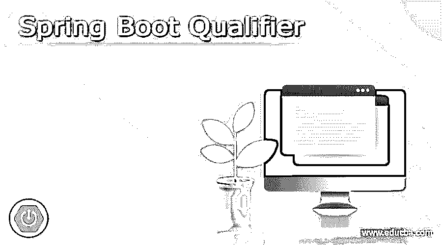
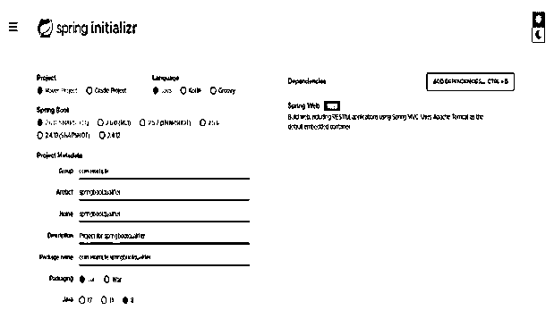
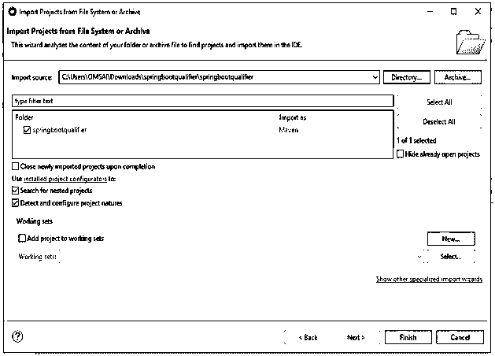
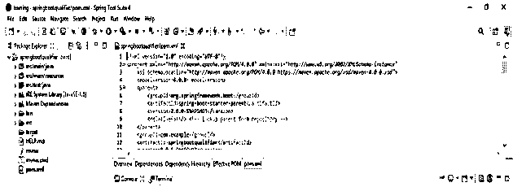
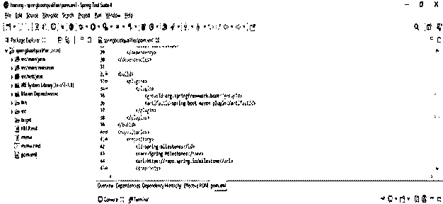
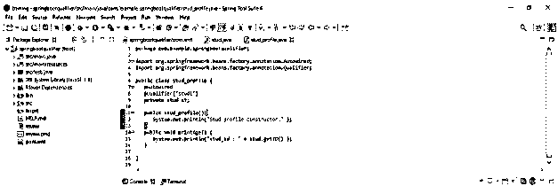
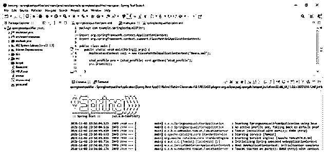

# Spring Boot 资格赛

> 原文：<https://www.educba.com/spring-boot-qualifier/>

## Spring Boot 限定词的定义

当我们需要为同一类型创建多个 bean，并且只需要连接一个 bean 时，就会使用 Spring boot 限定符。在这种情况下，我们使用 autowired 和 qualifier 注释来消除在 spring boot 项目中需要连接哪个 bean 的困惑。基本上，它展示了如何区分相同类型的 bean，即限定符。

### 什么是 Spring Boot 资格赛？

*   众所周知，autowired 注释主要用于注入 spring boot 依赖项。
*   默认情况下，自动关联的注释将解析其从属关系。如果我们只有一个相同类型的 bean，那么这个注释工作得很好。
*   当我们一次或多次使用相同类型的 bean 时，Spring boot framework 会抛出一个异常。
*   Spring boot qualifier 注释用于区分 bean 的引用。为了从代码中选择正确的 bean，我们在 spring boot 项目中使用了限定符注释。
*   spring boot qualifier annotation bean 也用于消除 bean 注入的问题。
*   我们在一个类中使用 bean 来消除从项目中注入哪些 bean 的问题。

下面的例子展示了如何在我们的项目中解决 bean 注入的问题。

<small>网页开发、编程语言、软件测试&其他</small>

**举例:**

`Public class qualifier
{
@Autowired
@Qualifier (“SpringBootQualifier”)
Private SBQualifier squalifier
}`

在上面的例子中，我们可以看到我们已经使用了 qualifier 注释，实现名为 SpringBootQualifier。在上面的例子中，我们已经避免了当 spring boot 将找到单一类型的多个 beans 时的不确定性。
要在单一代码中使用相同的 bean，我们需要使用@component 注释在程序中获得相同的结果。
下面的例子显示了如何在单个代码中使用两个限定符注释如下。

**举例:**

`@Component
@Qualifier (“SpringBootQualifier”)
Public class SpringBootQualifier implements SBQualifier
{
….
}
@Component
@Qualifier (“SBQualifier”)
Public class sbQualifier implements SBQualifier
{
….
}`

*   我们使用另一个注释名作为主要名称，当项目包含歧义时，它决定我们需要注入哪个 bean。

### Spring Boot 应用程序的项目结构

下面的例子显示了 spring boot 应用程序的项目结构如下。在下面的应用程序中，我们将 bean 定义为 per，并将类型定义为 stud 和 mngr。我们在项目中使用限定符注释来区分这两者。

`Pom.xml
|
|---main class
|
|---Java
|---- code of project
| Application.java file
| MyRunner.java file
|
|------ model
Mngr.java file
Per.java file
Stud.java file
|----- resources
|------test
|----java`

*   我们使用 spring boot starter 和 spring boot maven 插件依赖来开发使用 spring boot qualifier 的应用程序。
*   在上面的例子中，我们必须从 per 类继承 stud 类。我们使用了@component 注释，它允许 studs 使用 spring 容器进行检测。

### 限定词在弹簧靴中的应用

*   限定词注释用于帮助作为注释基础的自动布线。在许多场景中，我们创建不止一个 bean，同时在 spring boot 项目中使用限定符注释。
*   我们可以通过在 spring boot 应用程序中使用@Qualifier 注释来控制 bean 注入的情况。
*   在 spring boot 应用程序中，@Qualifier 注释用于解决不明确的依赖关系。另外，@Qualifier annotation 帮助我们@Autowired annotation 从依赖项中选择一个注释。
*   假设我们的 spring boot 应用程序包含一个接口的多个实现，同时我们使用@Qualifier 注释来选择运行时代码的有用实现。
*   我们也可以说，当我们在单个类中使用多种类型的 beans 时，限定符注释用于解决自动连接的冲突。
*   我们可以在任何由@component 注释的类中使用@Qualifier 注释，该方法被注释为@Beam。
*   我们还可以在方法参数和构造函数参数上应用@Qualifier 注释。
*   我们在 spring boot 应用程序中使用@Qualifier 注释。我们可以使用限定符 bean 来为我们的应用程序选择正确和合适的 bean。
*   我们可以通过使用@Qualifier 来处理多个 beans 问题。我们可以通过使用@Qualifier 注释来注释其他定制注释，在我们的项目中它被用作限定符。

### 弹簧靴限定词示例

下面是弹簧引导限定符的例子。

#### 1)使用 spring 初始化器创建项目模板，并给项目命名

在下面的步骤中，我们提供了项目组名称 com。例如，工件名为 springbootqualifier，项目名为 springbootqualifier，选择的 java 版本为 8。

`Group – com. example
Artifact name – springbootqualifier
Name – springbootqualifier
Spring boot – 2.6.0
Project – Maven
Project Description - Project for springbootqualifier
Java – 8
Dependencies – spring data JPA
Package name - com.example.springbootqualifier`

#### 2)生成项目后，提取文件并使用 spring 工具套件打开该项目

*   在这一步中使用 spring 初始化器生成项目之后，我们提取 jar 文件并使用 spring 工具套件打开项目。

#### 3)使用 spring 工具套件打开项目后，检查项目及其文件

在这一步中，我们检查所有的项目模板文件。我们还需要检查 maven 依赖项和系统库。

#### 4)添加依赖包–

在这一步中，我们将在项目中添加所需的依赖项。

**代码:**

`<dependency> -- Start of dependency tag.
<groupId>org.springframework.boot</groupId> -- Start and end of groupId tag.
<artifactId>spring-boot-starter-maven-plugin</artifactId> -- Start and end of artifactId tag.
</dependency> -- End of dependency tag.`

#### 5)创建 stud.java 文件–

**代码:**

`public class stud {
private Integer stud_id;
public void setID (Integer stud_id) {
this.stud_id = stud_id;
}
public Integer getID () {
return stud_id;
}
}`

#### 6)创建 stud_profile.java 文件–

**代码:**

`public class stud_profile {
@Autowired
@Qualifier("stud1")
private stud st;
public stud_profile (){
System.out.println("Stud profile constructor." );
}
public void printAge () {
System.out.println("stud_id : " + stud.getID () );
}
}`

#### 7)创建 main.java 文件–

**代码:**

`public class main {
ApplicationContext cont = new ClassPathXmlApplicationContext ("Beans.xml");
stud_profile pro = (stud_profile) cont.getBean ("stud_profile");
pro.printID ();
}
}`

#### 8)运行应用程序–

### 结论

我们在一个类中使用 spring boot 限定符 bean 来消除从项目中注入哪些 bean 的问题。当我们需要创建多个相同类型的 bean，并且只需要连接一个 bean 时，就会使用 Spring boot 限定符。

### 推荐文章

这是 Spring Boot 资格赛的指南。在这里，我们讨论定义，什么是 Spring Boot 限定词，项目结构，代码实现的例子。您也可以看看以下文章，了解更多信息–

1.  [Spring Boot 调度器](https://www.educba.com/spring-boot-scheduler/)
2.  [Spring Boot 的名字缩写](https://www.educba.com/spring-boot-initializr/)
3.  [Spring Boot·梅文](https://www.educba.com/spring-boot-maven/)
4.  [Spring Boot 缓存](https://www.educba.com/spring-boot-cache/)

