# Spring Boot 战争

> 原文：<https://www.educba.com/spring-boot-war/>

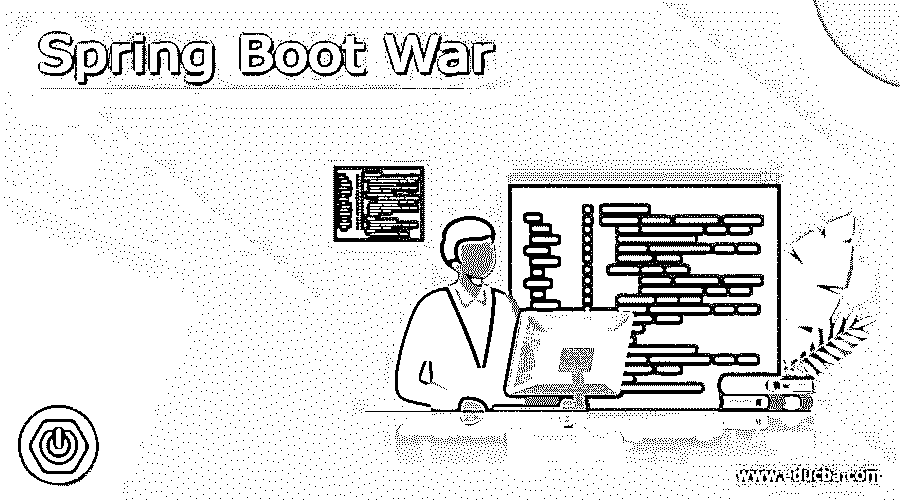

## Spring Boot 战争的定义

Spring boot war 定义为将应用程序打包为 war 文件。众所周知，应用程序的默认打包是 jar 部署在 tomcat 服务器上。我们还可以通过使用 tomcat、JBoss 和 weblogic server 实例来生成 spring boot 应用程序的 war 文件部署。要创建 jar 文件或将 jar 文件转换为 spring boot 应用程序的 war 打包文件，我们需要将打包类型声明为 war。

### 概观

*   它使用 tomcat 服务器，这使得运行我们的网络应用程序很容易。默认情况下，应用程序代码和库打包在一个 jar 文件中。
*   要将可执行的 jar 文件转换成可执行的 war 文件，我们需要遵循以下步骤。

1)首先我们需要在应用程序中禁用 tomcat 服务器。禁用 tomcat 服务器后，下一步是将包类型从 jar 改为 war 文件。
3)更改包类型后，下一步是扩展 servlet 初始化器的主应用程序类。
4)初始化主类后，下一步也是最后一步是将项目 war 文件上传到 tomcat 服务器的 webapps 目录中。

<small>网页开发、编程语言、软件测试&其他</small>

*   要在应用程序中禁用 tomcat 服务器，我们需要告诉 tomcat 服务器不要将 tomcat 用作 servlet 容器。要禁用 tomcat 服务器，我们需要在应用程序的 pom.xml 文件中添加 starter tomcat 依赖项。
*   要将应用程序的打包类型从 jar 更改为 war 文件，我们需要在 pom.xml 文件中将应用程序的打包类型更改为 war。
*   此应用程序包含用于运行或启动应用程序的 main 方法。要在主应用程序类中扩展 SpringBootServletInitializer，我们需要修改该类并扩展 SpringBootServletInitializer，之后，我们需要配置覆盖方法。它将使应用程序在 servlet 容器中运行时是兼容的。
*   要使用 maven 构建 war 文件，我们需要执行以下命令。

`# mvn clean package`

*   要使用 gradle 构建 war 文件，我们需要执行以下命令。

`# gradle war`

*   要将 war 文件上传到 tomcat 服务器，我们需要将 war 文件上传到 tomcat 服务器的 webapps 目录中。
*   在此应用程序中，具有嵌入式服务器解决方案的 jar 文件并不适合所有生产就绪环境，因为部署团队希望完全控制服务器，他们不接触任何代码，因此我们需要应用程序的 war 文件。
*   Spring boot webflux 不依赖于 netty 服务器上部署的应用程序和 servlet API，webflux 应用程序不支持项目 war 文件部署。
*   扩展主类和配置包 war 文件是在应用程序中创建项目 war 文件的主要步骤。
*   我们可以生成 spring boot 应用程序 war 文件来部署在容器内部。Maven 插件支持创建 maven 项目的 war 文件。
*   gradle 插件支持创建 gradle 项目的 war 文件。我们可以使用 gradle 插件创建一个应用程序的 war 文件。

### 创建战争文件 Spring Boot

下面的例子显示了创建 war 文件的项目如下。

#### 1)使用 spring 初始化器创建项目模板，并给项目命名

在下面的步骤中，我们将项目组名称设置为 com。例如，工件名为 springbootWar，项目名为 springbootWar，选择的 java 版本为 8。

`Group – com.example Artifact name – springbootWar
Name – springbootWar Description - Project for springbootWar
Spring boot – 2.5.5 Project – Maven project
Java – 8 Package name - com.example.springbootWar Dependencies – spring web.`

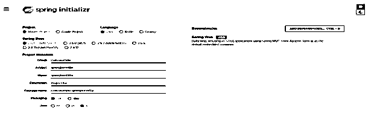

#### 2)生成项目后，提取文件并使用 spring 工具套件打开该项目

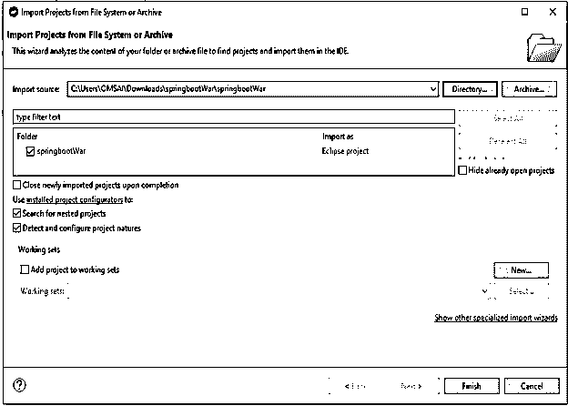

#### 3)使用 spring 工具套件打开项目后，检查项目及其文件

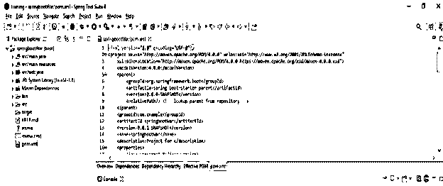

#### 4)添加依赖包–

**代码:**

`<dependency> -- Start of dependency tag.
<groupId>org.springframework.boot</groupId> -- Start and end of groupId tag.
<artifactId>spring-boot-maven-plugin</artifactId> -- Start and end of artifactId tag.
</dependency> -- End of dependency tag.`

#### 5)扩展主类–

**代码:**

`@SpringBootApplication
public class warapp extends SpringBootServletInitializer{
public static void main/* main method of spring boot war app */ (String[] args)
{
SpringApplication.run (warapp.class, args);
}
}`

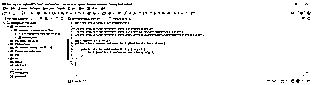

#### 6)覆盖配置方法–

**代码:**

`@SpringBootApplication
public class warapp extends SpringBootServletInitializer
{
public static void main/* main method of spring boot war app */ (String[] args)
{
SpringApplication.run (warapp.class, args);
}
}
@Override
protected SpringApplicationBuilder configure(SpringApplicationBuilder builder)
{
return builder.sources (warapp.class);
}
}`

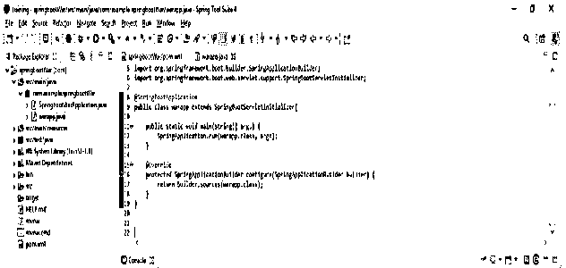

#### 7)配置打包警告-

**代码:**

`<packaging>war</packaging> -- Start and end of packaging tag.`

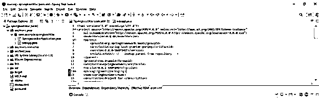

#### 8)建立春季启动战项目——

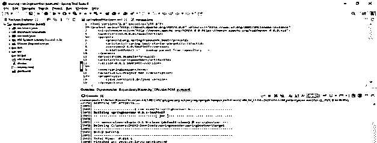

### Spring Boot 的例子

下面的例子显示了 spring boot 使用打包为 war 文件如下。

#### 1)使用 spring 初始化器创建项目模板，并给项目命名

在下面的步骤中，我们将项目组名称设置为 com。例如，工件名为 springboot_war，项目名为 springboot_war，选择的 java 版本为 8。

`Group – com.example
Artifact name – springboot_war
Name – springboot_war
Description - Project for springboot_war
Spring boot – 2.5.5
Project – Maven project
Java – 8
Package name - com.example.springboot_war
Dependencies – spring web.`

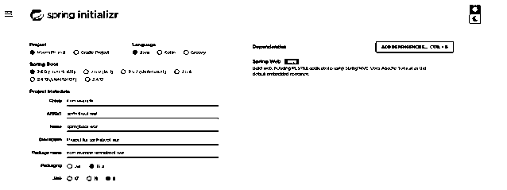

#### 2)生成项目后，提取文件并使用 spring 工具套件打开该项目

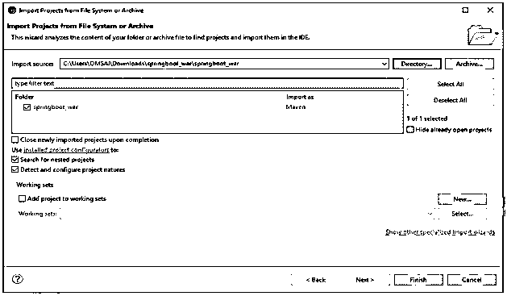

#### 3)使用 spring 工具套件打开项目后，检查项目及其文件

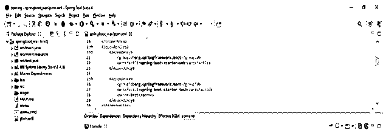

#### 4)为 spring boot war 应用程序创建简单的类

**代码:**

`public class springbootwar
{
public static void main /* main method of spring boot war application */ (String[] args)
{
SpringApplication.run (springbootwar.class, args);
System.out.println ("Simple code of spring boot war application");
}
}`

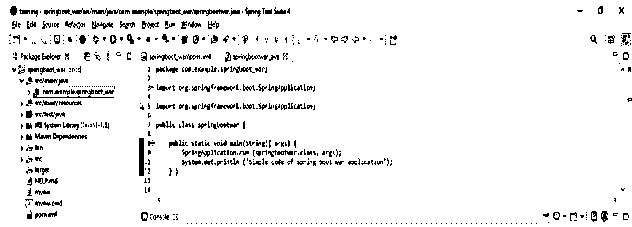

#### 5)使用 war 文件运行 spring boot 应用程序

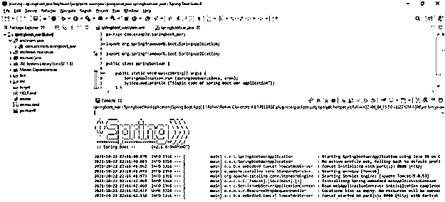

### 结论

Spring boot 使用 tomcat 服务器，这使得我们的 web 应用程序运行起来很容易。默认情况下，应用程序代码和库打包在一个 jar 文件中。Spring boot war 定义为将应用程序打包为 war 文件。

### 推荐文章

这是一本 Spring Boot 战争指南。这里我们讨论定义、概述、创建 WAR 文件 Spring Boot、代码实现示例。您也可以看看以下文章，了解更多信息–

1.  [Spring Boot 的优势](https://www.educba.com/spring-boot-advantages/)
2.  [Spring Boot 缓存](https://www.educba.com/spring-boot-cache/)
3.  [Spring Boot 的名字缩写](https://www.educba.com/spring-boot-initializr/)
4.  [Spring Boot·梅文](https://www.educba.com/spring-boot-maven/)

