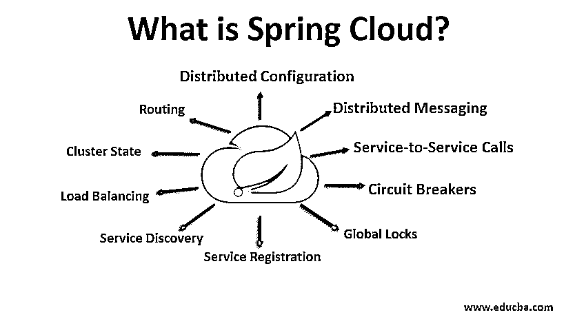

# 什么是春云？

> 原文：<https://www.educba.com/what-is-spring-cloud/>

## 春云简介

Spring Cloud 被定义为一个开源库，它提供了在云上快速部署基于 JVM 的应用程序的工具，它提供了一个可扩展的机制和比其竞争对手更好的用户体验，因为它具有各种功能，如分布式配置、断路器、全局锁、服务注册、负载平衡、集群状态、路由、负载平衡等，它还能够与 Spring 和各种不同语言的不同应用程序一起工作

### 春季云的特征

Spring Cloud 提供了比其他产品更好的体验和可扩展的机制。Spring cloud 的主要特点是:

<small>网页开发、编程语言、软件测试&其他</small>

*   分布式配置
*   分布式消息传递
*   服务对服务呼叫
*   断路器
*   全局锁
*   服务注册
*   服务发现
*   负载平衡
*   集群状态
*   按指定路线发送

### 我们为什么要要求春云？

在使用 Spring Boot 开发分布式微服务的过程中，我们面临以下问题:

*   **性能问题**:不同的运营开销严重影响性能。
*   **部署的复杂性:**需要开发运维技能。
*   **冗余:**分布式系统经常面临冗余问题。
*   **负载**–**平衡:**负载平衡改善了各种计算资源之间的工作负载分布。
*   **分布式系统复杂性:**复杂性包括带宽问题、网络问题、安全问题、延迟问题等。
*   **服务目录工具:**这些工具让同一个集群中的进程和服务能够相互对话。

### 它是如何工作的？

下面是 Spring Cloud 如何工作的解释:

*   Spring Cloud config 为分布式系统中的各种配置提供了客户端和服务器支持。
*   它提供了一个集中的平台来管理不同环境中所有应用程序的各种属性。
*   服务器和客户机的概念完全相同地映射到属性源抽象和 Spring 应用程序。
*   它们可以在 Spring 应用程序中正常工作，并且可以在任何语言的不同应用程序中使用。
*   当应用程序通过部署管道从开发到测试时，它允许您管理和配置所有的环境。
*   它还确保了应用程序在迁移时的所有必需品。
*   用 Spring Cloud Config 添加和插入替代实现很容易。
*   在 Spring Config 客户端和 Spring Boot 执行器出现在类路径上之前， [Spring Boot 应用程序](https://www.educba.com/spring-boot-application/)一直在联系`spring.cloud.config.uri i.e. http://localhost:8888/`的默认值。
*   您可以在`bootstrap.[yml | properties]`或系统属性中设置默认的`value spring.cloud.config.uri`。

**代码:**

`@Configuration
@EnableAutoConfiguration
@RestController
public class DemoApplication {
@Value("${config.name}")
String str = "Cloud";
@RequestMapping("/")
public String new() {
return "Spring " + str;
}
public static void main(String[] args) {
SpringApplication.run(DemoApp.class, args);
}
}`

*   本地配置或远程配置服务器可以提供 name 的值。
*   你可以尝试使用 spring-cloud-config-server 运行你自己的服务器。
*   要在端口 8888 上运行应用程序，您可以设置`spring.config.name=configserver`，然后从样本存储库中提供数据。
*   要找到必要的配置数据，您可能需要`spring.cloud.config.server.git.uri`

### 设置春云

以下是要遵循的步骤:

**第一步:**打开 https://start.spring.io/[网站](https://start.spring.io/)选择

**第二步:**选择 Spring Boot 1.4.X

**步骤 3:** 工件应该设置为“配置”。

步骤 4: 从依赖项部分添加配置服务器模块。

**步骤 5:** 点击 Generate 按钮，下载一个包含 zip 文件的预配置项目。

**步骤 6:** 您还可以通过手动将依赖项添加到 POM 文件来创建一个 Spring Boot 项目。

第 7 步:这些依赖关系可以在所有项目中共享。

**代码:**

`<parent>
<groupId> org.springframework.boot </groupId>
<artifactId> spring-boot-starter-parent </artifactId>
<version> 1.4.0.RELEASE </version>
<relativePath/>
</parent>
<dependencies>
<dependency>
<groupId> org.springframework.boot </groupId>
<artifactId> spring-boot-starter-test </artifactId>
<scope> test </scope>
</dependency>
</dependencies>
<dependencyManagement>
<dependencies>
<dependency>
<groupId> org.springframework.cloud </groupId>
<artifactId> spring-cloud-dependencies </artifactId>
<version> Brixton.SR5 </version>
<type> pom </type>
<scope> import </scope>
</dependency>
</dependencies>
</dependencyManagement>
<build>
<plugins>
<plugin>
<groupId> org.springframework.boot </groupId>
<artifactId> spring-boot-maven-plugin </artifactId>
</plugin>
</plugins>
</build>`

**步骤 8:** “配置服务器”的依赖关系如下:

**代码:**

`<dependency>
<groupId> org.springframework.cloud </groupId>
<artifactId> spring-cloud-config-server </artifactId>
</dependency>`

**第 9 步:**应该添加如下应用程序类，以启用前面示例中提到的配置服务器:

**代码:**

`@SpringBootApplication
@EnableConfigServer
public class DemoApplication {
...
}`

**步骤 10:** 应该将“应用程序属性”添加到 src/main/resources 中。

**代码:**

`server.port = 8888
spring.application.name = config
spring.cloud.config.server.git.uri = file://${user.home}/application-config`

**步骤 11:**Uri 参数是“配置服务器”最重要的设置之一。

**步骤 12:** 在 Windows 上，Uri 参数通常被添加到解析为`C:\users\<username>\. And on Linux, it is /users/<username>/.`的相对路径中

**步骤 13:** 各种应用程序的所有属性文件都存储在上述 Git 存储库中。

**第 14 步:**然后将文件夹“application-config”添加到文件夹 cloud.config.server.git.uri 中。

**步骤 15:** 使用“cd”命令导航到该文件夹，然后键入 git init。

步骤 16:Git 存储库现在将被启动，它允许你存储和跟踪你的文件。

**步骤 17:** 运行配置服务器，检查它是否在工作。

**步骤 18:** 在命令行中键入 mvn spring-boot: [run 命令](https://www.educba.com/powershell-run-command/)启动服务器。

**步骤 19:** 以下输出将被视为服务器成功启动的指示:

`Tomcat started on port(s): 8888 (http)`

**步骤 20:** 配置服务器管理服务器中的应用属性。

**步骤 21:** 在服务器中，每个应用程序的属性应该以这样一种方式配置，即它们应该能够与服务器对话。

**步骤 22:** 这个过程是一个引导过程。每个应用程序都应该有一个名为 properties 的文件。

**第 23 步:**包含与应用属性相似但差别不大的属性。

**步骤 24:** 属性最初由一个名为 Application Context 的父 spring 加载。

**步骤 25:** 由于很关键，配置服务器将启动属性的属性管理。

**步骤 26:** 应用上下文也将解密加密的属性。

第 27 步:这些属性应该保持不同。

**步骤 28:** 属性启动配置服务器，并做好准备。

步骤 29: 属性为你的应用指定属性。

**步骤 30:** 技术上，应用属性也可以放在 properties 中。

**步骤 31:** 虽然配置服务器负责管理应用程序属性，但是我们仍然需要这些属性，因为它们可以作为默认值使用，而在配置服务器中是不可用的。

### 结论

Spring Cloud 的各个部分可以连接在一起成为一个功能性的微服务应用。这是一个基础平台，允许您构建各种复杂的应用程序。Spring Cloud 让您构建强大的云应用程序。分布式环境面临的所有问题都是用 Spring Cloud 解决的。

### 推荐文章

这是一本什么是春云的指南？.在这里，我们将讨论 Spring Cloud 的特性、需求、工作原理和逐步设置。您也可以浏览我们的其他相关文章，了解更多信息-

1.  什么是 Spring Boot？
2.  [什么是 Salesforce 销售云？](https://www.educba.com/what-is-salesforce-sales-cloud/)
3.  [春云组件](https://www.educba.com/spring-cloud-components/)
4.  [Spring Boot vs 春天 MVC](https://www.educba.com/spring-boot-vs-spring-mvc/)

