# 春云契约

> 原文：<https://www.educba.com/spring-cloud-contract/>

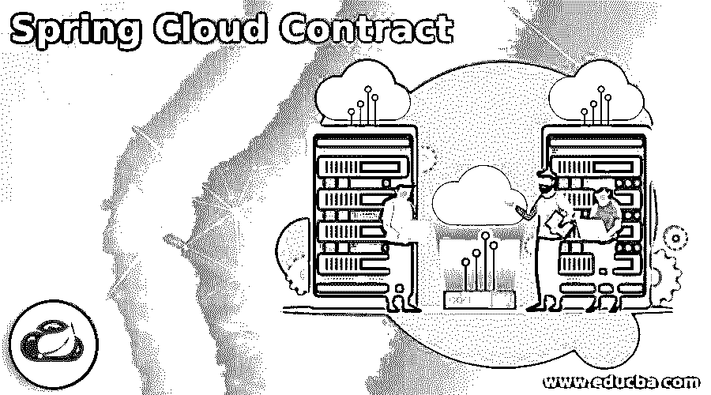

## 春云合约简介

Spring cloud contract 是一个项目，用于保存来自用户的解决方案，以实现消费者驱动的契约方法。Spring 云合同是由云合同的验证者项目组成的；它是一种工具，能够开发消费者驱动的契约。云契约是用 groovy 或者 YAML 写的，附带契约定义语言。契约定义语言用于产生资源。

### 什么是春云合约？

*   云合同是一个帮助我们编写消费者驱动的合同的项目。
*   Spring cloud 契约将确保被分发的应用程序中消费者和生产者之间的契约。此外，它将有助于基于消息和基于 http 的交互。
*   云契约用于产生以下资源。
*   在对客户机代码进行集成测试时，JSON 存根定义被用在 HTTP 服务器存根中。测试代码是手工编写的，测试数据是使用云契约的验证器生成的。
*   我们可以使用云合同路由消息。我们正在将它与 spring integration 集成在一起。我们还可以通过使用云合同来设置我们自己的集成。
*   在云合同中，验收测试用于验证服务器端 API 的实现是否符合合同。我们可以通过使用云合同来生成完整的测试。
*   云合同正在将 TDD 推向架构的层面。我们可以使用 spring cloud 测试部署所有微服务，并执行端到端测试。
*   与其他合同相比，Spring cloud 合同包含非常快速的反馈。对于云合同，我们不需要任何基础架构。
*   云合同将确保 HTTP 消息存根正是服务器端的实现。
*   使用云契约很容易实现消费者和生产者端的测试用例。契约生产者是暴露给云中的 API 并发送消息的服务。
*   在云中，契约消费者只不过是生产者公开的用于消费 API 的服务。

### 如何建立云契约？

*   春云合同是消费者和生产者之间的协议，包括以下几点。
*   第一个协议点包括我们的应用程序使用哪些端点。
*   第二个一致点包括我们从端点获取的输入。
*   第三个一致点将包括输出的样子。
*   在云合同中，消费者驱动的合同是一种消费者驱动 API 变化的方法。
*   消费者和生产者之间的契约一旦建立，就要确保它不会在两者之间破裂。
*   云合同的验证器用于支持消费者驱动的合同开发。
*   云合同中的验证器与合同定义语言一起使用，该语言是用 YAML 或 groovy 语言编写的。

### Spring cloud 合同示例

下面是云合同的例子。

<small>网页开发、编程语言、软件测试&其他</small>

*   **使用 spring initializer 创建云合同应用的项目模板**

在下面的步骤中，我们已经提供了项目组名为 com.example，工件名为 springcloudcontract，项目名为 springcloudcontract，选择的 java 版本为 8。

我们在下面的项目中选择了 spring web 和 contract verifier 依赖来实现云合同项目。

`Group – com.example
Artifact name – springcloudcontract
Name – springcloudcontract
Spring boot – 2.6.0
Project – Maven
Project Description - Project for springcloudcontract
Java – 8
Dependencies – contract verifier, spring web
Package name - com.example.springcloudcontract`

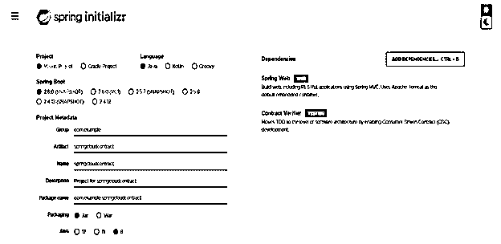

*   **生成项目后，提取文件，使用 spring 工具套件打开该项目—**

在这一步中使用 spring 初始化器生成项目之后，我们提取 jar 文件并使用 spring 工具套件打开项目。

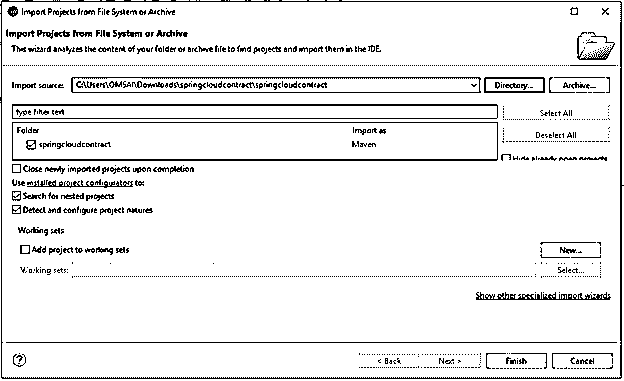

*   **使用 spring 工具套件打开项目后，检查项目及其文件—**

在这一步中，我们检查所有的项目模板文件。我们还需要检查 maven 依赖项和系统库。

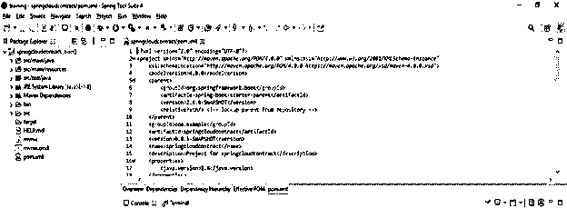

*   **添加依赖包—**

在这一步中，我们将在云合同项目中添加合同验证器依赖项。

**代码—**

`<dependency>   -- Start of dependency tag.
<groupId>org.springframework.cloud</groupId>   -- Start and end of groupId tag.
<artifactId>spring-cloud-starter-contract-verifier</artifactId>  -- Start and end of artifactId tag.
</dependency>    -- End of dependency tag.`

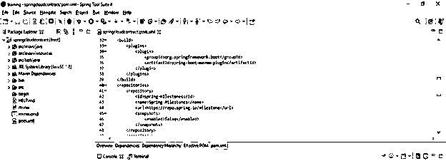

*   **创建生产者** **类—**

**代码—**

`public class stud {
public Integer stud_id;
public String stud_name;
}`

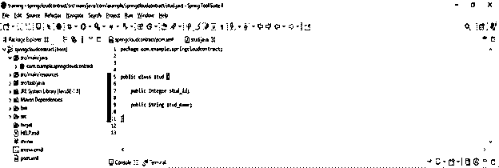

*   **创建生产者控制器类—**

**代码—**

`@RestController
public class studcon {
@Autowired
studService studService;
@GetMapping (value = "stud/{stud_id}")
public ResponseEntity<?> getEmployee(@PathVariable("id") int id) {
if (stud.isPresent()) {
return (ResponseEntity<?>) ResponseEntity.status(HttpStatus.OK).contentType (null);
} else {
return ResponseEntity.status (HttpStatus.NOT_FOUND).build();
}
}`

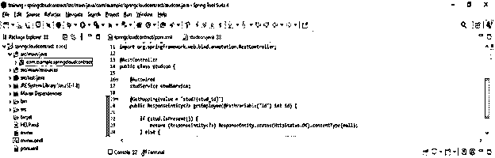

*   **创建消费者** **类—**

**代码—**

`public class cust {
public Integer cust_id;
public String cust_name;
}`

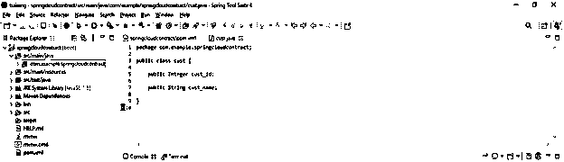

*   **创建端点云合同生产者—**

**代码—**

`@Component
class custClient {
private String stud_id;
public stud getStud (final int cust_id) {
final RestTemplate restTemplate = new RestTemplate();
final ResponseEntity<stud> result = restTemplate.exchange ("http://localhost:8080/stud/" + stud_id,
HttpMethod.GET, null, stud.class);
return result.getBody ();
}
}`

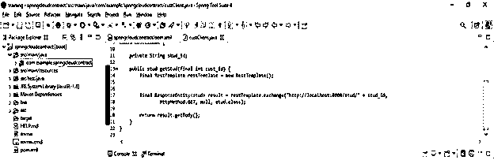

*   **测试消费者—**

**代码—**

`<u>@</u>SpringBootTest(classes = SpringCloudContractConsumerApplication.class)
@AutoConfigureWireMock (port = 808)
@AutoConfigureJson
public class custTest {
@Autowired
custClient cust;
@Autowired
ObjectMapper objmap;
@Test
public void clientShouldRetrunStudForGivenID () throws Exception {
WireMock.stubFor (WireMock.get (WireMock.urlEqualTo ("/stud/1")).willReturn (
WireMock.aResponse ()
.withStatus (100)
.withBody (jsonForStud (new stud (1, "ABC")))));
}
private String jsonForStud (final stud st) throws Exception {
return objmap.writeValueAsString (st);
}
}`

*   **实施生产者服务合同-**

**代码—**

`Contract.make
{
description("After getting request if stud id=1")
request {
method 'GET'
<u>url</u> '/stud/1'
}
response
{
status 100
body("""
{
"stud_id": "1",
"stud_name": "ABC",
}
""")
headers
{
contentType(applicationJson())
}
}`

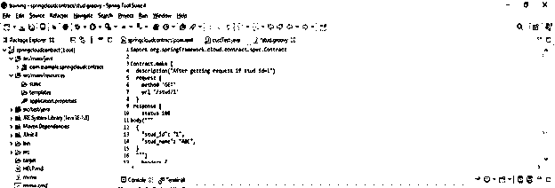

*   **创建一个基类—**

**代码—**

`public class BClass {
@Autowired
studcon sCont;
@MockBean
private studService sService;
@Before
public void before() {
final stud st = new stud(1, "ABC");
Mockito.when(this.sService.findById(1)).thenReturn(Optional.of(st));
RestAssuredMockMvc.standaloneSetup (this.sCont);
}
}`

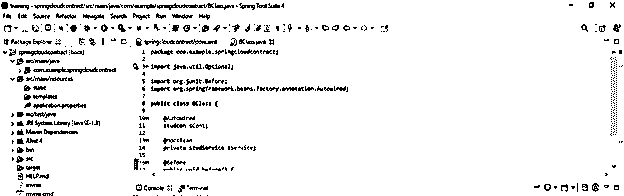

*   **构建应用程序—**

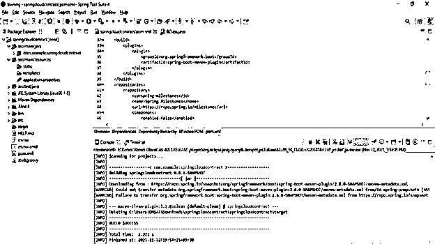

*   **运行应用程序—**

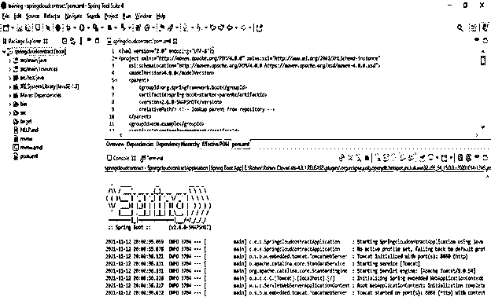

### 结论

Spring cloud contract consumer 只不过是用来消费 API 的服务，由生产者公开。云合同由云合同的验证者项目组成；它只不过是一种工具，能够促进消费者驱动的契约的发展。

### 推荐文章

这是春云契约指南。在这里，我们将讨论什么是 spring 云契约，以及如何构建云契约，并给出示例。您也可以看看以下文章，了解更多信息–

1.  [spring-boot gradle](https://www.educba.com/spring-boot-gradle/)
2.  [弹簧靴框架](https://www.educba.com/spring-boot-framework/)
3.  [Spring Boot 管理](https://www.educba.com/spring-boot-admin/)
4.  [春季开机记录等级](https://www.educba.com/spring-boot-logging-level/)

