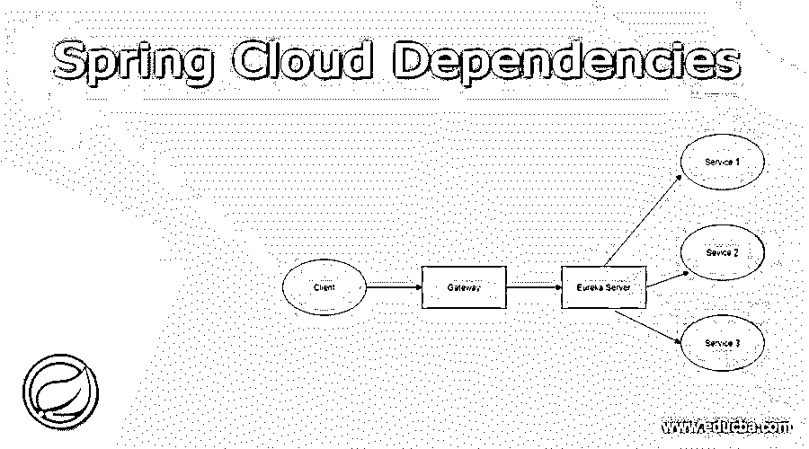
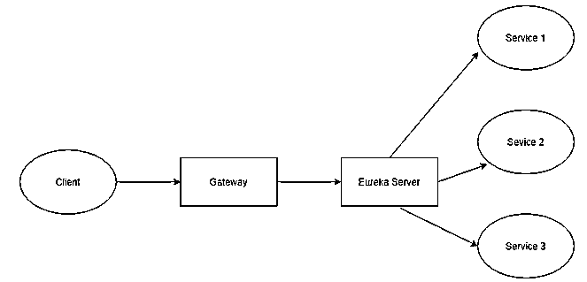
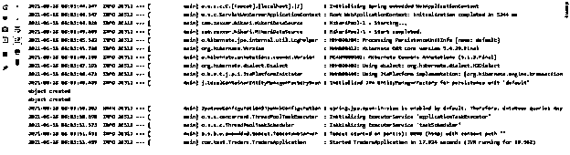

# Spring 云依赖项

> 原文：<https://www.educba.com/spring-cloud-dependencies/>

## Spring 云依赖关系介绍

Spring cloud dependency 帮助我们构建云应用程序，我们必须添加一些依赖项才能实现这一点。首先，了解 spring cloud 是一个框架，它可以帮助我们轻松地开发云应用程序，并为我们提供各种功能。通过使用 spring cloud 框架，我们可以构建一个基于微服务架构的应用程序，不存在 spring cloud 依赖项，核心概念是云框架，为了在我们的应用程序中使用该框架，我们必须使用它们提供的一些依赖项，我们通常会在许多领域中这样做，我们希望在我们的应用程序中实现特定的功能。因此，这些云依赖允许我们创建发现服务、客户端服务、网关等等。在本教程的下一节中，我们将通过一些实践例子来更好地理解和阐明这一点。

**语法:**

<small>网页开发、编程语言、软件测试&其他</small>

正如我们已经讨论过的，spring cloud 是一个框架，我们在应用程序中使用了云依赖关系来创建云应用程序，让我们看看我们需要在 spring cloud 的应用程序中添加什么依赖关系，见下文；

`<dependency>
<groupId>org.springframework.cloud</groupId>
<artifactId>spring-cloud-dependencies</artifactId>
<version>Hoxton.SR8</version>
<type>pom</type>
<scope>import</scope>
</dependency>`

如您所见，我们必须将这些添加到我们的应用 pom.xml 文件中，以获得 spring cloud 依赖项。在教程的下一部分，我们将看到 spring cloud 的内部实现，以便更好地理解和使用。

### Spring 云依赖是如何工作的？

到目前为止，我们已经知道了为什么我们在我们的应用程序中使用 spring cloud 依赖项，在这一节中，我们将首先看到内部工作，而不是为了实现这一工作需要什么不同的配置，所以让我们开始看下面的内容；

Spring Cloud 有三个主要组件，帮助我们将应用程序划分为不同的模块，现在我们将详细了解每个组件的详细信息，见下文；

1)发现服务(Discovery service):这是 spring cloud 的主要服务，它帮助我们发现我们不同的服务，并让我们相互交流。顾名思义，它有助于发现服务。它也被称为注册服务，所有其他服务都注册自己，以便被它找到。为此，我们必须对我们的应用程序进行一些配置，并且记住它将是一个运行在服务器上的单独的 spring boot 项目。我们需要它来跟踪我们已注册的服务，它也不注册自己，在接下来的部分中，我们将看到启用它所需的配置。

2)客户端服务:这也是另一种形式的服务，但是该服务代表来自我们的应用程序的模块，该模块负责执行一些业务逻辑并返回结果。基本上，这个服务为应用程序提供数据，或者我们可以说是实际数据。我们的应用程序中可以有多个客户端服务，这些服务将代表应用程序的不同功能。我们必须向发现服务注册这些服务。

3)网关服务:该服务充当我们的应用程序的入口点，它可以包含我们的应用程序的公共逻辑或我们拥有的所有不同服务所需的集中配置。基本上，它为我们完成了身份验证部分，我们也可以将我们的集中日志记录部分放在这里，它可以是任何东西，具体取决于应用程序的要求。

下面是使用 spring cloud 依赖项的应用程序的基本流程:

正如您在流程图中看到的，我们内部有不同的层，让我们详细了解一下流程；

a)首先，客户端将向服务器发出对资源的任何请求，以便在 UI 上向用户显示它们，

b)在此设置中，请求将首先发送到网关，该网关负责对我们从用户处收到的请求执行身份验证。

c)如果用户是有效的，则网关将映射 URL 并将请求转发给指定的服务，以便获得数据。

d)如果请求或用户无效，则网关将简单地拒绝该请求，并且不会执行进一步的动作来获取数据。

正如您在流程图中看到的，我们可以让许多不同的小型服务在服务器上独立运行，我们也可以为每个服务建立单独的数据库，因为服务 1 不依赖服务 2 获取数据。在本教程的下一节中，我们将通过一个简单的例子来看看如何在我们的应用程序中配置它。

### 例子

1)从 soring initializer 创建 spring boot 项目，并添加所需的依赖项。从下面的网址:https://start.spring.io/

2)在此之后，将它导入到您的 IDE 中，并添加以下用于创建 eureka 服务器的依赖项，

**例如:**

`<dependency>
<groupId>org.springframework.cloud</groupId>
<artifactId>spring-cloud-starter-netflix-eureka-server</artifactId>
</dependency>
<dependency>
<groupId>org.springframework.boot</groupId>
<artifactId>spring-boot-starter-web</artifactId>
</dependency>`

3)在此之后，我们只需向我们的主 spring 应用程序类添加一个注释，以启用 eureka 服务器，并且我们可以运行应用程序来查看输出:

**例如:**

`import org.springframework.boot.SpringApplication;
import org.springframework.boot.autoconfigure.SpringBootApplication;
import org.springframework.cloud.netflix.eureka.server.EnableEurekaServer;
@SpringBootApplication
@EnableEurekaServer
public class EurekaServerApplication{
public static void main(String[] args) {
SpringApplication.run(EurekaServerApplication.class, args);
}
}`

4)将以下配置添加到应用程序文件中，这样注册器就不会将自己注册到服务中，见下文；我们正在使用。yml 文件进行配置，因此语法会有所不同；作为参考，我附上代码

**例如**

`server:
port: 8989
eureka:
client:
register-with-eureka: false
fetch-registry: false`

5)运行应用程序并查看日志，如下所示；

**输出:**

### 结论

正如我们所看到的，spring cloud 使我们开发了一个基于微服务的架构，并且非常容易构建和部署。它通过提供一个通用的用户界面，让我们能够监控我们的每一项服务。它帮助开发者跟踪他们的服务。易于使用、操作和实施。

### 推荐文章

这是一个 Spring 云依赖的指南。这里我们讨论 Spring 云依赖的定义、语法和工作原理。代码实现示例。您也可以看看以下文章，了解更多信息–

1.  [Spring Boot RestTemplate](https://www.educba.com/spring-boot-resttemplate/)
2.  [Spring Boot 2](https://www.educba.com/spring-boot-oauth2/)
3.  Spring Boot·HTTPS
4.  [Spring Boot 换港](https://www.educba.com/spring-boot-change-port/)

