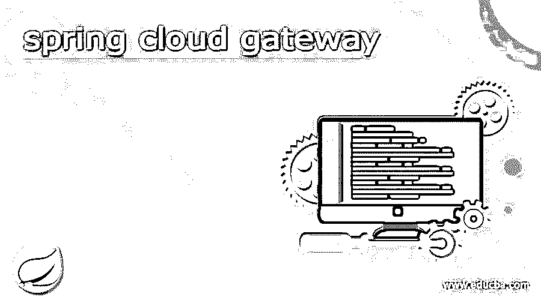
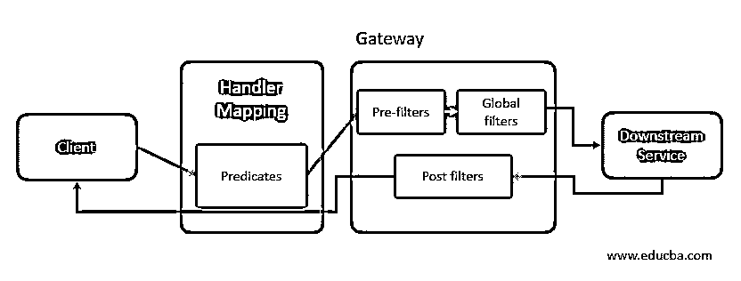
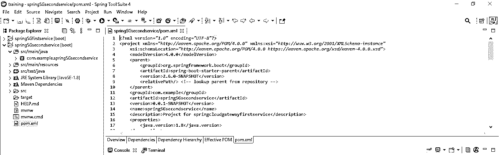
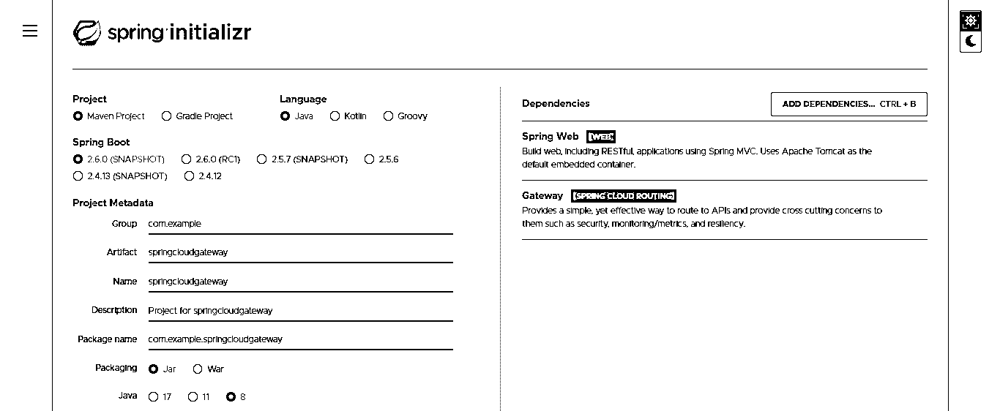
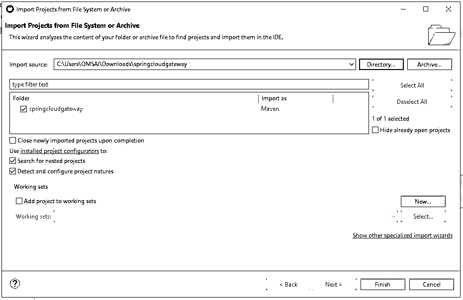
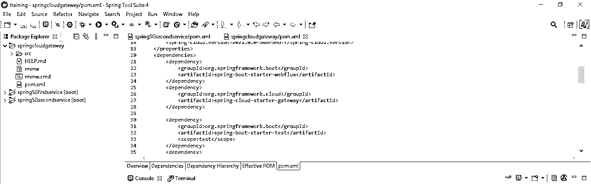
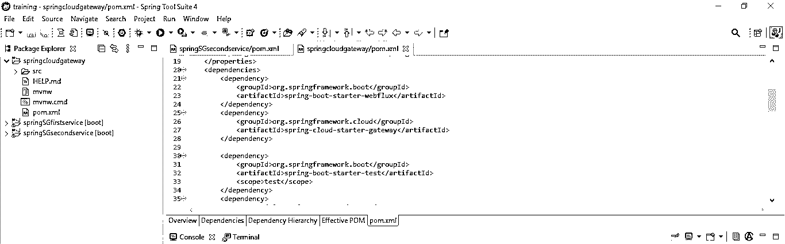
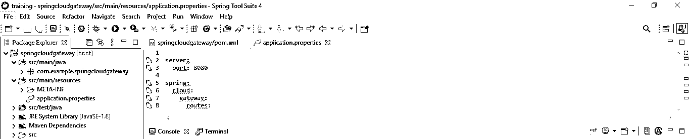
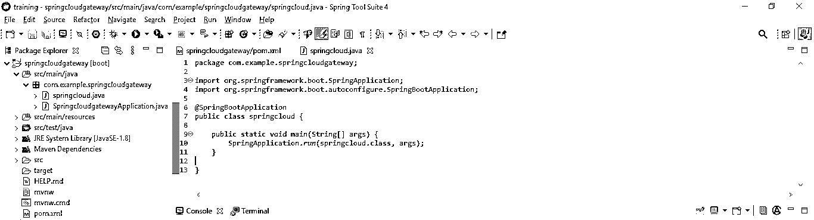
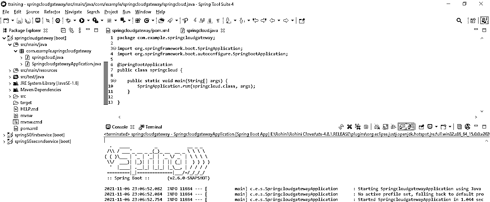

# 春云网关

> 原文：<https://www.educba.com/spring-cloud-gateway/>

## spring 云网关简介

Spring cloud gateway 提供了一个在 java 和 Spring 之上构建网关 API 的库。它将提供一种基于数字标准路由请求的简单方法；它还将关注应用程序的监控和安全性。基本上，spring boot gateway 提供了一种简单有效的方法来路由 API。使用 spring boot 网关，我们可以匹配任何请求的属性路由。

### 什么是春云网关？

*   众所周知，在分布式应用程序中，我们必须使用服务来与应用程序通信。因此，它也被称为军种间通信。
*   我们还为应用程序创建了使用案例，其中来自外部域的客户端从 API 访问服务，因此我们可以公开应用程序客户端调用的微服务的地址，或者我们也可以创建请求不同微服务的网关服务，然后它将响应应用程序客户端。
*   在我们的应用中创建云网关的主要好处是，我们不需要维护每个微服务的安全性；它还将在一个地方处理元信息。
*   为了开发使用云网关的应用程序，我们需要在我们的 spring 应用程序中添加 spring cloud starter 网飞尤里卡客户端和 spring cloud starter 网关依赖项。

下面是 spring boot 网关的功能如下。

<small>网页开发、编程语言、软件测试&其他</small>

1.  云网关的主要重要特性是路径重写。
2.  使用云网关，我们可以定义应用程序的请求速率限制。
3.  使用云网关时，很容易编写过滤器和谓词。
4.  通过使用云网关，可以集成断路器。
5.  我们可以使用 project reactor、spring boot 2.0 和 spring framework 5 来实现云网关。
6.  使用 spring boot gateway，可以路由过滤器和谓词。

*   Spring cloud gateway 正在提供 API gateway，它构建在 Spring 生态系统之上。
*   通过使用云网关，断路器集成成为可能。使用云网关，可以匹配属性请求的路由。
*   我们需要添加 spring cloud starter gateway 依赖项来使用云网关开发项目。

### Spring 云网关架构

*   下图显示了云网关架构如下。该架构分为三个部分。

*   该架构由以下组件组成。

1.  客户
2.  述语
3.  映射处理程序
4.  预过滤器
5.  全局过滤器
6.  后置过滤器
7.  下游服务

*   一旦请求到达云网关，网关的第一个工作就是从可用路由中匹配请求。
*   在匹配来自路由的请求之后，请求被移动到 web 的处理程序，然后过滤器对该请求应用条件。
*   网关提供了多个过滤器，用于修改主体和请求头。
*   预过滤器用于应用于路由，全局过滤器应用于请求的身份验证和授权。

### 使用创建路由 spring 云网关

以下示例显示了如何使用云网关创建路由，如下所示。首先，我们为云网关创建了两个服务。

第一步，我们为云网关创建第一个服务。

*   **创建第一个服务—**

*   **创建第二个服务—**

*   **为 spring 云网关应用创建项目模板—**

在下面的步骤中，我们将项目组名称设置为 com.example，将工件名称设置为 springcloudgateway，将项目名称设置为 springcloudgateway，并将选择的 java 版本设置为 8。

group–com . example

工件名称–springcloudgateway

springcloudgateway 网关 Name

弹簧靴–2 . 6 . 0

项目 Maven

项目描述 springcloudgateway 项目

java 8

依赖性——spring web、网关

包名–com . example . springcloudgateway

*   **生成项目后，提取文件，使用 spring 工具套件打开该项目—**

在这一步中使用 spring 初始化器生成项目之后，我们提取 jar 文件并使用 spring 工具套件打开项目。

*   **使用 spring 工具套件打开项目后，检查项目及其文件—**

在这一步中，我们检查所有的项目模板文件。我们还需要检查 maven 依赖项和系统库。

*   **添加依赖包—**

在这一步中，我们将所需的依赖项添加到项目中。

**代码—**

`<dependency>   -- Start of dependency tag.
<groupId>org.springframework.cloud</groupId>   -- Start and end of groupId tag.
<artifactId>spring-cloud-starter-gateway</artifactId>  -- Start and end of artifactId tag.
</dependency>    -- End of dependency tag.`

*   **配置 application.yml 文件—**

**代码—**

`server:
port: 8080
spring:
cloud:
gateway:
routes:
- id: emp
uri: http://localhost:8081/
predicates:
- Path=/emp/**
- id: cust
uri: http://localhost:8082/
predicates:
- Path=/consumer/**`

*   **创建一个引导类—**

**代码—**

`@SpringBootApplication
public class springcloud {
public static void main /* main method of spring cloud gateway application */ (String[] args) {
SpringApplication.run (springcloud.class, args);
}
}`

*   **运行应用程序—**

### 它是如何工作的？

*   下面的例子展示了云网关如何在如下应用中工作。它由以下组件组成。
*   网关客户端
*   网关 web 处理程序
*   网关处理程序映射
*   服务代理。
*   代理过滤器

*   在云网关中，客户端首先向网关发出请求。匹配请求后，它将发送给 web 处理程序。
*   然后处理程序过滤该请求；过滤请求后，云网关发出请求。

**春云网关-核心功能**

*   下面是云网关的核心功能如下。
*   路径重写
*   谓词和路由过滤
*   使用云网关的请求速率限制
*   断路器集成
*   云网关的主要功能是路径重写。我们可以使用云网关重写路径。
*   我们可以使用云网关预测应用程序的路由过滤。
*   断路器集成对于云网关的功能也很重要。我们还可以限制应用程序的请求。

### 结论

Spring cloud gateway 提供了一种简单的方法来基于大量标准路由请求；此外，它还将关注应用程序的监控和安全性。云网关提供了在 java 和 spring 之上构建网关 API 的库。

### 推荐文章

这是 spring cloud gateway 的指南。在这里，我们讨论什么是 spring cloud gateway，它是如何工作的，并给出了例子和代码。您也可以看看以下文章，了解更多信息–

1.  [春云组件](https://www.educba.com/spring-cloud-components/)
2.  [春云流](https://www.educba.com/spring-cloud-stream/)
3.  [什么是春云？](https://www.educba.com/what-is-spring-cloud/)
4.  [Spring Boot 批次](https://www.educba.com/spring-boot-batch/)

