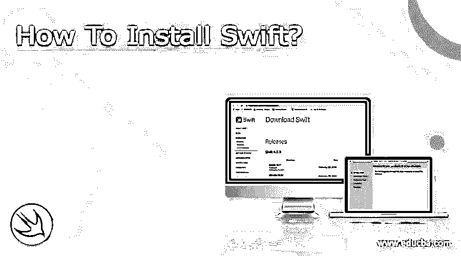
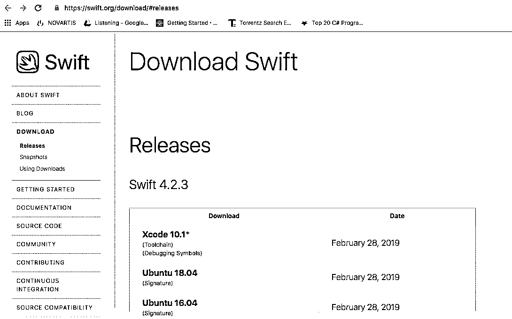
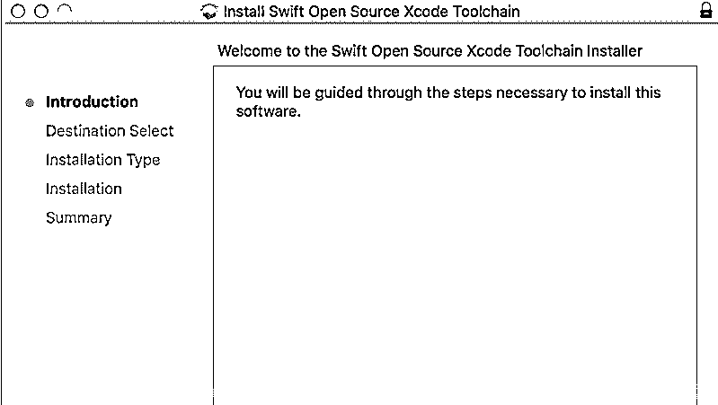
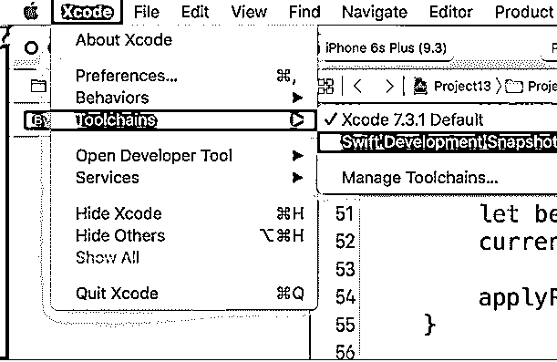

# 如何安装 Swift？

> 原文：<https://www.educba.com/install-swift/>

## 安装 Swift 简介

Swift 是一种编程语言，用于构建具有良好性能、安全性和软件设计模式的应用程序。它有许多使代码更容易读写的特性。它是开发移动和桌面应用程序的最佳语言之一。它的主要开发目的是通过新特性使开发人员的生活变得轻松。

Swift 由苹果公司设计开发，于 2014 年首次亮相。它基于静态的、强的和推断的打字规则。该文件的文件扩展名为“”。斯威夫特。它具有广泛的后期绑定和可扩展的编程特性。在 swift 中，不需要放分号(；)在每条语句的末尾，不需要头文件，它需要类型推断。Swift 是一种通用编程语言。它是独立于平台的，并且支持许多平台。它支持在运行时用来扩展类的类别和方法。它使用接口来支持多重继承。

<small>网页开发、编程语言、软件测试&其他</small>

### 安装 Swift 的步骤

swift 安装的详细信息如下:

**第一步:**下载安装程序及其组件。要下载，请使用此链接【https://swift.org/download/#releases T2】

**第二步:**下载完成后，双击安装程序。将会打开以下屏幕

**第三步:**完成上述一组指令后，swift 的安装完成。之后，启动 Xcode 并选择 toolchain 选项，选择 Swift 开发语言，如下所示:

*   **对于 MacOS** :

工具链在 Mac 上的默认位置，可以通过终端命令安装

`$ export TOOLCHAINS=swift`

*   **对于 Linux:**

安装，铿锵:$ sudo apt-get 安装铿锵

swift 安装的实际路径是:

`$ export PATH=/path/to/Swift/usr/bin: “%{PATH}”`

### Swift 的特点

swift 的特点是共同努力使语言更加强大，Swift 的特点包括:

1.  无商标消费品
2.  多个返回值和元组
3.  内置错误处理
4.  闭包统一和函数指针
5.  支持方法、协议和扩展的结构
6.  高级控制流程
7.  函数式编程模式。
8.  在范围或集合上快速简洁的迭代。

swift 的另一个特点是安全性。它被设计得比其他语言更安全，并消除了其他不安全的代码。它有助于自动管理内存。它被调整以使定义意图变得容易。重要的特性是 swift 对象不能为零，否则会抛出编译时错误。它使编码更容易，更干净，更安全，并防止运行时崩溃。它也被称为面向协议的编程。

swift 是开源的，很容易获得，因为代码在 GITHUB 上很容易获得。它由 swift 开发人员的更大社区支持来维护，并继续提高 swift 的性能。swift 最令人兴奋的一点是它对任何平台开放，这意味着它可以跨各种平台和设备移植。

在 Swift 中，它完全支持 Unicode 字符串。没有异常处理，它有自己不同的兼容模型来处理错误。在 swift 中，枚举类可以有与之相关的数据，可以为这些类定义新的运算符，也可以重新定义运算符。不需要在 switch 块中使用 break 语句。变量和常量总是被初始化并检查绑定数组。

### Swift 代码包括以下内容

以下是上面提到的代码:

#### 1.安全的

swift 代码应该以安全的方式编写。swift 使开发人员以适当的方式并按照编程语言的标准编写代码变得非常安全。

#### 2.快速的

它是为了取代 objective-c 语言和 C 语言而开发的。就大多数任务的性能而言，它与其他语言不相上下。据观察，【swift 性能是可预测的和一致的。又快又快。它的应用程序正以更快的速度加载。

#### 3.表达的

Swift 代码更具表现力，易于阅读和使用。它简单易学，具有现代特征，便于使用。这些年来，随着最新版本的推出，它变得越来越好。

### 结论

swift 是开发人员广泛使用的编程语言。它很容易获得和使用。它具有最新版本的现代特征，为不同类型的应用程序进行编程，以向用户提供这些特征。对于懂 C 语言的人来说，学习很容易。它有一个很棒的在线社区，并且在官方网站上有很好的文档来介绍最新版本和特性的使用。正在被很好的解释，以及第三方库的持续支持。上面提供了安装 Swift 的详细信息，以便快速安装并开始开发应用程序。

### 推荐文章

这是如何安装 Swift 的指南。这里，我们讨论了在我们的系统上安装 Swift 的基本概念和步骤。您也可以阅读以下文章，了解更多信息——

1.  [安装 Django](https://www.educba.com/install-django/)
2.  [安装 MATLAB](https://www.educba.com/install-matlab/)
3.  [安装 Apache](https://www.educba.com/install-apache/)
4.  [安装 phpMyAdmin](https://www.educba.com/install-phpmyadmin/)

