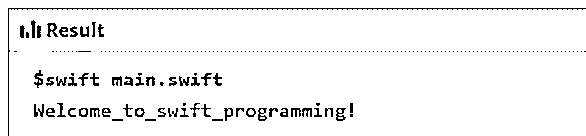
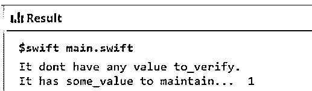
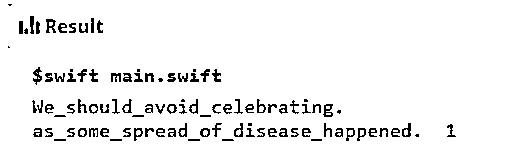

# Swift 软件包管理器

> 原文：<https://www.educba.com/swift-package-manager/>

## Swift 软件包管理器简介

swift 包管理器就像一个以统一方式管理和分发 swift 代码库的工具。它为 swift 提供了一个集成的内置系统，使编译、链接和下载的整个流程更加灵活高效。所有模块都由一些专用于产品实现及其依赖项的特殊源文件和清单文件组成。swift 包管理器中的清单文件，称为包。Swift 定义包名，另一个包描述模块包含实际内容。

### Package Manager 如何在 Swift 中工作？

*   由于 Swift 3.0 版及更高版本支持并包含 Swift 中的包管理器概念，因此包管理器在 Swift 中有一些概念模式和工作方式。
*   swift 中有一些模块用于将 swift 的整个代码库组织成模块，Swift 中的每个模块都具有重要意义，代码可用于名称空间，并在模块外实施每个访问控制。
*   很多时候，一个代码可能只有一个用于导入代码的模块，但是依赖关系也是存在的，它用于处理许多与系统相关的模块，比如 Linux 上的 macOS、Darwin、0r Glibc。
*   这些模块在某种程度上是有帮助的，它们可以作为可重用的代码来解决需求可能是相同的任何问题。
*   相同的模块也可以在 swift 的相同代码库集合中共享，因为两者都需要一个 swift 包管理器来正确解决。
*   可以使用库或可执行文件作为 swift package manager 所在产品的一部分来构建其中的目标存在。
*   作为 swift 语言一部分的可执行文件可以在 macOS、Darwin 等任何操作系统上运行。，支持 swift 3.0 及以上版本。
*   其中存在的目标还包含包中代码库所需的依赖项，该依赖项由源包的相对和绝对 URL 组成，并且还具有一组支持它的版本所必需的要求。
*   基于一个场景，我们可能需要编辑与项目相关的依赖项，并且可能通过提供管理版本和依赖项所需的所有相关信息来深入到包管理器及其相关的粒度。
*   与 XCode 的集成也起到了关键的作用，因为它有助于使软件包管理器和应用程序的执行更加顺畅和高效。
*   在打包整个代码库以供执行时，有许多管理依赖项和解决依赖项的方法发挥着重要作用。此外，这两种依赖性在集思广益和解决问题方面对程序员有很大帮助，而不是在软件或硬件方面进行调试。

### Swift 包管理器示例

下面是提到的例子:

<small>网页开发、编程语言、软件测试&其他</small>

#### 示例#1

本程序演示了在使用 import swift 语句导入 inbuild swift 软件包管理器后，成功执行程序时打印 Welcome_to_swift_programming，如以下代码和输出所示。

**代码:**

`import Swift
print("Welcome_to_swift_programming!")`

**输出:**

#### 实施例 2

该程序演示了软件包管理器与 import foundation 的用法，该软件包管理器与 swift import 软件包管理器略有不同，这意味着即使未进行 swift 导入，foundation import 也将管理 swift 导入的所有基本需求，因为 Foundation package 作为一个框架，用于导入必要的清单文件和文件夹，以编译输出中所示的代码。

**代码:**

`import Foundation
var sm_val:Int?
var sm_anthr_val:Int! = 1
if sm_val != nil
{
print("It has some_value to maintain... \(sm_val!)")
}
else
{
print("It dont have any value to_verify.")
}
if sm_anthr_val != nil
{
print("It has some_value to maintain...  \(sm_anthr_val!)")
}
else
{
print("It don't have any_val to verify.")
}`

**输出:**

#### 实施例 3

这个程序演示了 import Glibc 的用法，它用于替换 Darwin 包管理器模块以支持 Linux 环境，并维护或测试整个包管理器的用法和工作效率，如下面的代码库所示，输出如图所示。

**代码:**

`import Foundation
import Glibc
var sm_val:Int?
var sm_anthr_val:Int! = 1
if sm_val != nil
{
print("Lets_celebrate_festival \(sm_val!)")
}
else
{
print("We_should_avoid_celebrating.")
}
if sm_anthr_val != nil
{
print("as_some_spread_of_disease_happened.  \(sm_anthr_val!)")
}
else
{
print("So_be_safe&enjoy.")
}`

**输出:**

**Note:** There are many ways to explore the swift package manager, but it is better to analyze the requirement and then move forward in order to apply and select the appropriate standard libraries with it to maintain the uniformity and distribution of the codebase.

### 优势

下面是提到的优点:

*   Swift package manager 的主要目的是降低所用资源的总体成本，即资源管理。
*   它有助于自动化和简化构建、打包和下载与项目相关的所有依赖项的整个过程。
*   它确实有助于使整个过程像递归过程一样高效，因为它帮助依赖者利用他们自己的依赖来完全工作。
*   它形成了一个依赖图，为程序员提供了一个概览，使他们能够整理出大多数模块及其依赖关系，从而有效地工作和管理。
*   包管理器有一些内置的系统和包，它们带有帮助提供构建的模块，以满足和管理图中要维护的流的整个依赖性。

### 结论

它在整个 swift 编程语言中起着举足轻重的作用。它有助于形成一个容器，用于组织和管理整个内容和具有依赖关系的模块，以确保所有内容和模块都有一个适当的概览，从而维护执行中的格式和范例。

### 推荐文章

这是 Swift 包管理器指南。在这里，我们讨论简介，软件包管理器如何在 swift 中工作？例子和优点。您也可以看看以下文章，了解更多信息–

1.  [Swift For Loop](https://www.educba.com/swift-for-loop/)
2.  [Swift 版本](https://www.educba.com/swift-version/)
3.  [什么是雨燕？](https://www.educba.com/what-is-swift/)
4.  [Swift 运营商](https://www.educba.com/swift-operators/)

