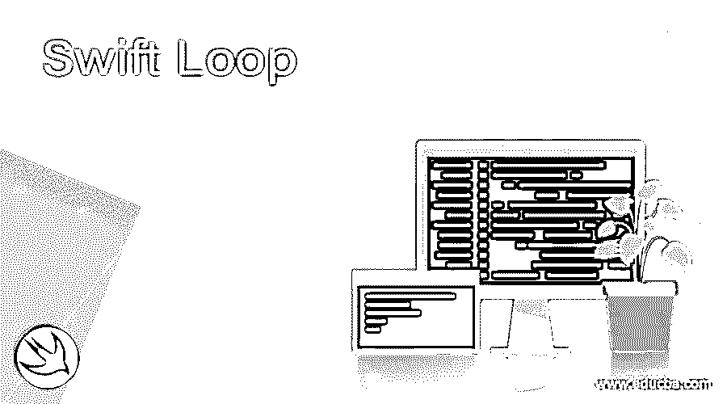
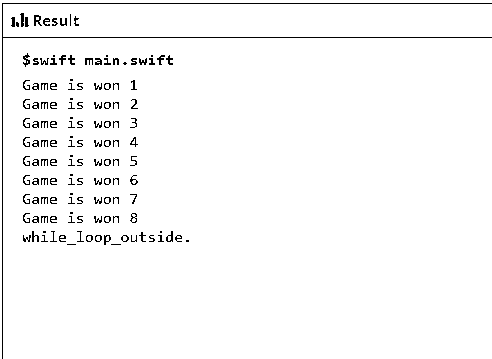
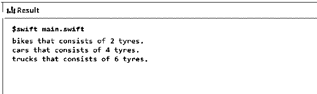
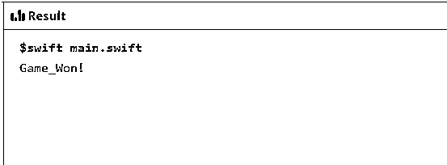
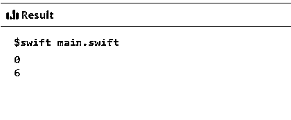
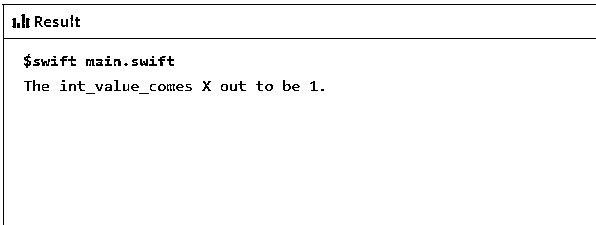
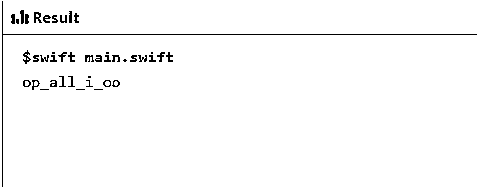

# 快速循环

> 原文：<https://www.educba.com/swift-loop/>

## Swift 循环的定义

Swift loop 是 Swift 编程语言的一部分，当出现需要多次执行同一段代码的情况时，swift loop 就会发挥作用。在 swift 循环中，语句以序列的形式执行，首先执行第一条语句，然后是第二条语句，依此类推。Swift loop 赋予程序员调用和重用相同语句序列任意指定次数的特权。Swift 循环根据循环流中提供的条件和控制语句的顺序工作。

### Swift 中的环路类型

Swift 中带循环控制语句的循环类型如下:

<small>网页开发、编程语言、软件测试&其他</small>

*   **While 循环**
*   **For-in 循环**
*   **重复…while 循环/ Do while 循环**
*   **条件增量循环**
*   **中断语句**
*   **继续语句**

#### 1.While 循环

While loop 是 swift 编程语言中的一种循环类型，用于评估循环中语句或主体的任何条件，以满足为真的条件，然后使整个循环成功执行。如果 case condition _ for _ execution 为 false，则循环将不会进入用于执行代码体的 conditional_statements。

**语法:**

`while (condition_for_execution)
{
Conditional_statements for the body of the code
}`

**例 1** :这个程序演示了 while 循环，在这个循环中，进行了一场国际象棋比赛，如果条件满足，那么比赛就赢了，如输出所示。

**代码:**

`import Foundation
import Glibc
var crrnt_lvl:Int = 1,
trgt_lvl:Int = 8
let check_mate = true
while (crrnt_lvl <= trgt_lvl) {
if check_mate {
print("Game is won \(crrnt_lvl)")
crrnt_lvl += 1
}
}
print("while_loop_outside.")`

**输出:**

#### 2.For-in 循环

swift 编程语言中的 for-in 循环用于迭代数组和字典等数据结构集，这些数据结构有一定的顺序。数组或字典中的元素需要正确排列。

**语法**

`for index_with_sequence
{
statements for the body of the code
}`

**示例 2:** 该程序演示了 swift 编程语言中的 for-in 循环，该循环用于迭代带有车辆名称的数组列表，以获得车辆中存在的轮胎数量，如输出所示。

**代码:**

`import Foundation
import Glibc
let no_of_tyres = ["car": 4, "truck": 6, "bike": 2] for (vehicle_nm, tyre_cnt) in no_of_tyres
{
print("\(vehicle_nm)s that consists of \(tyre_cnt) tyres.")
}`

**输出:**

#### 3.重复…while 循环或 do-while 循环

Repeat while 循环或 do while 循环的行为方式是，在整个执行过程中，条件语句体中出现的任何语句都将至少执行一次。更重要的关注点是终止条件，它在执行语句时以递增的方式在整个搜索中测试一次。循环继续执行，直到语句的执行变为 false。

**语法:**

`repeat
{
Statements_to_satisfy_body
}
while (conditional_statements)`

**示例 3:** 这个程序演示了 repeat while 循环，其中玩了一个像 snake and ladder 这样的游戏，其中有一个在棋盘游戏中重复条件语句的场景，以使整个游戏获胜，其条件如输出中所示。

**代码:**

`import Foundation
import Glibc
let finl_sqr = 36
var brd_gm = [Int](repeating: 0, count: finl_sqr + 1)
brd_gm[05] = +12; brd_gm[08] = +11; brd_gm[10] = +09; brd_gm[12] = +02
brd_gm[20] = -05; brd_gm[22] = -13; brd_gm[24] = -02; brd_gm[28] = -09
var sqr = 0
var dc_rll = 0
repeat
{
sqr += brd_gm[sqr] dc_rll += 1
if dc_rll == 12 { dc_rll = 1 }
sqr += dc_rll
} while sqr < finl_sqr
print("Game_Won!")`

**输出:**

#### 4.for-条件增量循环

与 C 编程语言相比，Swift 编程语言中的 for-condition-increment 循环没有太大区别。整个循环包括初始化阶段，随后是条件测试，用语句递增，然后执行循环的每次迭代。

**语法:**

`For initialization_vl; condition; increment++
{
Conditional_statements_for_body
}`

**示例 4** :该程序演示了 Swift 4.0 版中的 for-condition-increment 循环，该循环使用 stride 提供与 Swift 3 版及以下版本中的 for-condition-increment 相同的功能，因为这些功能对于更多要求已经过时，因此这些功能已被弃用，以提供如下所示的相同输出。

**代码:**

`import Foundation
import Glibc
for indx in stride(from: 0, to: 8, by: 6)
{
print(indx)
}`

**输出:**

#### 5.break 语句

无论什么时候，如果要从正在运行的程序中出来，而不必等到执行结束时才终止，那么 break 语句就有了被频繁使用的动力和能力。实际上，break 语句主要用于遇到主体内部的循环。当程序控制要求尽快中断时，循环立即终止，并在下一个循环的下一条语句处继续。

**语法:**

`Switch statement {
Case 1 :
Case 2 :
.
.
.
Case n:
Default :
Break;
}
Print statement
{
Statement;
}`

**例 5:** 这个程序演示了作为 swift 循环一部分的 break 语句，该语句在执行完成后给出值，如输出所示。

**代码:**

`import Foundation
import Glibc
let nm_symbl: Character = "X"
var psbl_int_val: Int?
switch nm_symbl {
case "1", "X":
psbl_int_val = 1
case "2", "X":
psbl_int_val = 2
case "3", "X":
psbl_int_val = 3
case "4", "X":
psbl_int_val = 4
default:
break
}
if let int_val = psbl_int_val {
print("The int_value_comes \(nm_symbl) out to be \(int_val).")
} else {
print("the int_value_cannot come out for. \(nm_symbl).")
}`

**输出:**

#### 6.连续语句

Continue 语句保持对迭代语句的检查，以保持循环，并检查在循环开始后是否停止或开始执行。

**语法:**

`Case 1 : Stmnt_1;
Case 2 : Stmnt_2;
.
.
.
.
Case 3 : Stmnt_3;
Default: continue
{
Print()
}`

**例 6:** 这个程序演示了 continue 语句，该语句通过删除不需要的字符来指示继续流，直到进行下一次迭代，如输出中所示。

**代码:**

`import Foundation
import Glibc
let pzl_inpt = "hope_all_is_good"
var pzl_otpt = ""
let Remv_chrcters: [Character] = ["e", "h", "s", "g", "d", " "] for Charc_incl in pzl_inpt {
if Remv_chrcters.contains(Charc_incl) {
continue
}
pzl_otpt.append(Charc_incl)
}
print(pzl_otpt)`

**输出:**

### 结论

Swift loop 是一种循环模式，主要用于执行代码的可重用性，尤其是不重复执行相同的组件。使用 swift 循环执行数组、具有指定计数的字典和序列中的所有迭代，swift 循环通过消除代码库中的冗余提供了更多功能，如灵活性、健壮性和通用性。

### 推荐文章

这是一个快速循环的指南。这里我们讨论 Swift 中循环的定义和类型，以及代码实现的例子。您也可以浏览我们的其他相关文章，了解更多信息——

1.  [Swift For Loop](https://www.educba.com/swift-for-loop/)
2.  [Swift 版本](https://www.educba.com/swift-version/)
3.  [Swift 中的属性](https://www.educba.com/course/properties-in-swift/)
4.  [什么是雨燕？](https://www.educba.com/what-is-swift/)

