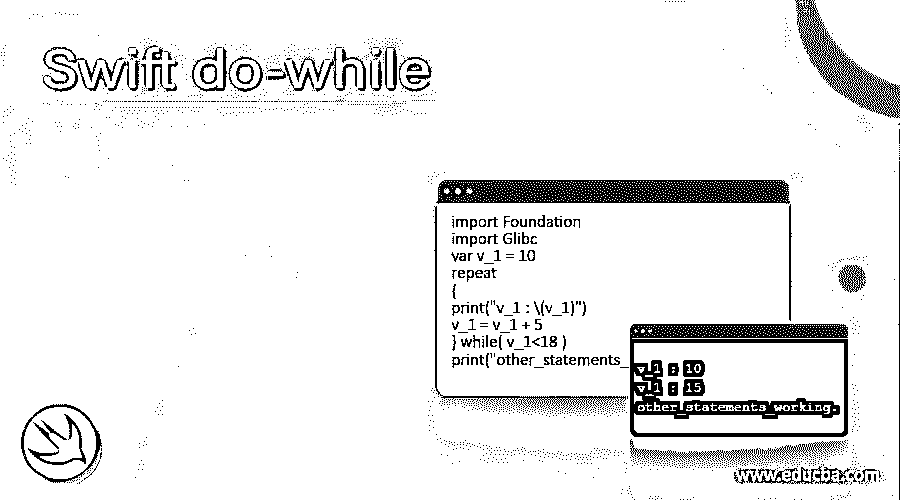
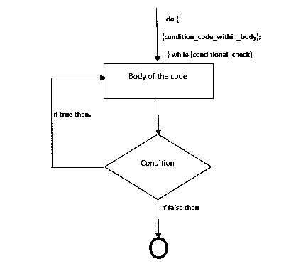
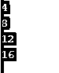
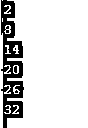
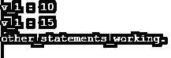
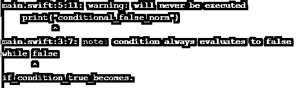
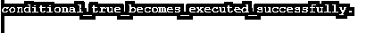

# 快速做一会儿

> 原文：<https://www.educba.com/swift-do-while/>

## 快速 do-while 循环的定义

Swift do-while 循环用于测试和检查循环结束时的条件，例外情况是 do-while 循环在进行其他条件检查之前至少执行一次。Swift do while 循环的行为与其他 for 和 while 循环不同，在 while 循环中，执行从循环顶部开始。由于在 do-while 循环中，条件表达式位于循环的末尾，因此循环中的所有语句都应该在条件检查之前执行，也称为重复 do-while。

**语法:**

<small>网页开发、编程语言、软件测试&其他</small>

语法流是这样的，do 循环将执行活动，然后整个程序体将执行程序体中的语句，该语句还提供条件检查，它出现在循环的末尾，如图所示。

`do
{
Statement_for_body;
}while( conditional_check );`

**流程图**

代码的流程是这样的，先进行条件检查，然后执行代码体，以使值为真。如果底部的条件检查结果为假，则应满足末尾或底部的条件检查，然后终止整个代码体。

### Swift 中的 While loop 是如何工作的？

*   Swift 中的 While loop 以上述流程图所示的方式工作和流动。
*   出现在底部的条件表达式应该在条件被验证和测试之前执行一次。
*   如果在这种情况下，条件看起来为真，那么控制流跳回到 do 循环，并且循环中出现的所有语句再次无缝执行。
*   语句执行的迭代被重复执行，直到条件变为假。
*   一旦迭代成为假，它将使条件数 0，然后""，列为空()和 undef()所有值都是假的，与大多数布尔格式。
*   快速 while 循环通常被称为重复 while 循环，两者没有太大区别。repeat while 循环的主要重点是条件检查点，一旦所有语句都执行了，就会执行该检查点。
*   有一种情况是，如果没有使用正确的语句和条件检查，repeat while when 可能会导致无限 while 循环。当使用 repeat loop 语句时，会检查末尾的条件检查，然后执行循环中的所有语句。
*   每当需要解决和重用代码集时，最好使用 swift do while 循环，这样所有的迭代和语句都会得到正确的解决。
*   重复 while 循环与 while 循环有一些不同，例外情况是 while 循环在顶部有条件检查，而重复 while 循环补充了条件检查出现在底部的事实，然后执行循环中的语句。
*   Swift 中的 Do while 循环如果最初被求值为 false，将永远不会执行其中的任何语句，而是会抛出警告，说明永远不会被执行，也不会被求值为 false。

### 快速 do-while 示例

让我们讨论一下快速 do-while 的例子。

#### 示例#1

这个程序演示了 repeat while 循环，在这个循环中，游戏从第一个阶段开始初始化，然后在条件检查之后从最后一个阶段结束游戏，然后游戏结束，结果如输出所示。

**代码:**

`import Foundation
import Glibc
var frst_stage:Int = 0, lst_stage:Int = 8
let finishd_game = true
repeat
{
if finishd_game
{
print("Completed_frst_stage: \(frst_stage)")
frst_stage += 1
}
} while (frst_stage <= lst_stage)
print("Excution_outside_while_loop.")`

**输出:**

#### 实施例 2

这个程序演示了条件检查，它出现在代码的底部，用循环中包含的所有语句执行，直到条件变为假，如输出中所示的所有条件和满足。

**代码:**

`import Foundation
import Glibc
var sm_0 = 4
repeat
{
print(sm_0)
sm_0 = sm_0 + 4
} while sm_0 < 20`

**输出:**

#### 实施例 3

这个程序演示了 while 循环，它不同于 repeat while 循环，在 repeat while 循环中，while 条件检查出现在代码的顶部而不是底部，如下面的输出所示。

**代码:**

`import Foundation
import Glibc
var j_m = 2
while j_m < 36
{
print(j_m)
j_m = j_m + 6
}`

**输出:**

#### 实施例 4

这个程序演示了 repeat while 循环，其中在条件检查中提到的布尔表达式变为 false，如输出所示。

**代码:**

`import Foundation
import Glibc
var v_1 = 10
repeat
{
print("v_1 : \(v_1)")
v_1 = v_1 + 5
} while( v_1<18 )
print("other_statements_working.")`

**输出:**

#### 实施例 5

此程序演示了使用 while loop with false 将引发异常的情况，如输出中所示，说明 false 条件始终为 false，并且循环将永远不会执行，如输出中所示。

**代码:**

`import Foundation
import Glibc
while false
{
print("conditional_false_norm")
}
print("if_condition_true_becomes.")`

**输出:**

#### 实施例 6

示例 5 中演示的程序可以用下面的代码集来解析和执行，因为最终的代码会被执行，并且在它的顶部会执行条件检查，条件检查会在代码的底部执行并提到，如输出所示。

**代码:**

`import Foundation
import Glibc
repeat
{
print("conditional_true_becomes_executed_successfully.")
} while false`

**输出:**

### 结论

Swift do while 循环用于重用带有条件检查的代码。它还有助于使整个代码和语句以流的形式执行，直到条件变为假。它还有助于使循环灵活多变，可以执行和采用循环中的所有重复语句。

### 推荐文章

这是一个纯 CSS 的指南。这里我们讨论 Swift 中 While 循环的定义、语法、流程图以及如何工作？和代码实现示例。您也可以看看以下文章，了解更多信息–

1.  [雨燕词典](https://www.educba.com/swift-dictionary/)
2.  [雨燕地图](https://www.educba.com/swift-map/)
3.  [Swift 表单](https://www.educba.com/swift-forms/)
4.  [Swift For Loop](https://www.educba.com/swift-for-loop/)

