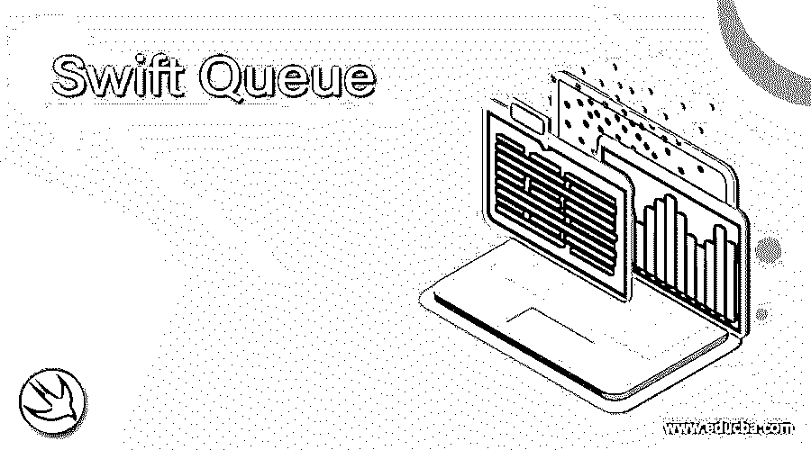
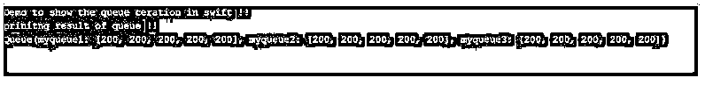

# 快速队列

> 原文：<https://www.educba.com/swift-queue/>

## Swift 队列简介

Swift 队列与任何其他编程语言都是一样的。队列是用于存储元素的数据结构；在队列中，我们可以从一端存储数据，并使用另一端删除它。队列工作并遵循 FIFO，即先进先出。我们有很多这样的例子，比如从任何车站买票等等。swift 支持操作中的队列，用于处理数据或元素。

**语法:**

<small>网页开发、编程语言、软件测试&其他</small>

我们知道，swift 中的队列是用来存储数据的。为了存储任何数据，我们需要来自队列的预定义方法，并且为了删除数据，有一些来自队列的方法，但是首先，我们将看到在进行编程时如何在 swift 中定义队列的语法。

`var variable_name:[Type] = []`

正如你在上面的语法行中看到的，定义一个队列非常简单，就像定义任何其他集合一样。首先，我们必须给出变量名，后跟它要存储的类型，如果我们愿意，我们可以初始化它。

**举例:**

**代码:**

`var myqueue :[Int] = []`

在这里，我们将看到如何在 swift 中添加元素和从队列中删除元素。

### Swift 中如何实现队列？

我们已经知道，队列是一种用于存储元素的数据结构。要对队列执行任何操作，它为此提供了不同的方法。它是预定义的，或者我们可以说是在 swift 中构建的，因此我们不需要为此包含任何库。我们可以执行不同的操作，比如在队列中插入和从队列中删除元素。

在这里，我们将详细地看到队列中可用的这两种方法。

#### 1.使…入队

这是队列中可用的方法。此方法用于向队列中添加元素。我们可以简单地在我们创建的队列或数组上调用这个方法。

**语法:**

`var myqueue : [Int] = [] myqueue.append(your element here )`

正如您在上面 enqueue 方法的语法中看到的，我们在第一行代码中创建的队列变量上调用这个方法。我们可以向队列变量中添加任意多的元素。

#### 2.出列/删除

此方法用于从队列中移除元素。这也是 swift 队列数据结构中可用的预定义方法。

**语法:**

`var myqueue : [Int] = [] myqueue.remove(your element here )`

正如您在上述 dequeue 方法的语法中所看到的，我们在第一行代码中创建的队列变量上调用这个方法。我们可以从队列变量中删除任意多的元素。要执行出列操作，我们必须对它调用 remove()方法。

现在我们将看到一个例子，在程序中使用这两种方法来详细了解它的内部工作原理。

**举例:**

**代码:**

`import Foundation
import Glibc
import Foundation
struct Queue{
var myqueue:[Int] = [] mutating func enqueue(element: Int)
{
myqueue.append(element)
}
}
var obj = Queue()
obj.enqueue(element : 200)
print(obj)`

正如您在上面几行代码中看到的，我们正在创建一个结构队列来使用队列功能。在该结构中，我们覆盖了名为“myqueue”的对象，它只将整数值作为数据存储在队列中。此后，我们尝试使用 swift 队列中的“入队”功能。这个函数将向我们创建的队列对象添加一个新元素。要添加对象，我们可以使用 append 方法。我们只需对队列对象调用 append 方法；在这个方法中，我们可以将元素传递给对象。

### 如何在 swift 中从队列中删除元素？

**代码:**

`import Foundation
import Glibc
import Foundation
struct Queue{
var myqueue:[Int] = [] mutating func enqueue(element: Int)
{
myqueue.append(element)
}
mutating func dequeue() -> Int?
{
if myqueue.isEmpty {
return nil
}
else{
myqueue.remove(at: 0)
return 0
}
}
}
var obj = Queue()
obj.enqueue(element : 200)
print(obj)
obj.dequeue()
print(obj)`

从上面几行代码中可以看出，我们正在创建一个队列。所有的事情都是一样的，但是现在我们向队列中添加了一个新函数，它从队列中移除了元素。如果我们的队列对象是空的，那么它将返回 NIL 否则，我们将调用 remove()方法从队列中删除特定的元素。要调用这个方法，我们可以创建对象并从队列中删除它们。

### Swift 队列示例

在本例中，我们试图在 swift 中创建一个队列，并向其中添加元素。我们正在创建几个队列对象，并添加同一个对象来展示我们如何在编程时使用它。

**代码:**

`import Foundation
import Glibc
import Foundation
struct Queue{
var myqueue1 :[Int] = [] var myqueue2 :[Int] = [] var myqueue3 :[Int] = [] mutating func enqueue(element: Int)
{
myqueue1.append(element)
myqueue2.append(element)
myqueue3.append(element)
}
}
print("Demo to show the queue ceration in swift !!")
var obj = Queue()
obj.enqueue(element : 200)
obj.enqueue(element : 200)
obj.enqueue(element : 200)
obj.enqueue(element : 200)
obj.enqueue(element : 200)
print("prinitng result of queue !!")
print(obj)`

**输出:**

### 结论

众所周知，队列是用来存储元素的。它提出了两种方法，可用于对 queue 元素执行名为“enqueue”和“dequeue”的操作。它们非常容易实现，可读性强，并且便于开发人员操作。

### 推荐文章

这是快速排队指南。这里我们讨论一下入门，如何在 swift 中实现队列？和示例。您也可以看看以下文章，了解更多信息–

1.  [Swift For Loop](https://www.educba.com/swift-for-loop/)
2.  [Swift 版本](https://www.educba.com/swift-version/)
3.  [Swift 中的属性](https://www.educba.com/course/properties-in-swift/)
4.  [什么是雨燕？](https://www.educba.com/what-is-swift/)

