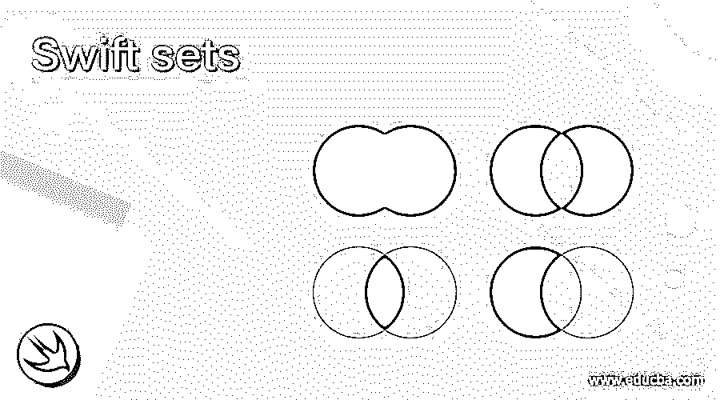
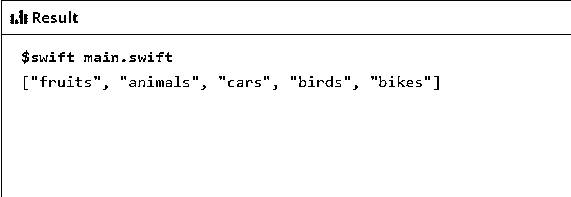
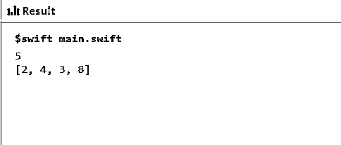
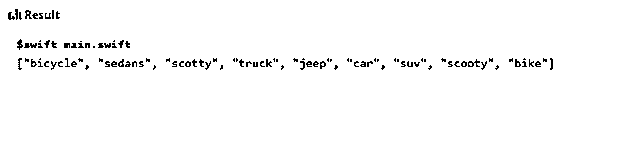
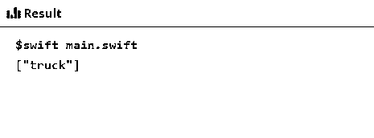
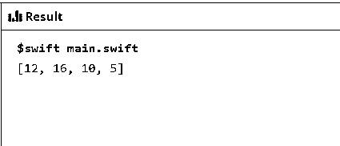
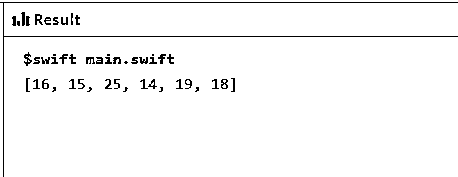
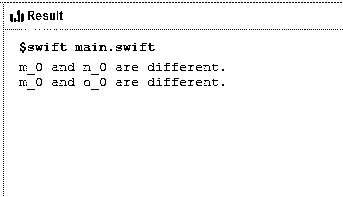

# 快速集合

> 原文：<https://www.educba.com/swift-sets/>

## Swift 集合简介

Swift Sets 是 Swift 编程语言中最受欢迎和最强大的数据结构之一。Swift 中的集合是以无序列表的形式保存各种类型元素的容器，但列表中的元素必须是唯一的，并且在整个列表中只出现一次。列表必须以可哈希的方式拥有元素，这意味着它应该为列表中的元素提供哈希类型值。hashable 属性的主要优点是无序列表中的元素易于访问。

### 如何在 swift 中声明集合？

swift 中的集合声明具有如下语法:

<small>网页开发、编程语言、软件测试&其他</small>

`let Int_dec_Set:Set = [0,5,2,6,1] // [ ] this is used to create empty Set and [any set of values].
print(Int_dec_Set)`

在这里，Int_dec_Set 是集合的名称，它将保存以名为 Set 的值为前缀的数据类型，这表示该集合将用于操作。

### 如何在集合中添加元素？

集合中元素的添加在根据需求以及在任何需要的地方插入元素中起着关键作用。

使用 swift 编程语言中的 insert()方法添加集合中的任何新元素。由于 swift 中的集合由无序列表组成，因此可以将元素添加到列表中的任何位置。没有特定的顺序。

示例部分将阐明在集合中添加元素的过程。

### 如何删除集合中的元素？

使用 remove()方法删除集合中的元素，该方法用于从无序列表中删除指定的元素。

如果场景是从列表中删除任何元素，remove()方法将返回成员元素(如果它是列表的一部分)或给出零值。进一步的示例部分将为元素的删除部分提供更多的清晰度。

### 在 swift 中对器械包执行的各种操作。

使用 set 的美妙之处及其为程序员提供的灵活性是 swift 编程语言中 set 提供的操作。因此，在 swift 中对器械包执行的各种操作如下:

*   **并集:**对元素 x 和 y 的集合执行该操作，这些元素出现在集合的 x 或 y 中，或者同时出现在集合的 x 和 y 中。
*   **交集:**该操作在元素 x 和 y 的集合上执行，包括 x 中存在的所有元素和 y 中存在的那些元素。
*   **减法:**这个操作在两个集合 x 和 y 上执行，其中集合将由 x 中存在的所有元素组成，并将移除 y 中存在的所有元素。
*   **对称差:**这个操作在两个集合 x 和 y 上执行，其中元素将出现在提到的两个集合的任何一个中。
*   **设置成员和等式运算**

**集合相等:**集合相等操作用于检查集合中的元素是包含相同的元素还是不同的元素。

**集合隶属度:**集合隶属度是一种用于确定两个集合或子集之间任何关系的方法，其运算包括 is subset(of:)，is superset(of:)，isDisjoint(with:)，is strictSuperset(of:)

### 例子

下面举几个例子

#### 示例#1

这个程序演示了使用 insert()方法添加元素，其中鸟被添加为现有无序列表的一部分，如输出所示。

`import Foundation
import Glibc
var sm_add_set:Set = ["fruits", "cars", "animals", "bikes"] sm_add_set.insert("birds")
print(sm_add_set)`

**输出:**

#### 实施例 2

这个程序演示了从无序列表中删除指定元素的可选方法，在这个列表中，可以使用集合中的值来删除指定的元素，如输出所示。这里是可选移除，这是更推荐的方法。

`import Foundation
import Glibc
var s_del_int_Set:Set = [4,3,2,5,8] if let sm_ltl_Val = s_del_int_Set.remove(5)
{
print(sm_ltl_Val)
print(s_del_int_Set)
}
else
{
print("no_element_is_found_for_deletion")
}`

**输出:**

#### 实施例 3

这个程序演示了两个集合 x_1 和 y_1，其中 union 应用于运算，输出如下所示。

`import Foundation
import Glibc
let x_1: Set = ["truck", "car", "jeep", "scotty", "bike"] let y_2: Set = ["truck", "suv", "scooty", "sedans", "bicycle"] print(x_1.union(y_2))`

**输出:**

#### 实施例 4

这个程序演示了两个集合 x_1 和 y_1，其中交集应用于操作和操纵，输出如下所示。

`import Foundation
import Glibc
let x_1: Set = ["truck", "car", "jeep", "scotty", "bike"] let y_2: Set = ["truck", "suv", "scooty", "sedans", "bicycle"] print(x_1.intersection(y_2))`

**输出:**

#### 实施例 5

这个程序演示了集合 E0 和 f1，其中执行的操作是将一个集合中的元素减去另一个集合中的元素，如输出所示。

`import Foundation
import Glibc
let e_0: Set = [10, 12, 16, 5, 10] let f_1: Set = [1, 2, 6, 9, 8] print(e_0.subtracting(f_1))`

**输出:**

#### 实施例 6

这个程序演示了集合 p_0 和 q_1，在这里执行运算以获得输出中所示的对称差。

`import Foundation
import Glibc
let p_0: Set = [25,12,10,14,16] let q_1: Set = [12,10,15,18,19] print(p_0.symmetricDifference(q_1))`

**输出:**

#### 实施例 7

这个程序演示了集合 m_0、n_0 和 o_0，它们用于表示集合等式运算，如输出所示。

`import Foundation
import Glibc
let m_0: Set = [12, 2, 8, 10, 13] let n_0: Set = [0, 1, 9, 17, 12] let o_0:Set = [9, 7, 3, 1, 5] if m_0 == n_0 {
print("m_0 and n_0 both appears same.")
} else {
print("m_0 and n_0 are different.")
}
if m_0 == o_0 {
print("m_0 and o_0 both appears same.")
} else {
print("m_0 and o_0 are different.")
}`

**输出:**

### 结论

Swift set 在 Swift 编程语言中起着非常重要的作用，因为它使程序员能够根据需要访问和操作元素。集合操作和方法在组织和处理无序集合中的数据类型方面有额外的优势。

### 推荐文章

这是一份 Swift sets 指南。这里，我们讨论如何在 swift 中通过对集合执行各种操作来添加和删除集合中的元素。您也可以看看以下文章，了解更多信息–

1.  [Swift 表单](https://www.educba.com/swift-forms/)
2.  [雨燕词典](https://www.educba.com/swift-dictionary/)
3.  [Swift 版本](https://www.educba.com/swift-version/)
4.  [什么是雨燕？](https://www.educba.com/what-is-swift/)

