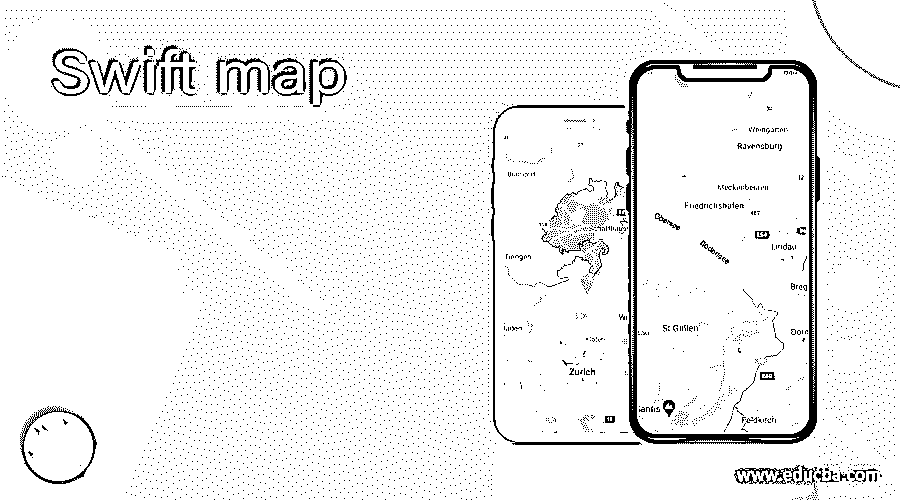
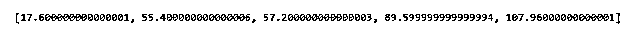
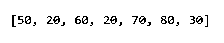
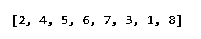
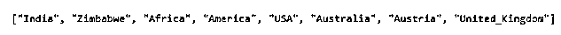
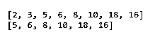
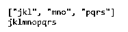

# Swift 地图

> 原文：<https://www.educba.com/swift-map/>

## Swift 映射函数的定义

Swift map function 来自于函数式编程的背景，在函数式编程中，map 使用适当的集合(如数组和字典)来减少和过滤函数，以便在不使用任何 for 循环的情况下对它们进行循环。快速映射函数也称为高阶函数，因为它们将大多数函数作为输入。Swift 地图功能将提供的输入需要进行适当的分析，因为它将进一步将整个数据转换为一个数据。一旦 swift map 函数被用于迭代，那么它就使得该函数易于操作。

**语法:**

<small>网页开发、编程语言、软件测试&其他</small>

`let rs_collction = i_p_collection.map
{
(elemnt_of_collection) -> Rslt_type in
return transformed_data;
}`

其中，rs _ collction 是变量或存储变量，用于将值存储到其中，变量将被定义到框架单元中。之后是输入映射集合，一旦按照 for 循环在所考虑的变量中使用 Rslt_type 中的(elemnt_of_collection)执行迭代，就将值放入。最后，它将返回 transformed_data，这是根据需要转换的数据。

### Swift 中的地图功能是如何工作的？

*   swift 中的 Map 功能根据程序员在实施时选择的要求和方法而有所变化。
*   Swift 编程语言是一种元素的顺序或任何排序非常重要的语言，因为从集合继承的集合类型(如数组、集合和字典)对于存储值非常重要。
*   高阶函数被认为是 Swift 编程语言的最佳特性之一，因为它提供了映射、排序、过滤、平面映射和归约等功能，可用于各种类型的集合和集合。
*   高阶函数在集合上循环，并允许元素执行相同的一组操作，事实上它应该完全相同，没有任何变化。
*   有些情况下，不需要所有元素，而是元素应该以单个集合的形式存在，在这种情况下，它应该以某种方式准备好，以便从集合中删除大多数不必要的元素或零元素，并且实现序列本质上是可选的。当在集合或序列上实现时，映射被认为是展平的集合。
*   Filter 是一个可以与 map 函数合并的函数，以便提供一些有用的操作，允许基于需求过滤来过滤所有现有的元素集合。
*   Reduce 是一个函数，用于将元素集或数组生成的结果缩减为集合中的单个计算值。
*   有一些闭包应用于集合或集合，用于在遍历时对转换闭包中存在的值或元素进行转换，然后在那时非常需要保持 Swift map 与其他操作和转换闭包同步。
*   然后是应用于地图之上的变体，称为平面地图和紧凑地图，这都取决于使用和需求的场景。
*   每当需要在平面地图上进行变化以展平和压缩结果时，平面地图就会出现，而应用闭包将返回适当的序列。
*   平面映射可以接受非零值或零值，这取决于返回类型是返回可选值还是不返回值。
*   平面图也称为紧凑图，两者相同，但在命名惯例上有所不同，因为从 swift 版开始，相同的平面图命名转换为紧凑图，差别非常小。

### 例子

让我们讨论 Swift map 的例子。

#### 示例#1

这个程序演示了使用 swift map 函数将摄氏温度转换为华氏温度，该函数利用闭包来转换为输出中显示的转换后的数据集。

`let clsius = [-8.0, 13.0, 14.0, 32.0, 42.2] let frhight = clsius.map { $0 * (9/5) + 32 }
print(frhight)`

**输出:**

#### 实施例 2

这个程序演示了精确和简洁的编码范例，以减少实现映射的模板，特别是 arr_of_int，使用下面的映射格式，如输出所示。

`let arr_of_int = [5,2,6,2,7,8,3] let map_new_array = arr_of_int.map { $0 * 10 }
print(map_new_array);`

**输出:**

#### 实施例 3

这个程序演示了在字典上迭代的概念，反过来，它将只返回关键字，从这些关键字中可以很容易地检索到值，如输出所示。

`let countries = [1:"Austria", 2:"India", 3: "Australia", 4: "Zimbabwe", 5: "Africa", 6: "America", 7: "USA", 8: "United_Kingdom" ] let countries_Dctnry_Keys = countries.map
{
(k_e_y, val_ue) -> Int in
return k_e_y
}
print(countries_Dctnry_Keys)`

**输出:**

#### 实施例 4

这个程序演示了在字典上迭代的概念，反过来，它将只返回值，从这些值中可以很容易地检索到这些值，如下所示。

`let countries = [1:"Austria", 2:"India", 3: "Australia", 4: "Zimbabwe", 5: "Africa", 6: "America", 7: "USA", 8: "United_Kingdom" ] let countries_Dctnry_values = countries.map
{
(k_e_y, val_ue) -> String in
return val_ue
}
print(countries_Dctnry_values)`

**输出:**

#### 实施例 5

这个程序演示了在一个序列上使用平面映射，这个序列有一个闭包，它返回一个值序列。

`let rslt_mrks = [[2,3,5], [6,8], [10,18,16]] let totl_rslt_marks = rslt_mrks.flatMap { $0 }
print(totl_rslt_marks)
let passng_marks = rslt_mrks.flatMap { $0.filter { $0 > 3} }
print(passng_marks)`

**输出:**

#### 实施例 6

这个程序演示了 reduce 函数和一个 concatenate 函数，该函数可以以类似的方式与 map 函数结合使用，它将打印如下所示的输出。

`let cds = ["jkl","mno","pqrs"] let txt_0 = cds.reduce("", +)
print(cds)
print(txt_0)`

**输出:**

### 结论

Swift map 是一种有很多好处的功能。通过使用 swift map 函数简化迭代属性，它有助于克服 for 循环的复杂挑战。它使得整个语言在实现时非常灵活、优化且易于理解。Swift map 即兴发挥了数组、字典和集合的全部遍历和组织特性。

### 推荐文章

这是一份 Swift 地图指南。在这里，我们将讨论定义、map 函数在 Swift 中的工作方式以及代码实现的示例。您也可以浏览我们推荐的其他文章，了解更多信息——

1.  [什么是雨燕？](https://www.educba.com/what-is-swift/)
2.  [Swift 版本](https://www.educba.com/swift-version/)
3.  [Swift For Loop](https://www.educba.com/swift-for-loop/)
4.  [Swift 运营商](https://www.educba.com/swift-operators/)

