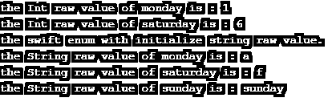

# Swift 枚举

> 原文：<https://www.educba.com/swift-enum/>

## Swift enum 简介

swift enum 是一种特殊的数据类型，用于创建一组常量值、变量和属性。enum 是使用 enum 关键字创建的用户定义的接口，并根据用户的选择描述所需的变量及其值。enum 是 swift 代码中重复使用的常量元素的集合。enum 是用户定义的数据类型，它创建了一组在 swift 条件语句中使用的常量元素。枚举是由常量变量及其值的集合组成的枚举数据类型。枚举也称为快速枚举。

**语法:**

<small>网页开发、编程语言、软件测试&其他</small>

swift 枚举语法如下。

`enum Enum_Name {
// defined datatype and its value here…
}`

**描述:**

*   枚举使用“enum”关键字创建用户定义的接口。
*   Enum_Name 是枚举的名称，用作类名。
*   枚举元素和值放在枚举内部。
*   通过 enum 类的实例在 swift 代码中访问 enum 值。

### Swift 中的 enum 功能是如何工作的？

enum 编程的快速安装。

*   Ios 和 OS x 用户已经安装了 Xcode IDE，但是用户必须在 apple developer 网站上拥有帐户。
*   用户输入游乐场名称，并在 Xcode IDE 中选择平台名称。
*   用户可以获得操场窗口并开始编码。
*   其他操作系统用户可以使用在线选项进行 swift 编程。
*   用户可以使用 https://iswift.org/playground 网站进行快速编码。

enum 语法用于创建用户定义的数据类型及其值。

`enum Oceans
{
case Pacific
case Indian
case Atlantic
case Southern
case Arctic
}`

通过 enum 类的实例在 swift 代码中访问 enum 值。

`var oceans = Oceans.Indian;
oceans = .Indian;`

根据用户要求，在 swift 代码中使用该值。

`switch oceans {
case .Pacific:
print("This is pacific ocean.")
case .Indian:
print("This is Indian ocean.")
case .Atlantic:
print("This is Atlantic ocean.")
case .Southern:
print("This is the southern ocean.")
case .Arctic:
print("This is the arctic ocean.")
default:
print("There is no ocean.")
}`

结合枚举工序的步骤。

`enum Oceans
{
case Pacific
case Indian
}
var oceans = Oceans.Indian;
oceans = .Indian;
switch oceans {
case .Pacific:
print(" This is pacific ocean. ")
case .Indian:
print(" This is Indian ocean. ")
default:
print(" There is no ocean. ")
}`

**描述:**

*   它宣布海洋的价值是一个不变的因素。
*   该类的实例使用“Indian”作为枚举的成员。
*   变量 select。印度语作为枚举中的常数值。
*   开关盒返回值“case”。印度人”。

### 例子

以下是下面提到的例子。

#### 示例#1

具有相同实例和变量的基本枚举示例和输出如下。

**代码:**

`enum Oceans
{
case Pacific
case Indian
case Atlantic
case Southern
case Arctic
}
var oceans = Oceans.Indian;
oceans = .Indian;
switch oceans {
case .Pacific:
print("This is pacific ocean.")
case .Indian:
print("This is Indian ocean.")
case .Atlantic:
print("This is Atlantic ocean.")
case .Southern:
print("This is the southern ocean.")
case .Arctic:
print("This is the arctic ocean.")
default:
print("There is no ocean.")
}`

**输出:**

**描述:**

*   枚举使用 Indian 作为枚举类名的关联成员名。
*   开关盒使用了 oceans =。作为枚举的常数值。

#### 实施例 2

下面是具有不同实例和变量示例和输出的基本 swift 枚举。

**代码:**

`enum Oceans
{
case Pacific
case Indian
case Atlantic
case Southern
case Arctic
}
var oceans = Oceans.Indian;
oceans = .Southern;
switch oceans {
case .Pacific:
print("This is pacific ocean.")
case .Indian:
print("This is Indian ocean.")
case .Atlantic:
print("This is Atlantic ocean.")
case .Southern:
print("This is the southern ocean.")
case .Arctic:
print("This is the arctic ocean.")
default:
print("There is no ocean.")
}`

**输出:**

**描述:**

*   枚举使用 Indian 作为枚举类名的关联成员名。
*   开关盒使用了 oceans =。太平洋作为枚举的常数值。

#### 实施例 3

下面是带有相关值的基本枚举示例和输出。

**代码:**

`enum StudentInfo
{
case Student_name(String)
case Student_addr (String, String, Int)
case Student_mark (Int, Int)
}
var student_name = StudentInfo.Student_name(" Swift Enum ");
var student_addr = StudentInfo.Student_addr(" st. road", " nyk ", 453);
var student_mark = StudentInfo.Student_mark(25, 28);
switch student_addr {
case .Student_name(let st_name):
print("This is studet name: \(st_name). ")
case .Student_addr(let std_street, let std_city, let std_pin):
print("This is student address: \(std_street), \(std_city), \(std_pin). ")
case .Student_mark(let st_mar1, let st_mar2):
print("This is student mark: \(st_mar1), \(st_mar2).")
}`

**输出:**

**描述:**

*   具有关联值的枚举可以使用相同或不同的数据类型。
*   具有基于变量或数据类型的关联值的枚举。

#### 实施例 4

下面是带有原始值的基本枚举示例和输出。

**代码:**

`enum WeekDays: Int
{
case monday = 1
case tuesday
case wednesday
case thursday
case friday
case saturday
case sunday
}
let weekday = WeekDays.monday.rawValue
let weekday1 = WeekDays.saturday.rawValue
print("the swift enum with initialize Int raw value. ")
print("the Int raw value of monday is : \(weekday)")
print("the Int raw value of saturday is : \(weekday1)")
enum WeekDays1: String
{
case monday = "a"
case tuesday  = "b"
case wednesday = "c"
case thursday = "d"
case friday  = "e"
case saturday  = "f"
case sunday
}
let weekday2 = WeekDays1.monday.rawValue
let weekday3 = WeekDays1.saturday.rawValue
let weekday4 = WeekDays1.sunday.rawValue
print("the swift enum with initialize string raw value. ")
print("the String raw value of monday is : \(weekday2)")
print("the String raw value of saturday is : \(weekday3)")
print("the String raw value of sunday is : \(weekday4)")`

**输出:**

**描述:**

*   具有关联值的枚举可以使用相同的数据类型。
*   具有基于预定义值的关联值的枚举。

### 结论

*   枚举是一组相似的常量值或元素。
*   enum 帮助程序员减少编码并经常使用相同的代码。
*   枚举是用户定义的输出，用于理解条件语句的实际值。

### 推荐文章

这是 Swift enum 的指南。在这里，我们讨论了 enum 功能在 Swift 中的工作原理、示例以及代码和输出。您也可以看看以下文章，了解更多信息–

1.  [Swift 版本](https://www.educba.com/swift-version/)
2.  [Swift For Loop](https://www.educba.com/swift-for-loop/)
3.  [什么是雨燕？](https://www.educba.com/what-is-swift/)
4.  [如何安装 Swift？](https://www.educba.com/install-swift/)

