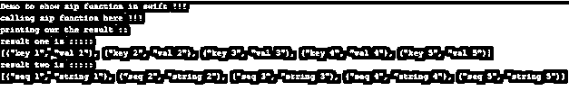
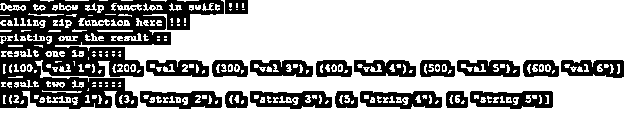

# Swift 拉链

> 原文：<https://www.educba.com/swift-zip/>

## Swift zip 简介

zip 函数用于压缩 Swift 中的两个序列。如果你想合并两个数组或者任何一个集合，那么我们可以使用 zip 函数。它将创建一个新的配对序列或集合，其中包含 Swift 序列或集合中的元素。此外，它是 swift 标准库中可用的内置函数，因此我们在编程时不包括任何外部库来使用它。在接下来的部分中，我们将详细讨论更多的 zip 函数，以便从内部理解它们的工作原理，从而在实际应用中更好地使用它们。

**语法:**

<small>网页开发、编程语言、软件测试&其他</small>

正如我们所讨论的，这个函数将创建一个新的对序列，它将包含第一个和第二个集合或序列的所有元素。让我们详细看看它的语法，理解如何使用它，而编程见下文；

`let result_variable = zip(sequence1 , sequence2)`

正如您在上面几行语法中看到的，这个函数很容易使用，并接受两个参数作为输入参数。我们可以传递我们想要压缩的序列或集合，并创建一个元组对作为结果。让我们来看一个练习语法，以便更好地理解它的用法，见下文；

`let variable_name_1 = [some_values] let variable_name_2 = [some_values] let result_variable = zip(variable_name_1 , variable_name_2)`

通过这种方式，我们可以在编程时使用它，在下一节中，我们将看到它在内部是如何工作的，并详细讨论它的方法签名。

### Swift 中的 zip 功能是如何工作的？

众所周知，zip 功能用于压缩 Swift 中的两个序列或集合。如果我们想要合并两个集合，并创建一个结果集合或元组对，其中包含来自序列和集合的所有元素，那么我们可以使用 Swift 中的 zip 功能。在本节中，我们将详细讨论方法签名，见下文；

**方法签名:**

1) func zip(_ sequence1: Sequence1，_ sequence2: Sequence2):这是网上可获得的 apple 文档对 zip()函数的官方声明。在这里，我们传递两个序列作为参数。我们可以直接调用这个函数，并在其中传递我们的集合和序列或数组对象。

2)返回类型:该函数将返回元组对。这些对将包含两个数组中的所有元素，并使它们成为结果元组中的键值对。

现在让我们看一个例子来详细理解它的工作原理。

例如:

`let seq1 = ["key 1", "key 2", "key 3", "key 4", "key 5"] let seq2 = ["val 1", "val 2", "val 3", "val 4", "val 5"] let result  = zip(seq1, seq2)`

正如你在上面几行代码中看到的，我们使用 Swift 的 zip()函数来创建两个集合或数组的元组对。首先，我们创建了两个数组序列，分别命名为“seq1”和“seq2”。在创建了两个序列之后，我们在这里调用 zip()函数。请注意，我们没有为此使用任何外部库，因为 Swift 标准库中提供了 zip()函数。所以我们在 zip()函数中传递两个序列。这个 zip 函数将创建一个元组对，并返回结果。第一个序列的元素将与第二个序列的元素配对。它将从第一个序列中取出第一个元素，并与第二个序列的第一个元素绑定或配对，整个过程将重复进行，直到两个序列的第 n 个元素。在某些情况下，我们可能在序列或集合中都有不相等的元素，那么在这种情况下，它将选取较小的序列并相应地执行操作。

**在 Swift 中使用 zip()函数时要记住的几点见下文；**

1) zip()函数用于对集合或序列的元素进行配对，它将始终返回一个新的元组对作为结果。

2)它非常易于使用，可读性强，并且还减少了代码行。

3)这个函数是合并集合而不是联接它们的更好选择。

4)它还处理序列或集合中的不相等元素，并相应地合并它们。

### 例子

下面举几个例子

#### 示例#1

在本例中，我们尝试使用 swift 中的 zip()函数压缩字符串序列。这是一个示例，便于初学者更好地理解它。

**代码:**

`print("Demo to show zip function in swift !!!")
let seq1 = ["key 1", "key 2", "key 3", "key 4", "key 5"] let seq2 = ["val 1", "val 2", "val 3", "val 4", "val 5"] let seq3 = ["seq 1", "seq 2", "seq 3", "seq 4", "seq 5"] let seq4 = ["string 1", "string 2", "string 3", "string 4", "string 5"] let seq5 = ["bye 1", "bye 2", "bye 3", "bye 4", "bye 5"] print("calling zip function here !!!")
let result1 = zip(seq1, seq2).map {$0}
let result2  = zip(seq3, seq4).map {$0}
print("printing our the result ::")
print("result one is :::::")
print(result1)
print("result two is :::::")
print(result2)`

**输出:**

#### 实施例 2

在这个例子中，我们试图显示数组或序列中不相等数量的元素，并试图使用 Swift 中的 zip()函数来压缩它们，这是一个适合初学者的简单例子。

**代码:**

`print("Demo to show zip function in swift !!!")
let seq1 = [100, 200, 300, 400, 500, 600, 700] let seq2 = ["val 1", "val 2", "val 3", "val 4", "val 5", "val 6"] let seq3 = [2, 3, 4, 5, 6, 7] let seq4 = ["string 1", "string 2", "string 3", "string 4", "string 5"] let seq5 = ["bye 1", "bye 2", "bye 3", "bye 4", "bye 5"] print("calling zip function here !!!")
let result1 = zip(seq1, seq2).map {$0}
let result2  = zip(seq3, seq4).map {$0}
print("printing our the result ::")
print("result one is :::::")
print(result1)
print("result two is :::::")
print(result2)`

**输出:**

### 结论

zip()函数在 Swift 中易于使用和处理。通过使用它，我们可以很容易地在 Swift 中执行两个序列或集合的合并。这也减少了代码行，并且比手工连接两个 sequence1 或集合要好。

### 推荐文章

这是 Swift zip 的指南。在这里，我们将讨论 zip 函数在 Swift 中是如何工作的，并举例说明代码和输出。您也可以看看以下文章，了解更多信息–

1.  [Swift 版本](https://www.educba.com/swift-version/)
2.  [反应原生迅捷](https://www.educba.com/react-native-swift/)
3.  [Swift 运营商](https://www.educba.com/swift-operators/)
4.  [Swift 面试问题](https://www.educba.com/swift-interview-questions/)

