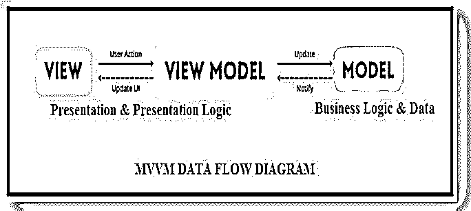
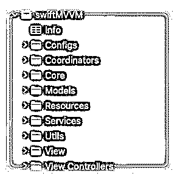
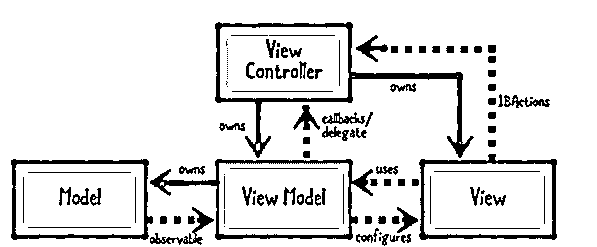

# MVVM·斯威夫特

> 原文：<https://www.educba.com/mvvm-swift/>


## MVVM·斯威夫特简介

MVVM Swift 是 MVC 架构模式的高级版本。它引入了称为视图模型的(第四个)组件。视图模型对于通过控制器控制模型和将模型的数据集中在 outlook 上是可靠的。MVVM Swift 包括四个主要组件:模型、视图、视图模型和控制器。每个组件都有各自的工作，它们结合在一起为应用程序提供结构。

### 什么是 MVVM·斯威夫特？

MVVM 架构模式使我们能够使项目结构化和易于管理，因此开发人员很容易找到文件并控制它们。

<small>网页开发、编程语言、软件测试&其他</small>

MVVM 包含三个组成部分，它们是:

*   **模型:**它保存数据。它还负责符号化来自业务逻辑的数据，并且这个模型层不知道任何其他层。
*   **视图:**是 UI 的表示。这一层负责处理整个布局并以不可访问的方式查看数据。视图能够知道视图模型，但是它不知道模型。
*   **视图模型:**它持有业务逻辑，控制器充当模型和视图的中介。ViewModel 用于转换在 View 方法中检索的数据，使用业务逻辑，并从视图中检索操作。每个组件都有各自的工作，它们结合在一起为应用程序提供结构。这是应用程序关注点的分离，有助于测试和进一步的维护。




### 如何使用 MVVM·斯威夫特？

该模式用于将数据从模型类转换为表示，这适用于多个视图。ViewModel 将字符串转换为 NSAttriburedString 或格式化字符串 Date。这种模式与 MVC 有关；我们需要在现有的代码库中包含 ViewModel 类，并按照您的要求表示数据。它最小化了视图控制器的角色，这有助于减少视图控制器类。

让我们看看 MVVM 是如何用代码工作的:

#### 1.创建新的 Swift 项目

只需创建整个组件的文件夹结构，如 Model-ViewController-ViewModel，然后进入编码部分。

最初，要定义模型类，为了在模型中存储数据，我们必须创建模型。

**代码:**

```
struct DataModel: Codable {
var data:QuesModel?
}
struct QuesModel: Codable {
var Newquestions: [NewQuestions]?
}
struct NewQuestions: Codable {
var ct_answer: String?
var answer_1: String?
var answer _2: String?
var answer _3: String?
var answer _4: String?
var topquestion: String?
}
```

#### 2.调用 API 并填充数据模型

一旦我们调用 API，模型就会被加载，这样我们就可以在 ViewController 中正确地使用模型来加载视图。

**代码:**

```
class QuesViewModel {
var quesData:DataModel?
private let sourcesURL = URL(string: "https://quiz-68112-default-rtdb.firebaseio.com/quiz.json")!
func apiToGetQuesData(completion : @escaping () -> ()) {
URLSession.shared.dataTask(with: sourcesURL) { [weak self] (data, urlResponse, error) in
if let data = data {
    let jsonDecoder = JSONDecoder()
    let empData = try! jsonDecoder.decode(DataModel.self, from: data)
    self?.quesData = empData
    completion()
}
}.resume()
}
}
```

#### 3.更新视图控制器

将数据获取到 ViewModel 类中，以使用在 ViewModel 中获取的数据更新 ViewController。在屏幕上设计 UITableView，然后将问题所需的数据加载到表视图中，这是我们在 ViewModel 中获得的。

**代码:**

```
class ViewController: UIViewController {
@IBOutlet weak var tableView: UITableView!
var viewModel = QuesViewModel()
var quesi:DataModel?
override func viewCheckLoad() {
super.viewCheckLoad()
viewModel.apiToGetQuesData { [weak self] in
self?.quesi = self?.viewModel.quesData
DispatchQueue.main.async {
self?.tableView.reloadData()
}
}
}
}
extension ViewController: UITableViewDelegate, UITableViewDataSource {
quesi?.data?.ques?.count ?? 0
}
func tableView(_ tableView: UITableView, cellForRowAt indexPath: IndexPath) -> UITableViewCell {
let cell = tableView.dequeueReusableCell(withIdentifier: "cell", for: indexPath)
cell.textLabel?.text = quesi?.data?.ques?[indexPath.row].ques
return cell
}
}
```

### MVVM Swift 项目结构

视图模型对于通过控制器控制模型并将模型的数据集中在视图上是可靠的。

让我们看看项目的结构如下:




上图解释了 MVVM 项目的结构:

*   **配置:**开发配置、生产和试运行等应用环境设置完全使用。xcconfig 文件。
*   **协调者:**现在大多使用协调者模式。通过消除控制器，它有助于分离导航逻辑。
*   **核心:**本质上是为了 AppDelegate。
*   **模型:**它是维护来自 API 的整个模型对象的模型。
*   **资源:**在这个资源文件中，项目资产启动故事板。
*   **服务:**这个服务包含 CoreData、API 服务、UserDefaults 等等。
*   **实用程序:**实用程序包含帮助文件，如自定义错误和扩展。
*   **View:** 在 View 中，它存储了视图的组件，比如自定义视图、单元格、按钮等等。
*   **ViewController:** 包含 UI 相关代码。它不包含任何业务逻辑。MVVM 的视图部分使用适合 iOS 中 UIViewControllers 元素的名称。

### MVVM·斯威夫特设计模式

设计模式非常非常有用，不需要任何语言来执行，它只是我们为每个开发人员开发的平台，每个开发人员都必须知道如何以及何时应用它们。在这里，我们将看到如下过程。MVVM Swift 是 MVC 架构模式的高级版本。它包含其中的组件。

MVVM(模型-视图-视图模型)是一种结构设计模式，它将对象分成三个部分。

它们如下:

*   模型主要保存应用程序数据；它将是简单的类或结构。
*   视图是控制屏幕的视觉元素。它是 UI 视图的子类。视图用于显示可视元素。
*   视图模型是将数据方法转换成视图上显示的值。它通常是类，因此可以作为引用传递。




上面的图片类似于 MVC(模型-视图-控制器)模式。

### 结论

在本文中，我们看到了新概念 MVVM，即视图模型对于通过控制器控制模型并将模型数据聚焦到视图是可靠的。

### 推荐文章

这是 MVVM·斯威夫特的指南。在这里我们讨论介绍，以及如何使用 MVVM 斯威夫特？项目结构和设计模式。您也可以看看以下文章，了解更多信息–

1.  [Swift hashable](https://www.educba.com/swift-hashable/)
2.  [Swift enum](https://www.educba.com/swift-enum/)
3.  [Swift 扩展](https://www.educba.com/swift-extension/)
4.  [Swift int 到 string](https://www.educba.com/swift-int-to-string/)


