# Tkinter 小工具

> 原文：<https://www.educba.com/tkinter-widgets/>

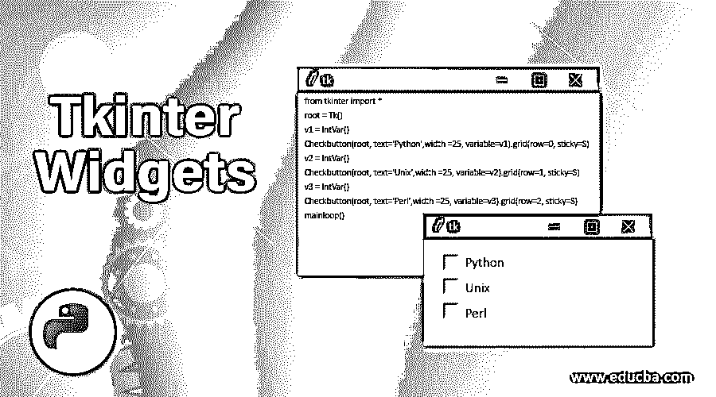


## Tkinter Widgets 简介

Python Tkinter 是一个用于 GUI 编程的包或内置库。为了开发 GUI 应用程序，Tkinter 提供了用于在浏览器中表示的小部件。Tkinter 小部件是多事件的，在浏览器中表现出来，比如 textbox、button 等。在 Python 中，Tkinter 小部件是标准的 GUI 元素，用于通过按钮、框架、标签等元素处理事件。在 [Python 中，Tkinter 提供了一些用于基本 GUI 编程的小部件](https://www.educba.com/python-tkinter/)，它还允许我们创建专门的部件作为定制部件。Tkinter 小部件通常在 GUI 应用程序中提供各种控件。

### Tkinter 小部件的工作示例

Python 中的 Tkinter 提供了各种范围的小部件；大致来说，Tkinter 有 11 种不同的小部件。Tkinter 小部件是必要的，因为它们为 GUI 应用程序提供了不同的、有吸引力的外观和感觉。让我们通过一个示例来详细了解一些基本和主要的小部件:

<small>网页开发、编程语言、软件测试&其他</small>

#### **1。纽扣**

 **按钮是一个小部件，用户只需点击一下就可以使用，或者在 GUI 应用程序中有点击事件时通常使用按钮。按钮用于控制行为，这意味着如果我们按下或单击按钮，就会执行动作或事件，例如显示文本或图像。

**语法:**

`Button (master, option = value)`

**参数:**

*   Master:该参数用于表示或声明根窗口或父窗口。
*   选项:按钮部件提供的选项有许多不同的值，如活动背景色、活动前景色、背景、字体、图像、宽度、高度、命令等

**举例:**

```
import tkinter as tk
r = tk.Tk()
button = tk.Button(r, text='click me', width=25, command=r.destroy)
button.pack()
r.mainloop() 
```

**输出:**

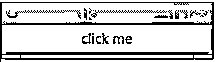


在上面的代码中，必须导入 Tkinter，然后声明根窗口并初始化按钮，按钮上显示的文本为“click me ”,按钮宽度为“25 ”,我们给出了命令 r.destroy，用于关闭根窗口。

#### **2。复选按钮**

 **Checkbutton 小部件用于显示没有复选标记的复选框，并可以通过 Tkinter 变量访问它。该按钮通常用于存储或记录状态，如开或关、真或假等。，这意味着它们也类似于按钮，但是当用户想要在两个不同的值或状态之间进行选择时使用。在这种情况下，用户可以选择多个复选框。让我们看看这个按钮是如何工作的。

**语法:**

`CheckButton (master, option = value)`

选项可以是为小部件指定标题的标题、设置背景和前景色的活动背景和活动前景、设置背景色的背景、命令、字体、图像等。

**举例:**

```
from tkinter import *
root = Tk()
v1 = IntVar()
Checkbutton(root, text='Python',width =25, variable=v1).grid(row=0, sticky=S)
v2 = IntVar()
Checkbutton(root, text='Unix',width =25, variable=v2).grid(row=1, sticky=S)
v3 = IntVar()
Checkbutton(root, text='Perl',width =25, variable=v3).grid(row=2, sticky=S)
mainloop() 
```

**输出:**

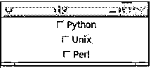


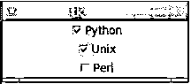


在上面的例子中，我们可以在截图中看到“Python”和“Unix”复选框被选中。在上面的代码中，我们将每个选项的变量声明为 intvar()，以访问这些 checkbuttons。

#### **3。单选按钮**

 **这也类似于 checkbutton，但是当给用户许多不同的选项，但是要求用户在所有这些选项中只选择一个时，使用这个小部件。radiobutton 小部件必须与同一个变量相关联，并且每个小部件代表一个值。

**语法:**

`RadioButton (master, option = values)`

选项与 checkbuttons 的选项相同。

**举例:**

```
from tkinter import *
root = Tk()
v = IntVar()
Radiobutton(root, text='male',width =25, variable=v, value=1).pack(anchor=W)
Radiobutton(root, text='female',width =25, variable=v, value=2).pack(anchor=W)
Radiobutton(root, text='others',width =25, variable=v, value=3).pack(anchor=W)
mainloop() 
```

**输出:**

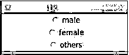


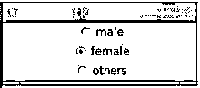


在上面的例子中，在屏幕截图中，我们可以看到使用 RadioButton 小部件只能选择一个按钮。

#### **4\. MenuButton**

 **此按钮与一个菜单小部件相关联，当用户单击它时，它会显示所选的选项。MenuButton 是下拉菜单的一部分，它总是出现在窗口上。

**语法:**

`MenuButton (master, option = value)`

同样，选项与复选按钮和单选按钮的选项相同。

**举例:**

```
from tkinter import *
root = Tk()
root.geometry("300x350")
menubutton = Menubutton(root, text = "File", width = 35)
menubutton.grid()
menubutton.menu = Menu(menubutton)
menubutton["menu"]=menubutton.menu
menubutton.menu.add_checkbutton(label = "New file", variable=IntVar())
menubutton.menu.add_checkbutton(label = "Save", variable = IntVar())
menubutton.menu.add_checkbutton(label = "Save as",variable = IntVar())
menubutton.pack()
root.mainloop() 
```

**输出:**

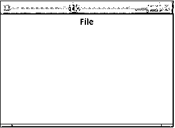


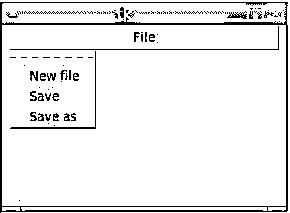


在上面的例子中，我们可以看到输出；当你点击“文件”时，你会看到一个下拉菜单，如“新建文件”、“保存”和“另存为”，否则“文件”只会出现在窗口上。

#### **5。进入**

 **这个小部件用于为用户提供一个单行文本框来输入字符串或句子。这个小部件仅限于输入一行字符串或句子。如果我们想输入多行，那么我们可以使用文本小部件。

**语法:**

`Entry (master, option = value)`

选项可以是其中之一，bd 用于边框设置，bg 用于背景颜色设置，命令，高度，宽度等。

**举例:**

```
from tkinter import *
root = Tk()
root.geometry("300x350")
Label(root, text='Enter the College Name').grid(row=0)
Label(root, text='Enter the Course name').grid(row=1)
e1 = Entry(root)
e2 = Entry(root)
e1.grid(row=0, column=1)
e2.grid(row=1, column=1)
mainloop() 
```

**输出:**

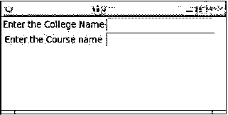


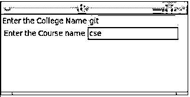


在上面的例子中，我们可以看到用于输入的两个文本框，在屏幕截图中，我们可以看到输入了“git”和“cse”作为输入值。

#### **6。标签**

 **这个小部件用来明确地告诉我们在哪里放置文本或图像，这有助于用户了解另一个小部件的用途。这个小部件提供一条消息，告诉用户这个小部件将对用户做什么。

**语法:**

`Label (master, option = value)`

选项也与入口小部件相同，并且还有许多不同的选项。

**举例:**

```
from tkinter import *
root = Tk()
root.geometry("300x350")
r = Label(root, text='Educba Training',width =35)
r.pack()
root.mainloop() 
```

**输出:**

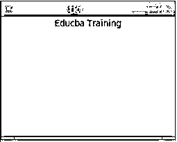


### 结论

Python 中的 Tkinter 小部件是任何 GUI 应用程序中非常重要的一部分。Tkinter 小部件是任何 GUI 应用程序的元素。本文有许多不同的小部件，每个小部件都提供了各种选项。在本文中，我们必须注意，root 必须是任何小部件的参数之一，因为我们必须将这些小部件放在我们声明为 root 的父窗口中。在 Python 中，Tkinter 小部件非常容易使用和理解。

### 推荐文章

这是 Tkinter 小部件的指南。这里我们讨论 Tkinter 小部件的介绍和工作，以及不同的例子和代码实现。您也可以看看以下文章，了解更多信息–

1.  [金特贴标机简介](https://www.educba.com/tkinter-labelframe/)
2.  [Tkinter 列表框](https://www.educba.com/tkinter-listbox/)
3.  [Python Tkinter Canvas](https://www.educba.com/python-tkinter-canvas/)
4.  [Python Tkinter 按钮指南](https://www.educba.com/python-tkinter-button/)
5.  [Tkinter Messagebox |方法和示例](https://www.educba.com/tkinter-messagebox/)
6.  [Tkinter 菜单按钮|示例](https://www.educba.com/tkinter-menubutton/)


************