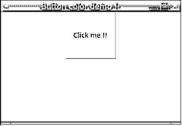

# t 中间按钮颜色

> 原文：<https://www.educba.com/tkinter-button-color/>


## Tkinter 按钮颜色介绍

我们可以使用 Tkinter 为 button 小部件提供任何颜色。按钮部件有如此多的属性，其中“bg”用于设置按钮的背景颜色。我们可以使用 bg 属性传递颜色的名称或十六进制值。我们还可以通过使用 Tkinter 中 button 小部件的“fg”属性来更改前景色。我们也可以使用 configure 方法来改变颜色。

**语法**

<small>网页开发、编程语言、软件测试&其他</small>

正如我们所知，我们可以使用 Button 小部件的“bg”和“fg”属性来更改颜色，我们需要在使用 Button 对象时传递这个变量。简而言之，在创建按钮对象时。让我们看看语法，以便更好地理解，见下文；

*   通过使用颜色字符串:我们可以在 bg 属性内部传递颜色字符串，如下所示；
*   variable_name = Button(parent，bg='your_color ')
*   通过使用十六进制值:我们也可以使用颜色的十六进制值来分配它。
*   variable_name = Button(parent，bg='HEX_VALUE_COLOR ')

为了更好地理解，我们将看到一个练习语法，让初学者更好地理解它；

button1 =按钮(parent，bg='RED ')

button2 = Button(parent，bg='#fff ')

### Tkinter 中的按钮如何上色？

到目前为止，我们知道可以使用 bf 和 fg 属性来更改按钮小部件的颜色。我们还有一个选项，通过使用 configure 方法来更改按钮的颜色。为了实现这个方法，我们在 button 小部件中提供了“command”属性；通过使用它，我们可以调用配置方法来改变颜色。要使用 Button 小部件，我们首先必须在程序中有一个 Tkinter 模块，因为它是 Tkinter 模块的对象，我们知道 Tkinter 用于在 python 中创建 GUI。现在我们将看到改变按钮的背景和背景颜色的例子，并详细讨论它们。见下文；

**1。使用按钮部件**改变背景和背景颜色

按钮小部件作为两个属性，分别使用 bg 和 fg 关键字来更改按钮的背景色和前景色。

**举例:**

```
from tkinter import *
parent = Tk()
parent.geometry('500x500')
button1 = Button(parent, text = 'click me!', fg='red', bg='yellow' )
button1.pack()
parent.mainloop()
```

在上面的例子中，我们改变了按钮部件的背景色和前景色。首先，我们将 Tkinter 模块导入到我们的程序中。在这之后，我们创建一个 Tkinter 对象，负责为我们创建 GUI 窗口；我们可以通过使用几何函数来指定窗口大小；在其他地方，它将采用默认大小。紧接着，我们通过初始化 bg 和 fg color 属性来创建一个按钮对象。之后，我们调用 pack 方法将按钮对象分配到窗口中的一个固定位置，最后，我们调用 mainloop()方法来初始化窗口。

**2。通过使用 configure 方法，改变颜色**

我们可以使用 configure 方法来更改按钮小部件的颜色，但是要使用它，我们需要创建一个函数，并从按钮小部件的 command 属性中调用它。

**举例:**

```
from tkinter import *
def demoColorChange(): button1.configure(bg="red", fg="yellow")
parent = Tk()
parent.geometry('500x500')
button1 = Button(parent, text = 'click me!', command= demoColorChange )
button1.pack()
parent.mainloop()
```

正如我们所看到的，我们在这里创建了一个名为“demoColorChange”的方法，并从 button 小部件的 command 属性中调用该方法，这样它将更改按钮的背景色和前景色。这是另一种说法。

### 构造器

我们知道，颜色是按钮小部件的属性，所以它本身不包含它的构造函数。但是 Button 小部件有自己的构造函数，里面有不同数量的参数。我们可以在下面详细讨论它；

**举例:**

```
variable_name = Button(parent, bg='your_color', fg = 'color', text= 'your_text', commnd = 'your_function'..)
```

*   **Parent:** 该参数负责创建窗口对象。所以我们需要创建一个 Tkinter 对象，并在这个里面传递它。
*   **bg:** 该参数负责给小工具分配背景颜色。
*   **fg:** 该参数负责给小工具分配前景色。
*   **文本:**该参数负责在按钮上提供文本。
*   命令:通过使用这个参数，我们可以调用我们的函数，并给它们分配颜色。
*   **高度:**通过使用该参数，我们可以指定高度。

### 方法

这里它也没有任何方法，因为它是一个按钮部件属性，但是我们可以使用 configure 方法来改变颜色，如下所示；

**举例:**

**配置:**通过使用这个，我们可以调用我们的自定义函数，这些函数负责为我们执行某个任务；

```
def function_name(): widget.configure(bg="red", fg="yellow")
```

我们可以在任何小部件上调用这个方法，但是这里我们使用一个按钮来改变颜色；这可以在任何小部件上调用。

### Tkinter 按钮颜色示例

以下是 Tkinter 按钮颜色的示例:

#### 示例#1

在这个例子中，我们使用 bg 属性来改变按钮的背景颜色。

**代码:**

```
from tkinter import *
parent = Tk()
#size of window
parent.geometry('500x500')
#titlt to window
parent.title('Button color demo !!')
#creating button and assiging color
button = Button(parent, text = 'Click me !!', bg='red', height = 5, width = 10)
button.pack()
#initilizing window
parent.mainloop()
```

**输出:**


#### 实施例 2

在这个例子中，我们使用 fg 属性来改变按钮的前景色。

**代码:**

```
from tkinter import *
parent = Tk()
#size of window
parent.geometry('500x500')
#titlt to window
parent.title('Button color demo !!')
#creating button and assiging color
button = Button(parent, text = 'Click me !!', bg='yellow',  fg = 'blue', height = 5, width = 10)
button.pack()
#initilizing window
parent.mainloop()
```

**输出:**




### 结论

通过使用这个颜色属性，我们可以为按钮小部件分配不同的颜色。为此，我们使用按钮的 bg 和 fg 属性。通过给按钮分配不同的颜色，我们可以使我们的 GUI 对用户更具交互性；我们还可以执行一些事件，比如点击一个按钮；我们可以再次改变按钮的颜色。

### 推荐文章

这是 Tkinter 按钮颜色的指南。在这里，我们将讨论如何在 Tkinter 中给按钮着色，以及示例、构造函数和方法。您也可以看看以下文章，了解更多信息–

1.  [t inter 选项菜单](https://www.educba.com/tkinter-optionmenu/)
2.  [Tkinter 树形视图](https://www.educba.com/tkinter-treeview/)
3.  [t 中间颜色](https://www.educba.com/tkinter-colors/)
4.  [Tkinter 滚动条](https://www.educba.com/tkinter-scrollbar/)


