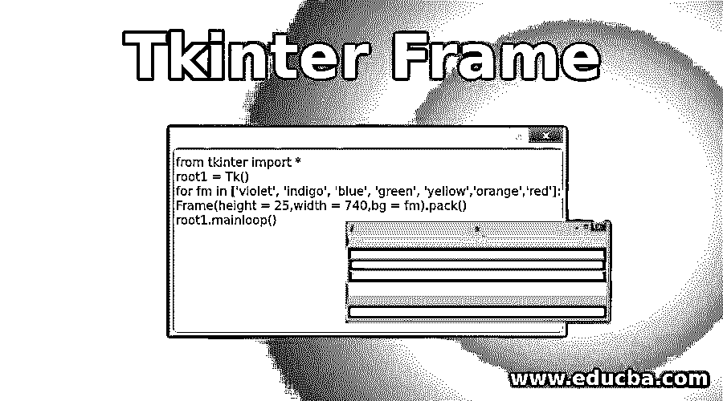
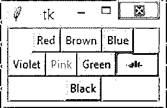
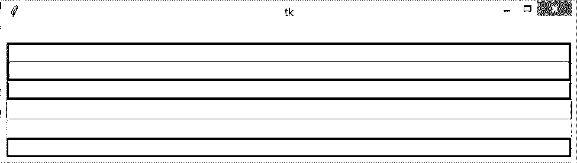

# t 帧间帧

> 原文：<https://www.educba.com/tkinter-frame/>




## Tkinter 框架介绍

Tkinter frame 是一个很棒的过程，它以一种简单友好的方式组织和分组其他小部件，就像一个容器一样工作，也用于安排其他小部件的位置，它还使用矩形区域来组织布局，这可以提供小部件的填充，这个 Tkinter 小部件也可以用于实现复杂的小部件作为基础类。

**语法:**

<small>网页开发、编程语言、软件测试&其他</small>

```
w=frame( master, option, …. )
```

**属性:**

这些属性是:

*   **Master:** Master 属性帮助我们表示父窗口
*   **Options:** Options 属性帮助我们列出小部件常用的选项，这些选项作为键值对非常有用，可以用逗号分隔。

### t 帧间选项

这些是 Tkinter 帧选项，这对控制 Tkinter 帧很有帮助。查看下面给出的选项:

*   **bg:**Tkinter 框架的 bg 选项为普通 BG(背景色)，用于显示在指示器和标签后面。
*   **bd:**Tkinter 框架的 BD 选项对于设置指示器周围的边框大小非常有帮助，默认情况下，它的大小只有 2 个像素。
*   **光标:**“光标”选项帮助将该光标选项设置为一个光标名称(点、箭头等..).在这个鼠标光标的帮助下，当光标/鼠标点在复选按钮上时，它将帮助改变图案/我们可以称之为当复选按钮在光标点下时改变图案。
*   **高度:**此处的“高度”选项只是新框架的垂直尺寸。
*   **highlightbackground:** 当框架没有任何焦点时，Tkinter 框架的“highlightbackground”选项是焦点高亮的颜色。
*   **highlightcolor:** 当框架有焦点时，框架的“highlightcolor”选项仅显示焦点高亮中的颜色。
*   **highlight thickness:**“highlight thickness”选项是焦点高亮的厚度。
*   **relief:**Tkinter 框架的“relief”选项是唯一一个甚至不会从背景中突出来的 checkbutton，默认情况下，relief 值是平坦的(relief = FLAT)。您可以将此选项设置为所有其他样式。
*   **width:**Tkinter 框架的“width”选项是 checkbutton 的宽度，默认为文本或图像的大小。你也可以用这个选项来决定字符的数量，这个宽度选择按钮也总是有很多字符的空间。

**方法:**

*   **Pack()方法:**这种“Pack()”方法非常有用，可以通过控制 pack geometry 管理器来填充、扩展和移动行和列。

### 例子

以下是显示如何使用 Tkinter.Frame 的代码示例

#### 示例#1

这是一个用不同的颜色显示按钮和按钮颜色名称的程序。这里使用了 pack()方法，该方法用于根据我们的要求对齐 Tkinter 帧。在下面的例子中，使用 import 和 from 函数调用所有 Tkinter 函数。Frame1 将从 root1 变量中删除 Tkinter 帧。为每个颜色按钮创建变量，按钮上有框架的颜色名称。redbutton1 是主选项为 frame1 的按钮的变量，以便调用 Tkinter 框架，然后包含选项文本，以便知道什么颜色嵌入到按钮中，然后使用“fg”选项将字体背景颜色添加到字体中。“背景”颜色是实现背景颜色的一个选项。

在这个 redbutton1 变量嵌入 pack()函数之后，根据我们的要求对齐按钮；同样，对于每个按钮，我使用“fg”、“bg”选项实现了相同的代码，但使用不同的颜色，并使用 pack()方法实现了选项 side = "LEFT "或 side = "BOTTOM "或 side = "RIGHT "等对齐。查看输出部分/标题下的输出，以了解在命令提示符 Python 解释器或基于我们的要求的任何其他软件中实现以下程序时发生了什么。

红色、棕色、蓝色、紫色、粉色、绿色、黄色和黑色按钮用于 Tkinter 框架功能。这里对于黄色按钮 bg 颜色(背景色=“红色”)选项也使用。

**代码:**

```
from tkinter import *
import tkinter
root1 = Tk()
frame1 = Frame(root1)
frame1.pack()
bottomframe1 = Frame(root1)
bottomframe1.pack( side = BOTTOM )
redbutton1 = Button(frame1, text="Red", fg="red")
redbutton1.pack( side = LEFT)
greenbutton1 = Button(frame1, text="Brown", fg="brown")
greenbutton1.pack( side = LEFT )
bluebutton1 = Button(frame1, text="Blue", fg="blue")
bluebutton1.pack( side = LEFT )
blackbutton1 = Button(bottomframe1, text="Black", fg="black")
blackbutton1.pack( side = BOTTOM)
yellowbutton1 = Button(bottomframe1, text="Yellow", fg="yellow", bg="red")
yellowbutton1.pack( side = RIGHT)
greenbutton1 = Button(bottomframe1, text="Green", fg="green")
greenbutton1.pack( side = RIGHT)
violetbutton1 = Button(bottomframe1, text="Violet", fg="violet")
violetbutton1.pack( side = LEFT)
pinkbutton1 = Button(bottomframe1, text="Pink", fg="pink")
pinkbutton1.pack( side = BOTTOM)
root1.mainloop()
```

**输出:**




#### 实施例 2

下面的程序将使用 for 循环函数和循环中提到的各种颜色一个接一个地实现系列或颜色。循环中提到的颜色是 VIBGYOR(紫色、靛蓝色、蓝色、绿色、黄色、橙色、红色)。这些是白光通过棱镜时棱镜的颜色。这里使用 root1 变量是为了在循环函数中调用 Tkinter 帧。“fm”是一个变量，用于显示所列颜色中的一种颜色。

**代码:**

```
from tkinter import *  
root1 = Tk()
for fm in ['violet', 'indigo', 'blue', 'green', 'yellow','orange','red']:  
    Frame(height = 25,width = 740,bg = fm).pack()  
root1.mainloop()
```

**输出:**




### 推荐文章

这是 Tkinter 框架指南。在这里，我们讨论基本概念及其属性和方法，以及不同的示例和代码实现。您也可以阅读以下文章，了解更多信息——

1.  [Tkinter 列表框](https://www.educba.com/tkinter-listbox/)
2.  [t 内部检查按钮](https://www.educba.com/tkinter-checkbutton/)
3.  [Tkinter 滚动条](https://www.educba.com/tkinter-scrollbar/)
4.  tkinter grid