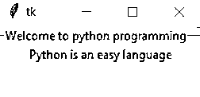
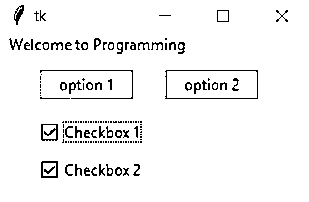

# 标签框架

> 原文：<https://www.educba.com/tkinter-labelframe/>


## Tkinter LabelFrame 简介

Tkinter 框架小部件的变体是 LabelFrame 小部件；它的任务是在它的子部件周围画一个边框，默认情况下显示标题，它用于将所有相关的部件组合在一起，例如，所有的单选按钮可以通过使用 LabelFrame 组合在一起，它的功能是框架的功能，它充当一个容器。每当创建 LabelFrame 并向其添加子级时，LabelFrame 都会在它们周围创建边框，并在它们上方放置一个文本标签。

**语法:**

<small>网页开发、编程语言、软件测试&其他</small>

```
w = LabelFrame(master, option,..)
```

主窗口代表父窗口，选项是可用于小部件的选项列表，选项是用逗号分隔的键值对。

### Tkinter LabelFrame 部件

小部件最常用的选项列表包括:

*   **bg:** 在标签和指示器后面，显示正常的背景色。

*   **bd** :表示指示器周围的边框大小。它的默认值是两个像素。

*   **光标:**通常，光标用点、箭头等表示。如果光标选项设置为点、箭头等光标名称。，当光标放在复选按钮上时，其图案将会改变。

*   **字体:**表示框架的垂直方向。

*   **高度:**表示框架的垂直方向。

*   **labelAnchor:** 该选项指定可以放置标签的地方。

*   **highlightbackground:** 这代表焦点不在框内时的焦点高亮颜色。

*   **highlightcolor:** 这代表焦点在框架中时的焦点高亮颜色。

*   **highlightthickness:** 该选项代表焦点高亮厚度。

*   **浮雕:**该选项代表边框的样式。如果此选项设置为默认值，平的或槽的或凸起的或凹陷的或脊的，复选按钮与背景相同，与背景没有区别。

*   **宽度:**该选项用于指定所需窗口的宽度。

*   **text:** 该选项指定要在小部件中显示的文本。

*   **class:** LabelFrame 是类的默认值。

*   **色彩映射表:**该选项指定用于小工具的色彩映射表。256 种颜色用于形成图形，这就是我们所说的色彩映射表。通过使用这个颜色图选项，颜色图可以在这个小部件的另一个窗口中重用。

*   **容器:**该选项用于使 LabelFrame 成为一个容器小部件。仅当此选项设置为 true 时，LabelFrame 才成为容器小部件。False 是该容器选项的默认值。

*   **fg:** 小工具的前景色用这个选项来表示。

*   **labelwidget:** 该选项表示标签将使用的小部件。如果没有指定值，文本将用于框架的标签。

*   **padx:** 该选项代表水平方向的小部件的填充。

*   **pady:** 这个选项代表垂直的小工具的填充。
*   **视觉:**该选项代表屏幕的视觉。该选项没有默认值。

### 标签帧间的方法

可以在 LabelFrame 对象上实现的一些方法有:

*   **cget("option"):** 选项值代表配置值，返回配置值的当前值。该选项可以是任何值。

*   **configure():** 如果没有将选项值指定为参数，则返回一个列表，描述所有可用的选项。

*   **configure("option"):** 如果有一个" option "值被指定为参数，则返回一个描述给定选项的列表。

*   **配置(* *选项):**如果有一个“* *选项”值被指定为参数，则命令会修改小工具选项以保存给定值。

### 例子

以下是 Tkinter LabelFrame 的示例:

#### 示例#1

Python 程序使用 Tkinter LabelFrame 来演示 Tkinter LabelFrame 是如何工作的。

**代码:**

```
#Import tkinter package
from tkinter import *
#Define a window name
root1 = Tk()
#Define the labelframe and assign the text to be displayed by the frame
label_frame = LabelFrame(root1, text="Welcome to python programming")
label_frame.pack(fill="both", expand="yes")
#Define the child frame and assign the text to be displayed in the child frame
left1 = Label(label_frame, text="Python is an easy language")
#To show the content in the window
left1.pack()
root1.mainloop()
```

**输出:**




在上面的代码中，Tkinter 包作为程序的第一步被导入。定义窗口名称，使用该名称定义 LabelFrame，并且还定义 LabelFrame 要显示的文本。然后用要在子框架中显示的文本定义子框架，最后，显示由 LabelFrame 和子框架组成的窗口的内容。

#### 实施例 2

Python 程序使用 Tkinter LabelFrame 来演示 Tkinter LabelFrame 如何与按钮和复选按钮一起工作。

**代码:**

```
#Import tkinter package
from tkinter import Tk, mainloop, LEFT, TOP
from tkinter.ttk import *
# tkinter window is created by defining the geometry
root1 = Tk()
root1.geometry('250x150')
# LabelFrame is created
labelframe = LabelFrame(root1, text = 'Welcome to Programming')
labelframe.pack(expand = 'yes', fill = 'both')
# Buttons are defined and created
button = Button(labelframe, text = 'option 1')
button.place(x = 30, y = 10)
button1 = Button(labelframe, text = 'option 2')
button1.place(x = 130, y = 10)
# Checkbuttons are defined and created
checkbutton1 = Checkbutton(labelframe, text = 'Checkbox 1')
checkbutton1.place(x = 30, y = 50)
checkbutton2 = Checkbutton(labelframe, text = 'Checkbox 2')
checkbutton2.place(x = 30, y = 80)
# An infinite loop is created and it
# waits for interrupt (like keyboard or
# mouse) for termination
mainloop()
```

**输出:**




在上面的代码中，Tkinter 包作为程序的第一步被导入。定义窗口名称，使用该名称定义 LabelFrame，并且还定义 LabelFrame 要显示的文本。然后定义和创建按钮，其名称将显示在按钮上，然后定义和创建检查按钮以及将显示在检查按钮上的文本，最后显示由标签框架、按钮和检查按钮组成的窗口内容。

### 推荐文章

这是 Tkinter LabelFrame 的指南。在这里，我们讨论 Tkinter LabelFrame 小部件、属性的简要概述，并举例说明 Tkinter LabelFrame 的工作原理。您也可以浏览我们推荐的其他文章，了解更多信息——

1.  [Tkinter 列表框](https://www.educba.com/tkinter-listbox/)
2.  [t 内部检查按钮](https://www.educba.com/tkinter-checkbutton/)
3.  [Tkinter 文本](https://www.educba.com/tkinter-text/)
4.  tkinter grid