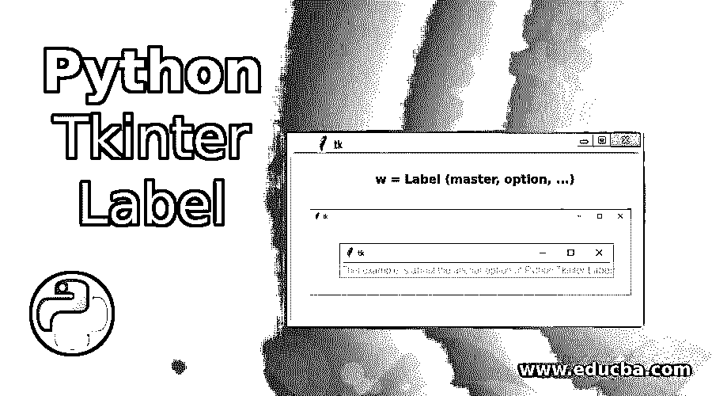
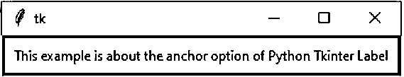
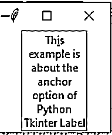
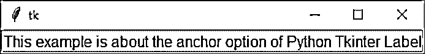

# Python Tkinter 标签

> 原文：<https://www.educba.com/python-tkinter-label/>




## Python Tkinter 标签的定义

Python Tkinter 标签是一个 Tkinter 微件类，用于在父微件中显示文本或图像。它是一个非交互式的小部件，唯一的目的是向用户显示任何消息。现在让我们先来看看 Python Tkinter 标签的语法，然后我们将讨论我们为什么首先使用它。

**语法:**

<small>网页开发、编程语言、软件测试&其他</small>

```
w = Label (master, option, ...)
```

以下是 Python Tkinter 标注的参数:

*   **Master:** 这是父小部件。
*   **Options:** 这表示可以在父小部件上使用的选项列表。这些是由逗号分隔的键值对。

### Python Tkinter 标签中使用的选项

Python Tkinter 标签用于指定放置文本或图像的容器框。它用于向用户提供 Python 应用程序中使用的微件的相关信息。

以下是可在 Python Tkinter 标注中使用的选项:

1.  **anchor:** 当父窗口小部件的空间超过文本需要的空间时，这个选项可以帮助我们控制文本的位置。锚点的值对应于指南针中可用的不同选项。默认选项是居中。
2.  **bg:** 这表示将显示在标签和指示器后面的背景颜色。
3.  **位图:**用于显示标签中的图像
4.  **bd:** 这表示指示器周围边框的大小。默认值为 2 像素。
5.  **光标:**用于表示光标的类型，即箭头或点。
6.  **字体:**这表示标签显示的字体。
7.  **fg:** 当我们在标签中显示文本时，该选项有助于设置文本的颜色。当我们显示位图时，这个选项帮助我们确定位图中 1 位的颜色。
8.  **高度:**决定标签的垂直尺寸。
9.  **image:** 它帮助我们在标签小部件中设置图像。
10.  **justify:** 它决定多行文本如何相互对齐。可能的选项有左对齐的 LEFT、居中对齐的 CENTER 和右对齐的 RIGHT。默认值是居中
11.  **padx:** 这表示添加到标签开始和结束的额外空格。默认值为 1。
12.  **pady:** 这表示添加到标签中文本顶部和底部的额外空格。默认值为 1。
13.  **浮雕:**它决定了标签周围边框的外观。默认值为 FLAT。
14.  **text:** 该选项用于在标签小部件中显示一行或多行文本。
15.  **textvariable:** 这个选项也帮助我们在标签小部件中显示文本；唯一的区别是我们显示文本的方法。在 textvariable 方法中，创建一个 StringVar 类对象，然后使用该对象上的 set 选项，我们可以分配文本。
16.  **下划线:**在此选项的帮助下，我们可以在标签中的文本下方显示下划线。下划线将从第 0 个<sup>元素开始，在第 n 个元素开始。下划线的默认值为-1，表示没有下划线。</sup>
17.  **宽度:**以字符表示标签的宽度。如果未设置此选项，标签将调整大小以适合其内容。
18.  **wraplength:** 这有助于我们通过将值提到期望值来限制每行的字符数。默认值为 0。

### Python Tkinter 标注示例

Label 小部件是一个标准的 Tkinter 小部件，用于显示文本或图像。以下是 python tkinter 标签的示例:

#### 示例#1

**代码:**

```
from tkinter import *
root = Tk()
var = StringVar()
label = Label( root, anchor = CENTER , bg = "blue", textvariable = var, bd = 10, cursor = "dot")
var.set("This example is about the anchor option of Python Tkinter Label")
label.pack()
root.mainloop()
```

**输出:**




#### 实施例 2

**代码:**

```
from tkinter import *
root = Tk()
label = Label( root, height = 10, width = 100, padx = 2, pady = 2, text="This example is about the anchor option of Python Tkinter Label")
label.pack()
root.mainloop()
```

**输出:**


#### 实施例 3

**代码:**

```
from tkinter import *
root = Tk()
var = StringVar()
label = Label( root, underline = 2, wraplength = 70, textvariable = var, relief = "groove")
var.set("This example is about the anchor option of Python Tkinter Label")
label.pack()
root.mainloop()
```

**输出:**




#### 实施例 4

**代码:**

```
from tkinter import *
root = Tk()
var = StringVar()
label = Label( root, font = "bold", fg = "green", bg = "yellow", textvariable = var, relief = "groove")
var.set("This example is about the anchor option of Python Tkinter Label")
label.pack()
root.mainloop()
```

**输出:**




### 结论

在下面的文章中，我们讨论了 Python Tkinter 标签的基础知识。首先，我们看到了语法以及我们使用 Python Tkinter 标签的原因。之后，我们讨论了可以用来调整标签的选项。最后，我们通过查看多个相同的示例来结束本文。因此，下次您考虑 Tkinter 时，一定要记得使用 Python Tkinter Label 的特性。

### 推荐文章

这是一个 Python Tkinter 标签的指南。在这里，我们讨论 python Tkinter 标签中使用的定义和各种选项，以及不同的示例及其代码实现。您也可以看看以下文章，了解更多信息–

1.  [t 帧间帧](https://www.educba.com/tkinter-frame/)
2.  [Python Tkinter Canvas](https://www.educba.com/python-tkinter-canvas/)
3.  [Python if main](https://www.educba.com/python-if-main/)
4.  [Python Tkinter Button](https://www.educba.com/python-tkinter-button/)