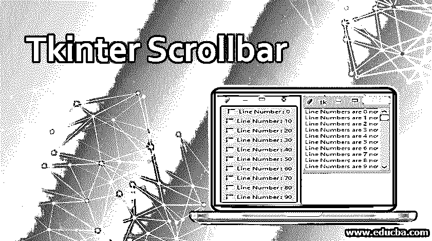
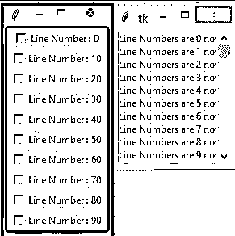

# Tkinter 滚动条

> 原文：<https://www.educba.com/tkinter-scrollbar/>




## Tkinter 滚动条介绍

Tkinter Scrollbar 小部件主要提供滑动控制器，用于实现垂直滚动小部件，如 Listbox、Canvas 和 Text。使用 Tkinter scrollbar 小部件，还可以尝试在 entry 小部件上创建水平滚动条。当滚动条设置为垂直时，Tkinter scrollbar 用于滚动内容以垂直查看整个内容。水平滚动条用于水平滚动内容。Scrollbar()语法将用于获取带有属性:master 和选项/options 的滚动条。

**语法:**

<small>网页开发、编程语言、软件测试&其他</small>

```
w=scrollbar( master, option/options, …  )
```

**属性:**

*   **Master:**Tkinter 滚动条的这个 Master 属性只代表父窗口
*   **选项/选项:**Tkinter scrollbar 的选项/选项属性将包含 scroll bar 小工具常用的选项列表。这些选项主要用作键-值对，用逗号分隔。

### Tkinter 滚动条小部件

小部件最常用的选项列表包括:

*   **activebackground:** 当鼠标/光标点在滚动条/滑块上时，Tkinter 滚动条的“activebackground”选项用于给滑块/滚动条/箭头/箭头/光标符号着色。
*   **Bg** :当鼠标/光标点实际上不在滚动条/滑块上时，Tkinter 滚动条的“Bg”选项对于改变滚动条/箭头/光标点的背景非常有帮助。
*   **bd:**Tkinter 滚动条的“BD”选项用于设置围绕整个槽周长的 3d 边界的宽度，以及滑块和鼠标点/箭头/光标点上的 3d 效果的宽度。默认情况下，槽的每个角落周围/旁边都没有边框。以及在滑块和箭头/光标点周围有 2 个像素的边框。
*   **command:**Tkinter 滚动条/滑块的“command”选项是每次根据需要移动滚动条/滑块时也要调用的程序。
*   **cursor:**Tkinter scroll bar 小工具的“cursor”选项是当滚动条位于鼠标/光标点下方时，使光标出现。
*   **elementborderwidth:**Tkinter scroll bar 小部件的“elementborderwidth”选项有助于调整滑块和箭头/光标点周围的边框宽度。默认情况下，elementborderwidth 的值为“1”。您可以根据需要使用 elementborderwidth 选项添加任何边框宽度。
*   **highlightbackground:** 每当滚动条/滑块没有焦点时，Tkinter scrollbar 小部件的“highlightbackground”选项有助于突出显示颜色。
*   **highlightcolor:**Tkinter scroll bar 小工具的“highlight color”选项用于当鼠标指针/滚动条/滑块获得焦点时高亮显示的焦点颜色。
*   **highlightthickness:**scroll bar 小工具的“highlight thickness”选项对于设置高亮显示的厚度很有用，但是默认情况下，高亮显示的厚度值设置为 1。您可以将值设置为 0，以抑制焦点高亮显示。
*   **jump:**Tkinter scrolling 小部件的“jump”选项控制当用户拖动/拖曳滑块时会发生什么。默认情况下，跳转选项的值为 0 时，每次小滑块拖动都会产生回调命令。如果跳转选项值设置为值 1，则当用户不释放鼠标/光标按钮时，不会调用回调。
*   **方向:**“方向”选项有助于将方向设置为水平/垂直。这就像定向=水平或定向=垂直。
*   ****repeat delay**:**“repeat delay”选项帮助我们控制滑块在特定方向重复移动之前按钮 1 在槽中被按住的时间。默认情况下，重复延迟(repeatdelay=300)为 300，单位为毫秒。
*   ****重复间隔** :** “重复间隔”选项用于重复滑块的间隔。
*   **take focus:**“take focus”选项用于通过滚动条小部件切换焦点，但是如果您不想要这个特性/行为，可以将它设置为值 0。
*   **槽色:**“槽色”选项用于改变槽的颜色。
*   **宽度:**“宽度”选项用于设置滚动条/滑块的宽度(x 维度为垂直方向，y 维度为水平方向)。默认情况下，宽度值为 16(宽度=16)。

### Tkinter 滚动条的方法

这些是用于 Tkinter Scrollbar 对象的方法:

*   **get():**get()方法返回 2 个数字，a 和 b，用来描述滑块的当前位置。get()值给出了滑动条边缘的精确位置(左或右),也分别给出了垂直和水平滚动条的精确位置，但是 b 的值给出了右边缘或下边缘的位置。
*   **set ( first1，last 1):**set()方法是将滚动条/滑块连接到另一个小部件“w”上。将 w 的 yscrollcommand 或 yscrollcommand 设置为 slider/scrollbar 的 set()方法。这些参数与 get()方法返回的所有值具有相同/相似的含义。
*   **Pack():** 这个方法对于设置滑块/侧边栏的对齐方式很有用。

### 例子

下面的例子是关于用一些函数实现 Tkinter 滚动条(右对齐的垂直滚动条)，for 循环从 0-99 打印一些文本 100 次，以及当循环值被值 10 整除时的检查按钮。首先，我们使用 python 库中的 import *函数导入所有 Tkinter 函数。然后，创建“master1”和“top1”变量作为第一步，以便在需要时制作滚动条和复选按钮。现在 scrollbar1 变量是用“scrollbar()”语法创建的，主属性为“master1”，选项属性为“bg”。

选项属性和变量可以根据我们的需求从所有可用选项列表中进行更改。然后为了对齐，使用 pack()方法，就像在 Tkinter checkbutton 中的用法一样。创建 pavanlist1 变量是为了使用 pack()方法中的“side=RIGHT”设置向右对齐和滚动条。为了设置方法，Listbox()小部件附带了 master 和 option 属性。Listbox()有助于根据需要显示项目/其他项目的列表。Listbox()项存储在 mylist1 变量中。现在，范围为 100 的循环出现了，通过运行 For 循环 100 次来获得从 0 到 99 的值。运行 100 次的循环下面的文本将在“pavanlist1”变量中列出，并在循环数/值被 10 整除时打印 checkbuttons。然后，当循环值被值 10 整除时，将检查条件以打印 Tkinter checkbutton。然后，config 方法与滚动条的小部件一起使用，以在从其他变量初始化之后访问对象的属性..以便在程序运行过程中随时修改文本。

**代码:**

```
from tkinter import *
import tkinter
top1 = tkinter.Tk()
CheckVar11 = IntVar()
master1 = Tk()
scrollbar1 = Scrollbar(master1, bg="green")
scrollbar1.pack( side = RIGHT, fill = Y )
pavanlist1 = Listbox(master1, yscrollcommand = scrollbar1.set )
for pavanline1 in range(100):
	pavanlist1.insert(END, "Line Numbers are " + str(pavanline1) + " now in online ")
	if pavanline1%10==0:
		C11 = Checkbutton(top1,text="Line Number : " + str(pavanline1),variable = CheckVar11)
		C11.pack()
pavanlist1.pack( side = LEFT, fill = BOTH )
scrollbar1.config( command = pavanlist1.yview )
mainloop()
top1.mainloop()
```

**输出:**




### 推荐文章

这是一个 Tkinter 滚动条的指南。这里我们讨论 Tkinter Scrollbar 小部件、属性的简要概述，以及演示 Tkinter Scrollbar 工作的例子。您也可以浏览我们推荐的其他文章，了解更多信息——

1.  [t 帧间帧](https://www.educba.com/tkinter-frame/)
2.  [Python Tkinter Canvas](https://www.educba.com/python-tkinter-canvas/)
3.  tkinter grid
4.  tkinter menu