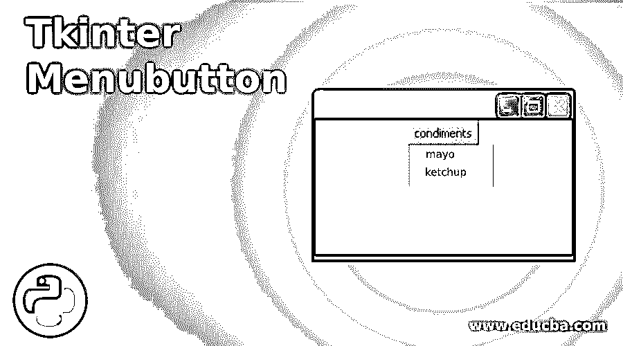
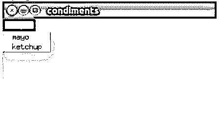
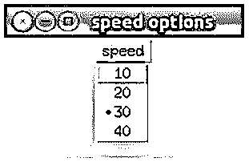

# Tkinter 菜单按钮

> 原文：<https://www.educba.com/tkinter-menubutton/>




## Tkinter 菜单按钮介绍

以下文章提供了 Tkinter Menubutton 的概述。在 python 中，Tkinter 菜单按钮被定义为一个菜单按钮，它始终是屏幕上下拉菜单的一部分，并且该菜单按钮与一个菜单小部件相关联，当用户单击菜单时，该菜单小部件提供不同的选项供应用程序选择。它用于根据需求在应用程序中创建不同类型的菜单。它向用户提供选项，供用户从应用程序中所有可用选项的菜单中进行选择，该应用程序称为 Tkinter 菜单按钮。菜单按钮通常用于在应用程序中创建顶级菜单。

### 带有选项的菜单按钮的语法

以下是带有选项的语法和菜单按钮:

<small>网页开发、编程语言、软件测试&其他</small>

**语法:**

`w = tk.menu button(parent, option, ...)`

其中父窗口是根窗口或父窗口。

其中选项是菜单小部件中常用选项的列表，可以用作键值对。

**选项列表:**

*   **activebackground** :该选项给出了用户将鼠标放在菜单按钮上时的背景颜色。
*   **activeforeground:** 当用户将鼠标放在菜单按钮上时，该选项给出前景色。
*   **anchor:** 该选项根据用户默认设置的选项设置文本在应用中的位置，它会在中心(anchor = tk。中心)，并通过使用(anchor =tk。w)将文本靠左侧居中放置。
*   **背景或 bg:** 当鼠标不在用户菜单按钮上时，该选项给出原始背景。
*   **光标:**当我们将鼠标放在菜单按钮上时，该选项给出光标。
*   **复合:**该选项将指定图像相对于文本出现的位置，不同的位置为上、左、右、下、居中和无(在这种情况下，文本不会显示，只有图形会显示)。
*   **方向:**该选项将设置菜单在屏幕上需要显示的位置或方向。我们有三个选项在菜单按钮的左边，右边和上面。
*   **Disabledforeground:** 该选项禁用时会在菜单按钮上显示前景色。
*   **Forground 或 fg:** 当鼠标不在菜单按钮上时，该选项将显示原来的前景色。
*   **字体:**该选项指定用于在屏幕上显示文本的字体类型。
*   **height:** 该选项定义菜单按钮与文本内联的高度，而不是像素；默认情况下，它将适合其内容。
*   **Highlightbackground:** 该选项突出显示背景颜色，当光标不活动时，该颜色处于焦点中。
*   **Highlightcolor:** 这些选项显示菜单按钮小工具获得焦点时的颜色。
*   **Highlightthickness:** 该选项高亮显示焦点厚度。
*   **图像:**此选项显示用此设置的图像对象时的图像。
*   **Justify:** 该选项控制当文本不在菜单按钮中时显示的文本。
*   **菜单:**该选项将与菜单按钮相关联，通过将该选项设置为菜单对象来提供不同的选择。
*   **Padx:** 该选项告诉菜单按钮左右需要留出的空间。
*   **Pady:** 这个选项告诉你菜单按钮上下需要留的空间。
*   **浮雕:**该选项启用菜单按钮的 3d 效果。
*   **状态:**该选项提供了禁用菜单按钮或无响应的选项。
*   **Takefocus:** 该选项允许通过设置 take focus=True 使用键盘添加焦点。
*   **文本:**该选项将告诉菜单按钮显示文本字符串。
*   **文本变量:**该选项使我们能够将一个字符串变量与菜单按钮相关联。
*   **下划线:**该选项可为菜单按钮上的任何字符文本加下划线。
*   **宽度:**该选项使我们能够根据字符设置菜单按钮的宽度；默认情况下，它将适合其内容。
*   **Wraplength:** 该选项通过将该选项设置为字符数来换行；所有的线将被完全按照数字分成碎片。

### Tkinter 菜单按钮示例

以下是提到的例子:

#### 示例#1

不同类型酱的示例，并从可用列表中选择一种酱。

**代码:**

```
import tkinter
from tkinter import *
window = tkinter.Tk()
window.title("condiments")
window.geometry('350x200')
menub = menubutton(window, text='sauces', activebackground=’blue’)
menub.grid()
menub.menu = Menu(menub, tearoff=0)
menub["menu"] = menub.menu
mayo_sauce = IntVar()
ketchup = IntVar()
menub.menu.add_checkbutton(label='mayo', variable=mayo_sauce)
menub.menu.add_checkbutton(label='ketchup', variable=ketchup)
window.mainloop() 
```

在上面的程序示例中，我们创建了一个名为 window 的父显示，标题为“调味品”，高度和宽度分别为 350×200，并创建了一个与父窗口相关联的菜单按钮，文本为“酱汁”,选项 activebackground 为“蓝色”,以及显示可用选项列表的菜单。我们创建了两个选项，mayo_sauce 和番茄酱，并将它们作为选项列表添加到菜单中，并调用 mainloop()函数。

**输出:**




#### 实施例 2

一个程序，显示一个速度选项列表的菜单，并选择一个选项作为速度。

**代码:**

```
from tkinter import *
import tkinter
j = 1
speed = ['10', '20', '30', '40']
top = tkinter.Tk()
top.title('speed options')
top.geometry('200x100')
top.menubutton_1 = menubutton(top, text='speed', relief='raised')
top.menubutton_1.menu = Menu(top.menubutton_1)
top.menubutton_1.pack()
top.user_choice = IntVar()
top.file_menu = Menu(top.menubutton_1,tearoff=0)
for i in speed:
S = top.file_menu.add_radiobutton(label=i, variable=top.user_choice, value=i)
j += 1
top.menubutton_1.config(menu=top.file_menu)
top.mainloop() 
```

在上面的例子中，我们创建了一个速度选项列表，并使用 Tk()创建了一个名为 top 的父窗口，标题为“速度选项”，高度和宽度为 200×100。我们创建了一个菜单按钮，以文本作为速度，以选项作为浮雕，以凸起作为值，并调用 pack()函数，创建了一个 user_choice 变量，并使用 add_radiobutton()函数添加了列表中的所有速度选项，最后调用 mainloop()函数。

**输出:**




### 结论

最后，这是所有关于 Tkinter 菜单按钮。到目前为止，我们已经看到了菜单按钮的定义、语法、选项以及每个选项的简要说明，并解释了菜单按钮的不同示例及其用法，以及如何使用它来创建带有选项列表的菜单。

### 推荐文章

这是 Tkinter 菜单按钮的指南。这里我们讨论 Tkinter Menubutton 的介绍以及示例代码，以便更好地理解。您也可以看看以下文章，了解更多信息–

1.  [Tkinter Messagebox](https://www.educba.com/tkinter-messagebox/)
2.  [Tkinter Widgets](https://www.educba.com/tkinter-widgets/)
3.  tkinter grid
4.  [t 内部检查按钮](https://www.educba.com/tkinter-checkbutton/)


