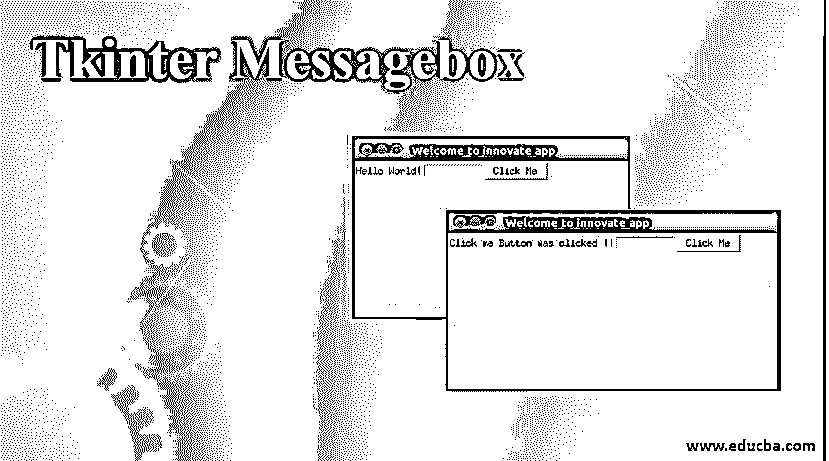
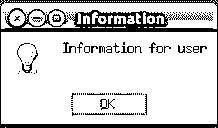
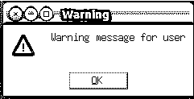
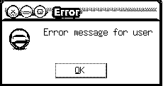
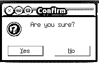
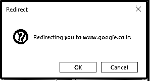
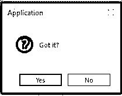
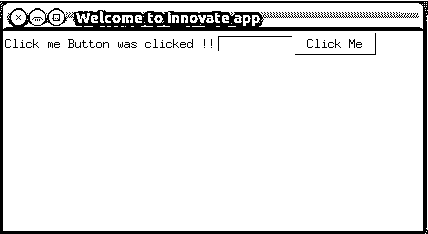

# Tkinter Messagebox

> 原文：<https://www.educba.com/tkinter-messagebox/>




## 什么是 Tkinter Messagebox？

Tkinter Messagebox 是 python 中的一个模块，它提供了一组不同的对话框，用于显示消息框，显示错误或警告， 用于选择文件或更改颜色的小部件称为 Tkinter Messagebox，它是一个弹出框，根据 python 应用程序的要求显示相关消息和标题，并带有一个图标，中断用户流程以获取用户输入，它具有不同的功能，用于根据应用程序要求显示相关消息，如信息消息、警告消息、错误消息或获取用户输入。

**语法:**

<small>网页开发、编程语言、软件测试&其他</small>

```
import  tkinter
from tkinter import messagebox
messagebox.functionname(title, message [,options])
```

**解释:**在上面的语法中，我们导入了 Tkinter 库，并由此导入了 messagebox 模块，使用该模块我们可以调用不同的函数，并根据应用程序的需求显示相关的消息和标题。

### Tkinter Messagebox 的属性

在上一节中，我们已经讨论了 Tkinter messagebox 的语法。现在我们将详细讨论语法中使用的参数或属性。语法中有四个属性:函数名、标题、消息和选项。

*   **函数名:**函数名代表消息框函数的正确名称。
*   **标题:**标题是一条消息，将显示在标题栏消息的对话框中。
*   **Message:** Messages 是一个文本，用于向适当的函数名显示消息。
*   **选项:**选项就像一个选择，通过它我们可以自定义消息框，这是标准的。一些选项是默认和父。默认选项用于提及默认操作或消息框按钮，如消息框中的中止、忽略或重试。父选项用于表示将在顶部显示消息框的父窗口。

### Tkinter Messagebox 的方法

让我们看看 Tkinter messagebox 提供的不同函数，如 showinfo()、showwarning()、showerror()、askquestion()、askokcancel()、askyesno()和 askretrycancel()。上述函数用于显示适当的消息框，所有函数都具有相同的语法，但功能不同。我们要讨论的所有函数都是 python3 及以上版本的。

#### 1.showinfo()

当我们想要向用户显示一些相关或相关的信息时，我们使用这个 messagebox 函数。让我们试着用下面的例子创建一个信息消息框。

**代码:**

```
import tkinter
from tkinter import messagebox
top =  tkinter.Tk()
top.geometry("150x150")
messagebox.showinfo("Information","Information for user")
top.mainloop()
```

**解释:**在上面的例子中，我们使用 tkinter 创建了一个 Tkinter 对象 top。Tk()并使用 messagebox 和 showinfo()函数来显示信息消息。

**输出:**




#### 2.showwarning()

当我们想要向用户显示警告消息时，我们使用这个 messagebox 函数。让我们通过下面的例子为用户创建一条警告消息:

**代码:**

```
import tkinter
from tkinter import messagebox
top =  tkinter.Tk()
top.geometry("150x150")
messagebox.showwarning("Warning","Warning message for user")
top.mainloop()
```

**解释:**在上面的例子中，我们使用 tkinter 创建了一个 Tkinter 对象 top。Tk()并使用带有 showwarning()函数的 messagebox 来显示用户的警告消息。

**输出:**




#### 3.显示错误()

当我们想要向用户显示错误消息时，我们使用这个 messagebox 函数。让我们通过下面的例子为用户创建一条错误消息:

**代码:**

```
import tkinter
from tkinter import messagebox
top =  tkinter.Tk()
top.geometry("150x150")
messagebox.showerror("Error","Error message for user")
top.mainloop()
```

**解释:**在上面的例子中，我们使用 tkinter 创建了一个 Tkinter 对象 top。Tk()并使用带有 showerror()函数的 messagebox 来显示用户的警告消息。

**输出:**




#### 4.问问题()

当我们想问用户一些问题时，我们使用这个 messagebox 函数，这些问题可以用 yes 或 no 来回答。让我们用下面的例子创建一个程序来问用户一个问题，用户是否想确认它:

**代码:**

```
import tkinter
from tkinter import messagebox
top =  tkinter.Tk()
top.geometry("150x150")
messagebox.askquestion("Confirm","Are you sure?")
top.mainloop()
```

**解释:**在上面的例子中，我们使用 tkinter 创建了一个 Tkinter 对象 top。Tk()并使用 messagebox 和 askquestion()函数询问用户一个问题，并用消息确认:你确定吗？

**输出:**




#### 5.askokcancel()

当我们想要确认用户对应用程序行为或活动的响应时，我们使用这个 messagebox 函数。让我们创建一个程序，通过下面的例子来确认用户对应用程序的响应:

**代码:**

```
import tkinter
from tkinter import messagebox
top =  tkinter.Tk()
top.geometry("150x150")
messagebox.askokcancel("Redirect","Redirecting you to www.google.co.in")
top.mainloop()
```

**解释:**在上面的例子中，我们使用 Tkinter 创建了一个 Tkinter 对象 top。Tk()并使用一个带有 askokcancel()函数的 messagebox 来获取用户对应用程序活动的响应。

**输出:**




#### 6.阿斯凯斯诺

当我们想问用户一些可以用“是”或“否”来回答的问题时，我们使用这个 messagebox 函数。让我们创建一个程序来问用户一些问题，用户将通过用下面的例子说“是”或“否”来回答:

**代码:**

```
import tkinter
from tkinter import messagebox
top =  tkinter.Tk()
top.geometry("150x150")
messagebox.askyesno("Application","Got it?")
top.mainloop()
```

**解释:**在上面的例子中，我们使用 tkinter 创建了一个 Tkinter 对象 top。Tk()并使用 messagebox 和 askyesno()函数询问用户关于某个问题的消息，明白了吗？

**输出:**




### 实现 Tkinter Messagebox 的示例

让我们使用标签、网格和入口类创建一个应用程序，从其中获取输入，并在单击按钮后应用操作，如下例所示。

**代码:**

```
import tkinter
from tkinter import *
top = tkinter.Tk()
top.title("Welcome to innovate app")
top.geometry("350x200")
labl = Label(top, text=”Hello World!”)
labl.grid(column=0, row=0)
txt = Entry(top, width=10)
txt.grid(column=1, row=0)
def click():
	labl.configure(text="Click me Button was clicked ! !")
btn = Button(top, text ="Click Me", command=click)
btn.grid(column=2, row=0)
top.mainloop()
```

**解释:**在上面的例子中，我们已经使用 tkinter 创建了一个 Tkinter 对象 top。Tk()和函数 click()，我们在这里用文本“Click me Button was clicked！!"我们为 Tkinter 对象创建了一个标题，并创建了一个网格来显示输出，如下所示:

**输出:**





### 结论

最后，是 python 中 Tkinter messagebox 模块的概述。到目前为止，我们已经讨论了模块中支持什么 messagebox、它的语法、它的属性和函数，详细描述了函数，最后用一个使用 pack()方法使用 showinfo()函数的例子来说明。我希望在读完这篇文章后，你能很好地理解 Tkinter messagebox 模块，它的功能，以及如何根据应用程序的需求来使用它们。

### 推荐文章

这是一个 Tkinter Messagebox 的指南。在这里，我们讨论语法、属性、不同的方法以及使用适当的语法和示例代码来实现的示例。您也可以浏览我们的其他相关文章，了解更多信息——

1.  [Tkinter 滚动条](https://www.educba.com/tkinter-scrollbar/)
2.  [Python Tkinter 标签](https://www.educba.com/python-tkinter-label/)
3.  [Tkinter 列表框](https://www.educba.com/tkinter-listbox/)
4.  tkinter menu button


