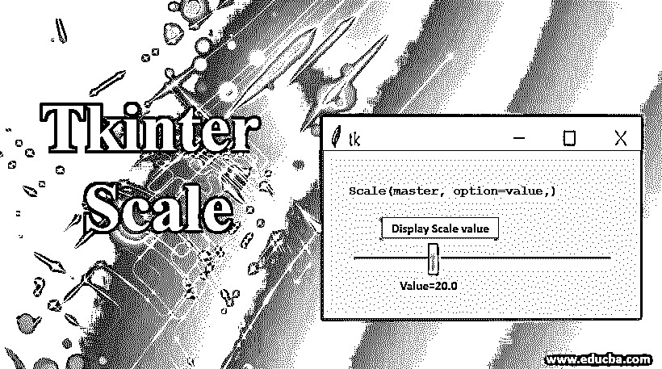

# Tkinter 量表

> 原文：<https://www.educba.com/tkinter-scale/>

## Tkinter 秤简介

Python Tkinter scale 选项允许设计可灵活滚动的比例微件，并列出在面向 Python 的用户界面中设计比例项目最常用的微件；这些比例项可以在小部件中以水平和垂直方式建立，除此之外，在比例小部件中关联的值可以以最精确的方式灵活地检索、处理和显示。

**语法:**

<small>网页开发、编程语言、软件测试&其他</small>

`Scale(master,option=value,)`

### Python Tkinter 比例的属性

以下是 Python Tkinter 比例的属性

| **入口小部件属性** |
| **选项** | **描述** |
| 活动背景 | 它表示当鼠标光标放在元素顶部时滚动元素的背景色。指定的颜色将显示在悬停实例中。 |
| 锥齿轮 | 对于 scale 小部件，great 选项或参数表示位于槽外的元素的背景颜色。此处的槽代表实际的刻度区域，此处指定的颜色很可能到达数值显示区域。 |
| 弹底引信（base detonating 的缩写） | 这表示刻度周围区域的宽度，因此它将包括滑块和槽区域的宽度值。 |
| 槽色 | 该参数在 scale 小部件中提到了波谷区域的颜色。 |
| 命令 | 当滑块有一些移动时，将调用一个方法或特定的过程。但是，这里使用的方法或过程可以包含一个有效的参数。这是因为滑块的快速移动可能不会产生综合结果。 |
| 光标 | 在 scale 小部件中设置 cursor 选项，允许小部件在鼠标光标位于滚动条或 scale 小部件区域的滑块上方时，显示鼠标图标集。 |
| 数字 | scale 小部件中的 digits 参数表示必须添加到显示在波谷区域的值中的浮点。精度从 4 开始，因此将值 4 赋值将允许向数字添加一个浮点。浮点数的数量随着数字值的增加而增加。 |
| 字体 | 字体选项代表滑块标签部分使用的字体类型。 |
| 细粒 | fg 选项用于表示滑块标签部分使用的字体颜色。 |
| 标签 | 标签选项用于将可显示标签标记到缩放微件。标签文本是非常可定制的。 |
| 长度 | 可以使用此长度参数设置缩放微件的长度。此处指定的值越高，小部件就越长。length 参数的默认值是 100 像素。 |
| 东方 | orient 参数用于表示小部件的位置方向。这里使用的默认值是“水平”和“垂直”“水平”值指定水平刻度，而“垂直”值则垂直放置刻度。因此，orient 参数的默认值是“垂直”这个参数很大程度上有助于将 scale 小部件放在用户界面面板的一个可定制的位置。 |
| 减轻 | 提到要放置在 scale 小工具的标签实体周围的边框类型。该参数的默认值是 FLAT。 |
| 反复地 | 这表示滑块的保持时间，以便它可以在滚动区域滑动。 |
| 滑动长度 | 提及缩放小部件滚动区域中使用的滑块长度。通常这个参数的长度是 30 个像素。 |
| 解决 | 改变整个单位的标度不是经常可能的。设置此值表示每个值在标尺上滑动时的最小增量。例如，如果 from_=2.0 且 to=3.0，并且您设置分辨率=0.5，则比例将有 5 个可能的值:2.0、2.25、2.5、2.75 和 3.0。 |
| 时间间隔 | 与分辨率类似，刻度间隔允许将每个刻度设置为其值的倍数。 |

| **方法** |
| **方法** | **描述** |
| 获取() | get 方法用于检索刻度的值。 |
| 集合() | set 方法有助于将给定值设置为刻度 |

### Tkinter 秤示例

python Tkinter 比例的示例如下:

**代码:**

`from tkinter import *
def Scale_select():
selected_value = "Value = " + str(var.get())
label.config(text = selected_value)
root = Tk()
var = DoubleVar()
scale_widget_variable = Scale( root,
activebackground = "red",
bg="grey",
bd=10,
digits=5,
troughcolor="yellow",
fg="Black",
label="Acurracy Score",
length=150,
orient="horizontal",
resolution=10,
variable = var )
scale_widget_variable.pack()
button = Button(root, text="Display scale value", command=Scale_select)
button.pack()
label = Label(root)
label.pack()
root.mainloop()`

**输出:**
T3】

### 说明

Tkinter 中的 scale 小部件用于在用户界面中构建可滚动的比例项目。在本例中，小部件是使用以下属性声明的，

*   **活动背景:**红色
*   背景:灰色
*   **背景尺寸:** 10
*   **位数:** 5 位
*   **槽色:**黄色
*   **前景色:**黑色
*   **标签:**准确率评分
*   **长度:** 150
*   **定向:**水平
*   **分辨率:** 10
*   **变量:**变量

我们还可以注意到一个按钮变量也被声明了；在这个上下文中，这个按钮变量负责提取 scale 小部件中设置的值，并将其显示为下面的标签项。按钮和秤都包装得很好。接下来，在命令部分调用 scale_select()。在这个方法中，scale_select 负责精确选择与 scale 小部件相关联的值。最后，gets()方法用于从 scale 小部件中检索值。检索到的值存储在名为“selected_value”的变量中使用 config()方法将该变量用作标签项的输入。标签项的 config()方法可以使用它的“text”参数来获取这些变量。因此，与这个“文本”参数或选项相关的任何内容，更具体地说，都将显示为标签的内容。更重要的是，这个例子中的 Scale 小部件、button 小部件和 label 小部件都是使用 Tkinter 对象“root”实例化的。标签被打包，根被使用 mainloop()执行。

### 推荐文章

这是一个 Tkinter 规模的指南。这里我们讨论 python Tkinter scale 的介绍和属性，一个例子，以及它的代码实现。您也可以看看以下文章，了解更多信息–

1.  [t 帧间帧](https://www.educba.com/tkinter-frame/)
2.  [Python Tkinter Canvas](https://www.educba.com/python-tkinter-canvas/)
3.  [Python 切片字符串](https://www.educba.com/python-slice-string/)
4.  [Python 统计模块](https://www.educba.com/python-statistics-module/)

