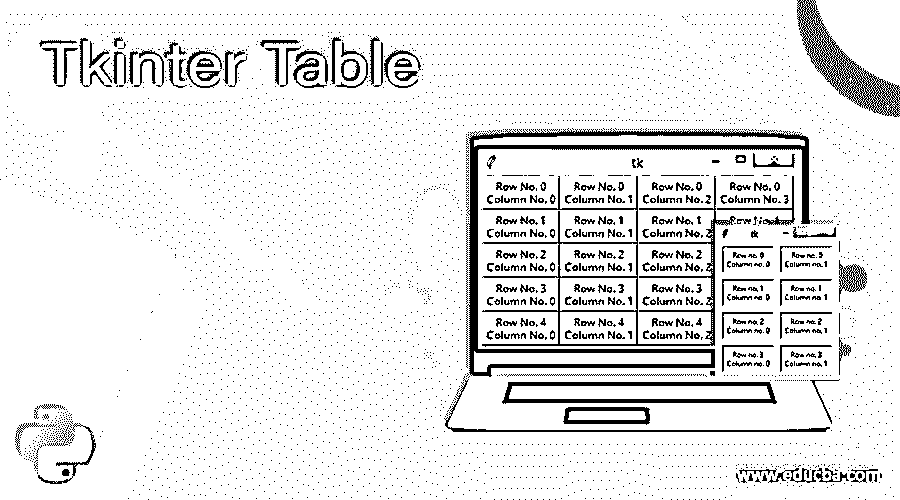
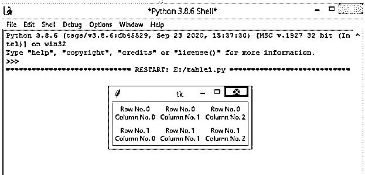
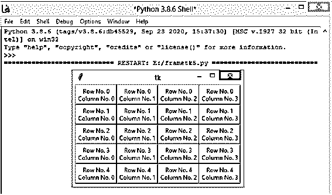
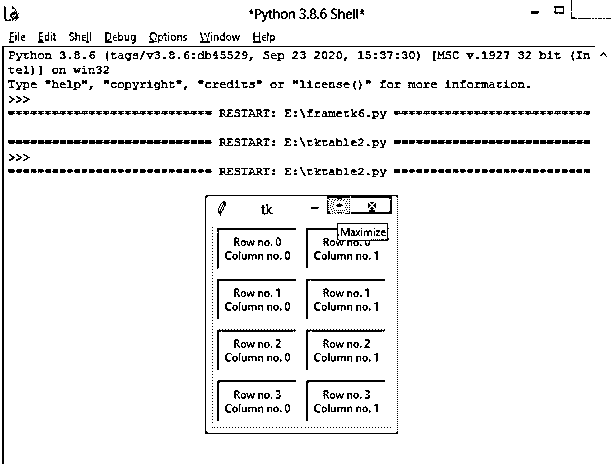
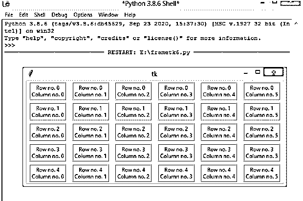
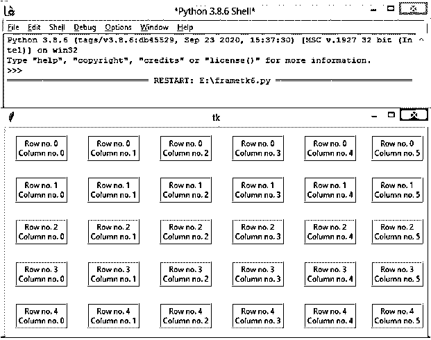
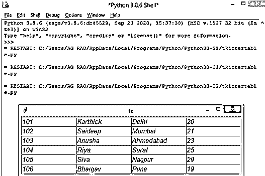

# tkinter table-tkinter table-tkinter 表格

> 原文：<https://www.educba.com/tkinter-table/>




## Tkinter 表介绍

Tkinter Table 用于以行和列的形式显示数据。Tkinter 没有提供任何表格小部件来创建表格，但是我们有其他替代方法。Python GUI-tkinter 为开发图形用户界面提供了多种选择。Tkinter 模块是结合 Python 的 tk GUI 的标准接口。Python tkinter 有 3 个几何管理器类，grid()方法在将微件放入父微件之前，以类似表格的结构组织微件。

这个 grid()方法的工作原理是将一个框架或窗口分成行和列，小部件的位置可以通过调用 grid()方法来指定，将行的索引分别传递给关键字参数。

<small>网页开发、编程语言、软件测试&其他</small>

**语法:**

```
grid_name = tk.Frame(
master=window,
relief=tk.<type_of_border>,
borderwidth=2
)
grid_name.grid(row=<row_element>, column=<column_element>)
```

下面列出了可能的网格选项:

*   **column_element:** 列元素的变量
*   **row_element** :行元素的变量
*   **边框宽度:**用户必须定义边框的宽度
*   **浮雕:**指定边框类型。

Tkinter 提供了允许显示小部件的类。小部件的定位和控制。一些顶级小部件是 Tk 和 TopLevel。还有其他小部件，如标签、条目、文本、框架、画布、单选按钮、按钮、复选按钮、列表框、滚动条、刻度、微调框、窗格窗口和标签框架。

Tkinter 为 tk GUI 工具包提供了一个面向对象的接口。

### Python GUI 中的 Tkinter 是如何工作的？

*   Tkinter 模块的导入
*   创建 GUI 应用程序主窗口
*   向应用程序添加一个或多个小部件
*   进入主事件循环，对用户触发的每个事件采取行动

### Tkinter 表示例

让我们讨论 Tkinter 表的例子。

#### 示例#1:简单的网格 Tkinter 表

**代码:**

```
import tkinter as tkinter
window = tkinter.Tk()
for x in range(2):
for y in range(3):
frameGrid = tkinter.Frame(
master=window,
relief=tkinter.FLAT,
borderwidth=2
)
frameGrid.grid(row=x, column=y)
labelGrid = tkinter.Label(master=frameGrid, text=f"Row No. {x}\nColumn No. {y}")
labelGrid.pack()
window.mainloop()
```

**输出:**




#### 示例 2:具有不同类型边框的 Tkinter 表格

**代码:**

```
import tkinter as tkinter
window = tkinter.Tk()
for x in range(5):
for y in range(4):
frameGrid = tkinter.Frame(
master=window,
relief=tkinter.RAISED,
borderwidth=2
)
frameGrid.grid(row=x, column=y)
labelGrid = tkinter.Label(master=frameGrid, text=f"Row No. {x}\nColumn No. {y}")
labelGrid.pack()
window.mainloop()
```

**输出:**




**示例#3:带填充的 Tkinter 表格网格()管理器**

**代码:**

```
import tkinter as tkinter
window = tkinter.Tk()
for x in range(4):
for y in range(2):
framegrid = tkinter.Frame(
master=window,
relief=tkinter.SUNKEN,
borderwidth=1.5
)
framegrid.grid(row=x, column=y, padx=5, pady=5)
labelgrid = tkinter.Label(master=framegrid, text=f"Row no. {x}\nColumn no. {y}")
labelgrid.pack(padx=3, pady=3)
window.mainloop()
```

**输出:**




#### 示例 4:带有 padx 和 pady 以及山脊地貌的 Python Tkinter 表

**代码:**

```
import tkinter as tkinter
window = tkinter.Tk()
for x in range(5):
window.columnconfigure(x, weight=2, minsize=25)
window.rowconfigure(x, weight=1, minsize=45)
for y in range(0,6):
framegrid = tkinter.Frame(
master=window,
relief=tkinter.RIDGE,
borderwidth=1.5
)
framegrid.grid(row=x, column=y, padx=7, pady=3)
labelgrid = tkinter.Label(master=framegrid, text=f"Row no. {x}\nColumn no. {y}")
labelgrid.pack()
window.mainloop()
```

**输出:**




在设置 columnconfigure()和 rowconfigure()时，行和列会根据窗口大小的增减进行调整。关键字 weight 确定行或列应如何根据窗口大小调整做出响应。

关键字 minsize 有助于设置行高和列宽的 minsize。




.grid()将控制台或框架的窗口分成行和列。用于创建 tkinter 表的 grid()小部件的位置是通过传递行索引和列索引来指定的，这两个索引都从 0 开始。因此，行索引 2 和列索引 3 将小部件放在第 2 <sup>和第 2</sup>行的第 3 <sup>和第 1</sup>列中。使用了两个几何窗口，每个框架都连接到该窗口

在这里，即使。grid()在每个对象上调用，几何管理器仅应用于窗口对象。前一个示例中的框架是并排放置的。为了增加框架周围的空间，每个单元格的填充可以是固定的。

两种类型的填充是“外部填充”和“内部填充”，外部填充增加了网格外部的空间。padx()和 pady()在水平和垂直方向添加填充。两者都以像素为单位，因此设置这些值将在两个方向上进行填充。

#### 示例 5:包含雇员列表的 Tkinter 表

**代码:**

```
from tkinter import *
class Tkinter_Table:
def __init__(table_text,root):
for x in range(rows):
for y in range(columns):
table_text.e = Entry(root, width=15, fg='blue', font=('Timew New Roman',13,'italic'))
table_text.e.grid(row=x, column=y)
table_text.e.insert(END, employee_array[x][y])
employee_array = [(101,'Karthick','Delhi',20), (102,'Saideep','Mumbai',21), (103,'Anusha','Ahmedabad',23), (104,'Riya','Surat',25), (105,'Siva','Nagpur',29), (106,'Bhargav','Pune',19)]
rows = len(employee_array)
columns = len(employee_array[0])
root = Tk()
t = Tkinter_Table(root)
root.mainloop()
```

**输出:**




Tkinter 中 grid()管理器最重要的是下面 3 个关键字，

*   **Place** :用于将微件放置在绝对位置。
*   **网格**:用于在网格中排列控件。
*   **Pack** :用于将上述小部件装入一个框架或一个空腔中。

至此，我们结束了我们的主题“Python Tkinter”。我们已经了解了 Python Tkinter 是什么，以及它是如何在 GUI 应用程序中使用的。这里也解释了 Tkinter 的语法，你可以从在你的系统上安装 Python 开始，然后继续编码。我们也看到了一些例子供你理解。您仍然可以使用 Python 探索 GUI 应用程序中使用的 Tkinter 的其他一些小部件。谢谢！快乐学习！!

### 推荐文章

这是一份餐桌指南。这里我们讨论一下定义，Python GUI 中的 Tkinter 是如何工作的例子？为了更好地理解，提供了示例代码。您也可以看看以下文章，了解更多信息–

1.  [Tkinter 计算器](https://www.educba.com/tkinter-calculator/)
2.  [t inter 滑块](https://www.educba.com/tkinter-slider/)
3.  [Tkinter 颜色图表](https://www.educba.com/tkinter-color-chart/)
4.  [Tkinter Icon](https://www.educba.com/tkinter-icon/)


