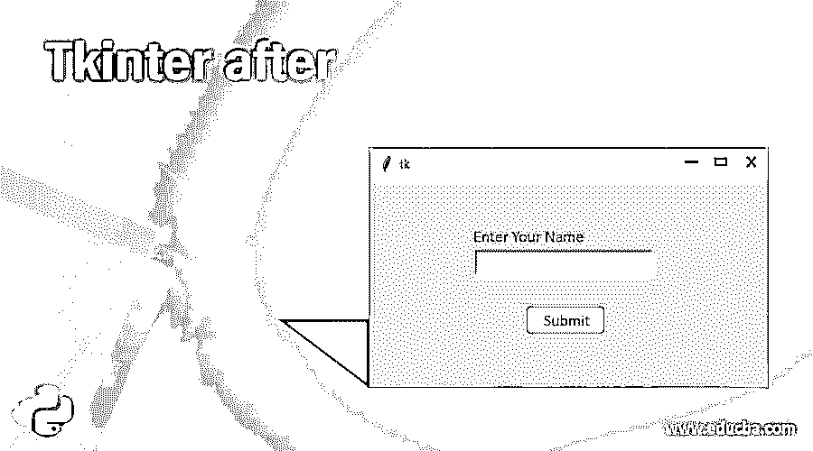
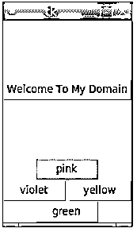
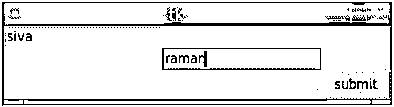
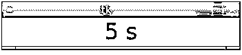
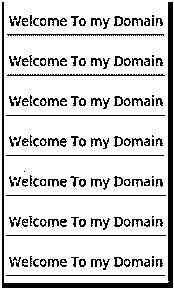
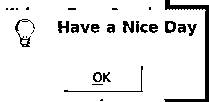

# t 中间在后

> 原文：<https://www.educba.com/tkinter-after/>




## Tkinter 介绍之后

Tkinter after()是 Tkinter 包的方法之一，该方法用于计算应用程序并行中函数的时间间隔。它使用毫秒格式计算时间，无论小部件是否延迟，因为 Tkinter 是一个基于 GUI 的库，也是一个最强大的面向对象的接口，所以每当 UI 小部件像按钮等。它会自动调用特定的函数行为，还会传递用于数据绑定参数的参数。如果我们没有特定参数的特定值，那么它会转到默认状态行为。

### 句法

Tkinter 最强大的基于 GUI 的小部件，它拥有 python 中最先进的库方法。它有更多的全局方法，因此在()之后也是一个全局方法，它可以直接用于小部件或应用程序的特定根函数。它有自己的语法和默认参数。

<small>网页开发、编程语言、软件测试&其他</small>

```
from tkinter import Tk //import the library in python
from tkinter.ttk import Button //import the library in python
variablename =functionName() //Tk library function
variablename.after(time(if it’s in delay status or not),callback)
--some python code logics---
```

在上面的代码中，我们首先使用来导入特定的库，我们用特定的函数声明了一个变量名，它必须是 Tk 库函数，同一个变量将作为另一个调用 after()的方法被调用，因为我们传递了两个参数，一个是延迟时间间隔，另一个是回调方法，如果它处于延迟状态，那么它将在另一个时间间隔执行。

### 它是如何工作的？

Tkinter 包有一组内置函数，用于覆盖 web 应用程序中的 UI 部分。它有最互动和先进的图书馆，它可以计算时间，速度的功能，即使一些基于人工智能的功能也涵盖在这个小工具。基本上，我们要装饰的用户界面有按钮，视图，滚动框等，主要是按钮将在用户界面区域导航网页或应用程序。一旦我们点击了按钮，它的运作和工作的后端领域。如果它似乎是一个基于网络的应用程序，我们还会在 chrome 或其他一些浏览器中计算时间间隔。每当用户点击按钮时，将使用后端命令行选项调用函数，在用户点击按钮时，我们希望调用函数名。如果我们在(delay，callback)之后没有给这个方法任何特定的值，那么它只能使用默认值。例如，我们没有给定任何延迟时间和回调参数值回调采用了 None 值延迟参数默认调用 python 代码的 sleep()方法。此外，它采用毫秒作为时间格式，而不是秒。

after()方法还调用 python 应用程序的所有 Tkinter 小部件。Tkinter 将在 windows、Linux 等多种操作系统上得到支持。这是一个标准库，我们也可以使用 python Tkinter 创建基于桌面的应用程序，这也不是一个复杂的任务，我们可以使用 Tkinter 基本小部件，如"**按钮、画布、Checkbutton、框架、标签、列表框、菜单、消息、单选按钮、文本等"**这些小部件主要包含在 UI 部分中，这些小部件包在所有小部件中使用 after()方法。主要是与时间相关的逻辑，在 Tkinter 库中，多线程应用也是这些特定方法中最重要的部分。Tkinter 有独立的模块，它有自己的接口，就像 Tkinter 接口位于一个叫做二进制模块的模块中，它被命名为 _tkinter，它也接受布尔类型的值。

### Tkinter after 示例

让我们在后面讨论 Tkinter 的例子。

#### 示例 1

```
from tkinter import *
from time import time
from tkinter.ttk import Button
demos= Tk()
b = Button(demos, text = 'Welcome To My Domain')
b.pack(pady = 77,side = TOP)
pink = Button(demos, text = "pink")
pink.pack( side = TOP)
green = Button(demos, text = "green")
green.pack( side = BOTTOM )
violet = Button(demos, text = "violet")
violet.pack( side = LEFT )
yellow = Button(demos, text = "yellow")
yellow.pack( side = RIGHT)
print('The Tk Widget is running on the screen...')
startingtime = time()
demos.after(200000, demos.destroy)
demos.mainloop()
endingtime = time()
print('The Tk Widget is closed after % d seconds' % (endingtime-startingtime))
```

**输出:**

**

** 

#### 示例 2

```
from tkinter import *  
user = Tk()  
uname = Label(user,text = "uname").grid(row =0, column = 0)  
un= Entry(user).grid(row = 0, column = 0)  
passw = Label(user,text = "pass").grid(row = 1, column = 1)  
ps = Entry(user).grid(row = 1, column = 1)  
result = Button(user, text = "submit").grid(row = 3, column = 3)  
user.mainloop() 
try:
    import tkinter as tk
except ImportError:
    import Tkinter as tk
class Timer:
    def __init__(first, second):
        first.seconds = 1
        first.label = tk.Label(second, text="1s", font="Arial 25", width=17)
        first.label.pack()
        first.label.after(3000, first.demo)
    def demo(first):
        first.seconds += 1
        first.label.configure(text="%i s" % first.seconds)
        first.label.after(2000, first.demo)
if __name__ == "__main__":
    demos = tk.Tk()
    tme = Timer(demos)
    demos.mainloop() 
```

**输出:**







#### 示例 3

```
from tkinter import Tk, mainloop, TOP
from tkinter.ttk import Button
from tkinter.messagebox import _show
sample = Tk()
btn = Button(sample, text = 'Welcome To my Domain')
btn.pack(side = TOP, pady = 7)
b2 = Button(sample, text = 'Welcome To my Domain')
b2.pack(side = TOP, pady = 7)
b3 = Button(sample, text = 'Welcome To my Domain')
b3.pack(side = TOP, pady = 7)
b4 = Button(sample, text = 'Welcome To my Domain')
b4.pack(side = TOP, pady = 7)
sample.after(3400, lambda : _show('user', 'Have a Nice Day'))
sample.after(5400, sample.destroy)
btn.pack(side = TOP, pady = 7)
b5 = Button(sample, text = 'Welcome To my Domain')
b5.pack(side = TOP, pady = 7)
b6 = Button(sample, text = 'Welcome To my Domain')
b6.pack(side = TOP, pady = 7)
b7 = Button(sample, text = 'Welcome To my Domain')
b7.pack(side = TOP, pady = 7)
mainloop()
b8 = Button(sample, text = 'Welcome To my Domain')
b8.pack(side = TOP, pady = 7)
b9 = Button(sample, text = 'Welcome To my Domain')
b9.pack(side = TOP, pady = 7)
b10 = Button(sample, text = 'Welcome To my Domain')
b10.pack(side = TOP, pady = 7)
mainloop()
```

**输出:**

**

** 




### 结论

after()是 python 脚本的 Tkinter 库中的方法之一，使用它我们可以创建不同类型的 GUI 表示，并且与其他基于 GUI 的技术相比，它更加用户友好。同样，python Tkinter 库有默认的方法来在基于桌面和 web 的应用程序中创建 UI 小部件。

### 推荐文章

这是 Tkinter 之后的指南。在这里，我们讨论了 Tkinter 的介绍和工作原理，以及不同的例子和代码实现。您也可以看看以下文章，了解更多信息–

1.  tkinter menu button
2.  [Tkinter 文本](https://www.educba.com/tkinter-text/)
3.  [Tkinter Widgets](https://www.educba.com/tkinter-widgets/)
4.  [Python Tkinter Button](https://www.educba.com/python-tkinter-button/)