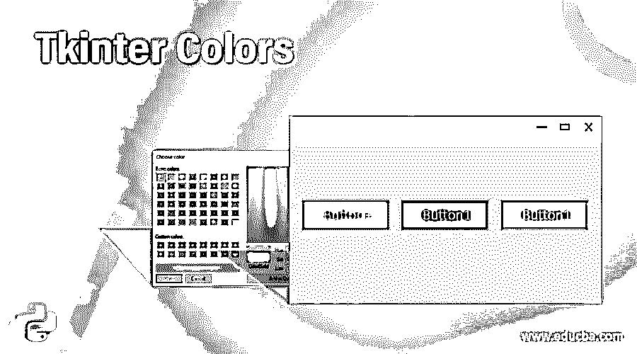
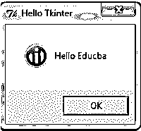
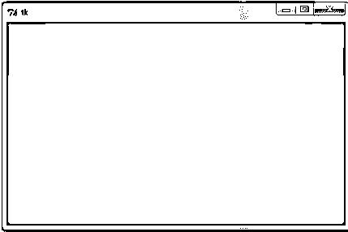

# t 中间颜色

> 原文：<https://www.educba.com/tkinter-colors/>




## t 中间颜色的定义

Tkinter 颜色被定义为使用任何颜色来设计 web 开发前端的属性。这可以通过两种方式来定义:使用已经存储在数据库中的本地定义的颜色名称，或者使用红色、蓝色和绿色的十六进制值的组合来获得 Tkinter 中的其他颜色。总的来说，Tkinter 是为开发一个没有颜色就不完整的 web 应用程序而设计的，因此，颜色非常重要，因此可以按照用户或开发人员的意愿来定义，Tkinter 中有一个设置背景和前景色的选项，可以使 web 应用程序对用户更有吸引力。

### Tkinter 颜色的功能

在本文中，我们将讨论 Tkinter 的颜色属性，Tkinter 是 Python 编程语言为设计 web 应用程序而提供的 GUI 库。在 Tkinter 中，color 属性主要用于设置应用程序中的颜色，使其对用户更具吸引力。以两种方式定义或声明 Tkinter 颜色。在 Tkinter 中，使用两种方式指定颜色，它们是:首先，我们可以通过使用从其库的给定数据库中使用的本地定义的颜色来定义或命名颜色，例如“红”、“蓝”、“绿”、“黑”、“白”等，另一种方式是使用“红”的组合来声明颜色。 “蓝色”和“绿色”颜色的十六进制值，以获得诸如白色#fff、黑色#000000 等颜色，这些颜色可以是十六进制值中颜色比例的字符串规范，十六进制值可以是每种颜色 4、8 或 12 位。 在 Python 中，Tkinter 还为开发人员提供了颜色图表，可用于开发有吸引力的移动或 web 应用程序或游戏应用程序。

<small>网页开发、编程语言、软件测试&其他</small>

现在让我们看看如何使用颜色以及如何设置背景色、前景色等例子。Tkinter 中的 class color 提供了许多不同的选项，如 highlightcolor，用于在小部件具有高亮区域的焦点时设置前景色 highlightbackground，用于设置背景色 selectbackground，用于设置所选小部件项目的背景色 selectforeground，用于设置所选小部件项目的前景色 activebackground，用于设置活动小部件的背景色 activeforeground，用于设置具有活动小部件的前景色，等等。

要使用 Tkinter，首先我们必须导入 Tkinter，现在让我们看看使用 bg 属性、颜色名称和十六进制值设置窗口背景颜色的例子。

### Tkinter 颜色示例

让我们讨论一下中间色的例子。

#### 示例 1

因此，为窗口、按钮、文本框或文本区等设置背景颜色，Python Tkinter 中有不同的方法，比如我们可以使用配置方法(configure())，使用背景或背景属性，使用颜色名称，使用带有十六进制值的颜色名称。现在在下面

```
import Tkinter as tk
import tkMessageBox
def func():
    tkMessageBox.showinfo( "Hello Tkinter", "Hello Educba")    
root =tk.Tk()
frame = tk.Frame(root)
frame.pack()
bt = tk.Button(frame, text ="Button1", bg = "red", command = func)
bt.pack(side=tk.LEFT)
bt1= tk.Button(frame, text ="Button2", background = "#856ff8", command = func)
bt1.pack(side=tk.TOP)
bt2= tk.Button(frame, text ="Button3", activebackground = "yellow", command = func)
bt2.pack(side=tk.RIGHT)
root.mainloop()
```

**输出:**





在上面的程序中，我们可以看到我们首先导入了 Tkinter 包，这样我们就可以设计任何 web 开发应用程序的 GUI 部分。在上面的代码中，我们演示了如何设置我们已经创建的按钮的颜色，并且每个按钮的颜色定义是以不同的方式完成的，正如我们可以在第一个按钮中看到的，我们使用“bg”属性来设置按钮 1 的背景颜色，RGB 颜色名称为“红色”， 然后，对于按钮 2，我们使用“背景”属性来设置颜色，使用浅蓝色的十六进制值，值为“#856ff8”，然后在按钮 3 中，我们定义了“活动背景”属性来设置按钮背景颜色，当我们单击按钮时，它会显示“黄色”颜色。 类似地，我们也可以通过使用上述代码以及任何不同的颜色定义方式来设置前景属性的颜色。

在 Python 中，Tkinter 用于 GUI 应用程序，其中每个应用程序都有窗口，我们可以设置窗口的颜色以及分辨率大小，我们还可以更改文本框或文本区中文本的颜色，等等。所以我们也可以得到不同颜色的图表，我们也可以显示所有这些颜色。

让我们看看一个简单的程序，如何设置背景窗口颜色适当的定义分辨率和代码如下:

#### 示例 2

```
import Tkinter as tk
print("Hello Tkinter", "Hello Educba")
wd = tk.Tk()
wd.geometry('500x300')
wd['background'] = '#58F'
wd.mainloop()
```




在上面的代码中，我们可以看到，首先我们已经导入了 Tkinter，然后我们使用 Tkinter 别名创建了一个父窗口或根窗口，这样我们就可以在这个父窗口中放置小部件，我们已经放置了一个窗口，其大小使用具有适当像素规格的几何函数进行了描述，然后我们将背景颜色设置为十六进制值“#58F”，然后我们应该始终通过声明 mainloop()来关闭这个父窗口。这样，我们甚至可以设置窗口的背景颜色。一般来说，Tkinter 为 Tkinter 窗口中的几乎所有小部件提供了这些颜色选项。

### 结论

在本文中，我们得出结论，Python 为设计 web 应用程序的 GUI 提供了 Tkinter，并且在本文中，我们已经讨论了一个属性或选项，它是在父窗口中定义的所有小部件最常用的，那就是颜色。在本文中，我们看到了不同的选项，如背景、前景、活动背景等，用于指定小部件的颜色，我们还在本文中通过示例说明了如何定义按钮和窗口的颜色，我们可以使用这些概念在 Python 编程语言的 Tkinter 中定义任何小部件的颜色。

### 推荐文章

这是一个关于颜色的指南。在这里，我们讨论了 Tkinter 颜色的定义和工作，以及不同的例子和代码实现。您也可以看看以下文章，了解更多信息–

1.  tkinter menu
2.  [Tkinter 文本](https://www.educba.com/tkinter-text/)
3.  [Tkinter 滚动条](https://www.educba.com/tkinter-scrollbar/)
4.  [Tkinter 旋转盒](https://www.educba.com/tkinter-spinbox/)