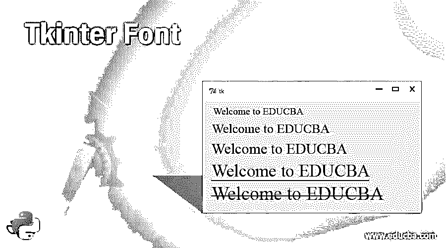
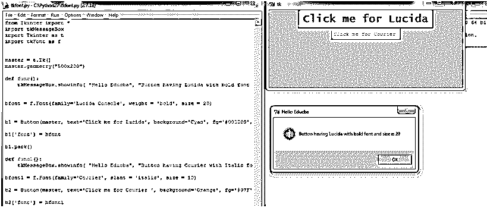

# tkinter font-tkinter 字体

> 原文：<https://www.educba.com/tkinter-font/>




## Tkinter 字体介绍

在 Python 中，Tkinter 字体被定义为用于样式化文本或显示文本的小部件，其中有许多不同的样式、大小或任何字样变化，包括以文本字体的正常、斜体或粗体形式显示文本。一般来说，我们可以将 Tkinter 字体定义为一个小部件，它具有测试中显示的或可以打印的每个字符的所有属性和字体属性的组合，如大小、粗细、风格和斜度，并且该字体小部件不仅可以应用于字符或字母，还可以应用于数字、符号、特殊字符、标点符号等。

### Tkinter 字体在 Python 中是如何工作的？

在本文中，我们将讨论 Tkinter 字体小部件样式，它被定义为样式化文本的字体，这是非常常用于设计网页中文本的字体。在 Python 中，Tkinter 是一个用于设计网页的 GUI 库，它提供了各种小部件来设计这样的网页，其中之一是可以应用于文本、按钮、标题等的字体。在本文中，我们将看到如何在 Tkinter 中定义这个字体属性，并看到字体的所有属性，然后我们必须看到 Tkinter 支持的字体构造函数，它支持字体的各种样式选项。

<small>网页开发、编程语言、软件测试&其他</small>

### 构造器

提供不同样式选项的字体构造函数如下:

字体粗细和字体倾斜属于字体构造器中的粗细和倾斜样式选项，用于通过使用诸如 normal 的值来指定字体粗细，对于 normal 是默认值，给出粗体值，而对于字体倾斜，包括将 normal 作为默认值的 normal 和 italic 值。

**1。字体系列:**也支持定义不同的字体样式，如“Times New Roman”、“Courier”、“Helvetica”等。是开发人员广泛使用的一些字体系列。

**2。字体大小:**这是为网页样式定义文本或字符大小的另一个选项，这些字体的大小以整数点为单位。还有另一种使用像素来声明字体大小的方法，该方法使用负值。

**3。字体下划线属性:**用于隐藏所选文本的文本或字体，它使用 0 和 1 值来指定该属性，例如 0 是默认值，字体没有下划线，如果我们指定 1，则显示文本将加下划线。

**4。字体删除选项:**这是字体的不同选项之一，允许我们对选中的文本进行删除。在这种情况下，它也需要一个布尔值，表示 1 为真，则在文本上绘制一条线，如果为假，则在文本上不绘制线，0 是默认值。

在 Python Tkinter 中，有一个单独的模块用于使用 tkFont 模块定义 Font 类，该模块为我们提供了一种简单的方法来使用 font 类，其中有定义为 font 类的选项或参数的 font 构造函数，要使用该模块，我们需要首先导入该模块。现在让我们看看如何使用 tkFont 模块声明 font 类的语法。

首先，我们需要导入 tkFont，如下所示:

```
import tkFont
```

现在，我们可以通过将字体类赋给变量来声明字体类，语法如下所示:

```
f = tkFont.Font(arguments)
```

这里的自变量可以是上面定义的相同的字体构造器选项，并且使用 tkFont 模块的 font 类来定义字体方法，例如 cget()用于检索 font 的属性，config(* *自变量或选项)该方法用于定制字体的属性，copy()方法用于返回当前字体的新实例，families()返回不同类型的字体族，names()返回定义的字体名称，等等。这种 Tkinter 字体可用于改变标签、按钮等的字体。现在，在下面的部分，让我们看看几个 Tkinter 字体的例子。

### 例子

现在首先让我们看一个简单的例子，说明如何在按钮或标签名称上使用 font 类，这个例子是由 tkFont 模块提供的。

```
from Tkinter import *
import tkMessageBox
import Tkinter as t
import tkFont as f
master = t.Tk()
master.geometry("500x200")
def func():
    tkMessageBox.showinfo( "Hello Educba", "Button having Lucida with bold font and size is 20")
bfont = f.Font(family='Lucida Console', weight = 'bold', size = 20)
b1 = Button(master, text='Click me for Lucida', background='Cyan', fg='#000000', command = func)
b1['font'] = bfont
b1.pack()
def func1():
    tkMessageBox.showinfo( "Hello Educba", "Button having Courier with Italic font and size is 10")    
bfont1 = f.Font(family='Courier', slant = 'italic', size = 10)
b2 = Button(master, text='Click me for Courier ', background='Orange', fg='#07F', command = func1)
b2['font'] = bfont1
b2.pack()
master.mainloop() 
```

**输出:**




在上面的程序中，我们使用 Tkinter 和 tkFont 模块编写了一个 Python 程序，用于使用 tkFont 模块设计具有不同字体样式的网页。我们必须首先导入 Tkinter 和 tkFont 模块，然后定义放置小部件的父窗口，比如上面代码中的按钮。因此，我们给出了两个按钮，它们的按钮名称或文本采用不同的字体构造器选项，例如 font-family: Lucida，宽度为“粗体”,按钮 1 的大小为 20，倾斜为“斜体”,按钮 2 中使用的字体系列为 courier，文本将为斜体，大小为 10。在上面的程序中，当我们单击按钮时，会弹出一个消息框，但它具有默认的字体设置，因为我们没有自定义。

### 结论

在本文中，我们得出结论，Python 中的 Tkinter 有各种各样的小部件，后跟用于样式化它们的属性，我们在本文中讨论的一个这样的小部件是用于定义文本大小、粗细和外观或样式的字体。在本文中，我们看到了各种字体构造函数选项，这些选项对于 tkFont 模块的参数也是相同的，tk font 模块提供了各种字体类来设置文本的字体样式。在本文中，我们看到了一个演示 Tkinter 字体属性的例子。

### 推荐文章

这是一个 Tkinter 字体的指南。在这里，我们讨论了 Tkinter 字体的定义和工作方式，以及示例和代码实现。您也可以看看以下文章，了解更多信息–

1.  [标签帧间](https://www.educba.com/tkinter-labelframe/)
2.  tkinter menu
3.  [Tkinter 列表框](https://www.educba.com/tkinter-listbox/)
4.  [Tkinter 旋转盒](https://www.educba.com/tkinter-spinbox/)