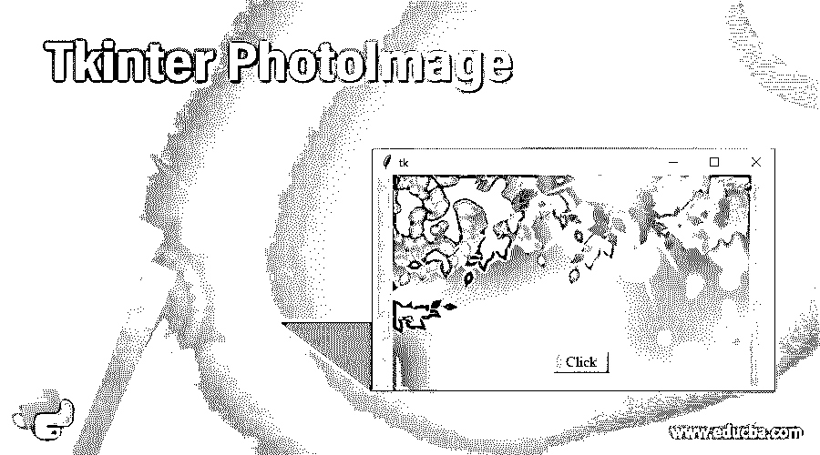
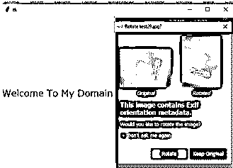
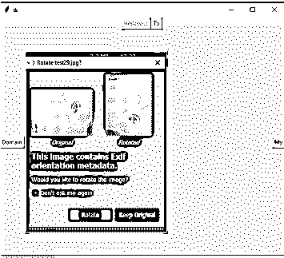
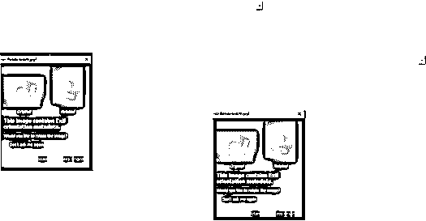

# tkinter photo image(tkinter 照片间映像)

> 原文：<https://www.educba.com/tkinter-photoimage/>




## tkinter 照片图像介绍

Tkinter Photoimage 是一种内置方法，用于在应用程序中添加用户定义的图像。它也是通常调用参数文件的关键字，它存储在我们可以使用数据参数类型的路径中。它还必须用于字节数据类型对象。它包含图像数据。使用 photoimage 方法。图像有参数，该参数用于其他小部件(如标签)需要的任何地方，但如果它的实例可以在其他小部件中调用和利用，则有帮助。

**语法:**

<small>网页开发、编程语言、软件测试&其他</small>

Tkinter 最强大的基于 GUI 的小部件，它拥有 python 编程语言中最先进的库方法。它有 n 种方法，已在全球范围内使用，包括图像和动画，因此 photoimage()是默认方法之一，它可以直接用于特定需求小部件，这些函数将调用其他小部件区域的任何需要的地方。它有自己的语法和默认参数。

```
from tkinter import * //import all the library of the tkinter module
from PIL import Image, ImageTk
variable name=Tk()
variable name=PhotoImage(file="")
variable name.mainloop()
```

上述代码是在 tkinter 库中创建几何函数的基本算法，这些模块将利用所有其他小部件来使桌面应用程序更加安全和强大。

### 在 Tkinter 中 Photoimage 是如何工作的？

Tkinter 包有一组内置函数，用于覆盖桌面和 web 应用程序中的 UI 部分。它有更多的互动和先进的库脚本，它可以计算实时世界中的时间，空间功能，即使一些基于人工智能的应用场景，这将涵盖跨部件方法。基本上，我们要装饰的 UI 有文本框、标签、按钮、视图、滚动框等，大部分按钮将是导航网页的 UI 区域。一旦我们点击了这个按钮，它就会执行应用程序逻辑，并在后台工作。我们可以使用文件路径调用 photoimage 方法，该路径可以是任何本地机器 URL 路径。并且这些 photoimage 类已经用于显示的图像，它将是灰度方法或一些其他真彩色图像，这些真彩色图像已经是 gif、jpg 的 base64 编码格式和一些其他图像文件格式。我们也可以在 python 代码中使用这种类型的嵌入式代码，只要它在应用程序小部件区域中需要。我们在代码中使用了一组不同的方法，以及 iframe 等 UI 相关功能的内部，它将覆盖整个窗口框架。每个框架都有一套不同的模式来创建一个正常和复杂的布局屏幕，它形成了一个小组，包括像额外的框架等小工具功能。

当我们使用 photoimage()时，使用 python 图像库(pil)读取图像，这些库将适用于加载图像，并且它是 python 语言中 Pypi 包管理器更需要和可用的模块。这些库必须支持 PPM、PNG、GIF 等文件格式。JPG，JPEG，BMP 等这些格式都包含在库包中，在 UI 小部件如标签的帮助下，这些图像占据了应用程序窗口中的区域。

### 构造器

Tkinter geometry()构造函数有一组默认的参数，这些参数将在整个编程过程中传递给。行和列有一组值，这些参数应该在运行时传递。

```
from Tkinter import *
from PIL import Image, ImageTk
class classname(tk.Tk):
def _init_(variable name,first arguments,second arguments)
variable name= ImageTk.PhotoImage(fileurl)
```

上面的代码将用于创建和传递文件中的参数 image 和这些 PhotoImage 构造函数，它帮助创建对象和它需要调用的其他默认方法，它需要更多的演示和定制的图像。

### 方法

我们已经在前面的段落中讨论了 photoimage()方法及其默认行为和属性。photoimage 函数将使用 PIL 软件包获得方法，与其他软件包相比，这些软件包将更加用户友好。这些包管理器总是使用一些默认选项，比如填充、侧边、扩展等。这些选项将用于控制窗口屏幕中的照片图像。

```
variable name=PhotoImage(file=””)
variable name.pack(fill=BOTH,expand=2)
```

### tkinter 照片图像示例

让我们讨论一下照片图像的例子。

#### 示例#1

**代码:**

```
from tkinter import *
from tkinter.ttk import *
first = Tk()
Label(first, text = 'Welcome To My Domain', font =(
'Verdana', 17)).pack(side = LEFT, pady = 11)
imge = PhotoImage(file = r"C:\Users\Kripya-PC\Downloads\MicrosoftTeams-image (11).png")
Button(first, text = 'Have a Nice Day !', image = imge).pack(side = LEFT)
mainloop()
```

**输出:**




#### 实施例 2

**代码:**

```
from tkinter import *  
import tkinter as tk
from tkinter import ttk
first = Tk()  
first.geometry("132x110")  
frm = Frame(first)  
frm.pack()  
frm1 = Frame(first)  
frm1.pack(side = RIGHT)  
frm2 = Frame(first)  
frm2.pack(side = LEFT)  

butn = Button(frm, text="Welcome", fg="pink",activebackground = "green")  
butn.pack(side = LEFT)  

butn1 = Button(frm, text="To", fg="orange", activebackground = "red")  
butn1.pack(side = RIGHT)  

butn2 = Button(frm1, text="My", fg="green", activebackground = "violet")  
butn2.pack(side = RIGHT)  

butn3 = Button(frm2, text="Domain", fg="blue", activebackground = "yellow")  
butn3.pack(side = LEFT)  
comb = tk.Label(first,
                    text = "Welcome Back",background = 'pink', foreground ="pink",  
          font = ("Times New Roman", 17))
result = Button(first, text = "Have a Nice Day")
example = ttk.Combobox(first, 
                            values=[
                                    "first", 
                                    "second",
                                    "third",
                                    "four"])
imge = PhotoImage(file = r"C:\Users\Kripya-PC\Downloads\MicrosoftTeams-image (11).png") 
Button(first, text = 'Have a Nice Day !', image = imge).pack(side = LEFT)              

first.mainloop()
```

**输出:**




#### 实施例 3

**代码:**

```
from tkinter import *  
import tkinter as tk
from tkinter import ttk
first = Tk()  
first.geometry("132x110")  
frm = Frame(first)  
frm.pack()  
frm1 = Frame(first)  
frm1.pack(side = RIGHT)  
frm2 = Frame(first)  
frm2.pack(side = LEFT)   
imge = PhotoImage(file = r"C:\Users\Kripya-PC\Downloads\MicrosoftTeams-image (11).png") 
Button(first, text = 'Have a Nice Day !', image = imge).pack(side = LEFT) 
labels=Label(first, image=imge, width=320, height=350)
labels.pack(side=BOTTOM)

btn1=Button(first, text=" +" )
btn1.pack(side=TOP)

btn2=Button(first, text=" - ")
btn2.pack(side=RIGHT)                                  

first.mainloop() 
```

**输出:**




### 结论

Photoimage 方法有默认模式类，可以读取所有类型的图像格式文件。并且这些文件将图像转换成具有机器可读格式的二进制源代码。图像库将包括 python 库中已定义的所有受支持的类。

### 推荐文章

这是 Tkinter PhotoImage 的指南。这里我们讨论 Tkinter PhotoImage 的介绍，如何使用 PhotoImage 的示例代码以便更好地理解。您也可以看看以下文章，了解更多信息–

1.  之后的 [Tkinter](https://www.educba.com/tkinter-after/)
2.  [Python Tkinter 条目](https://www.educba.com/python-tkinter-entry/)
3.  tkinter grid
4.  [Tkinter 组合框](https://www.educba.com/tkinter-combobox/)