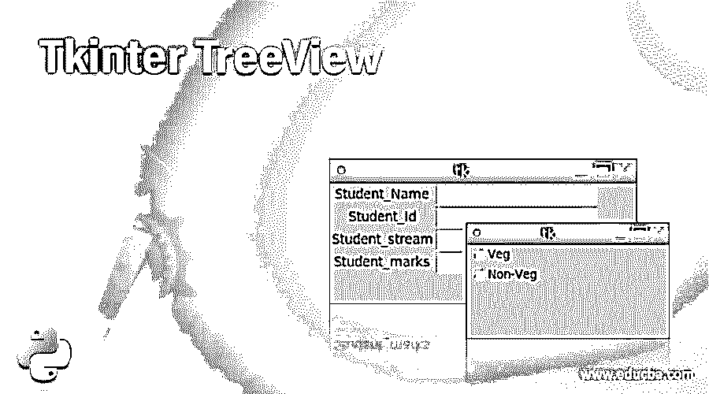
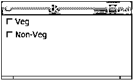
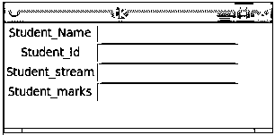
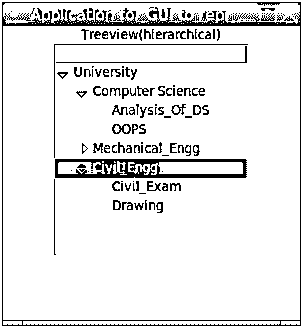

# Tkinter 树视图

> 原文：<https://www.educba.com/tkinter-treeview/>




## Tkinter 树视图的定义

Tkinter Treeview 是 python 中的一个模块，用于为 python 开发者构建一些有吸引力的 GUI(图形用户界面)。Tkinter Treeview 是 python 中专门用于设计用户界面的标准库之一，它为 web 开发人员提供了这个基于 tk 的工具包。Tkinter Treeview 由 GUI 工具包 tk 组成，该工具包为程序员提供了一种面向对象的方法，使其可以作为开发的一部分。它由许多其他控件和小部件组成，如文本框、按钮、滚动条等。结合一些管理方法来组织这些部件。

**语法:**

<small>网页开发、编程语言、软件测试&其他</small>

```
w = Entry( _master, _options, ... )
```

*   **_master:** 该参数代表 Tkinter Treeview 模块中的父窗口。
*   **_options:** 许多常用方法的列表出现在模块中，只要选择了列表中的一个可用选项，就可以使用该模块。

**方法列表**

*   获取()
*   索引
*   索引(索引)
*   插入(索引，s)
*   select_clear()
*   select_adjust(索引)
*   select_present()
*   select_from(索引)
*   select_range(开始，结束)
*   xview _ scroll(数字，什么)
*   视图(索引)
*   删除(名字，姓氏=无)

**选项列表**

*   弹底引信（base detonating 的缩写）
*   锥齿轮
*   光标
*   命令
*   导出选择
*   字体
*   高亮颜色
*   细粒
*   证明合法
*   选择背景
*   减轻
*   选择前景
*   选择边框宽度
*   文本变量

### 如何在 Tkinter 中创建 TreeView？

在 Tkinter 中创建树形视图的列表和方法中有许多选项，并且大量用于创建有吸引力的和增强的 GUI(图形用户界面)。呈现的模块负责使用 tk GUI 工具包中的各种选项和方法创建用户界面，当导入时，它为 python web 开发人员提供了很多帮助。让我们看看如何使用 Tkinter 创建一个 Treeview 来开发任何特定类型的应用程序:

*   如前所述，Tkinter 模块起着关键作用，因此非常需要导入 Tkinter 模块来启动与该应用程序相关的其他应用程序。
*   按照语法中描述和提到的那样创建主窗口，它的行为就像一个容器，意味着这个主窗口将驻留在这个容器中。
*   因为主窗口作为父窗口，所以可以添加任意数量的小部件。
*   此外，该窗口小部件将包括选项列表，该列表需要被触发并应用于窗口小部件，以提供任何窗口小部件选项来执行所需的操作。
*   尽管如此，还有两个最重要的方法，它们是执行与 python 相关的任何操作以创建 web GUI(图形用户界面)的指令。
*   这两种方法包括 **:**

**#表示为**的 tk 的创建

Tk(screenName=None，baseName=None，className='Tk '，useTk=1)，用于创建包含所有这些参数的窗口，随后是主循环。

如何创建该方法是主要问题，通过使用父主窗口的名称调用任何类来使用该方法，例如:

o = tkinter。Tk()，其中 o 代表主窗口的名称。

**#主回路()**

当应用程序准备运行时使用该方法，该方法是一个无限循环，用于运行应用程序，然后等待应用程序，然后处理整个事件，直到它没有关闭。

Tkinter 还有一个更有趣的特性，在这个特性中，工具包提供了对窗口小部件几何配置数量的访问，这些几何配置用于在父窗口的整个容器中排列和组织窗口小部件的各种原因。主要有三个几何管理器类，包括与几何方向相关的方法，如下所示:

*   打包方法()
*   Place 方法()
*   网格方法()

有许多选项列表用于创建小部件，然后用其方向来组织小部件，以增强 Tkinter Treeview 的视图和可见性。因此，Tkinter treeview 及其所有特性都非常有希望使整个视图成为 web 开发的一部分。

### Tkinter TreeView 示例

让我们讨论 Tkinter TreeView 的例子。

#### 示例#1

该程序用于演示 Tkinter 模块导入和使用窗口中的选项。与给定程序一样，使用 Checkbutton 作为选项列表的一部分，在 veg 和非 Veg 之间选择选项，如输出所示。

**代码:**

```
from tkinter import *
ms = Tk()
vr_1 = IntVar()
Checkbutton(ms, text='Veg', variable=vr_1).grid(row=0, sticky=W)
vr_2 = IntVar()
Checkbutton(ms, text='Non-Veg', variable=vr_2).grid(row=1, sticky=W)
mainloop()
```

**输出:**




#### 实施例 2

这个程序演示了一个小部件的使用，其中用户使用输入文本来创建学生的详细信息，用户使用这些信息在一行中输入文本，然后使用多行文本输入来创建小部件。有了这个批次，可以很容易地创建许多选项，如输出所示。

**代码:**

```
from tkinter import *
ms = Tk()
Label(ms, text='Student_Name').grid(row=0)
Label(ms, text='Student_Id').grid(row=1)
Label(ms, text='Student_stream').grid(row=2)
Label(ms, text='Student_marks').grid(row=3)
o1 = Entry(ms)
o2 = Entry(ms)
o3 = Entry(ms)
o4 = Entry(ms)
o1.grid(row=0, column=1)
o2.grid(row=1, column=1)
o3.grid(row=2, column=1)
o4.grid(row=3, column=1)
mainloop()
```

**输出:**




#### 实施例 3

这个程序是用来演示 Tkinter 层次树视图通过一所大学和各种选项来选择相应的从列表中显示的输出。

**代码:**

```
from tkinter import *
from tkinter import ttk
appln = Tk()
appln.title("Application for GUI to represent the University ")
ttk.Label(appln, text ="Treeview(hierarchical)").pack()
treeview = ttk.Treeview(appln)
treeview.pack()
treeview.insert('', '0', 'i1', text ='University')
treeview.insert('', '1', 'i2', text ='Computer Science')
treeview.insert('', '2', 'i3', text ='Mechanical_Engg')
treeview.insert('', 'end', 'i4', text ='Civil_Engg')
treeview.insert('i2', 'end', 'Analysis_Of_DS', text ='Analysis_Of_DS')
treeview.insert('i2', 'end', 'OOPS', text ='OOPS')
treeview.insert('i3', 'end', 'Mech_Exam', text ='Mech_Exam')
treeview.insert('i3', 'end', 'CAD', text ='CAD')
treeview.insert('i4', 'end', 'Civil_Exam', text ='Civil_Exam')
treeview.insert('i4', 'end', 'Drawing', text ='Drawing')
treeview.move('i2', 'i1', 'end')
treeview.move('i3', 'i1', 'end')
treeview.move('i4', 'i1', 'end')
appln.mainloop()
```

**输出:**




### 结论

Tkinter Treeview 是 python 中一个非常有用的标准库，用于创建一个非常增强的 GUI[图形用户界面],其功能可以帮助程序员无缝地操作和执行 UI 相关的操作。它有助于为最终用户提供一个用户友好、灵活和多功能的用户界面来工作和协作。

### 推荐文章

这是 Tkinter TreeView 的指南。这里我们讨论 Tkinter TreeView 的定义，如何使用 Tkinter TreeView 以及示例代码以便更好地理解。您也可以看看以下文章，了解更多信息–

1.  之后的 [Tkinter](https://www.educba.com/tkinter-after/)
2.  tkinter menu button
3.  [Tkinter Widgets](https://www.educba.com/tkinter-widgets/)
4.  [Tkinter 滚动条](https://www.educba.com/tkinter-scrollbar/)