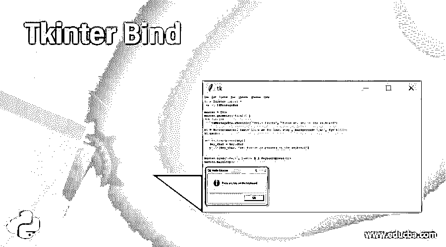
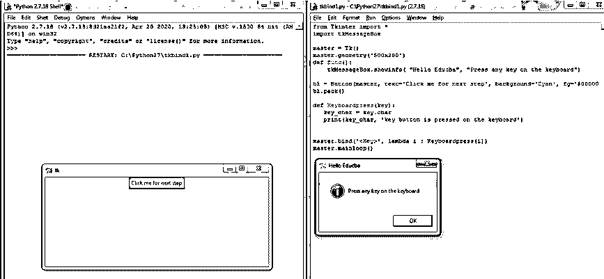
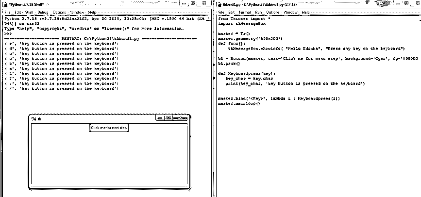

# tkinter bind(tkinter bind)连结

> 原文：<https://www.educba.com/tkinter-bind/>




## Tkinter 绑定简介

在 Tkinter 中，bind 被定义为用于绑定事件的 Tkinter 函数，这些事件可能通过启动在程序中编写的代码而发生，并且为了处理在程序中发生的这种事件，由 binding 函数来处理，其中 Python 提供了被称为 bind()的绑定函数，它可以将任何 Python 方法和函数绑定到事件。因此，一般来说，Tkinter 绑定被定义为用于处理 Python 的函数和方法的函数，这些函数和方法被绑定到在程序执行期间发生的事件，例如使用鼠标移动光标、点击鼠标按钮、点击键盘上的按钮等，这些都是使用 Tkinter 中的绑定函数处理的事件。

### 在 Python 中使用 Tkinter 绑定

在本文中，我们将讨论 Tkinter 绑定函数，它通常用于将任何 Python 函数和方法绑定到通过启动开箱即用程序或程序范围而发生的事件或操作，这样的操作可以由一小段代码来处理，这段代码就是 Tkinter 中的绑定函数。在 Tkinter 中，通常用于设计 web 应用程序或桌面应用程序，其中创建了不同的事件，例如从一个页面导航到另一个页面、单击一个链接并转到另一个页面等，所有这些事件都可以通过使用绑定函数 bind()来处理，我们可以将 Python 的任何函数绑定到这些事件来正确处理这些事件，然后这些函数又可以与 Tkinter 模块提供的任何小部件绑定。因此，事件处理不仅仅是通过我们已经使用过的 bind()函数来完成的，或者在使用按钮小部件时看到的，在点击按钮小部件时，我们会得到一些已经写在按钮小部件的命令选项中的消息。同样，bind 函数用于处理用户通过系统发生的一些其他事件。一些常见的事件如单击鼠标按钮、按下键盘上的任何按钮等。

<small>网页开发、编程语言、软件测试&其他</small>

在本文中，让我们看几个使用 bind 函数处理一些系统事件的例子，比如鼠标点击、键盘按键输入或按压。首先，我们将看到一个语法，其中提供的每个小部件都可以用 Python 方法绑定，这可以使用 bind()函数实现。

**语法:**

```
widget.bind(event, handler)
```

**参数:**

*   **事件:**该参数用于定义事件，以便使用处理函数进行处理。例如聚焦、输入、按键等
*   **handler:** 该参数用于定义 handler 函数，使其能够描述使用事件对象发生的事件，该事件对象与 handler 函数一起被调用，例如使用 x 轴和 y 轴的像素、鼠标按钮数等来确定鼠标位置。

因此，使用上述语法，我们可以通过一个非常简单的过程将一个事件绑定到一个函数，即如果任何事件(如单击鼠标或键盘按钮)发生，将自动触发语法中定义的处理函数，假设如果事件参数未给定或隐藏在函数中，则有可能会出现一个称为 TypeError 的错误。Tkinter 提供了其他已定义的事件，如<destroy>事件，当定义或指定或绑定任何小部件时，小部件就会被销毁，因此在 Tkinter 模块本身中可以看到许多这样的事件。</destroy>

现在让我们看一个如何通过将事件附加到小部件来使用 bind 函数的例子。在下面的例子中，我们将看到一个键盘按钮，随着被按下的键一起显示。

### 例子

**代码:**

```
from Tkinter import *
import tkMessageBox
master = Tk()
master.geometry('500x200') 
def func():
    tkMessageBox.showinfo( "Hello Educba", "Press any key on the keyboard")    
b1 = Button( master, text='Click me for next step', background = 'Cyan', fg = '#000000', command = func)
b1.pack()
def Keyboardpress( key):
   key_char = key.char
   print( key_char, 'key button is pressed on the keyboard')
master.bind( '', lambda i : Keyboardpress(i))
master.mainloop()
```







在上面的程序中，我们看到了一个简单的代码，用于查看键盘上按下的键，这个事件<key>与 Python 函数绑定，我们在这个程序中定义的函数是“Keyboardpress()”，当这个事件发生时，当我们在键盘上键入或按下任何键时，它会自动打印您在输出屏幕上键入的键名，如上面的屏幕截图所示。在上面的代码中，我们还看到了按钮小部件通过在函数中指定要执行的操作来调用事件，该函数被定义为按钮小部件中命令选项的值。因此，我们首先可以在上面看到，当我们运行程序时，它将显示一个名为“单击我进行下一步”的按钮，因此当我们单击该按钮时，会生成一个事件，并且通过处理该事件来触发命令选项中定义的功能，该事件显示一条消息，提示“按下键盘上的任意键”。然后，按下任意键也是一个事件<key>，我们将该事件与程序中定义的函数绑定，以显示键盘上按下的字符，这是通过使用 bind()函数完成的。</key></key>

因此，有许多这样的事件，如<destroy>销毁窗口小部件、<configure>根据父窗口设置窗口显示、<key>按下键盘上的键、<enter>按下键盘上的回车键等。这些事件都可以和我们在程序中定义的函数绑定，并处理这些事件。</enter></key></configure></destroy>

### 结论

在本文中，我们得出结论，Tkinter bind 是一个绑定函数，用于将任何事件绑定到 Python 函数或程序中定义的处理此类事件的方法。在本文中，我们看到了如何使用既包含事件名称又包含函数名称的处理程序的语法来定义 bind()函数。在本文中，我们还看到了一个简单的例子，按下键盘上的任何键都是一个事件，所按下的键的名称显示在输出屏幕上。

### 推荐文章

这是一个 Tkinter 绑定的指南。在这里，我们讨论 Tkinter Bind 的介绍和工作方式，以及一个示例和代码实现。您也可以看看以下文章，了解更多信息–

1.  [Tkinter 组合框](https://www.educba.com/tkinter-combobox/)
2.  tkinter font
3.  [t 中间颜色](https://www.educba.com/tkinter-colors/)
4.  tkinter menu button