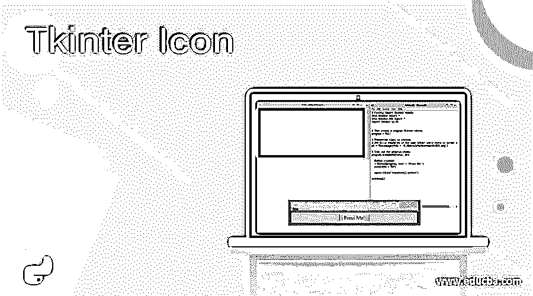
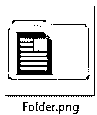
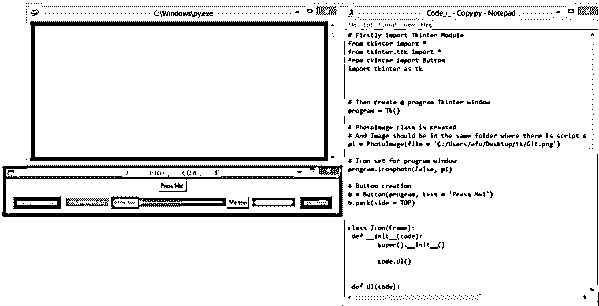
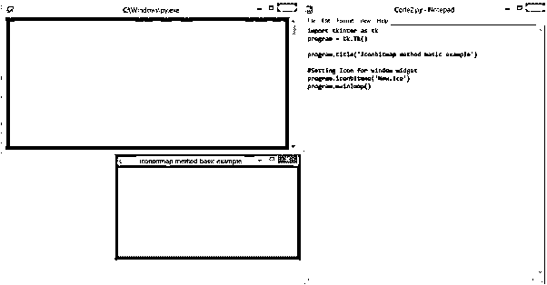
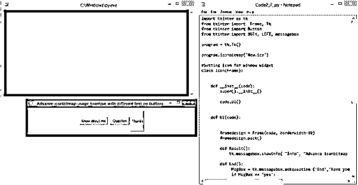
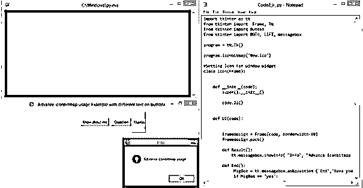
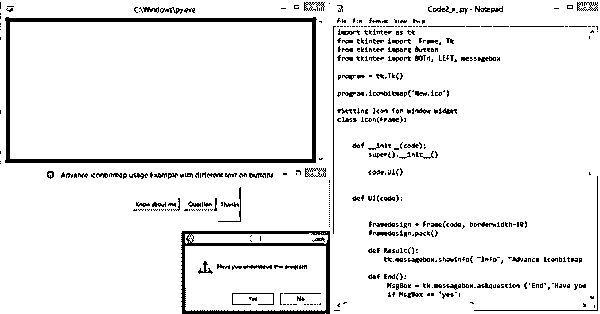
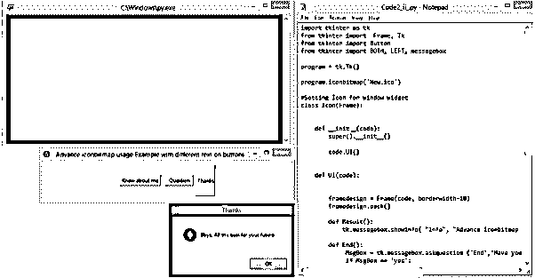
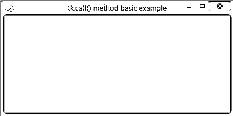
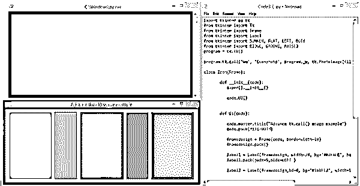

# tkinter icon-tkinter 图示

> 原文：<https://www.educba.com/tkinter-icon/>




## Tkinter 图标介绍

Python 有不同的库，用于不同的目的。Tkinter 就是这样一个库，它是 Python 中用于创建图形用户界面的库。Tkinter 是用 Python 创建图形用户界面最简单快捷的方法，它还为 Tk GUI 工具包提供了一个面向对象的接口，功能非常强大。Tkinter icon 是一种在 Tkinter 创建的不同窗口上放置自定义图标的方式。这是创建图形用户界面最重要的部分之一。本文介绍了 Tkinter 图标的不同方法，以及如何在 GUI 的不同方面使用它。

**语法:**

<small>网页开发、编程语言、软件测试&其他</small>

*   **Iconphoto()方法**

```
iconphoto(self, default = False, *args)
```

*   **图标位图方法**

```
program.iconbitmap('<image path>')
```

*   **调用()方法**

```
program.tk.call('wm','iconphoto',program._w,tk.PhotoImage(file=’<image path>'))
```

### Tkinter 图标的方法

让我们用例子来讨论方法及其工作原理:

#### 1.Iconphoto()方法

此方法用于将标题栏图标放置在任何顶级窗口上。要将图像设置为图标，图像需要是 PhotoImage 类的对象。

示例[i]和示例[ii]中使用的图像-


示例[iii]中使用的图像-




**【我】基本 Iconphoto()用法举例**

这是一个基本的例子，创建一个顶层窗口，并把一个图像作为它的图标。这里，图像已经成为 PhotoImage 类的对象，它与 iconphoto 一起使用，将图像设置为图标。

**代码:**

```
# Firstly import Tkinter Module 
from tkinter import * 
from tkinter.ttk import *
import tkinter as tk
# Then create a program Tkinter window
program = Tk()   
# Photoimage class is created
# And Image should be in the same folder where there is script saved 
p1 = PhotoImage(file = 'C:/Users/afu/Desktop/tk/Git.png')   
# Icon set for program window
program.iconphoto(False, p1)   
# Button creation
b = Button(program, text = 'Press Me!') 
b.pack(side = TOP) 
program.title('iconphoto() method')
mainloop() 
```

**输出:**

**T2】**


 **


**【ii】高级 Iconphoto()使用示例**

此示例是上一示例中创建的窗口的更高级版本。这里的窗口包含按钮，它有一个背景颜色和一个活动的背景颜色。除了按钮，还有彩色标签。设置图标的方法是 iconphoto，它的使用方法和前面的例子一样。

**代码:**

```
# Firstly import Tkinter Module 
from tkinter import * 
from tkinter.ttk import *
from tkinter import Button
import tkinter as tk
# Then create a program Tkinter window
program = Tk()   
# Photoimage class is created
# And Image should be in the same folder where there is script saved 
p1 = PhotoImage(file = 'C:/Users/afu/Desktop/tk/Git.png')   
# Icon set for program window
program.iconphoto(False, p1)   
# Button creation
b = Button(program, text = 'Press Me!') 
b.pack(side = TOP) 
class Icon(Frame):
 def __init__(code):
        super().__init__()
        code.UI()
 def UI(code):    
        framedesign = Frame(code, borderwidth=10)
        framedesign.pack()
        button1 = Button(framedesign, activebackground = 'SlateGray3',  text='Change my color', bg = 'red')
        button1.pack(padx=5, side=LEFT)        
        label1 = Label(framedesign, background='SlateGray3', width = 15)
        label1.pack(padx=5, side=LEFT)
        button2 = Button(framedesign, text='Mine too',background='blue', activebackground = 'SlateGray3')
        button2.pack(side=LEFT)        
        label2 = Label(framedesign, background='SlateGray4',width = 15)
        label2.pack(side=LEFT)
        button3 = Button(framedesign, text='I am Green', background='crimson', activebackground = 'DarkSeaGreen3' )
        button3.pack(side=RIGHT, padx=5)
        label3 = Label(framedesign, background='DarkSeaGreen3',width = 15)
        label3.pack(side=RIGHT, padx=5)        
        button4 = Button(framedesign, text='Me too', background='pink',activebackground = 'DarkSeaGreen4')
        button4.pack(side=RIGHT)
        label4 = Label(framedesign, background='DarkSeaGreen4', width = 15)
        label4.pack(side=RIGHT)
        code.master.title("Advance iconphoto() method'")
        code.pack(fill=BOTH)
        code.pack()
app = Icon()
program.mainloop()
```

**输出:**




**

** 

**[iii]使用多种字体的文本的高级 Iconphoto()用法示例**

这个例子展示了一个创建窗口的方法，这个窗口使用 icon photo 来设置一个图像作为它的图标，同时它也展示了一个在窗口中设置不同字体的方法。

**代码**:

```
import tkinter as tk
from tkinter import Tk
from tkinter import BOTH
from tkinter.ttk import Frame
from tkinter.ttk import Label , Style
from tkinter.ttk import Notebook
program = tk.Tk()
program.iconphoto(False, tk.PhotoImage(file='C:/Users/afu/Desktop/tk/Folder.png'))
from tkinter.font import Font
class Icon(Frame):
    def __init__(code):
        super().__init__()
        code.UI()
    def UI(code):
        code.master.title("program.iconphoto method example")
        code.pack(fill=BOTH, expand=True)
        text = "This example if for creating an icon "
        text1 = 'using program.iconphoto'
        text2 = 'Hope you like it'
        thefont = Font(family="Arial", size=16)
        label1 = Label(code, text=text, font=thefont)
        label1.grid(row=0, column=0)
        label2 = Label(code, text=text1, font="Times")
        label2.grid(row=1, column=0)
        label3 = Label(code, text=text2, font=('Courier', '18', 'bold'))
        label3.grid(row=2, column=0)
app = Icon()
program.mainloop()
```

**输出:**

**T2】**


 **


#### 2.图标位图方法

Iconbitmap 用于将窗口或框架的图标设置为位图。要使用此方法，位图图像应该是带有。ico 作为它的延伸。

示例[i]和示例[ii]中使用的图像-


**[i]基本图标位图使用示例**

这是一个创建窗口的基本例子，在这个窗口中使用 iconbitmap 设置了图标。图像是。ico 扩展，你可以看到，这是强制性的使用图标类型的图像在这种方法。

**代码:**

```
import tkinter as tk
program = tk.Tk()
program.title('iconbitmap method basic example')
#Setting Icon for window widget
program.iconbitmap('New.ico')
program.mainloop()
```

**输出:**




**【ii】高级图标位图使用示例，按下按钮时显示不同的消息**

这个例子向我们展示了如何创建一个以位图图像为图标的窗口，当按钮被按下时显示消息或询问问题。这个例子还解释了如何让窗口对问题和消息做出更好的响应。

**代码:**

```
import tkinter as tk
from tkinter import Frame, Tk
from tkinter import Button
from tkinter import LEFT, messagebox
from tkinter import BOTH 
program = tk.Tk()
program.iconbitmap('New.ico')
#Setting Icon for window widget
class Icon(Frame):    
    def __init__(code):
        super().__init__()
        code.UI()
    def UI(code):   
        framedesign = Frame(code, borderwidth=10)
        framedesign.pack()

        def Result():
            tk.messagebox.showinfo( "Info", "Advance iconbitmap usage")
        def End():
             MsgBox = tk.messagebox.askquestion ('End','Have you understood this program',icon = 'warning')
             if MsgBox == 'yes':
                  program.destroy()
             else:
                  tk.messagebox.showinfo('Return','Check our courses on Python on EduCBA')
        def Thanks():
            tk.messagebox.showinfo( "Thanks", "Bbye, All the best for your future")
        button1 = tk.Button(framedesign, text='Know about me', command = Result, activebackground = 'Cyan')
        button1.pack(padx=5,side=LEFT)
        button2 = Button(framedesign, text='Question', width=8, command = End, activebackground = 'Cyan')
        button2.pack(padx=5, side=LEFT)
        button3 = Button(framedesign, text='Thanks', width=5, height=4, command = Thanks, activebackground = 'Cyan')
        button3.pack(side=LEFT)
        code.master.title("Advance iconbitmap usage Example with different text on buttons")
        code.pack(fill=BOTH)
        code.pack()
app = Icon()
program.mainloop()
```

**输出:**

*   **代码执行时**




*   **点击“了解我”按钮时**

*

* 

*   **点击“提问”按钮时**




*   **按下“感谢”按钮时**




*   **窗口**

**T2】**


 **#### 3.tk.call()方法

这个方法是 Tkinter 到 tcl 解释器的一个接口。可以使用此方法运行 tcl 命令。图像被设置为 tk.PhotoImagetk.call。

示例[i]和示例[ii]中使用的图像-


**【I】基础 tk.call()使用示例**

这个例子展示了 tk.call 方法的使用。这里的图像与 tk.PhotoImage 一起使用。

**代码:**

```
import tkinter as tk
program = tk.Tk()
program.title('tk.call() method basic example')
program.tk.call('wm', 'iconphoto', program._w, tk.PhotoImage(file='C:/Users/afu/Desktop/tk/dino.png'))
program.mainloop()
```

**输出:**

**T2】**


 **


****【ii】Advance tk . call()用法举例****

 **这个例子展示了一种使上一个例子中使用的窗口更加高级的方法，并且使用 tk.call 来设置它的标题图标。这个例子设置了一个图像作为窗口的图标，并解释了如何用不同的背景颜色，宽度，高度，填充来放置标签。

**代码:**

```
import tkinter as tk
from tkinter import Tk
from tkinter import Frame 
from tkinter import Label
from tkinter import SUNKEN, LEFT 
from tkinter import FLAT, BOTH 
from tkinter import RIDGE, RAISED
from tkinter import GROOVE
program = tk.Tk()
program.tk.call('wm', 'iconphoto', program._w, tk.PhotoImage(file='C:/Users/afu/Desktop/tk/dino.png'))
class Icon(Frame):
       def __init__(code):
          super().__init__()
          code.UI()
       def UI(code):
          code.master.title("Advance tk.call() usage example")
          code.pack(fill=BOTH)
          framedesign = Frame(code, borderwidth=10)
          framedesign.pack()
          label1 = Label(framedesign, width=20,  bg='#02FAFE', height=15, relief=GROOVE)
          label1.pack(padx=5, side=LEFT)
          label2 = Label(framedesign, bd=4,  bg='#16DFE2', width=10,height=15, relief=GROOVE)            
          label2.pack(padx = 5, side=LEFT)
          label3 = Label(framedesign, bd=4, bg='#28A6A8', width=20,height=15, relief=FLAT)            
          label3.pack(padx=5,side=LEFT)
          label4 = Label(framedesign, bd=2,  bg='#2A7778', width=10, height=15, relief=RAISED)       
          label4.pack(padx = 5, side=LEFT)
          label5 = Label(framedesign, bd=3,  bg='#173232', width=20, height=15, relief=RIDGE)            
          label5.pack(padx=5,side=LEFT)
          code.pack()
app = Icon()
program.mainloop()
```

**输出:**




### 结论

根据上面的例子，个人可以理解如何设置图像作为一个窗口的图标。不同的方法和示例以不同的方式描述了将图像设置为图标的过程，并简要介绍了使用 Tkinter 创建 GUI 的不同方面。

### 推荐文章

这是 Tkinter 图标的指南。这里我们讨论 Tkinter 图标的介绍，不同的 Tkinter 图标的方法与例子。您也可以看看以下文章，了解更多信息–

1.  [Tkinter 组合框](https://www.educba.com/tkinter-combobox/)
2.  tkinter font
3.  [t 中间颜色](https://www.educba.com/tkinter-colors/)
4.  [Python Tkinter 条目](https://www.educba.com/python-tkinter-entry/)**********