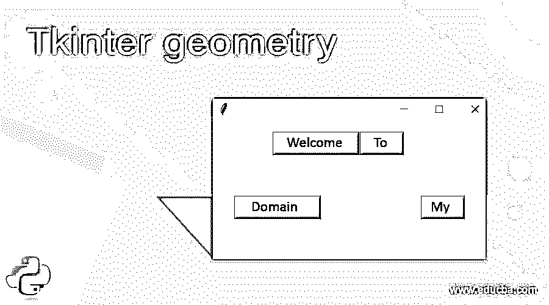
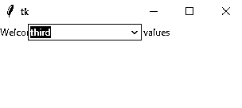
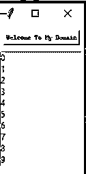
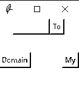

# Tkinter 几何

> 原文：<https://www.educba.com/tkinter-geometry/>




## Tkinter 几何简介

Tkinter geometry 是内置方法之一，用于设置尺寸，而我们使用的 Tkinter widget 窗口主要用于设置应用程序窗口的尺寸长度。它可能是基于桌面的应用程序小部件，这些 geometry()方法也用于基本的基本东西，同时传递一些参数，如窗口的大小和位置，甚至字体及其样式，颜色也用于几何图形的屏幕布局。小部件方法包含一组行和列，将更多地呈现应用程序。

**语法**

<small>网页开发、编程语言、软件测试&其他</small>

Tkinter 最强大的基于 GUI 的小部件，它拥有 python 编程语言中最先进的库方法。它有 n 个方法，已经在全球范围内使用，因此 geometry()也是默认方法之一，可以直接在特定需求小部件中使用，这些函数将在需要时调用。它有自己的语法和默认参数。

```
import webbrowser
from tkinter import * //import all the library of the tkinter module
variable name=Tk()
variable name.geometry(“rows x columns”)
variable name.mainloop()
```

上述代码是在 Tkinter 库中创建几何函数的基本算法，这些模块将利用所有其他小部件来使桌面应用程序更加安全和强大。

### 几何方法在 Tkinter 中是如何工作的？

Tkinter 包有一组内置函数，用于覆盖桌面和 web 应用程序中的 UI 部分。它有更多的互动和先进的库脚本，它可以计算实时世界中的时间，空间功能，即使一些基于人工智能的应用场景，这将涵盖整个小部件方法。基本上，我们要装饰的 UI 有文本框、标签、按钮、视图、滚动框等，大部分按钮将是导航网页的 UI 区域。一旦我们点击了这个按钮，它就会执行应用程序逻辑，并在后台工作。geometry()方法是基于 UI 装饰的小部件方法之一，它将传递应用程序窗口的行和列区域中的参数。geometry()方法有 geometry manager，也称为 pack manager，这些包将是一组预定义的方法，这些方法已经包含在小部件的所有情况中。我们在代码中使用了一组不同的方法，以及 iframe 等 UI 相关功能的内部，它将覆盖整个窗口框架。

每个框架都有一套不同的模式来创建一个正常和复杂的布局屏幕，它形成了一个组，包括像额外的框架等功能。行和列包含一组网格值以及网格管理器中使用的这些值。使用填充选项自动填充小部件中的值是减少不需要的空间的选项之一，它填充空间值，然后显示在屏幕上。如果我们使用这两种方法，它应该涵盖整个行和列将在屏幕上的水平和垂直位置。如果我们使用 Both=X 和 Both=Y，X 表示屏幕的水平布局，Y 表示屏幕的垂直位置。

### 构造器

Tkinter geometry()构造函数有一组默认的参数，这些参数将在整个编程过程中传递给。行和列有一组值，这些参数应该在运行时传递。

类 classname(tk。Tk):

def _init_(变量名，第一个参数，第二个参数)

变量 name.geometry("rows x columns ")我们也可以将这些方法与 GUI 部件一起使用，比如 GUI.geomtery("r x c ")

上述代码将用于创建并传递几何构造函数中的参数，这有助于创建对象并调用其他已定义的方法。

### 方法

我们已经在前面的段落中讨论了 geometry()方法有一个几何管理器，这些包将会更多地与其他包部件进行比较。这些包管理器将使用一些默认选项，如填充、侧边、扩展等。这些选项将用来控制几何方法。

变量 name.geometry("行 x 列")

variable name.pack(fill=X，expand = 2)//示例方法以及几何管理器附带的 pack 方法。

### Tkinter 几何图形的示例

下面举几个例子

#### 示例#1

**代码:**

```
import tkinter as tk
from tkinter import ttk
def demo(events):
print("Please select the new events from the list")
first = tk.Tk()
first.geometry('310x110')
def month():
example["values"] = ["first",
"second",
"third",
"four"
]
lists = tk.Label(first,
text = "Welcome User please select list of values")
lists.grid(column=5, row=5)
example = ttk.Combobox(first,
values=[
"first",
"second",
"third",
"four"],
postcommand=month)
example.grid(column=5, row=5)
first.mainloop()
```

**输出:**




#### 实施例 2

**代码:**

```
from tkinter import *
first = Tk()
first.geometry('120x213')
second = Button(first, text = 'Welcome To My Domain', font =('Courier',7, 'bold'))
second.pack(side = TOP, pady = 8)
lists = Listbox(first)
lists.pack()
for i in range(12):
lists.insert(END, str(i))
mainloop()
```

**输出:**




#### 实施例 3

**代码:**

```
from tkinter import *
import tkinter as tk
from tkinter import ttk
first = Tk()
first.geometry("132x110")
frm = Frame(first)
frm.pack()
frm1 = Frame(first)
frm1.pack(side = RIGHT)
frm2 = Frame(first)
frm2.pack(side = LEFT)
butn = Button(frm, text="Welcome", fg="pink",activebackground = "green")
butn.pack(side = LEFT)
butn1 = Button(frm, text="To", fg="orange", activebackground = "red")
butn1.pack(side = RIGHT)
butn2 = Button(frm1, text="My", fg="green", activebackground = "violet")
butn2.pack(side = RIGHT)
butn3 = Button(frm2, text="Domain", fg="blue", activebackground = "yellow")
butn3.pack(side = LEFT)
comb = tk.Label(first,
text = "Welcome Back",background = 'pink', foreground ="pink",
font = ("Times New Roman", 17))
result = Button(first, text = "Have a Nice Day")
example = ttk.Combobox(first,
values=[
"first",
"second",
"third",
"four"])
first.mainloop()
```

**输出:**




以上三个例子我们在不同的场景中使用了 geometry()方法。当我们在函数中传递参数时，它也利用了其他不同的选项及其用法。这些选项将在几何管理器包下，它将与其他默认小部件一起使用。

### 结论

geometry()方法用于应用程序的基本和高级目的，也与其他 Tkinter 库一起使用，这些库可用于创建不同类型的 GUI 表示以及用户友好的环境。它支持大多数操作系统，并且每当我们在 python 脚本中使用时，这些库都将被导入。

### 推荐文章

这是一本关于几何的指南。在这里，我们讨论几何方法如何在 Tkinter 和示例中工作，以及代码和输出。您也可以看看以下文章，了解更多信息–

1.  [Tkinter 笔记本](https://www.educba.com/tkinter-notebook/)
2.  [t 中间颜色](https://www.educba.com/tkinter-colors/)
3.  tkinter menu
4.  [Tkinter 滚动条](https://www.educba.com/tkinter-scrollbar/)


