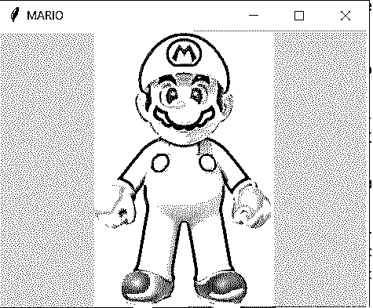
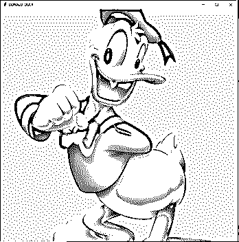

# tkinter image(tkinter image)

> 原文：<https://www.educba.com/tkinter-image/>


## Tkinter 图像介绍

Tkinter 中一个名为 PhotoImage class 的类用于在 Tkinter 中显示灰度图像或真彩色图像。并且这些图像的格式可以是各种类型，包括 png、jpeg、gif、tif、ppm、bmp 等。image.open(要打开的文件)方法用于打开在程序目录和 PhotoImage 类中搜索指定文件的文件，image.open(要打开的文件)方法要工作，必须安装 Python 图像库或 PIL，它允许加载图像，相应的模块存在于 PyPi 中，可以使用 pip 包管理器安装。

**Python 中 tkinker 图像函数的语法如下:**

<small>网页开发、编程语言、软件测试&其他</small>

```
import tkinter as tk
from PIL import ImageTk, Image
ImageTk.PhotoImage(Image.open(path_of_the_image))
```

其中，图像路径是要显示的图像所在的路径。

### Tkinter 中的图像处理

*   Tkinter 中一个名为 PhotoImage class 的类用于在 Tkinter 中显示灰度图像或真彩色图像。
*   这些图像的格式可以是各种类型，包括 png、jpeg、gif、tif、ppm、bmp 等。
*   image.open(要打开的文件)方法用于打开在程序目录中搜索指定文件的文件。
*   对于 PhotoImage 类，必须安装 image.open(要打开的文件)方法、Python 图像库或 PIL 来加载图像。
*   相应的 PIL 模块存在于 PyPi 中，可以使用 pip 包管理器安装。

### 构造器

```
__init__(self, name=None, cnf={}, master=None, **kw)
```

上面的构造函数创建一个带有名称和资源的图像，这些资源的值是数据、文件、格式、gamma、宽度、高度和调色板。

### 方法

*   **__init__** **(self，name=None，cnf=** {} **，master=None，**kw)**

此方法用于创建带有名称的图像。

*   **空白(自我)**

使用这种方法可以显示透明图像。

*   **cget(自身，选项)**

使用此方法返回选项的值。

*   **复制(自我)**

使用此方法将返回一个新的照片图像，该图像与小部件的图像相同。

*   **zoom(self，x，y=' ')**

使用这种方法，将返回一个新的照片图像，该图像与小部件的图像相同，但是图像被缩放了 x 和 y。

*   **子样本(self，x，y=' ')**

使用此方法，将返回一个新的照片图像，该图像基于与小部件相同的图像，但该图像仅使用第 x 个或第 y 个像素。

*   **get(self，x，y)**

使用此方法返回像素 x 和 y 处的红色、绿色和蓝色。

*   **put(self，data，to=None)**

使用此方法，将行格式的颜色放入从到中指定的位置开始的图像中。

*   **写(self，filename，format=None，from_coords=None)**

以指定格式指定为文件名的图像到文件从指定为 from_coords 的位置开始写入。

### Tkinter 图像示例

下面举几个例子

#### 示例#1

Tkinter 程序显示一个图像，该图像的路径是利用 PhotoImage 类和 image.open()函数指定的。

**代码:**

```
#importing tkinter package
from tkinter import *
#importing ImageTK, Image from PIL package
from PIL import ImageTk, Image
#specifying the path of the image to be displayed
pathoftheimage = 'C:\\Users\\admin\\Desktop\\quote1.png'
root = Tk()
#specifying the title of the tkinter window within which the specified image is displayed
root.title("QUOTES")
#using image.open function and PhotoImage function to open the spcified image and display on the screen
img = ImageTk.PhotoImage(Image.open(pathoftheimage))
panel = Label(root, image = img)
panel.pack(side = "bottom", fill = "both", expand = "yes")
root.mainloop()
```

**输出:**


在上面的程序中，先导入 Tkinter 包，然后从安装的 PIL 包中导入 ImageTK，Image 包。然后指定要显示的图像的路径。然后指定在其中显示图像的 Tkinter 窗口的标题。然后使用 image.open 函数和 photoimage 函数打开指定的图像并显示在屏幕上。

#### 实施例 2

Tkinter 程序显示一个图像，该图像的路径是利用 PhotoImage 类和 image.open()函数指定的。

**代码:**

```
#importing tkinter package
from tkinter import *
#importing ImageTK, Image from PIL package
from PIL import ImageTk, Image
#specifying the path of the image to be displayed
pathoftheimage = 'C:\\Users\\admin\\Desktop\\Mario.jpg'
root = Tk()
#specifying the title of the tkinter window within which the specified image is displayed
root.title("MARIO")
#using image.open function and PhotoImage function to open the spcified image and display on the screen
img = ImageTk.PhotoImage(Image.open(pathoftheimage))
panel = Label(root, image = img)
panel.pack(side = "bottom", fill = "both", expand = "yes")
root.mainloop()
```

**输出:**




在上面的程序中，先导入 Tkinter 包，然后从安装的 PIL 包中导入 ImageTK，Image 包。然后指定要显示的图像的路径。然后指定在其中显示图像的 Tkinter 窗口的标题。然后使用 image.open 函数和 photoimage 函数打开指定的图像并显示在屏幕上。

#### 实施例 3

Tkinter 程序显示一个图像，该图像的路径是利用 PhotoImage 类和 image.open()函数指定的。

**代码:**

```
#importing tkinter package
from tkinter import *
#importing ImageTK, Image from PIL package
from PIL import ImageTk, Image
#specifying the path of the image to be displayed
pathoftheimage = 'C:\\Users\\admin\\Desktop\\duck.png'
root = Tk()
#specifying the title of the tkinter window within which the specified image is displayed
root.title("DONALD_DUCK")
#using image.open function and PhotoImage function to open the spcified image and display on the screen
img = ImageTk.PhotoImage(Image.open(pathoftheimage))
panel = Label(root, image = img)
panel.pack(side = "bottom", fill = "both", expand = "yes")
root.mainloop()
```

**输出:**




在上面的程序中，先导入 Tkinter 包，然后从安装的 PIL 包中导入 ImageTK，Image 包。然后指定要显示的图像的路径。然后指定在其中显示图像的 Tkinter 窗口的标题。然后使用 image.open 函数和 photo image 函数打开指定的图像并显示在屏幕上。

### 推荐文章

这是 Tkinter 图像的指南。这里我们通过定义、语法讨论 Tkinter image 的概念，通过编程实例讨论 Tkinter image 的工作原理、它们的输出，然后讨论 Tkinter image 的构造函数和方法。您也可以看看以下文章，了解更多信息–

1.  [Tkinter 树形视图](https://www.educba.com/tkinter-treeview/)
2.  [Tkinter 笔记本](https://www.educba.com/tkinter-notebook/)
3.  tkinter grid
4.  tkinter menu


