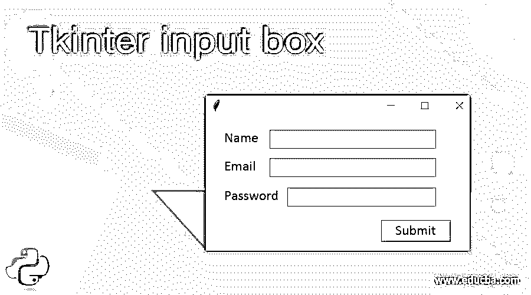
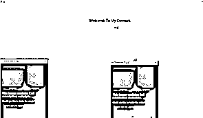
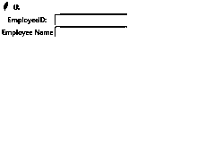

# t 中间输入框

> 原文：<https://www.educba.com/tkinter-input-box/>




## Tkinter 输入框介绍

Tkinter 输入框也被称为入口小部件框，是用户通过输入框进行输入的一种元素。这些框是用来获取用户输入的基本部件之一。它可以是任何格式，如文本字符串和数字，它允许应用程序使用单行文本，即使输入是数字，它也将在单行中显示，否则字符串类型输入将是较长的格式，这意味着使用滚动选项可以在屏幕上显示内容。

### 句法

Tkinter 最强大的基于 GUI 的小部件，它主要用于应用程序中的基本 UI 元素，以及一些类型的应用程序，需要 python 编程语言中的高级库方法。它有 n 种方法，已经在全球范围内使用，包括图像、动画、视频，甚至一些科学应用程序都是使用这些类型的 UI 小部件创建的。

<small>网页开发、编程语言、软件测试&其他</small>

因此，Entry()是一个基本的默认方法，它可以用来直接在应用程序上输入用户输入，这取决于特定的需求。小部件和这些函数将在其他项目区域的任何需要的地方被调用。它有自己的语法和默认参数。

```
from tkinter import * //import all the library of the tkinter module
import tkinter as tk
variable name=Tk()
tk.Label(variable name, text=””).grid()
```

变量名. mainloop()

### 如何在 Tkinter 中创建输入框？

Tkinter 包有一组内置函数，用于覆盖桌面和 web 应用程序中的 UI 部分。它有更多的互动和先进的库脚本，它可以计算实时世界中的时间，空间功能，即使一些基于人工智能的应用场景，这将涵盖整个小部件方法。基本上，我们要装饰的 UI 有文本框、标签、按钮、视图、滚动框等。大多数按钮将是导航网页的用户界面区域。一旦我们点击了这个按钮，它就会执行应用程序逻辑，并在后台工作。

即使在一些研究领域，他们使用 python 编程语言创建了科学应用程序，他们也使用这些 Tkinter 模块来创建 UI。正如我们前面提到的，用户输入可以是任何格式，如字符串、数字等。如果我们使用字符串格式的数据取决于用户的需要，输入数据将是更长的格式，这些格式将通过滚动框用户界面面板部件处理。每当用户向 ui 屏幕输入内容时，这些小部件将通过后端可用。

这些输入格式不能完全在屏幕上看到。使用箭头键可以将其移动到应用程序的不可见区域。在箭头键的帮助下，用户输入将在应用程序上自动滚动，因此隐藏区域在用户屏幕上可见。此外，如果我们想输入更多的字符，它会跨越多行，因此多行文本将被覆盖使用文本小部件。如果我们在应用程序中使用入口小部件，它会限制用户输入，即它在小部件应用程序中仅使用单一字体。

我们对这两种情况都使用默认方法，我们还可以在输入字段的用法中加入一些输入数据。网格行和列用于文本框大小的复杂性，文本框将更加网格，在屏幕上看起来更漂亮。

### 构造器

Tkinter Entry()构造函数有一组默认的参数，这些参数将在整个编程过程中传递给。我们可以主要使用两种结构网格大小的文本框借助行和列来设置值，这些参数应该在运行时传递。

```
Entry()//without arguments
Entry(method or option values)//with arguments
```

构造函数通常用于创建实例，它将在逻辑上任何需要的地方被整个脚本调用。

### 方法

我们已经在前面的段落中讨论了 Entry()方法及其行为和属性。入口函数将使用 Tk 包获取方法，这些包将更加用户友好，并且是默认包。当使用这些包管理器时，它将覆盖一些默认选项，如填充、侧边、扩展等。这些选项将用于控件，并在应用程序中提供更多的演示。

### Tkinter 输入框示例

下面举几个例子

#### 示例#1

**代码:**

```
from tkinter import *
import tkinter as tk
from tkinter import ttk
first = Tk()
first.geometry("132x110")
textboxes = tk.Canvas(first, width = 430, height = 330,  relief = 'raised')
textboxes.pack()
lbel = tk.Label(first, text='Welcome To My Domain:')
lbel.config(font=('helvetica', 17))
textboxes.create_window(213, 104, window=lbel)
e = tk.Entry (first)
textboxes.create_window(303, 146, window=e)
frm = Frame(first)
frm.pack()
frm1 = Frame(first)
frm1.pack(side = RIGHT)
frm2 = Frame(first)
frm2.pack(side = LEFT)
imge = PhotoImage(file = r"C:\Users\Kripya-PC\Downloads\MicrosoftTeams-image (11).png")
Button(first, text = 'Have a Nice Day !', image = imge).pack(side = LEFT)
labels=Label(first, image=imge, width=320, height=350)
labels.pack(side=BOTTOM)
btn1=Button(first, text=" +" )
btn1.pack(side=TOP)
btn2=Button(first, text=" - ")
btn2.pack(side=RIGHT)
first.mainloop()
```

**输出:**




#### 实施例 2

**代码:**

```
from tkinter import *
import tkinter as tk
from tkinter import ttk
first = Tk()
first.geometry("132x110")
textboxes = tk.Canvas(first, width = 430, height = 330)
textboxes.pack()
e = tk.Entry (first)
textboxes.create_window(230, 147, window=e)
def demo ():
i = e.get()
lbel = tk.Label(first, text= float(i)**1.44)
textboxes.create_window(220, 310, window=lbel)
btn = tk.Button(text='Square of the given number is:', command=demo)
textboxes.create_window(200, 180, window=btn)
imge = PhotoImage(file = r"C:\Users\Kripya-PC\Downloads\MicrosoftTeams-image (11).png")
Button(first, text = 'Have a Nice Day !', image = imge).pack(side = LEFT)
labels=Label(first, image=imge, width=320, height=350)
labels.pack(side=BOTTOM)
btn1=Button(first, text=" +" )
btn1.pack(side=TOP)
btn2=Button(first, text=" - ")
btn2.pack(side=RIGHT)
first.mainloop()
```

**输出:**


#### 实施例 3

**代码:**

```
import tkinter as tk
first = tk.Tk()
tk.Label(first, text="EmployeeID:").grid(row=0)
tk.Label(first, text="Employee Name").grid(row=1)
e = tk.Entry(first)
en = tk.Entry(first)
e.grid(row=0, column=1)
en.grid(row=1, column=1)
first.mainloop()
```

**输出:**




### 结论

Entry 方法有一个默认的模式类，它将用于向应用程序 UI 小部件输入所有类型的用户输入数据格式。这些数据将根据代码中编写的验证脚本进行验证。这些库将包括 python 库中已经定义的所有受支持的类和方法。

### 推荐文章

这是 Tkinter 输入框的指南。这里我们讨论如何在 Tkinter 中创建一个输入框和例子，以及代码和输出。您也可以看看以下文章，了解更多信息–

1.  [Tkinter 笔记本](https://www.educba.com/tkinter-notebook/)
2.  [Tkinter Widgets](https://www.educba.com/tkinter-widgets/)
3.  [t 中间颜色](https://www.educba.com/tkinter-colors/)
4.  [Tkinter 滚动条](https://www.educba.com/tkinter-scrollbar/)


