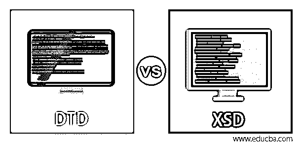
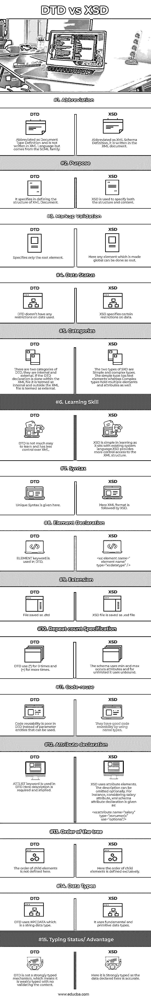
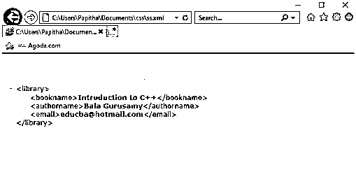
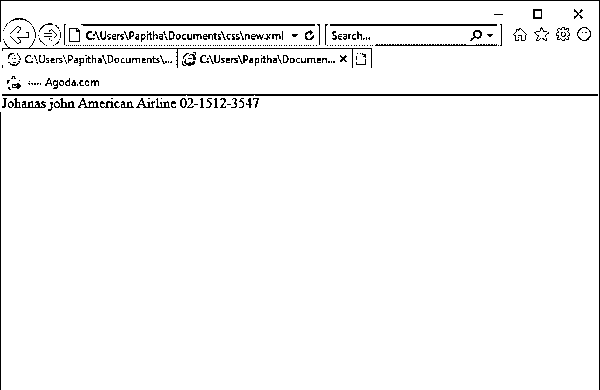

# DTD vs XSD

> 原文：<https://www.educba.com/dtd-vs-xsd/>




## DTD 与 XSD 的区别

DTD 代表文档类型定义，而 XSD 代表 XML 模式定义，意在用于数据传输，该数据传输与具有公认的行业标准的 XML 数据模型的功能相关，并且被认为是 XML 的构建块。这两种模式都定义了 XML 文档的模式结构。文档类型定义(DTD)可以定义为一个合法的标准模式定义，其内置的规范有助于为 SGML 系列定义文档类型。较老的 DTD 提供元数据，元数据是定义 XML 文档的简单语法，并在 XML 版本旁边声明为 DOCTYPE。而 XML Schema，DTD 的改进版本通过提供数据应该具有和不具有的细节而受益。XML Schema 引用 XML 名称空间和 XML DTD 进行引用和定义。在这个主题中，我们将学习 DTD 和 XSD。

### DTD 与 XSD 的面对面比较(信息图)

以下是 DTD 和 XSD 之间的主要区别:

<small>网页开发、编程语言、软件测试&其他</small>




### DTD 与 XSD 的主要区别

以下是下面提到的主要区别:

#### 1.文档类型定义（Document Type Definition 的缩写）

*   这里不支持已定义的数据类型。DTD 的运算量非常有限。

*   为了与 XML 文档相关联，DTD 使用 DOCTYPE。

*   模式在 DTD 中由它们自己的一组关键字很好地定义。

*   DTD 有内联和外部定义，而 XML schema 没有。

*   DTD 非常适合小型 XML 文档，如公司、学校数据库。

**举例:**

下面的 DTD 示例是外部 DTD。当一个元素包含一个子元素时，它使用逗号来指定，如第 1 行语句所示。

ss.xml

```
<?xml version="1.0"?>
<!DOCTYPE Library SYSTEM "new.dtd">
<library>
<bookname>Introduction to C++</bookname>
<authorname>Bala Gurusamy</authorname>
<email>educba@hotmail.com</email>
</library>
new.dtd
<!ELEMENT library (bookname,authorname,email)>
<!ELEMENT firstname (#PCDATA)>
<!ELEMENT authorname (#PCDATA)>
<!ELEMENT email (#PCDATA)>
```

**结果:**




#### 2.XSD

*   这里，XSD 支持数字、字符串和布尔数据类型，也支持互联网数据类型，如 ISO、语言代码。

*   XSD 允许我们将名称空间用于定义良好的模式。XSD 即兴表演了 DTD 操作。以避免元素中的名称冲突。

*   将自身与 XML 文档模式相关联会执行一些规范，如。

```
xmlns:xsi="http://www.w3.org/2001/XMLSchema-instance"
xsi:noNamespaceSchemaLocation="schema name.xs"
```

*   它采用面向对象编程的特性，如继承和封装概念来格式化 XML 文档。XML schema 不允许内联定义。

*   像大多数流行的 Web 服务一样，XSD 在大型 XML 数据中更受青睐。

*   元素在 XML 文档中起着至关重要的作用，因此它们在 XML 模式中定义，如

```
<xs: element name ="name" type ="d"/> here name=Name appeared in XML document and type denotes description part. Example for a sample XML document like
<customer> fromUSA </customer>
The xsd is given as
<xs: element name ="customer " type="xs:string"/>
```

*   在 XSD，您可以指定像 minOccurs 和 maxOccurs 属性这样的基数，它们的默认值是‘1’。

**举例:**

new.xml

```
<?xml version="1.0"?>
<Airline_db
xmlns:xsi="http://www.w3.org/2001/XMLSchema-instance"
xsi:noNamespaceSchemaLocation="eee.xs">
<Aerostar  Employee_id="10">
<Name>Johanas john</Name>
<Type_flight>American Airline</Type_flight>
<Contact>02-1512-3547</Conact>
<Email>johanas will@ hotmail.com</Email>
</Aerostar>
<Aerostar  Employee_id="18">
<Name>Tom brutt</Name>
<Type_flight>Air India</Type_flight>
<Contact>03-1622-9722</Conact>
<Email>astius_87@ hotmail.com</Email>
</Aerostar>
</Airline_db>
eee.xs
<?xml version="1.0"?>
<xs:schema xmlns:xs="http://www.w3.org/2001/XMLSchema" >
<xs:element name="Airline_db" type="AirlineInfoType" />
<xs:complexType name="AirlineInfoType">
<xs:sequence>
<xs:element ref="Aerostar" minOccurs="0" maxOccurs="unbounded" />
</xs:sequence>
</xs:complexType>
<xs:element name="Aerostar" type="AerostarType" />
<xs:complexType name="AerostarType">
<xs:sequence >
<xs:element ref="Name" />
<xs:element ref="Type_flight" />
<xs:element ref="Contact" />
<xs:element ref="Email" />
</xs:sequence>
<xs:attribute name="Employee_id" type="xs:int" use="required"/>
</xs:complexType>
<xs:element name="Name" type="xs:string" />
<xs:element name="Type_flight" type="xs:string" />
<xs:element name="Contact" type="xs:string" />
<xs:element name="Email" type="xs:string" />
</xs:schema>
```

**结果:**




### DTD 与 XSD 对比表

现在让我们在下表中对 DTD 和 XSD 进行比较。

| **SNO** | **DTD** | **XSD** |
| **缩写** | 缩写为文档类型定义，不是用 XML 语言编写的，而是来自 SGML 家族。 | 缩写为 XML Schema Definition，写在 XML 文档中。 |
| **目的** | 它在定义 XML 文档的结构时指定 | XSD 用于指定结构和内容。 |
| **标记验证** | 仅指定根元素。 | 在这里，任何被全局化的元素都可以作为根元素来处理。 |
| **数据状态** | DTD 对使用的数据没有任何限制。 | XSD 规定了对数据的某些限制 |
| **类别** | 有两类 DTD，它们是内部的和外部的。如果 DTD 声明是在 XML 文件中完成的，则称为内部声明，在 XML 文件之外的称为外部声明。 | SXD 的两种类型是简单类型和复杂类型。简单类型有文本元素，而复杂类型也有多个元素和属性。 |
| **学习技能** | DTD 不太好学，对 XML 的控制也较少。 | XSD 学习起来很简单，因为它使用现有的系统语言。XSD 提供了对 XML 结构的更多控制。 |
| **语法** | 这里给出了唯一的语法 | 这里 XML 格式后面是 XSD。 |
| **元素声明** | DTD 中使用了元素关键字 |  |
| **分机** | 文件另存为。文档类型定义（Document Type Definition 的缩写） | XSD 文件另存为。xsd 文件 |
| **重复计数规格** | DTD 使用(*)0 次，使用(+)更多次 | 该模式使用 min 和 max occurs 属性，对于 unlimited，它使用 unbound 属性。 |
| **代码重用** | 代码重用性差的是 DTD 而不是可以使用的参数实体。 | 通过使用名称类型，它们具有良好的代码可重用性。 |
| **属性声明** | ATTLIST 关键字用在 DTD 中，这里描述是必需的和隐含的 | XSD uses attribute elements. The description can be omitted optionally. For instance, considering salary attribute, xml schema attribute declaration is given as: |
| **树的顺序** | 这里没有定义子元素的顺序 | 这里，子元素的顺序是专门定义的。 |
| **数据类型** | DTD 使用#PCDATA，它是一种字符串数据类型。 | 它使用基本和原始数据类型。 |
| **打字状态/优势** | DTD 不是强类型机制，这意味着它是弱类型的，不验证内容。 | 这里它是强类型的，因为这里声明的数据是准确的。 |

当处理模式变得太长时必须小心，因为 DTD 语法更紧凑，所以它们往往更短。也依赖于我们每天使用的工具，你可以坚持使用 DTD 或者模式。

### 结论

总之，XML 是一种广泛的数据传输技术，这些 DTD 和 XSD 都与 XML 相关。DTD 作为一种标记声明定义了 SGML 的文档类型，而 XSD 解释了如何在 XML 中描述元素。在这里，我们已经通过一个示例看到了这两者之间的比较。最后，在定义 XML 文档的情况下，与 DTD 相比，模式更可取，也更丰富。我希望所有 XML 专业人员都能从这篇文章中获得一点启发。

### 推荐文章

这是关于 DTD 和 XSD 的指南。这里我们用信息图和比较表来讨论 DTD 和 XSD 的主要区别。您也可以看看以下文章，了解更多信息–

1.  [XHTML vs HTML5](https://www.educba.com/xhtml-vs-html5/)
2.  [HTML vs XML](https://www.educba.com/html-vs-xml/)
3.  [字符串 vs 字符串 C#](https://www.educba.com/string-vs-string-c-sharp/)
4.  [Html5 vs Html4](https://www.educba.com/html5-vs-html4/)


