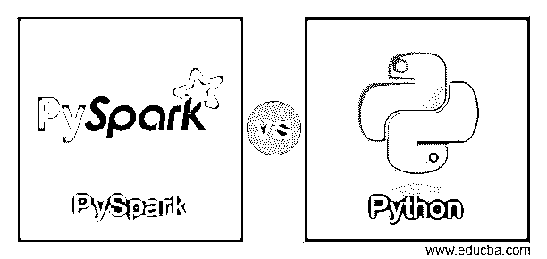
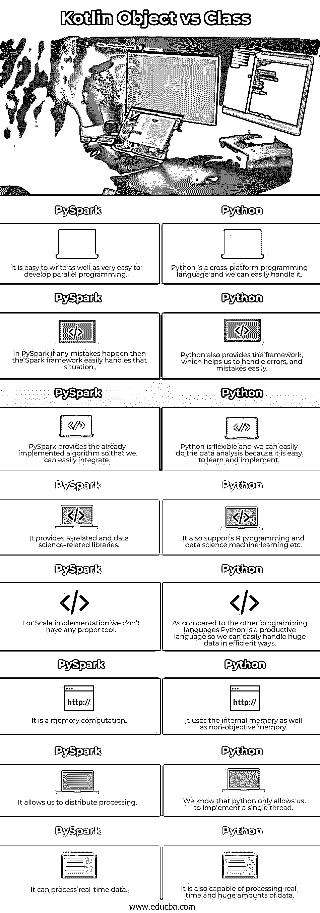

# PySpark vs Python

> 原文：<https://www.educba.com/pyspark-vs-python/>

## PySpark 与 Python 的区别

下面的文章提供了 PySpark 与 Python 的对比概要。Pyspark 只不过是用于 spark 的 Python API 换句话说，我们可以说它是 Apache Spark 和 Python 编程的集合，用来处理海量数据。另一方面，Python 也是一种面向对象的编程语言。它是一种用于实现数据科学的通用语言，机器学习概念很容易帮助我们实现 Pyspark。

**py Spark:**py Spark 无非是基于 Python 的 API，用于 Spark 的实现，或者我们可以说它是介于 Python 和 Apache Spark 之间的中间件。PySpark 同样使您能够向 Apache Spark 和 Python 传递有弹性的分布式数据集。在 Py4j 库中完成。Py4J 是并入 PySpark 的标准库，它允许 Python 与 JVM 对象进行强大的连接。此外，PySpark 附带了一些库，可以帮助您编写有效的项目。同样有不同的外部分类是可行的。

<small>网页开发、编程语言、软件测试&其他</small>

**Python:**Python 正在成为信息研究者最熟知的语言。Python 帮助你利用你的信息能力。Python 是一种非常强大的语言，并且简单易学。Python 在信息科学、人工智能和人工推理方面很有价值。

蟒蛇包含不同的诱人属性。这包括学习的简单性，对语言结构的研究，进一步发展的清晰性，以及更多。Python 最惊人的方面。它还允许软件工程师考虑编码这两个信息和有用性。

### py spark 是什么？

PySpark 是 Apache Spark 的 Python API，用于处理分布式集群中的大型数据集。它是用 Python 编写的，利用 Apache Spark 功能运行 Python 应用程序。Pandas 和 Spark 数据帧之间的一个重要对比是焦虑和无精打采的执行。在 PySpark 中，任务被推迟，直到一个结果被提及，准备就绪。例如，您可以确定堆叠来自亚马逊 S3 的信息集合以及对数据框应用各种更改的任务。但是，这些任务不会立即应用。

记录变更图表，当确实需要信息时，例如，在将结果合成回 S3 时，然后，在那时，变更作为单独的管道活动被应用。这种方法用于尝试不将完整的数据帧拉入内存，并支持跨一组机器的更可行的处理。例如，使用 Pandas 数据帧，所有内容都被移动到内存中，并且每个 panda 活动都被立即应用。

### Python 是什么？

Python 是一种众所周知的、广泛有用的编程语言，可用于多种用途。它包含了重要级别的信息结构、动态组合、动态限制和更多亮点，这使得它对于复杂应用程序的改进非常有价值，无论是出于何种意图还是为了在协作中做有用的笔记。此外，Python 有一个类似于另一种编程语言的框架，能够在需要时执行其他编程代码，如 C 和 C++。由于这个特性，python 框架可以运行任何程序，并提供其他功能，帮助我们在实现机器学习的同时广泛使用。

### PySpark 与 Python 的正面比较(信息图)

以下是 PySpark 与 Python 之间的 8 大区别:

### PySpark 与 Python 的主要区别

让我们来看看 PySpark 和 Python 的主要区别:

*   **Pyspark:** 正常情况下，它支持 Python 工具。Pyspark 的主要特点是支持庞大的数据处理或加工。在实现之前，我们必须需要 Spark 和 Python 的基础知识。它使用 Python 中的 Py4J 库，我们称之为 API。它也由 Apache Spark 许可和开发。
*   **Python** 是一种用于实现人工智能、大数据、机器学习概念的编程语言，具有非常好的特性。在实现之前，我们必须了解任何编程语言的基础。我们需要支持不同特性的基本和标准库，例如自动化、数据库、科学计算、数据处理等。Python 是许可的。我们知道 Python 是一种解释型编程语言，所以它可能比其他语言慢。这不是最佳选择，因此多线程可能会执行得更慢。

### PySpark 与 Python 对比表

我们来讨论一下 pyspark 和 python 之间的顶级对比:

| **Sr 号** | **PySpark** | **Python** |
| One | 它很容易编写，也很容易开发并行编程。 | Python 是一种跨平台的编程语言，我们可以轻松驾驭。 |
| Two | 在 PySpark 中，如果发生任何错误，那么 Spark 框架可以轻松处理这种情况。 | Python 还提供了框架，帮助我们轻松处理错误。 |
| Three | PySpark 提供了已经实现的算法，因此我们可以轻松地集成它。 | Python 是灵活的，我们可以很容易地进行数据分析，因为它很容易学习和实现。 |
| Four | 它提供 R 相关和数据科学相关的库。 | 它还支持 R 编程和数据科学机器学习等。 |
| Five | 对于 Scala 实现，我们没有任何合适的工具。 | 与其他编程语言相比，Python 是一种高效的语言，因此我们可以轻松高效地处理大量数据。 |
| Six | 这是一种记忆计算。 | 它使用内存和非目标内存。 |
| Seven | 它允许我们分散处理。 | 我们知道 python 只允许我们实现单个线程。 |
| Eight | 它可以处理实时数据。 | 它还能够处理实时和大量的数据。 |

### 结论

在本文中，我们将尝试探索 Pyspark 与 Python 的区别。在本文中，我们看到了 Pyspark 与 Python 的基本思想，以及这些 Pyspark 与 Python 的用途和特性。文章的另一点是我们如何看到 Pyspark 和 Python 之间的基本区别。

### 推荐文章

这是 PySpark vs Python 的指南。在这里，我们用信息图和一个比较表来讨论 PySpark 和 Python 的主要区别。您也可以看看以下文章，了解更多信息–

1.  [Python vs C#](https://www.educba.com/python-vs-c-sharp/)
2.  [Python vs Ruby](https://www.educba.com/python-vs-ruby/)
3.  [Python vs Matlab](https://www.educba.com/python-vs-matlab/)
4.  [Python vs Ruby 性能](https://www.educba.com/python-vs-ruby-performance/)

