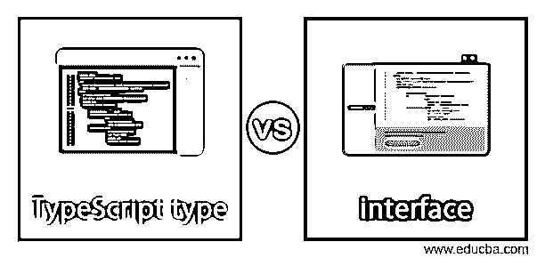
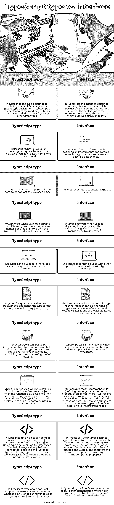

# 类型脚本类型与接口

> 原文：<https://www.educba.com/typescript-type-vs-interface/>

## TypeScript 类型与接口的区别

在 typescript 中，接口被定义为用于实现类成员的类的语法，其中接口可以被类对象引用，因此 typescript 编译器使用接口进行类型检查或鸭类型化，因此通常我们可以说 Typescript 接口引用负责定义属性、方法和事件的类的对象的数据形状，其中该接口结构将被派生类跟随。Typescript 中，类型被定义为定义变量的那些数据类型，这些数据类型可以是内置的、用户定义的，或者是在声明用作程序输入的任何变量之前定义的任何其他数据类型。在本主题中，我们将学习 TypeScript 类型与接口。

### TypeScript 类型与接口之间的直接比较(信息图表)

下面是 TypeScript 类型与接口之间的主要区别。

<small>网页开发、编程语言、软件测试&其他</small>

### 类型脚本类型与接口的主要区别

#### 1.灵活性

typescript 中的类型或类型别名被定义为用于创建变量名的类型声明，该变量名具有在名称之前声明的数据类型，其中它可以为类型创建名称，例如包括数字、字符串、布尔值、null 等的原始类型声明，并且该类型还可以声明联合、交集和元组类型。

而接口被定义为唯一对象类型的声明，这意味着接口仅限于对象类型，不支持任何其他类型的声明。但是我们可以说接口比 typescript 中的类型有更多的功能。因此在 typescript 中，据说类型比接口更灵活。

**语法:**

类型和接口的语法格式几乎相同。它们是:

`For type:
type type_name = {
// variable declaration with type and variable name
}
For interface
interface interface_name {
// variable declaration or method declaration
}`

#### 2.合并声明

在 Typescript 中，类型不支持合并不同的多个类型的功能，编译器无法合并两个或更多具有相同名称的类型声明，因为全局或模块范围类型是唯一的类型实体，如果我们尝试合并类型，则会引发编译器错误，指出重复的标识符。然而，接口支持这一特性，即接口可以被定义不同的时间，然后它可以被合并成一个单一的接口，这是类型所不能做到的。

#### 3.班

在 typescript 中，type 不支持在类中实现或扩展联合类型的功能，因为我们知道类是静态蓝图，类不能实现或扩展，也就是说，它不能存在于一个或另一个类结构中，如果使用类型完成，它将引发错误。然而，接口支持 typescript 中的实现和扩展功能，因此类可以使用“实现”和“扩展”关键字来实现或扩展接口。

#### 4.几个方面

类型可以描述函数、构造函数、元组，但不能在类中实现或扩展，也不能扩充或递归。然而，接口也可以描述函数、构造函数、元组，并且它也可以在类中实现和扩展，该类也支持这样的方面，即当与 Typescript 中的类型相比时，它可以被扩充并且也可以是递归的。

### 类型脚本类型与接口的比较表

下面给出的是比较表，描述了 TypeScript 类型与接口之间的直接差异:

| **序列号** | **打字稿类型** | **打字稿接口** |
| One | 在 typescript 中，定义类型是为了声明变量的数据类型，这意味着 typescript 中的类型声明是为了声明不同类型的名称，如用户定义的、内置的或任何其他数据类型。 | 在 Typescript 中，接口被定义为提供定义实体的方法的类的语法。这包含成员的声明，用于定义派生类可以遵循的结构。 |
| Two | It uses the “type” keyword for creating new type alias but not a new type instead of a new name for a type defined. | 它使用“interface”关键字来声明一个接口，该接口可以包含描述数据形状的方法、属性和事件。 |
| Three | typescript 类型仅支持数据类型，不支持使用对象。 | typescript 接口支持使用对象。 |
| Four | 当用于声明两个不同的类型时，如果声明的变量名相同，则 typescript 编译器将引发错误。 | Interface 关键字在用于声明两个同名接口时，能够合并这两个接口。 |
| Five | 这些类型也可以用于其他类型，例如原语、联合和元组。 | 该接口不能像在 Typescript 中对 type 那样与其他类型的声明一起使用。 |
| Six | 在 typescript 中，无法扩展类型或类型别名，因此该类型无法扩展类，因为它不支持此功能。 | 接口可以用类型别名扩展，或者接口也可以用类型扩展。Where interface 可以轻松地扩展类是 typescript 接口的最佳特性之一。 |
| Seven | 在 Typescript 中，我们可以通过将多个类型组合成一个类型来创建交集类型，也可以通过使用“&”关键字组合两个接口来创建新的交集类型。 | 在 typescript 中，我们不能通过组合不同的类型来创建任何新的交集接口，因为它在 typescript 中不起作用。 |
| Eight | 当我们创建一个函数，并在调用该函数时返回一个对象时，最好使用类型。因此，在使用函数、复杂类型等时，更推荐使用它们。因此，由我们来决定在我们的程序中使用什么 | 最推荐使用接口来定义新的对象或方法或对象的属性，其中它将接收特定的组件。因此，当使用对象和方法对象时，接口工作得更好。因此，我们可以根据程序需要选择类型或接口。 |
| Nine |   In Typescript, union types can contain one or more types using the “ &#124; ” keyword, where we can have a new union type by combining two interfaces. Similarly, it easy and very helpful concept for declaring the tuples in typescript using types. Hence we can use type aliases in computed properties using the “in” keyword”. | 在 Typescript 中，接口不支持此功能，因为我们无法通过组合两种类型来创建联合接口。在 Typescript 中，接口不能支持元组的声明，因为可以使用类型来实现。因此，typescript 的接口不支持计算属性。 |
| Ten | 在 Typescript 中，type 也不支持实现的功能，即只用于声明变量，因为它们不能实现其他类型。 | 在 Typescript 中，接口支持实现功能，它可以从派生类中实现类的对象或成员。 |

### 结论

在本文中，我们得出结论，在 typescript 中，类型和接口之间存在差异。但是我们应该注意，我们不能停止使用一个而不是另一个，因为两者几乎相似，但在某些特性上有所不同，因此我们应该在正确分析应该使用什么之后使用它们。有可能一起使用两者，因为程序可以很好地工作。最后，这完全取决于开发人员相应地选择使用哪一个。

### 推荐文章

这是一个关于 TypeScript 类型与接口的指南。在这里，我们用信息图和比较表来讨论 TypeScript 类型与接口的关键区别。您也可以看看以下文章，了解更多信息–

1.  [Couchbase vs CouchDB](https://www.educba.com/couchbase-vs-couchdb/)
2.  [内核与处理器](https://www.educba.com/core-vs-processor/)
3.  [SharePoint vs OneDrive](https://www.educba.com/sharepoint-vs-onedrive/)
4.  [Arduino Nano vs Mini](https://www.educba.com/arduino-nano-vs-mini/)

