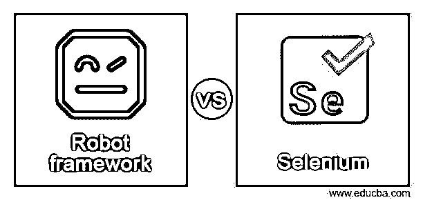
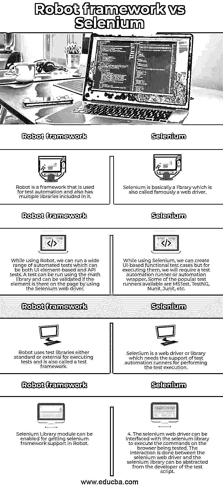

# 机器人框架 vs Selenium

> 原文：<https://www.educba.com/robot-framework-vs-selenium/>

## 机器人框架与 Selenium 的区别

机器人框架用于机器人流程自动化和验收测试。这个框架也是一个开源的自动化框架。Robot framework 是一个独立于平台的项目和应用程序，具有不断增长的生态系统，包括库和外部工具。GitHub 可用于访问该框架的源代码，维护人员甚至可以处理为其做出贡献的指南。另一方面，Selenium 是一个开源的免费自动化工具，目前非常流行。Selenium 对测试自动化非常有益。Web 应用程序可以很容易地通过记录和回放来测试，也可以在不同的浏览器上运行不同的脚本。在本主题中，我们将了解机器人框架 vs Selenium。

### 机器人框架与 Selenium 的面对面比较(信息图表)

以下是机器人框架与 Selenium 之间的主要区别

<small>网页开发、编程语言、软件测试&其他</small>

### 机器人框架与 Selenium 的主要区别

机器人框架与 Selenium 之间的一些主要差异如下:

#### 机器人框架

*   机器人框架有一个表格格式，其中的测试用例可以通过使用关键字来编写。因此，机器人框架被认为更容易让新手理解和编写测试用例。
*   Robot Framework 提供了内置关键字。此外，有几个库提供了各种关键字，包括 Selenium 库，如最大化浏览器、打开浏览器、关闭浏览器等等。用户定义的关键字也可以在 Robot Framework 中创建。这些用户定义的关键字是内置或库或不同的其他用户定义的关键字的组合。参数也可以传递给这些关键字，这使得用户定义的关键字就像可以重用的函数一样。
*   像 scalar、dict 和 list 这样的机器人框架也支持变量。这些变量易于使用，有助于开发人员编写困难的测试用例。
*   有各种各样的库来支持机器人框架，包括 Selenium 库、http 库和 FTP 库。Selenium 是最常用的库之一，它有助于与不同的浏览器进行交互，以及 web 应用程序和 UI 测试。robot 框架中还有内置的数字、字符串和日期等库。
*   带有关键字的 Robot 文件也可以导入到 Robot 框架中，并且可以与测试用例一起使用。这些资源在 robot 框架中很容易使用，如果我们不得不使用一些已经为其他项目编写的关键字，它们也会有所帮助。
*   robot 框架中也支持关键字驱动的风格测试用例和数据驱动的风格。高级关键字用于制作数据驱动的样式，作为测试套装的模板。此外，测试用例用于与模板的高级关键字一起共享数据。用不同的输入测试 UI 变得非常容易。

#### 硒

*   对于测试管理，没有提供测试集成工具。
*   与其他自动化工具相比，selenium 自动化工具对工具的要求非常低。
*   对于像 [REST 或 SOAP](https://www.educba.com/soap-vs-rest/) 这样的 web 服务，不能使用自动化分析。
*   Selenium 无法轻松处理框架和弹出窗口。
*   Selenium 非常适合被分解到测试框架中。
*   为了减少时间和提高测试效率，可以使用由 selenium 支持的并行测试执行。不幸的是，selenium 不能自动化条形码。
*   Selenium 不支持内置的报告特性。
*   Selenium 无法高效处理动态网页。
*   持续集成和持续交付很容易与 Selenium 集成。
*   使用 Selenium 可以很容易地自动化不同种类的测试。例如，Selenium 可以自动化的一些主要测试是自动化浏览器测试、单元测试、回归测试等等。
*   Selenium 中的新特性不太可靠。
*   Selenium 不能对图像进行测试。
*   Selenium 是 web 开发世界中使用最多的工具之一。
*   Selenium 不能用于测试软件和图形用户界面。它只能用于测试 web 应用程序。
*   Selenium 本身做不了移动自动化。
*   Selenium 在自动化验证码方面有局限性。
*   selenium 存在许多页面加载、同步和超时问题。
*   对于测试工具的自动化，需要很高的技能。
*   为了报道，硒完全依赖于黄瓜。
*   Selenium 支持用于软件测试自动化的所有主要语言，如 Python、Perl、Java、Ruby 和 Javascript。这些编程语言中的任何一种都可以用于编写脚本，selenium 可以很容易地将它们转换成兼容的代码。对于 Selenium 支持的每一种语言，都有一个特定的框架来帮助编写测试自动化的脚本。

### 机器人框架与 Selenium 之间的比较表:

下面给出的是机器人框架与 Selenium 之间的比较表

| **机器人框架** | **硒** |
| 1.Robot 是一个用于测试自动化的框架，其中包含了多个库。 | 1.Selenium 基本上是一个库，也就是著名的 web 驱动程序。 |
| 2.在使用 Robot 时，我们可以运行各种各样的自动化测试，既可以是基于 UI 元素的测试，也可以是 API 测试。可以使用数学库运行一个测试，并使用 Selenium web 驱动程序验证页面上的元素是否存在。 | 2.虽然使用 Selenium，我们可以创建基于 UI 的功能测试用例，但是为了执行它们，我们将需要一个测试自动化运行器或者自动化包装器。一些流行的测试运行程序有 MSTest、TestNG、Nunit、Junit 等。 |
| 3.Robot 使用标准或外部测试库来执行测试，也称为测试框架。 | 3.Selenium 是一个 web 驱动程序或库，它支持测试自动化运行程序来执行测试。 |
| 4.可以启用 Selenium 库模块，以便在机器人中获得 selenium 框架支持。 | 4.selenium web 驱动程序可以与 selenium 库连接，在被测试的浏览器上执行命令。交互是在 selenium web 驱动程序之间完成的，selenium 库可以从测试脚本的开发人员那里抽象出来。 |

### 结论

在上述文章的基础上，我们理解了机器人框架和 selenium 的概念。我们讨论了 Selenium 和 robot framework 之间的主要区别。这些差异将有助于开发人员决定 selenium 和 robot 框架中哪一个更适合他们的特定任务。

### 推荐文章

这是机器人框架 vs Selenium 的指南。在这里，我们通过信息图和比较表来讨论机器人框架与 Selenium 的主要区别。您也可以看看以下文章，了解更多信息–

1.  [Snapseed vs Lightroom](https://www.educba.com/snapseed-vs-lightroom/)
2.  [Verilog vs VHDL](https://www.educba.com/verilog-vs-vhdl/)
3.  [卢邦图诉徐本图](https://www.educba.com/lubuntu-vs-xubuntu/)
4.  [生育 vs 剪辑工作室](https://www.educba.com/procreate-vs-clip-studio/)

