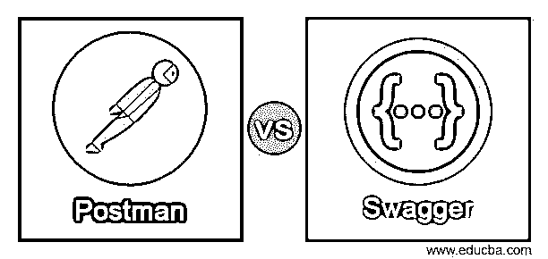
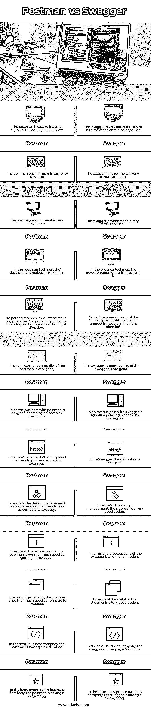

# 邮递员 vs 斯瓦格

> 原文：<https://www.educba.com/postman-vs-swagger/>

## 邮递员和招摇撞骗的区别

下面这篇文章为《邮差 vs 霸气》提供了一个大纲。postman 是测试 HTTP bases 请求的最佳工具之一。如果我们考虑 Restful API 故障排除，那么 postman 工具不是最常用的。一般来说，postman 工具是 chrome base 或 application bases 工具。这很容易实现。执行请求和验证 HTTP 响应非常简单。邮差很好，在开发界很受欢迎。这将有助于完成从简单到复杂的任务。它将能够同时处理多个请求。它将快速测试 HTTP 构建的请求。

#### 邮递员的主要特征:

*   **广泛的特性:**这个特性将支持所有类型的 HTTP 请求。广泛的支持功能还将包括多种东西，如它将能够处理纯文本代码，多参数，XML 代码，JSON 代码，多标题，验证等。它将处理 JavaScript 代码的后续响应。它可以是代码状态、可预测的主体请求、头的数量以及参数。
*   **集合:**它将保存文件夹结构组件。相同的文件夹结构组件具有根据最终用户或客户请求执行的请求，它将被分割。它将使用不同的参数定义需求，如功能、不同的业务需求、服务器等。
*   **环境:**在邮差生态系统中，环境扮演着非常重要的角色。环境将作为邮差中的全局变量提供帮助。环境是一组基于键值对的信息。它将辅助不同格式的信息，如静态信息和动态信息。对于与特定键相关联的整个请求也是如此。

在接口描述语言世界中，我们有多种语言可以使用它。但斯瓦格在其中扮演了非常重要的角色。因为它有关键的特性和角色，所以它将有助于描述 Restful API。Restful 将使用 JSON 格式表示。在 swagger 中，它不会被单独使用或运行。它可以用于不同的开源软件以及工具。它将与不同的开源工具协同工作。它将执行不同的活动，如 web 服务、文档、设计、构建等。我们也可以使用 Restful API。在 swagger 中，我们有代码生成等现有优势，它还将包括自动化文档，并且它将支持不同的编程语言。swagger 的主要用途也是用于测试用例生成。

<small>网页开发、编程语言、软件测试&其他</small>

#### Swagger 的关键选项:

*   **OpenAPI 规范:**在 swagger 工具中，这个工具的至高无上将从 OpenAPI 设计开始。它将满足 Restful API 设计的大多数行业标准的需求。
*   **开源工具:**swagger 是一个工具，它将使个人完成多个任务。该工具将有助于更新、共享 OpenAPI、创建 API 定义等。这也取决于消费者。
*   换句话说，我们可以说 SwaggerHub 是平台解决方案。这将有助于支持开放 API 工作流。

### 邮递员和大摇大摆之间的正面比较(信息图)

以下是邮递员和大摇大摆者之间的 14 大区别:

### 邮递员和大摇大摆之间的关键区别

让我们来讨论一下邮递员和大摇大摆者之间的一些主要区别:

*   与 swagger 和 postman 相比，有许多关键的不同之处。
*   与邮差相比，大摇大摆的配乐没那么好。另一方面，邮差比招摇要好得多。
*   就可扩展性而言，swagger 比 postman 更可靠。
*   数据安全在 postman 中扮演着非常重要的角色。但在斯瓦格，这是不符合标准的。

### 邮递员与招摇撞骗对比表

我们来讨论一下 Postman 和 Swagger 的顶级对比:

| **邮递员** | **大摇大摆** |
| 从管理的角度来看，postman 很容易安装。 | 从管理员的角度来看，swagger 很难安装。 |
| 邮差环境非常容易设置。 | 霸气的环境很难建立。 |
| 邮差环境非常好用。 | swagger 环境很难使用。 |
| 邮差工具中最大的开发要求就是满足它。 | 在 swagger 工具中，大部分的开发要求都是缺失的。 |
| 根据研究，大部分焦点表明 postman 产品正朝着正确和快速的正确方向前进。 | 根据调查，大多数人认为 swagger 产品正朝着正确的方向发展。 |
| 邮递员支持邮递员的质量很好。 | 霸气的霸气支持质量不好。 |
| 和邮递员做生意很容易，不会面临复杂的挑战。 | 大摇大摆地做生意很困难，面临着有点复杂的挑战。 |
| 在 postman 中，API 测试没有 swagger 好。 | 大摇大摆地说，API 测试非常好。 |
| 就设计管理而言，邮递员不如斯瓦格。 | 就设计管理而言，swagger 是一个非常好的选择。 |
| 在访问控制方面，邮递员不如大摇大摆。 | 在访问控制方面，swagger 是一个非常好的选择。 |
| 就可见度而言，邮递员不如斯瓦格。 | 就能见度而言，招摇是一个非常好的选择。 |
| 在小商业公司中，邮递员的支持率为 33.3%。 | 在小型商业公司中，swagger 的收视率为 32.5%。 |
| 在 mid 商业公司，邮递员有 33.3%的收视率。 | 在中型商业公司中，swagger 的收视率为 34.4%。 |
| 在大型或企业商业公司中，邮递员的收视率为 33.3%。 | 在大型或企业商业公司中，swagger 的比率为 32.0%。 |

### 结论

根据需要，我们可以选择任何选项，如招摇或邮递员。招摇通常有助于 API，而邮差有助于快速测试 HTTP 请求。

### 推荐文章

这是一个邮差 vs 霸气的指南。在这里，我们用信息图和比较表来讨论 Postman 和 Swagger 的关键区别。您也可以看看以下文章，了解更多信息–

1.  [SoapUI vs 邮递员](https://www.educba.com/soapui-vs-postman/)
2.  [RAML vs Swagger](https://www.educba.com/raml-vs-swagger/)
3.  [Alexa vs Siri](https://www.educba.com/alexa-vs-siri/)
4.  [Keynote vs PowerPoint](https://www.educba.com/keynote-vs-powerpoint/)

