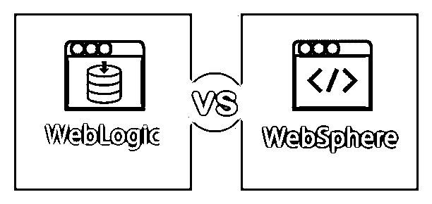
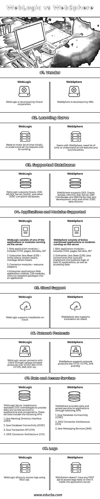

# WebLogic vs WebSphere

> 原文：<https://www.educba.com/weblogic-and-websphere/>

## WebLogic 与 WebSphere 的区别

通过各种协议(包括 HTTP)向各种客户端应用程序提供业务功能访问的服务器。客户端应用程序可以像调用对象的方法一样使用这些功能。应用服务器管理自己的资源，如安全性、事务处理、消息传递、资源池。对于像 GUI(图形用户界面)这样的应用服务器、web 服务器或任何应用服务器上托管的其他应用，存在各种客户端。客户机和应用服务器之间传输的信息不仅限于显示 HTML 文件；相反，这些信息可能是一些编程逻辑。客户可以根据自己的需要修改数据，并在应用程序中使用这些数据。在客户机和服务器之间传输的数据可以是多种类型，如 XML、JSON、纯文本格式等。

应用服务器的例子有 SAP Netweaver (SAP)、JBoss(Red Hat)、WebLogic Server(Oracle)、WebSphere(IBM)、Glassfish(Oracle)等。

<small>网页开发、编程语言、软件测试&其他</small>

### 什么是 WebLogic？

WebLogic 是一种 Oracle 产品，它扮演着应用程序服务器的角色。软件应用程序是一个中间件，它连接数据库等后端应用程序和具有基于浏览器的瘦客户端的相关应用程序。WebLogic 用于开发和部署 J2EE 应用程序。J2EE 是基于 Java 编程语言开发多层企业应用程序的标准平台。

### 什么是 WebSphere？

WebSphere 是一个执行应用服务器角色的 IBM 软件。它是一个软件框架和中间件，托管基于 Java 的 web 应用程序。WebSphere 是使用 Java EE、XML 和 web 服务等开放标准构建的。它用于开发和部署使用 Java 或 J2EE 构建的后端应用程序或服务，以便使用 web 浏览器或任何其他客户端访问它们。

### WebLogic 和 WebSphere 之间的直接差异(信息图表)

下面是 WebLogic 与 WebSphere 之间的 8 大区别

### WebLogic 和 WebSphere 之间的主要区别

两者都是市场上的热门选择；让我们讨论一些主要的区别:

*   WebSphere 倾向于更关注集成、连接和 web 服务，而 WebLogic 更关注新兴的 J2EE 标准和易用性。
*   WebLogic 有默认的事务属性“Supports”，但是 WebSphere 没有任何默认的事务属性。
*   WebLogic 比 WebSphere 发展得更快。
*   与 WebSphere 相比，WebLogic 中的类加载更容易理解，也更有效。

### WebLogic 与 WebSphere 比较表

下面是 WebLogic 与 WebSphere 之间最重要的比较

| **比较的基础** | **WebLogic** | **WebSphere** |
| 小贩 | WebLogic 是由 Oracle 公司开发的 | WebSphere 是由 IBM 开发的 |
| 学习曲线 | 我们需要投入大量的时间来理解所有的功能和它的工作原理。 | WebSphere 也是如此，它需要很多时间来理解所有的特性和功能。 |
| 支持的数据库 | WebLogic 支持 Oracle、DB2、MS SQL Server、MySQL 和其他 JDBC 兼容数据库。 | WebSphere 支持 DB2、Oracle、Sybase、Informix、SQL Server、IBM Cloudscape 和 IBM Derby(仅用于测试和开发)以及其他 JDBC 数据源。 |
| 支持的应用程序和模块 | WebLogic 由服务器上运行的应用程序或模块之一组成。

1.  Web application modules-including HTML pages, Servlets, JSP
2.  Enterprise Bean (EJB)-entity Bean, session Bean and message-driven bean
3.  Connector-resource adapter
4.  Enterprise-Web application module, EJB module and resource adapter are packaged into applications.

 | WebSphere 由下面提到的运行在服务器上的应用程序或模块组成。

1.  Web application modules-including HTML pages, Servlets, JSP
2.  Enterprise Java Bean(EJB): Java component, which usually implements the business logic of Java EE application and accesses data.

 |
| 云支持 | WebLogic 支持在云上安装。 | WebSphere 还支持在云上安装。 |
| 网络协议 | WebLogic server 通过 TCP/IP 上的各种网络协议(如 HTTP、HTTPS、RMI、IIOP 等)与客户端连接。 | WebSphere 支持像 HTTP、HTTPS、 [JMS](https://www.educba.com/what-is-jms/) 和 MQ 这样的网络协议。 |
| 数据和访问服务 | WebLogic Server 实现标准的 J2EE 技术，为应用程序和组件提供数据和访问服务。这些服务包括以下 API

1.  Java Named Directory Interface (JNDI)
2.  Java database connection (JDBC)
3.  Java 语言(一种计算机语言，尤用于创建网站)事务 API(JTA)
4.  J2EE java connector architecture (JCA)

 | WebSphere 通过以下 API 向应用程序提供数据和访问服务。

1.  Java database connection (JDBC)
2.  J2EE java connector architecture (JCA)
3.  Java message service (JMS)

 |
| 日志 | WebLogic 允许使用 REST API 访问日志。 | WebSphere 没有任何 REST API 来访问日志；它需要在应用服务器内部查看它们。 |

### WebLogic 与 WebSphere 的性能比较

下面是 WebLogic 和 WebSphere 之间的性能比较

IDE:-WebLogic 可以被各种开发工具使用，如 Eclipse、NetBeans、IntelliJ 等。尽管 IBM 已经提供了一个名为 MyEclipse 的 IDE，它完全支持 WebSphere，但它是一个付费版本。

**服务器性能:-** 即使在生产服务器中，WebLogic 花费的精力和时间也更少。WebSphere 需要一些时间来启动和运行服务器。

**部署:-** WebLogic 提供了多种方式来部署应用程序，如命令行界面、基于 web 的界面、用于自动部署、配置和操作的命令行工具。而 WebSphere 也提供了几种部署方式，如热部署(直接将文件复制到 WebSphere 中已部署的应用程序文件夹)、WebSphere 特定的 ant 任务和构建用于部署应用程序的自动化脚本、管理控制台。

**版本:-** WebLogic 有三个版本 1)Oracle WebLogic Server 标准版，2)Oracle WebLogic Server 企业版，3)Oracle WebLogic Suite。WebSphere 有七个版本:1)WebSphere Application Server–Liberty Core，2)WebSphere Application Server–Express，3)WebSphere Application Server–Base，4)WebSphere Application Server–Network Deployment，5)WebSphere Application Server–Hypervisor Edition，6)WebSphere Application Server–z/OS，7)WebSphere Application–Developers。

### 结论

在理解了 WebLogic 和 WebSphere 之间的区别之后，我们现在可以得出结论，两者都是领先的基于 J2EE 的应用服务器。尽管这两个应用服务器具有相似的功能，但它们都有各自的优缺点。根据我们的需要和要求，我们可以选择其中的任何一个。最有可能的是，这也是一个商业决策。我们可以阅读服务器的官方文档，找到关于这两个服务器的更多细节。有关服务器的更多信息，请参考下面提到的官方网站。

### 推荐文章

这是 WebLogic 和 WebSphere 之间最大区别的指南。在这里，我们还将讨论信息图和比较表的主要区别。你也可以看看下面的文章来了解更多。

1.  [Java 和 JavaScript](https://www.educba.com/java-and-javascript/)
2.  [Java EE vs Spring](https://www.educba.com/java-ee-vs-spring/)
3.  [手机应用 vs 网站](https://www.educba.com/mobile-apps-vs-website/)
4.  [PowerShell vs Python](https://www.educba.com/powershell-vs-python/)

