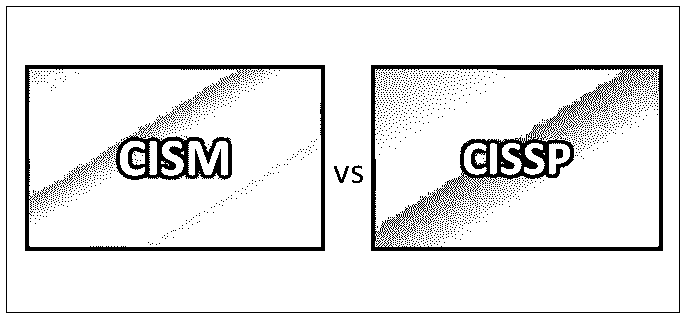
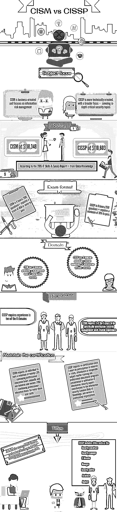

# CISM 对 CISSP

> 原文：<https://www.educba.com/cism-vs-cissp/>

## 关于 CISM vs CISSP 认证的一切

**CISM vs CISSP—**市场上有许多硬件认证课程，个人很难决定哪一个最适合自己的需求。但是只要我们让他们明白你决定选择哪一个，就没有必要担心。我们将讨论市场上最好的硬件认证计划之一。拥有证书的学生将获得更好的 T2 工作，并从丰厚的薪水中获益。证书持有人还被认为能够在最专业和升级的硬件系统上工作。

这一认证意味着你有能力胜任你喜欢的知名公司的任何工作。大多数证书持有人在招聘过程中被给予第一优先，因为他们最适合照顾硬件。

<small>网页开发、编程语言、软件测试&其他</small>

拿到基础 [CISM](https://en.wikipedia.org/wiki/Certified_Information_Security_Manager) 就可以赚好了。证书将帮助你获得更好的财务收益。本课程训练您掌握协议的基本知识和行业中使用的现代网络结构。不是每个人都有能力通过入口，因为入口很难通过。你需要有广博的知识和对基础知识的正确掌握才能通过考试。你应该能够实际展示你对所学系统的理解。

获得一个证书是艰难的，可能会阻碍许多人进入这个行业的兴趣。这个证书是给那些正在寻找新的有利可图的高薪工作的人的。在目前的工作岗位上获得认证可能会让你有资格立即得到提升。入门级的 ISACA 认证项目，CISM vs [CISSP](https://www.isc2.org/Certifications/CISSP) ，是为那些对网络或系统管理职业感兴趣的人准备的。这是一门非常基础的网络课程。要升级课程，必须获得该证书。

IT 行业缺少与网络相关的工作。获得 CISM vs CISSP 认证将有助于你在网络行业获得高薪工作。通过浏览网页，您可以找到更多关于认证计划的在线信息。网上有很多网站是为 IT 专业人士和其他有兴趣获得认证的人准备的。您可以了解所有提供的课程和认证计划。这些网站还会定期更新与网络行业相关的任何新闻。这些网站可以为你提供破解 CISM 与 CISSP 之争所需的技巧。

这篇关于 CISM 对 CISSP 的文章结构如下

*   [获得 CISM vs CISSP 认证的 3 个理由](#Reasons)
*   [CISM vs CISSP 信息图](#Infographics)
*   [CISM vs CISSP 的优势，训练](#Advantages)
*   [CISM vs CISSP 认证培训——简介](#Brief)

### 追求 CISM 与 CISSP 认证的 3 个理由

如果你感觉像约翰尼，你可能想知道什么是网络，在这个领域的培训是否值得。以下是一些你应该考虑这个职业领域的理由:

#### 需求旺盛

当你试图决定你应该从事的职业领域时，你应该问的最重要的问题之一涉及到未来几年的就业前景。你不想花上几千块钱自学却发现职业领域没有需求或者寻求同类工作的人太多。幸运的是，当谈到网络，有很大的需求，但供不应求。根据[劳动统计局](https://www.bls.gov/)的数据，从 2012 年到 2022 年，该领域的就业机会预计将增长 35%，远高于全国平均水平。

随着越来越多的移动设备、[云存储、](https://www.educba.com/cloud-data-storage-service/)、社交媒体和其他技术优势在商业中的应用，越来越需要能够在网络和系统管理过程中提供帮助的人。你可以在各个领域的这些职位上找到工作，比如教育、交通、医疗、技术或政府。

#### 不仅仅是数学家

您可能会对自己说，“从事网络和系统管理工作听起来真的很有趣，但是我不具备超越他人的数学知识。”你会发现与普遍的看法相反。你不需要成为数学天才来掌握在这个职业领域取得成功所需的要素。你应该具备基础数学、阅读理解和逻辑思维的知识，但培训计划可以通过模拟和实践活动帮助你更好地理解信息通信技术(ICT)领域。如果你没有数学或计算机方面的背景，你可能需要付出很多努力和奉献才能掌握一些更难的概念。你需要一个高质量的培训计划，并致力于学习导航领域，成为一名专家。

#### 全球标准

你曾经梦想过环游世界吗？你一直想去国外工作吗？你正在寻找一个完美的职业来帮助你做到这一点吗？网络可能是你的最佳选择。

网络有一个全球标准，这意味着你获得的技能和证书将被全世界接受。你可以在美国完成一个项目，欧洲或亚洲的公司会清楚地知道这意味着什么，你能为他们的公司做什么。因此，你可以在全球范围内寻找工作，给你在国外生活和工作的机会。要做到这一点，你可以花时间通过社交媒体网站，如 LinkedIn，与已经在这个职业领域就业的各种人联系。

在 CISM vs CISSP 找到了追求认证的许多理由后，Johnny 决定报名参加一个培训项目，开始他新的[职业道路](https://www.educba.com/how-to-choose-a-career-path/)。如果你像 Johnny 一样，正在考虑做些什么来为自己找到一份有回报的工作，你应该了解更多关于你可以利用的计划，以帮助你在网络和系统管理员领域找到工作。

### 推荐课程

*   [免费 Python 认证课程](https://www.educba.com/software-development/courses/python-certification-course/)
*   [专业免费软件测试课程](https://www.educba.com/software-development/courses/selenium-training-certification/)
*   [免费 Java 课程](https://www.educba.com/software-development/courses/java-course/)

### CISM vs CISSP 信息图

### CISM 相对于 CISSP 的优势薪资、培训

CISM 与 CISSP 的薪水你是在找新工作还是想在目前的公司里获得晋升？虽然你有很多选择来帮助你抓住那些潜在雇主的眼睛，但也许没有什么策略会比获得这个证书更有效。

#### 跟上最新的

如果你已经在计算机或信息技术领域工作了几天以上，你就已经知道技术是不断变化和发展的。参加本次培训，您将能够更好地跟上不断发展的趋势。那些能够参加这些新培训课程的人将站在最新技术的最前沿。

#### 这是未来之路

随着企业内部的网络变得更大、更复杂、需要更多的功能和设施，对真正的 IT 专业人员的需求正在飙升，并且预计只会增加和变得更加复杂。有理由认为，随着需求的增加，对拥有高级证书的高级人才的需求也会增加。对于那些没有 It 认证的人来说，找工作会比那些在 CISM 和 CISSP 获得认证并在众多 IT 学科中有专长的人更难。

#### 跟上移动技术

随着智能手机、平板电脑和其他移动设备的销量上升，电脑的销量正在下降，预计这一趋势将在未来继续。IT 认证专业人员的需求从未像现在这样高，随着人们越来越依赖他们的移动设备，他们将继续变得越来越有必要。现在，智能手机和平板电脑在世界各地的每个办公室都有，企业比以往任何时候都更需要能够集成网络并提供认证所需的 IT 专业知识的专业人员。

#### 提高你在 CISM 和 CISSP 的薪水

事实证明，这些 CISM 与 CISSP 的认证将工人的 CISM 与 CISSP 工资提高了 10%。因此，尽管你可能会看着价格标签，对更多的学习、更多的考试和更多的作业嗤之以鼻，但你真的应该从它是对你未来的投资的角度来看待它。经济回报可能非常可观。这样想的话，很明显你可以很快获得投资回报。

#### 在竞争中占上风

你知道吗，绝大多数雇主表示，在筛选新工作的申请人时，证书是他们寻找的关键因素之一。在一项研究中，超过 85%的招聘经理提到，IT 证书是潜在员工成功的关键指标之一，因此我们更有可能选择有证书的求职者，而不是没有证书的求职者，尽管列出了经验和其他教育背景。尤其是当你能够专攻其他 IT 学科时，你将在培训中为自己开辟出一个小小的天地，这给了你竞争对手可能缺少的额外优势。

最终，获得你的 CISM vs CISSP 难度认证可能是你在寻找新工作时对你的市场竞争力做出的最好的决定。这个培训可能是你做过的最聪明的选择，甚至可以让你赚很多钱。

#### CISM vs CISSP 保证训练永不过时

CISM 和 [CISSP 认证](https://www.educba.com/cissp-certifications/)是业界公认的认证课程，是认证网络专业人员的缩写。CISM，以及 CISSP 认证，给了一个巨大的推动，以保证有志人士以及专业人士，除了帮助他们在建设蓬勃发展的网络专业显着。

### 它对你的 it 职业生涯有何帮助？

该认证面向那些声称完全掌握 CISM vs CISSP 认证中涵盖的基本网络技能，并且在该领域有一定经验的人。在 CISM vs CISSP 培训中，学员将学习故障排除、配置和安装局域网和广域网等技能。

CISM vs CISSP 认证持有人在 IT 行业总是被给予优先考虑，因为他们符合市场需求和高期望。随着雇主在各个领域的选择越来越多，每个公司都需要多任务处理技能，特别是为了充分利用每项资源。在这样的环境下，CISM vs CISSP 认证被认为是市场上最好的技术，因为它拥有品牌形象，并为认证专业人员提供证书。

谈到网络领域，这是一个巨大的领域，有巨大的机会和途径，以及有助于组织功能的关键组件。其他原因包括使用各种电子通信方法和进行官方和日常活动的人数。如今，互联网是在家或在办公室方便地完成工作的主要来源。因此，在开展所有这些活动时，我们需要有效的网络。因此，网络是一个永远流行的职业，CISM vs CISSP 认证给了这些专业人士一个验证他们资质的优势。

### CISM vs CISSP 认证培训——简介

CISM vs CISSP 难度是一个高级水平认证，我们知道，在 IT 界的要求是非常高的。然而，获得 CISM vs CISSP 认证并非易事。一个人需要追求精准的互动训练，也需要亲身经历才能通过认证考试。这项认证的需求如此之大，也非常棘手，以至于它吸引了世界各地的数百人，但人们需要在头脑中有一个清晰的愿景，以及追求网络职业生涯的巨大热情。

许多培训公司和机构为了满足有志之士日益增长的需求，已经开发并提供各种 CISM vs CISSP 培训的附属课程。这些培训机构配备了世界一流的设施和业内知名的网络专家，他们拥有丰富的经验。或者，还有许多其他计划，如 IT 培训-CISM 与 CISSP 认证训练营或面向国际学生的讲师指导的现场虚拟 IT 培训。这些培训平台除了帮助你获得认证之外，还可以打磨和磨练你的技能；这种培训也可能帮助你找到工作。因此，可以正确地说，CISM 与 CISSP 的课程是真正脱颖而出的热门网络课程之一。

### 推荐文章

这里的文章将帮助你获得更多关于 cism vs cissp，cism vs cissp 工资，CISM vs cissp 难度，以及 cism vs cissp 认证的细节；只要通过下面给出的链接。

1.  [避开影子 IT 的陷阱](https://www.educba.com/avoid-pitfalls-of-shadow-it/)
2.  [关于 PMITS 的一切](https://www.educba.com/all-about-pmits/)
3.  [移动应用开发工具](https://www.educba.com/mobile-apps-development-tools/)
4.  [卡斯帕 vs CISSP](https://www.educba.com/casp-vs-cissp/)

