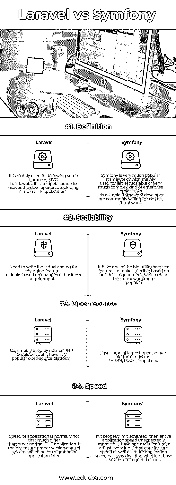

# Laravel vs Symfony

> 原文：<https://www.educba.com/laravel-vs-symfony/>

## Laravel 与 Symfony 的区别

Laravel vs Symfony 主要来自于 PHP 背景，所以常见的 PHP 关键功能在两者中都已经可用。Symfony vs Laravel 都支持普通的搜索技术，比如支架和全文。类似地，任何网站的两个基本特征，像跨脚本和多语言内容都由这两个框架支持。根据目前的研究，Laravel 和 Symfony 都支持以下常见功能，如脚手架，全文搜索，多语言内容，跨平台操作系统，PHP 作为编程语言，遵循模型视图控制器，依赖注入，名称空间，支持多用户系统，自动对焦，pingback，扩展或插件，图像处理引擎，所见即所得编辑器不可用，多个项目的效用，外部页面，用户统计，修订控制，PSR 0 投诉，orm 或对象关系映射，以及机器代码生成。

两者都是最受所有开发者欢迎的框架，主要是一些令人惊叹的特性。所有这些特性在任何 PHP 技术或框架中都很常见；这两者都受到那些吸引开发人员根据需求使用相同频率的特性的支持。有几种方法可以开发或构建任何 web 应用程序。我们有很多方法或技术来建造它。但是如果任何人需要在尽可能短的时间内开发具有完整功能的高质量网站，并保持适当的外观和功能要求，开发者总是更喜欢用 PHP 开发同样的网站。如果任何合适的 web 应用程序的快速开发需要，那么 PHP 对于整个全球开发者来说总是一种可接近的技术。

<small>网页开发、编程语言、软件测试&其他</small>

### Laravel 和 Symfony 之间的正面比较(信息图)

以下是 Laravel 与 Symfony 的 4 大区别:

### Laravel 和 Symfony 的主要区别

两者都是市场上的热门选择；让我们讨论一些主要差异:

1.  Laravel 主要用于下面一些常见的 MVC 特性；它是开源 PHP 平台之一，任何开发者都很容易使用和理解。而 Symfony 主要是为大规模或复杂类型的企业项目设计的，主要用于大型应用程序，其中包含大量的功能和大多数客户的使用。交响乐是一个稳定的框架；大客户总是喜欢这样。
2.  就 Laravel 而言，开发人员需要编写一些额外的代码，以便根据客户不断变化的需求保持适当的灵活性。而 Symfony 遵循一个额外的功能，使开发商或客户能够根据客户不断变化的需求灵活地切换不同的设计或功能。
3.  Laravel 没有任何特殊的方法来处理应用程序的可伸缩性；开发人员需要编写自己的代码来处理这些问题。Symfony 有几个平台来保持适当的可扩展性，如优化 propels，最小化或提供一些限制创建对象的数量，引入 join 实用程序，这有助于最小化直接影响性能的查询数量，临时数组创建机制避免 Symphony 始终保持高可扩展性。
4.  Laravel 有一个很大的用途，就是通过高级查询构建器机制的一个很大的用途来共享或强制执行来自多个数据库对象的一些公共约束值。而 Symfony 有一些额外的连接特性，用于维护正确和快速的查询构建。
5.  Laravel 没有任何特殊的工具来保持每个特性的速度。而 Symfony 有以下 verities 方法来非常灵活地维护或处理应用程序速度。对于单个模块或功能的特定速度以及整个应用程序的速度，它有一个非常智能的方法。开发人员可以通过调整编码质量或避免某些特定客户端核心功能中可能不需要的外部功能，轻松处理或管理整个应用程序或单个功能的速度。
6.  Laravel 从未确保应用程序正常运行。而 Symfony 总是确保为开发者保持适当的应用程序性能。它总是优先考虑用户需求和应用程序的最佳性能。Symfony 2 引入了一个重要的特性:HTTP 缓存处理器，通过使用适当的 HTTP 请求和响应。使用相同的总是提供适当的性能，它有助于在应用程序和页面的不同部分之间给定适当的变化。

### Laravel 与 Symfony 对比表

让我们看看顶部的对比——

| **比较的基础** | 拉勒维尔 | **symphony** |
| **定义** | 它主要用于遵循一些常见的 MVC 框架。它是开源的，开发者可以使用它来开发一个简单的 PHP 应用程序。 | Symfony 是一个非常流行的框架，主要用于最大的可扩展或非常复杂的企业项目。由于它是一个稳定的框架，开发人员通常愿意使用这个框架。 |
| **可扩展性** | 需要根据业务需求的变化为不断变化的功能或外观编写单独的代码。 | 它在给定的特性上有一个很大的效用，可以根据业务需求使它灵活，这使得这个框架更受欢迎。 |
| **开源** | 普通 PHP 开发人员常用，他们没有任何流行的开源平台。 | 拥有一些最大的开源平台，如 PHPBB、Piwik、Drupal 等。 |
| **速度** | 应用程序的速度通常与其他普通 PHP 应用程序没有太大区别。它主要确保一个适当的版本控制系统，这有助于以后应用程序的迁移。 | 如果实现得当，那么整个应用程序的速度会出乎意料地提高。它有一个很棒的功能，可以通过决定是否需要这些功能来轻松调整每个核心功能的速度以及整个应用程序的速度。 |

### 结论

根据上面的讨论，两者都是 PHP 语言中非常流行和有用的框架；开发人员可以根据项目需求使用任何人。如果一个应用程序过于复杂，这意味着它有许多不同的积极功能，那么 Symfony 永远是最好的选择。而 Lavarel 总是最适合页面数量有限的简单应用程序。如果客户希望在网页应用程序中随时对用户负载进行适当的优化，并且适当地保持应用程序的速度，那么 Symfony 总是 PHP 技术中的最佳选择。

### 推荐文章

这是拉弗尔和 Symfony 之间最大差异的指南。在这里，我们还讨论了 Laravel 与 Symfony 的主要区别，并提供了信息图表和比较表。您也可以看看以下文章，了解更多信息–

1.  [Drupal 7 vs Drupal 8](https://www.educba.com/drupal-7-vs-drupal-8/)
2.  [Laravel vs CakePHP](https://www.educba.com/laravel-vs-cakephp/)
3.  [Codeigniter vs Laravel](https://www.educba.com/laravel-vs-codeigniter/)
4.  [拉腊维尔 vs Yii](https://www.educba.com/laravel-vs-yii/)

