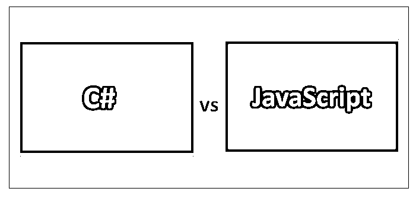
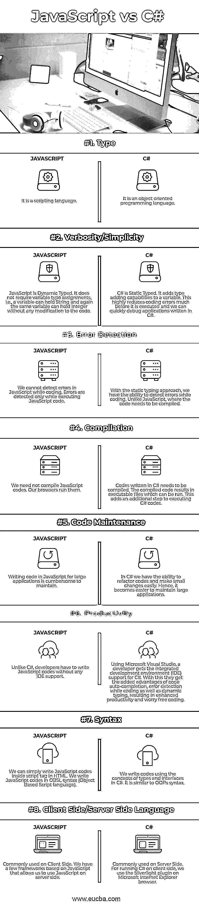

# C#与 JavaScript

> 原文：<https://www.educba.com/c-sharp-vs-javascript/>




## C#和 JavaScript 的区别

C#是一种通用的、面向对象的编程语言。它旨在成为一种简单、现代和通用的语言。它被设计用来构建从小功能到大操作系统的软件。它也是一种多范式语言，是强类型、命令式、声明式、函数式和面向组件的，而 JavaScript 是一种高级编程语言。它主要用于网络浏览器。与 HTML 和 CSS 一起，JavaScript 是万维网的基础。它使客户机和服务器之间的交互成为可能。绝大多数网站使用 JavaScript，几乎所有现代网络浏览器都有 JavaScript 引擎。JavaScript 支持事件驱动、函数式和命令式编程风格，它是一种多范式语言。它可以处理文本、数组、正则表达式、日期，并且可以执行文档对象模型(DOM)的基本操作。

### JavaScript 是什么？

[JavaScript 是](https://www.educba.com/what-is-javascript/)容易学习的一种编程语言。JavaScript 遵循 ECMAScript 标准以及 ECMAScript 标准中没有的一些特性。JavaScript 是一种脚本语言，由 Netscape 于 1995 年首次推出。
最初，JavaScript 被用作客户端编程语言。随着语言的不断增强，更多的新功能被添加进来，以扩展其对服务器端脚本、PDF 软件和字处理的支持。今天，JavaScript 是相当流行和广泛使用的脚本语言，与 CSS 和 HTML 一起创建互动和美丽的网站。

<small>网页开发、编程语言、软件测试&其他</small>

### 什么是 C#？

当微软把。在 2000 年左右，它引入了由欧洲计算机制造商协会(ECMA)和国际标准组织(ISO)批准的 C#。C#中的哈希符号“#”通常被称为单词“SHARP”。C#是一种面向对象的编程语言，它与 Visual Studio IDE 完全集成。C#的编码结构与 Java 非常相似。C#需要编译，因此可以在各种平台上编译。C#也是微软的一部分。NET 框架。

### C#和 JavaScript 的直接比较(信息图表)

下面是 C#和 JavaScript 之间的 8 大区别:




### C#和 JavaSript 的主要区别

既然我们已经讨论了 C#和 JavaScript 语言的大部分基本特性，在这一部分我们可以讨论一些其他的区别

*   JavaScript 有如此多的教程、文档和帮助，很容易学习。
*   C#是如此复杂和庞大，它可能会吓到初学的人。
*   JavaScript 和 C#这两种语言的开发者社区和同行网络都很强大，但事后看来，c#在 windows 开发者中似乎有更好的同行群体。
*   如今，没有人能逃脱只学习一种语言的惩罚，所以从哪一种语言开始并不重要。从长远来看，同时了解 JavaScript 和 C#只会有好处。
*   一般来说，一个人需要像 Java 一样用 C#写这么多行代码才能完成任务，而在 JavaScript 中却不是这样。
*   C#的语言语法比普通的 JavaScript 更加一致。
*   JavaScript 的一个好处是它仍在发展，其他语言中构建的更新的东西也开始进入 JavaScript。
*   现在 TypeScript 在进化，值得学习。TypeScript 为 JavaScript 带来了许多普通实现中没有的关键特性。
*   JavaScript 有数以千计的免费库和强大的社区支持，而 C#非常有限，因为它主要基于 windows。

### 例子

下面是 C#和 JavaScript 之间最重要的例子

*   下面的例子展示了一个运行的 JavaScript 脚本，它在浏览器上显示一个文本，点击文本，我们会看到文本的颜色发生了变化。

#### Java Script 语言

```
<html>
<body>
<p onclick="myFunction(this, 'red')">Click to change color.</p>
<script> function myFunction(element,colour) { element.style.color = colour; } </script>
</body>
</html>
```

*   下面的例子使用 C#打印了我们一直最喜欢的字符串 Hello World。

#### C#

```
using System;
namespace HelloWorldApplication
{
class HelloWorld
{
static void Main(string[] args)
{
/* my first program in C# */
Console.WriteLine("Hello World");
Console.ReadKey();
}
}
}
```

*   下面的例子展示了如何编写 JavaScript 脚本，以便在 web 浏览器上运行它时显示一个按钮。点击按钮，我们就能看到日期和时间。

#### Java Script 语言

```
<html>
<body>
<h1>My First JavaScript</h1>
<button type="button" onclick="document.getElementById('demo').innerHTML = Date()"> Click me to display Date and Time</button> <p id="demo"></p>
</body>
</html>
```

*   以下示例显示了如何在 C#中使用 FileStream 类来读写文件。

#### C#

```
using System;
using System.IO;
namespace FileIOApplication
{
class Program
{
static void Main(string[] args)
{
FileStream F = new FileStream("test.dat", FileMode.OpenOrCreate, FileAccess.ReadWrite);
for (int i = 1; i <= 20; i++)
{
F.WriteByte((byte)i);
}
F.Position = 0;
for (int i = 0; i <= 20; i++)
{
Console.Write(F.ReadByte() + " ");
}
F.Close();
Console.ReadKey();
}
}
}
```

*   从上面的例子中，我们可以简单地复制粘贴 JavaScript 示例代码，将它们粘贴到一个文本文件中，并将文件的扩展名更改为. html。这将使我们能够执行代码。为了运行 C#示例，我们可以使用 C# IDE，即 Microsoft Visual Studio，或者使用命令行来编译 C#代码。
*   就像我们之前讨论的那样，对于以上两个例子，JavaScript 可以在任何浏览器中执行。但是 C#更多的是在 Windows server 上进行服务器端编程。
*   JavaScript 是弱类型，而 C#是强类型。从上面的例子中，我们看到了 C#中类和类型的使用，而 JavaScript 却没有类型定义。

### C#和 JavaScript 对照表

我们来看看 C#和 JavaScript 的顶部对比。

| **比较的基础** | **C#** | **JAVASCRIPT** |
| **类型** | 它是一种面向对象的编程语言。 | 它是一种脚本语言。 |
| **冗长/简单** | C#是静态类型的。它为变量增加了类型添加功能。这大大减少了执行前的编码错误，我们可以快速调试用 C#编写的应用程序。 | JavaScript 是动态类型的。它不需要变量类型赋值，也就是说，一个变量可以保存字符串，同样的变量也可以保存整数，而不需要对代码做任何修改。 |
| **错误检测** | 使用静态类型方法，我们能够在编码时检测错误。不像 JavaScript，代码需要编译。 | 我们无法在编码时检测 JavaScript 中的错误。只有在执行 JavaScript 代码时才会检测到错误。 |
| **编译** | 用 C#写的代码需要编译。编译后的代码会生成可运行的可执行文件。这为执行 C#代码增加了一个额外的步骤。 | 我们不需要编译 JavaScript 代码。我们的浏览器运行它们。 |
| **代码维护** | 在 C#中，我们有能力重构代码，并轻松地做一些小的改动。因此，维护大型应用程序变得更加容易 | 用 JavaScript 为大型应用程序编写代码很难维护。 |
| **生产率** | 使用 Microsoft Visual Studio，开发人员可以获得集成开发环境(IDE)对 C#的支持。通过这种方式，他们获得了代码自动完成、编码时的错误检测以及动态键入的额外优势，从而提高了生产率并使编码无忧。 | 与 C#不同，开发人员必须在没有任何 IDE 支持的情况下编写 JavaScript 代码。 |
| **语法** | 我们使用 C#中的类型和接口概念编写代码。它类似于 [OOPs](https://www.educba.com/oops-java-interview-questions/) 语法。 | 我们可以简单地在 HTML 的脚本标签中编写 JavaScript 代码。我们用 OBSL 语法(基于对象的脚本语言)编写 JavaScript 代码。 |
| **客户端/服务器端语言** | 通常在服务器端使用。为了在客户端运行 C#，我们使用了 Microsoft Internet Explorer 浏览器上的 Silverlight 插件。 | 通常在客户端使用。我们有一些基于 JavaScript 的框架，允许我们在服务器端使用 JavaScript。 |

### 结论

基本上，JavaScript 是由 Netscape Communications 开发的脚本语言。它最初是为开发客户端应用程序而设计的，但后来也引入了对服务器端编码的支持。有几种基于 JavaScript 构建的框架，比如 JQuery、Angular.js、ReactJS 和 Meteor.js 等等。JavaScript 有一个不断增长的社区，并且不断更新新的特性。C#是一种面向对象的编程语言，由微软开发，项目由安德斯·海尔斯伯格负责。如果我们有 Java 或 C++编程语言的基础知识，C#代码是很容易学习的。C#的最新版本是 15.7.2，与微软 Visual Studio 2017 一起使用。
根据组织要求，大部分客户端工作都是用 JavaScript 完成的。我们浏览的大多数网站都使用 JavaScript。虽然 C#有它自己的优点，但相比之下 JavaScript 更受欢迎，我们可以很容易地找到专业开发人员。C#也很流行，但是在用法上有点过时。

### 推荐文章

这是 C#和 JavaScript 之间最大区别的指南。在这里，我们还将讨论直接差异、关键差异以及信息图和比较表。您也可以看看下面的 C#与 JavaScript 文章来了解更多信息

1.  [C 与 C#](https://www.educba.com/c-vs-c-sharp/)
2.  [JavaScript vs JQuery](https://www.educba.com/javascript-vs-jquery/)
3.  [Python vs C#](https://www.educba.com/python-vs-c-sharp/)
4.  [JavaScript 与安圭拉](https://www.educba.com/javascript-vs-angularjs/)


