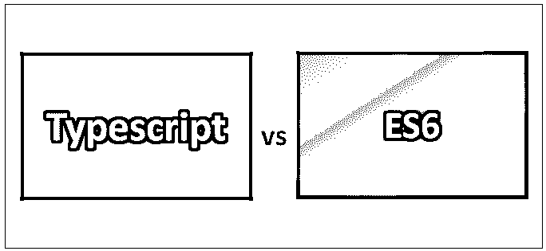
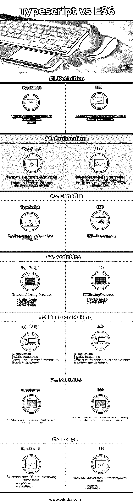

# Typescript vs ES6

> 原文：<https://www.educba.com/typescript-vs-es6/>

## Typescript 和 ES6 的区别

微软推出了 typeScriptsoft，它是一种开源的编程语言。在 Microsoft Visual Studio 2013 中，TypeScript 作为一级编程语言包含在内。typescript 的编译器只写 typescript，是[编译成 Javascript](https://www.educba.com/javascript-interview-questions/) 。

ES6 的完整形式是 ECMA 脚本 6。ES6 的主要目的是为普通 JS 和 AMD 的用户创建一种格式，两者都应该受益，它是脚本语言。它主要帮助应用程序启用客户端脚本。

<small>网页开发、编程语言、软件测试&其他</small>

[Typescript 是 javascript 的](https://www.educba.com/what-is-typescript/)组合和 Javascript 的一些[附加特性](https://www.educba.com/features-of-javascript/)。而且也是一套工具和语言的结合。它只是一个 javascript，并且支持其他 JS 文件。它是便携式的。

typescript 是一种开源工具。我们可以在任何浏览器或任何主机上运行它。有三种类型的打字稿。

1.  任何类型
2.  内置类型
3.  用户定义的类型。

标识符的主要用途是它包括数字和字符，但在这里，我们需要记住一件事，标识符不能以数字开头，所以它应该总是先以字符开头，然后以数字开头。它不应该有空格，也不应该有任何关键字，但它应该是唯一的。

ES6 (ECMA 剧本 6) 有这么多新功能，下面是其中一些:

*   模块
*   模板文字
*   收集
*   承诺
*   解构分配

ES6 中有两种循环，一种是由 For 循环组成的确定循环，另一种是不确定循环；它由 while 循环和 do while 循环组成。

这里 ES6 函数是返回的和参数化的，在类型脚本和 ES6 中都有许多其他函数。ES6 布尔对象代表真或假。布尔属性是构造器和原型。Boolean 中主要有三种类型 tosource()、tostring()和 valueof()。

ES6-String 帮助我们处理一系列字符，字符串属性包括构造函数、长度和原型。一个 ES6 字符串中有这么多方法。以前，并非所有的浏览器都支持 es6，但现在大多数浏览器都支持这些工具，但仍有一些浏览器不支持 ES6。

ES6 提出了一种在函数中返回多个值的简单方法。以前的开发者提出了许多方法，但是与所有这些相比，ES6 非常简单。

typescript [接口](https://www.educba.com/typescript-interface-vs-class/)是语法契约；它有助于定义实体语法。它定义了方法、事件和属性，这些也是接口的成员。它还负责派生类来定义成员。它还有助于提供派生类将遵循的标准结构。为了声明一个接口，我们使用了“interface”关键字。

### Typescript 和 ES6 之间的直接比较(信息图表)

下面是 Typescript 和 ES6 之间的 7 大区别:

### Typescript 和 ES6 之间的主要区别

Typescript 和 ES6 之间的主要区别在以下几点进行了解释:

1.  如果我们比较 Typescript 和 ES6，我们不会发现太多的不同。我们用 Typescript 写的所有东西都被 ES6 支持，反之亦然。Typescript 是 ESI 的扩展。我的意思是，Typescript 中添加了一些功能。
2.  由于类和模块等特性，开发人员总是更喜欢 Typescript，但现在 JavaScript 中也有相同的特性(在 ES6 引入后)，您可以使用 Babel 向下转换到 ES5 以获得更大的浏览器兼容性。
3.  现在我们将看到何时需要选择 Typescript 还是 ES6。如果我们想更喜欢编译时类型检查或使用新的库或框架，那么我们需要使用 Typescript。如果是最大的项目，我们需要多个开发人员，那么 [Typescript](https://www.educba.com/install-typescript/) 是最好的选择。
4.  ES6 主要倾向于内置所需工具或用于小型项目。我们需要记住，如果我们需要一个强大的测试工作流，我们必须使用 ES6。

### Typescript 和 ES6 比较表

以下是积分列表；描述一下 Typescript 和 ES6 的对比。

| 【Typescript 与 ES6 的比较基础 | **打字稿** | **ES6** |
| **定义** | Typescript 是为了根除开发错误 | ES6 在开发时间上相对更灵活 |
| **解释** | TypeScript 是一种免费的开源编程语言。它由微软开发和维护。 | ES6 是 ECMAScript (ES)的一个版本，ECMAScript 是由 ECMA 国际标准化的脚本语言规范。 |
| **好处** | [TypeScript 支持](https://www.educba.com/typescript-versions/)所有原始数据类型 | ES6 将不支持。 |
| **变量** | Typescript having 3 scopes.

1.全球范围

2.类别范围

3.局部范围

 | ES6 having 2 scopes.1.全球范围2.局部范围 |
| **决策** | 1\. if Statement2.if-else 语句3.else…if 和嵌套 if 语句4.交换语句 | 1\. if Statement2.if-else 语句3.else- if 梯形/嵌套 if 语句

4.[开关](https://www.tutorialspoint.com/es6/es6_switch_case_statement.htm)–[案例陈述](https://www.tutorialspoint.com/es6/es6_switch_case_statement.htm)

 |
| **模块** | 模块有两种类型:内部和外部模块 | 在 ES6 中，模块分为导入模块和导出模块。 |
| **循环** | Typescript and ES6 both are having the same loops.一定的模糊的 | Typescript and ES6 both are having the same loops.一定的模糊的 |

### 结论

JavaScript 在 1995 年作为一种弱类型脚本语言被 Netscape 引入，以使 HTML 成为动态的 T2。Java 脚本中有几个版本。希望最新版本是 ES7，但是很多浏览器都懂 ES5。

如果我们比较 Typescript 和 es6，在我看来，Typescript 比 ES6 更有优势。typescript 的另一个主要优点是，它将对所有 JS 文件进行快速的完整性测试，以识别语法错误。我们可以很容易地将 JavaScript 移植到 Typescript。

对于 typescript，有 3 种类型的类，但是 es6 有 2 个类。Typescript 类包括字段、构造函数和函数，但是如前所述，es6 包括构造函数和函数。

最后，我想得出结论，typescript 更可取，因为在 typescript 中，代码在编译成 JavaScript 并投入生产之前更加稳定并得到正确验证。如果我们不与此进行比较，那么我们可以使用 es6，更明确地说，两者是相同的；Typescript 和 ES6 之间的唯一区别是静态类型。如果我们使用任何其他工具来识别编码错误，那么您可以使用 JavaScript。如我所说，早期的 typescript 是现代的 Javascript。

### 推荐文章

这是 Typescript 和 ES6 之间主要区别的指南。我们还讨论了 Typescript 与 ES6 的直接比较、主要差异以及信息图和比较表。您也可以看看以下文章——

1.  [镖](https://www.educba.com/typescript-vs-dart/) [vs 打字稿差异](https://www.educba.com/typescript-vs-dart/)
2.  [TypeScript vs CoffeeScript](https://www.educba.com/typescript-vs-coffeescript/)
3.  [流](https://www.educba.com/typescript-vs-flow/) [vs 打字稿有用比较](https://www.educba.com/typescript-vs-flow/)
4.  [ES6 vs ES5:有什么区别](https://www.educba.com/es6-vs-es5/)
5.  [不同类型的脚本操作符示例](https://www.educba.com/typescript-operators/)

