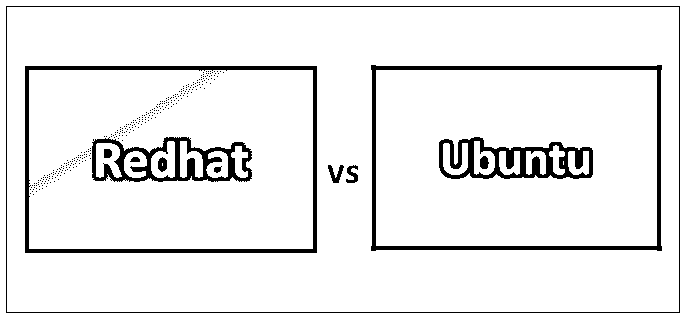
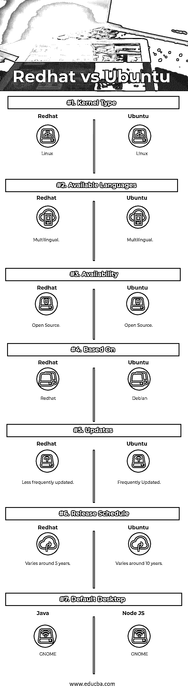

# Redhat vs Ubuntu

> 原文：<https://www.educba.com/redhat-vs-ubuntu/>

## Redhat 和 Ubuntu 的区别

操作系统是一种软件程序，它运行并控制安装在它上面的所有其他程序。操作系统还负责有效利用系统内存。下面列出了操作系统的几个关键组件。

*   核心
*   用户界面
*   应用程序界面

市场上流行并广泛使用的操作系统有 Windows、Linux、 [Redhat](https://www.educba.com/what-is-redhat/) 、Mac、Ios、 [Ubuntu](https://www.educba.com/uses-of-ubuntu/) 、Unix 等。

<small>网页开发、编程语言、软件测试&其他</small>

### 什么是 Linux？

Linux 是一个面向社区的操作系统，运行在市场上众多的计算机上。它类似于 Unix。有多个发行商将这个操作系统带到系统中。下面列出的 Ubuntu 和 Redhat 是其中的佼佼者。

#### Red Hat Linux

Linux 是市场上流行的著名操作系统之一，几家经销商将这种操作系统端上了客户的餐桌；一顶红帽子是其中之一。他们将最初的版本命名为 Red Hat Commercial Linux。Red Hat Enterprise Linux 是 Red Hat 发布的较晚且更著名的产品之一。RHEL 发布了多个服务器和桌面版本。它支持几乎所有类型的负载，无论是云系统、虚拟系统还是物理系统。

RHEL 的最初版本是开源的，而在未来，红帽与 fedora 组织携手维护两个不同版本的 Linux 红帽操作系统。一个是 RHEL，它在较小的版本中保持稳定，另一个是 FEDORA，它有更频繁的版本发布。RHEL 的常用工具有 firefox、CUPS、MYSQL、OpenOffice、Python 等。Redhat 推出了一个名为 Anaconda 的图形安装程序。

#### Ubuntu Linux

Ubuntu 的意思是“对他人的仁慈”,这个高效的软件被构建出来，并在构建的所有层中保持这一点。Ubuntu 是另一个开源 OS，也是 Linux 发行版；Ubuntu 支持商业、教育和个人家庭使用。Ubuntu 基于 Debian OS。拥有大约 2000 万用户。

基于 GUI 的操作系统，包含以下功能:

*   系统的外观和感觉
*   向可用性和易用性发展
*   桌面的组织
*   用户如何导航桌面
*   像 Firefox、Chrome 等 Windows 软件。默认情况下，Ubuntu 桌面版支持。
*   快速启动和全功能
*   键盘语言选择器
*   高度定制
*   基于社区的操作系统

### Redhat 和 Ubuntu 的正面比较

以下是 Redhat 和 Ubuntu 的 7 大区别:

### Redhat 和 Ubuntu 的主要区别在于

以下几点解释了 Redhat 和 Ubuntu 之间的主要区别:

*   平台焦点: Ubuntu 专注于桌面用户，精心设计其用户友好的外观和访问；red hat 将服务器平台作为首要目标。
*   **系统的基础:** Ubuntu 是以 Debian 为基础构建的，所有的属性和特性都是参考了这个现有的专业 OS Debian，在这种情况下，Redhat 不跟随任何来源，是一个独立构建的 [OS 系统](https://www.educba.com/os-interview-questions/)。
*   **包管理器:**包管理器类似于设备或程序管理器。软件包管理器允许安装，删除，升级系统中的程序。Ubuntu 中这个包管理器的扩展是。deb 指的是 Debian 和。rpm 引用 Redhat 中的 Redhat 包管理器。
*   **软件可用性:**Ubuntu 有大量的软件[可用，但就红帽而言，这些软件都是小仓库，有限的软件支持使其缺乏个性化。](https://www.educba.com/linux-vs-ubuntu/)
*   **云简介:**这两家公司都拥有公认的商业支持，当将这些系统推到云上时，Ubuntu 仍然保持完整的功能和出色的支持。
*   **与 Docker 的集成:** Docker 是一个允许管理虚拟化应用程序容器的软件平台。所以 Ubuntu 和 Redhat 都提供了 Docker 的集成。但是红帽通过认证 [Docker 应用保持领先。](https://www.educba.com/docker-alternatives/)
*   **支持因素:** Ubuntu 相当简化，为其 OS 提供了广泛的支持；Redhat 更看重系统的稳定性和性能，而不是支持因素。为了保持这一点，它与旧包一起进入市场，这确保了它的可靠性和稳定性，但事实上，对 red hat 的支持期长达 10 年。
*   **安全:**红帽发布快速安全更新，并通过安装集群的概念持有内置恢复解决方案。
*   对于初学者来说很容易: Redhat 对于初学者来说很难使用，因为它更像是一个基于 CLI 的系统，而不是；相比较而言，Ubuntu 对于初学者来说还是比较好用的。此外，Ubuntu 有一个很大的社区，随时帮助它的用户；此外，Ubuntu server 在之前接触过 Ubuntu Desktop 的情况下会容易得多。
*   为了保持应用程序之间的包兼容性，Red hat 更新了旧版本中暗示的所有错误，并在每个版本中发布了一个最佳的无错误发行版。与 Ubuntu 相比，red hat 的错误更少，而且每一个后续版本都是如此。

### Redhat 和 Ubuntu 对照表

以下是要点列表，描述了 Redhat 和 Ubuntu 之间的比较:

| **red hat 与 Ubuntu 的对比基础** | **红帽** | **Ubuntu** |
| **内核类型** | Linux 操作系统 | Linux 操作系统 |
| **可用语言** | 使用多种语言的 | 使用多种语言的 |
| **可用性** | 开放源码 | 开放源码 |
| **基于** | 美国红帽子的公司出品的计算机操作系统 | 一种自由操作系统 |
| **更新** | 更新频率较低 | 经常更新 |
| **发布时间表** | 它大约变化 5 年 | 它大约变化 10 年 |
| **默认桌面** | 土地神 | 土地神 |

### 结论

所选择的操作系统取决于用户的需求；如果用户期望稳定、高性能的基于服务器的必需品，那么 Red Hat 是最好的选择。如果用户坚持使用频繁更新的、用户友好的 GUI 系统，那么相比之下，Ubuntu 表现得很好。很明显，用户的需求会影响操作系统的选择。

### 推荐文章

这是 Redhat 和 Ubuntu 之间最大差异的指南。在这里，我们也讨论了 Redhat 和 Ubuntu 的主要区别，包括信息图和比较表。您也可以看看以下文章——

1.  [Java vs Go——找出不同点](https://www.educba.com/go-vs-java/)
2.  [Django vs Flask 有用的区别](https://www.educba.com/django-vs-flask/)
3.  [3DS Max vs Blender](https://www.educba.com/3ds-max-vs-blender/)
4.  [WordPress vs Weebly-找出差异](https://www.educba.com/wordpress-vs-weebly/)
5.  [流与打字稿——哪个更好](https://www.educba.com/typescript-vs-flow/)
6.  WordPress vs Django
7.  [3ds Max vs Sketchup:有什么区别](https://www.educba.com/3ds-max-vs-sketchup/)
8.  [Linux Mint 与 Ubuntu 的主要差异指南](https://www.educba.com/linux-mint-vs-ubuntu/)

