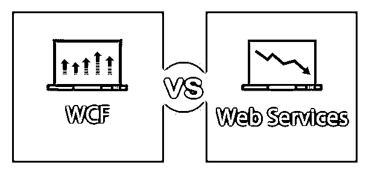
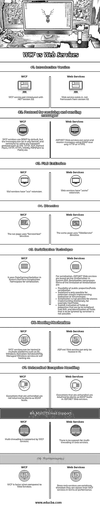

# WCF vs 网络服务

> 原文：<https://www.educba.com/wcf-vs-web-services/>

## WCF 和 Web 服务的区别

WCF 是所有早期网络服务技术的替代品。微软开发的。它取代了传统意义上的“web 服务”。Web 服务基于以 XML 形式返回数据的 SOAP。它只支持 HTTP 协议。它也不是开源的，任何理解 XML 的客户都可以使用。它只能在 IIS 中承载。

### 什么是 WCF？

WCF[基于 SOAP](https://www.educba.com/soap-vs-http/) 并以 XML 形式返回数据。它是 web 服务(ASMX)的扩展，支持各种协议，如 HTTP、HTTPS、TCP、命名管道、MSMQ 等。WCF 有一个繁琐和广泛的配置问题。它不是开源的，但是任何理解 XML 的客户都可以使用。它可以在应用程序或 IIS 中的多个平台上托管，或者使用窗口服务。

<small>网页开发、编程语言、软件测试&其他</small>

#### 在什么情况下必须使用 WCF？

*   为了进行商业交易，WCF 为我们提供了安全的服务器。
*   两个或更多的人可以使用基于 WCF 的聊天服务进行实时通信和交换数据。
*   一个仪表板应用程序，轮询一个或多个服务以获取信息，并以逻辑方式呈现信息。
*   将使用 Windows Workflow Foundation 实现的工作流作为 WCF 服务公开。

### 什么是 Web 服务？

如上所述，Web 服务在无状态环境中工作。它只能通过 HTTP 访问。WCF 服务可以托管在不同类型的应用程序中。因此，与 Web 服务不同，WCF 更加灵活。

WCF 可以在各种场景中被托管。此类场景包括 WAS、IIS、自宿主、托管 Windows 服务等服务。

### WCF 和 Web 服务的直接比较(信息图表)

下面是 WCF 与 Web 服务之间的 9 大区别

### WCF 和 Web 服务之间的主要区别

两者都是市场上的热门选择；让我们讨论一些主要的区别:

*   当从一个应用程序向另一个应用程序传输数据时，Web 服务只使用 HTTP 协议。另一方面，对于传输数据，与 ASP.NET web 服务相比，WCF 支持更多的协议。除了使用 HTTP 发送消息，WCF 还支持传输控制协议(TCP)、微软消息队列(MSMQ)和命名管道。
*   WCF 在架构上比 Web 服务更健壮。
*   XmlSerializer 用于 Web 服务中。WCF 使用 DataContractSerializer，它在性能方面比 XmlSerializer 更好。
*   当在不同平台上开发的多个应用程序之间进行通信时，我们使用 WCF。如果要从传输数据，使用 WCF 是唯一可能的方法。NET 平台上运行的任何其他应用程序，比如 Unix 或 Linux。
*   与 web 服务相比，WCF 的安全性非常高。

### WCF 与 Web 服务比较表

下面是 WCF 和 Web 服务之间的 9 个最重要的比较

| **比较的基础** | **WCF** | **网络服务** |
| **介绍版本** | WCF 服务始于。NET 3.0 版。 | Web 服务存在于. net framework 1.0 版中。 |
| **接收和发送消息的协议** | 默认情况下，WCF 服务使用 SOAP，但是消息可以是任何格式，并且可以使用任何传输协议来传送，例如 WS- HTTP、TCP、命名管道、HTTP、HTTPs、MSMQ、P2P(点对点)等。 | ASP.NET Web 服务只能通过 HTTP 或 HTTPS 使用 SOAP 发送和接收消息。 |
| **文件扩展名** | 周转基金服务有一个。svc”扩展。 | Web 服务有一个“.asmx”扩展名。 |
| **指令** | svc 页面使用“ServiceHost”指令。 | asmx 页面使用“WebService”指令。 |
| **序列化技术** | 它在系统中使用 DataContractSerializer。序列化的序列化命名空间。 | For serialization, ASP.NET Web services are based on the XmlSerializer in System.XML.Serialization namespace. Some of the limitations of XmlSerializer are:

*   公共属性/字段序列化的可能性。
*   序列化只能用于实现 Icollection 或 IEnumerable 的集合类。
*   对于实现 IDictionary(例如 HashTable)的类，序列化是不可能的。
*   不可能显式指示要序列化为 XML 的字段或属性，也不可能标识序列化程序要忽略的字段。

 |
| **托管机制** | WCF 服务可以在多个平台上托管，如 IIS、Windows 激活服务(WAS)、托管 Windows 服务或自托管等。 | ASP.net Web 服务只能在 IIS 中承载。 |
| **未处理的异常处理** | 未处理的异常不会作为 SOAP 错误返回给客户端。 | 在 ASP.NET Web 服务中，未处理的异常作为 SOAP 错误返回给客户端。 |
| **多线程支持** | WCF 服务支持多线程。 | web 服务中不支持多线程。 |
| **性能** | 与 Web 服务相比，WCF 更快 | 由于 web 服务使用序列化程序，因此在性能方面比 WCF 服务慢。 |

### WCF 与 Web 服务的例子

下面是 WCF vs Web 服务的例子如下:

#### 网络服务

下面的代码片段向我们展示了如何在 Web 服务中开发服务。

`[WebService] public class MyService
{
[WebMethod] public SumClass SumOfNums(string JsonStr)
{
var ObjSerializer = new JavaScriptSerializer();
var ObjSumClass = ObjSerializer.Deserialize<SumClass>(JsonStr);
return new SumClass().GetSumClass(ObjSumClass.First, ObjSumClass.Second);
}
}
public class SumClass
{
public int First, Second, Sum;
public SumClass GetSumClass(int Num1, int Num2)
{
var ObjSum = new SumClass
{
Sum = Num1 + Num2,
};
return ObjSum;
}
}`

#### WCF

下面的代码片段向我们展示了如何在 WCF 开发服务。

`ServiceContract] blic class MyService : WebService
{
[OperationContract] public SumClass SumOfNums(string JsonStr)
{
var ObjSerializer = new JavaScriptSerializer();
var ObjSumClass = ObjSerializer.Deserialize<SumClass>(JsonStr);
return new SumClass().GetSumClass(ObjSumClass.First, ObjSumClass.Second);
}
}
[DataContract] public class SumClass
{
[DataMember] public int First;
[DataMember] public int Second;
[DataMember] public int Sum;
public SumClass GetSumClass(int Num1, int Num2)
{
var ObjSum = new SumClass
{
Sum = Num1 + Num2,
};
return ObjSum;
}
}`

### 结论

从上面的讨论来看，WCF 服务绝对是 Web 服务的一项先进技术。就性能而言，WCF 比 web 服务更快。WCF 提供更好的安全性，支持各种协议以及消息格式。对于开发人员来说，WCF 唯一令人兴奋的地方是它的配置部分。然而，WCF4.0 通过引入默认配置设置也解决了这个问题。人们注意到，直到。NET3.5，visual studio，为 web 服务提供了一个直接的模板。从。NET4.0，我们没有得到任何直接的 web 服务模板。因此，我们需要创建一个 web 应用程序，并向其中添加一个 web 服务。

### 推荐文章

这是 WCF 与 Web 服务之间最大区别的指南。在这里，我们还将讨论信息图和比较表的主要区别。你也可以看看下面的文章来了解更多。

1.  [Ubuntu vs Windows 10](https://www.educba.com/ubuntu-vs-windows-10/)
2.  [手机应用 vs 网站](https://www.educba.com/mobile-apps-vs-website/)
3.  [睡眠模式与休眠模式](https://www.educba.com/hibernate-vs-sleep-mode/)
4.  [微软 Azure vs 亚马逊网络服务](https://www.educba.com/microsoft-azure-vs-amazon-web-services/)

