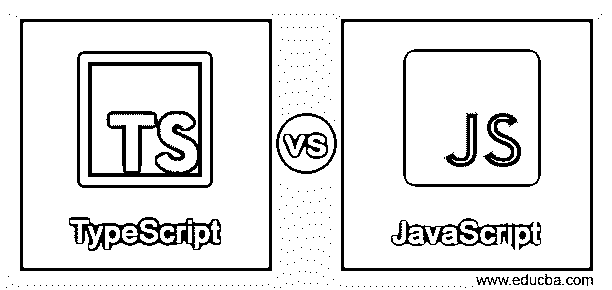
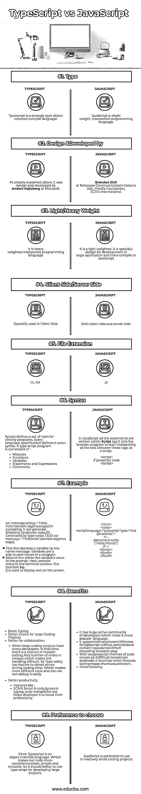

# 类型脚本与 JavaScript

> 原文：<https://www.educba.com/typescript-vs-javascript/>

## TypeScript 和 JavaScript 的区别

以下文章提供了 TypeScript 与 JavaScript 的概要。 [Typescript 是](https://www.educba.com/what-is-typescript/)一种开源编程语言。这意味着类型脚本是 [JavaScript](https://www.educba.com/what-is-javascript/) 加上其他特性。我们可以称之为 javascript 的超集，这意味着 Typescript 是 JavaScript 加上其他功能。

JavaScript 是一种轻量级的解释编程语言。它是一种动态编程语言。JavaScript 没有任何多线程或多重处理能力。它在 [web 开发](https://www.educba.com/career-in-web-development/)中用于增强 HTML 页面。

<small>网页开发、编程语言、软件测试&其他</small>

### TypeScript 和 JavaScript 的直接比较(信息图表)

以下是 TypeScript 与 JavaScript 之间的 9 大对比:

### TypeScript 和 JavaScript 之间的主要区别

下面总结了 Typescript 和 JavaScript 之间的主要区别:

*   Typescript 相对于 JavaScript 的主要优势在于，Typescript 是 JavaScript 的超集。因此，Typescript 是为开发一个大型程序而设计的，该程序可以反编译成 JavaScript。
*   JavaScript 在开发中用于以交互和设计的方式增强 HTML 页面。它被使用，特别是在客户端。但是 Typescript 可以用于开发客户端和服务器端的 JavaScript 应用程序。它是为开发一个大型应用程序而设计的，这个应用程序可以反编译成 JavaScript。
*   JavaScript 的主要优势之一是它不需要昂贵的开发工具；您可以从简单的文本编辑器(如记事本)开始。因为它是网页浏览器内部的解释语言，所以你甚至不需要购买编译器。而它的对应物 Typescript 作为一流的编程语言被包括在内，以通过插件支持昂贵的 IDE visual studio 2013 update 2 和 Eclipse，这是特定技术的贡献。
*   我们不能将 javascript 用作成熟的编程语言，因为它缺乏各种重要的特性，例如客户端 JavaScript 不允许读取或写入文件，而 Typescript 是一种强类型的面向对象编译语言。它既是一种语言，也是一套工具。
*   Typescript 支持其他 JavaScript 库，Typescript 生成的 JavaScript 可以重用所有的 JavaScript 框架、工具和库。
*   微软开发 typescript 的主要原因是让它在微软及其外部客户的大规模应用程序开发中使用。
*   JavaScript 不能用于网络应用程序，因为它没有这样的支持。
*   Typescript 支持定义文件，可以保存现有 JavaScript 库的类型信息，很像 [C++头文件](https://www.educba.com/c-plus-plus-header-files/)，可以描述现有对象文件的结构？所以这允许其他程序使用文件中定义的值。
*   typescript 编译器是用 Typescript 编写的，它编译成 JavaScript。

### TypeScript 与 JavaScript 的比较表

下面是 TypeScript 与 JavaScript 之间的比较表:

| **比较的基础** | **打字稿** | **JavaScript** |
| **类型** | Typescript 是一种强类型面向对象编译语言。 | JavaScript 是一种轻量级的解释型编程语言。 |
| **设计&**
**研制**
**由** | 如上所述，它是由微软的 Anders
Hejlsberg 设计和开发的。 | Brendan Eich，网景通信公司，Mozilla 基金会，ECMA 国际公司。 |
| **轻/重重量** | 它很重。一种解释的编程语言。 | 它很轻。它是专门为开发大型
应用程序和将
编译成 JavaScript 而设计的。 |
| **客户端/服务器端** | 专门用于客户端
端。 | 客户端和
服务器端。 |
| **文件扩展名** | .ts，。tsx | .射流研究… |
| **语法** | 语法定义了一套编写
程序的规则。每种语言规范都定义了自己的语法。一个打字稿程序由以下部分组成:

*   module
*   function
*   variable
*   Statements and expressions
*   annotate

 | 在 JavaScript 中，所有的
语句都写在脚本标签的
中。它告诉浏览器程序开始
将这些标签之间的所有文本
解释为
脚本<脚本> // javascript 代码</脚本>。 |
| **例子** | var message:string =
" Hello India " console . log(message)在编译时，会生成下面的
JavaScript 代码。//它由
typescript 1 . 8 . 10
var message = " Hello
India "生成；
console.log(消息)；

*   The first line declares a variable named message. A variable is a way of saving values in a program.

*   The second line prints the variable value to the prompt. Here, the console refers to the terminal window. The log () function is used to display text on the screen.

 | 
<正文>
<脚本
语言="javascript"
类型= " text/JavaScript ">
<！–
document . write
(“Hello World！”)
//–>
</脚本>
</正文>
< /html > |
| **好处** | 

*   Static typing.
*   A good choice for large coding projects.
*   When a large coding project has many developers, it is more suitable for collaboration.o During this time, there is an opportunity for messier coding. And the number of errors increases, which makes processing difficult. Therefore, type safety has the characteristic of detecting errors during coding. This makes the code more efficient, and we can debug it easily.
*   Better productivity. Eccript6 code, dynamic type, autocomplete and other features help developers improve their work efficiency.

 | 它有一个庞大的活跃的开发者社区，这使它成为一种更受欢迎的语言。*   It supports native browsers. Typescript will be compiled and converted into javascript first. This creates an additional step.*   With the original javascript, there are more lines of code, so when the code is larger than the corresponding code, it is difficult to maintain and make it error-free.*   More flexible.T9】 |
| **偏好**
**选择** | 由于 Typescript 是面向对象的
语言。这使得
我们的代码更加一致，
干净、简单和可重用。所以开发大型项目最好使用 typescript
。 | JavaScript 更适合用于相对较小的编码项目。 |

### 结论

Brendan Eich 在 1995 年为 Netscape 的 Netscape Navigator web 浏览器发明了 JavaScript。它是用 C 实现的，它的代号是蜘蛛猴。该项目最初被称为 Mocha，然后被重命名为 Live Script，最后，当 Netscape 和 Sun 达成许可协议时，它再次被重命名为 JavaScript。它在 1997 年获得了 ECMA 标准。但它不是一种完全成熟的编程语言。它是一种在 web 浏览器环境中的解释性语言。

Typescript 是设计和开发，特别是对于大型应用程序，并转换编译为 javascript。这意味着 Typescript 是带有一些额外加载特性的 JavaScript。它是由微软的 C#设计师安德斯·海尔斯伯格设计的。它是根据 Apache 2 许可的。它被编译成 JavaScript，可以用于任何 JavaScript 代码，所以使用 Typescript 有更多的优势。它的受欢迎程度和采用率正在急剧上升。该项目随着每个版本的发布而改进，并且随着新版本的发布会增加更多令人兴奋的特性。

### 推荐文章

这是一个关于 TypeScript 和 JavaScript 的指南。在这里，我们讨论了 TypeScript 与 JavaScript 的直接比较、关键差异以及信息图表和比较表。您也可以阅读以下文章，了解更多信息——

1.  [JavaScript vs Ruby](https://www.educba.com/javascript-vs-ruby/)
2.  [HTML5 vs JavaScript](https://www.educba.com/html5-vs-javascript/)
3.  [Java vs JavaScript](https://www.educba.com/java-vs-javascript/)
4.  [JavaScript vs Python](https://www.educba.com/python-vs-javascript/)

