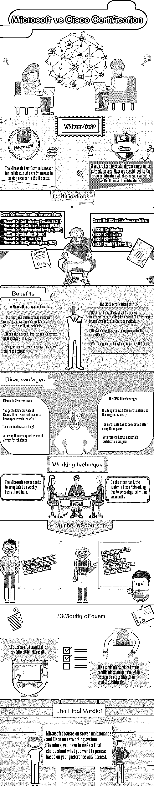
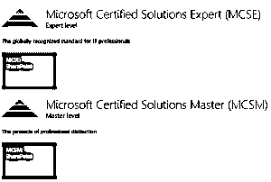
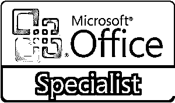
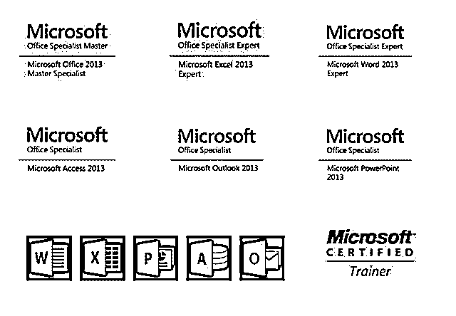
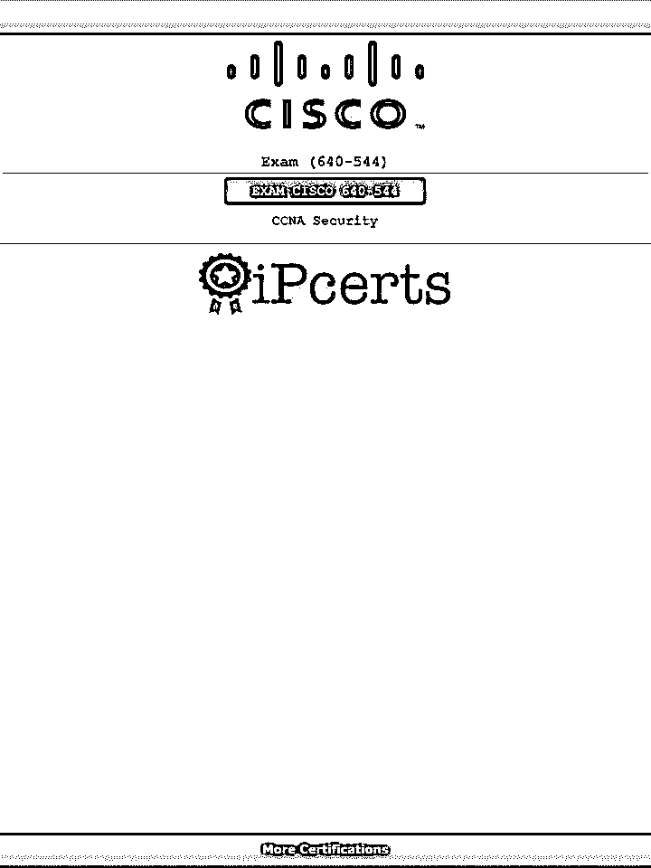
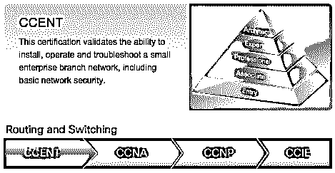

# 思科认证与微软——哪个更适合你？

> 原文：<https://www.educba.com/cisco-certification-vs-microsoft/>

## 思科认证与微软认证的区别

在当今竞争激烈的世界，获得专业证书或学位与学术教育同等重要。大多数跨国公司，甚至是著名的 IT 巨头都希望雇佣那些精通计算机、拥有优秀学术背景的候选人。专业认证授予那些已经完成授权培训中心的课程或学习的候选人。候选人必须参加考试，合格后才能获得证书。该证书是你有资格在 IT 行业获得某个职位的真实证明。除此之外，保持对技术变化的了解是非常重要的。如果你深入研究这些话题会有所帮助。

然而，你也必须定期更新你的认证。有些可能终生有效。您可能需要参加重新认证考试，或者表明您正在继续学习。IT 部门已经成为当今最大的雇主之一，提供[高薪](https://www.educba.com/salary-raise-expectations/ "How to Ask for a Salary Raise")和有利可图的未来。因此，当你出去申请工作时，证书证明是你简历中的额外加分。有一些认证侧重于特定的技术知识。这些技术的供应商提供了它们。

<small>网页开发、编程语言、软件测试&其他</small>

追求计算机专业认证的候选人确实对选择感到困惑。他们发现自己处于进退两难的境地，因为他们无法决定哪一条道路适合自己。许多受欢迎的证书课程都是现成的，这使得做决定变得更加困难。一些候选人不知道哪种认证适合他们的技能或技术专长。这些认证的另一个好处是，你不需要任何大学学位就可以注册这门课程。然而，为了最大限度地提高你的收益，你需要通过适当的强化训练。在进入这个领域之前，理解所有的技术方面是非常重要的。一些最有说服力的认证包括微软、[思科](https://www.educba.com/cisco-certification-vs-microsoft/ "Microsoft vs Cisco Certification - Which is Right for You?")、CompTIA，其中包括 A+、网络+、安全+、Linux+、[苹果](https://www.educba.com/summary-of-apple-event-2015/ "Summary of Apple Event 2015")、信息系统审计与控制协会和项目管理专家等。

但是两大认证是微软认证计划和思科认证计划。所以这两者做一个详细的对比研究很重要，这样你才能知道哪个更好。然而，首先也是最重要的是，要熟悉申请这个项目的先决条件是什么。

### 微软与思科认证信息图

以下是微软与思科认证之间的主要区别:

### 微软认证

微软认证是为那些有兴趣在 IT 部门发展职业生涯的人准备的。如果您想成为微软认证解决方案专家(MCSE)，您需要在开发、安装、配置和故障排除、微软服务器和数据库方面有几年的经验。还有其他的认证，比如 MTA，它是专门为大学生设计的，所以不需要你满足任何条件。然而，你必须通过每一项认证的考试。

微软认证有助于提高您的技能，您可以在自己的领域工作时应用这些知识。它被公认为是世界范围内备受重视的课程之一。当然，通过运用这些技能，你可以[提高公司的生产率](https://www.educba.com/increase-productivity-in-the-workplace/ "How To Increase Productivity in the Workplace")。事实上，为了激发更多人的兴趣，微软在 2012 年 4 月启动了另一项名为微软认证专家(MCP)的认证计划。该公司在这方面采取的另一个重要步骤是引入了微软云构建认证，取代了微软认证。这意味着商业公司可以采用新的技术，如 MTCS，MCIPT 和 MCPD。所有这些证书预计将在未来几年得到良好的回应。

这还不是全部。微软在修改后的认证中带来了另一个变化。它引入了重新认证。候选人需要参加一两次额外的考试来检验他们的技能。重新认证将增加所获得知识的价值，你将永远保持更新。事实上，微软认证通常有三个级别。他们是-

*   联想
*   专家
*   掌握

**推荐课程**

*   在线精益六适马课程
*   完成生产管理培训
*   [人工智能课程](https://www.educba.com/data-science/courses/artificial-intelligence-course/)

### 助理级别

以下是副科级:

#### 微软认证技术专家(MCST)

 

第一级认证是助理级别，项目名称是[微软认证技术专家(MCTS)](https://docs.microsoft.com/en-us/learn/certifications/browse/?resource_type=certification "Microsoft Certified Technology Specialist (MCTS)") 。在参加该计划的过程中，您将了解不同的微软产品，包括 Windows 8 和 SharePoint。由于这是初始阶段，您将了解各种其他活动，如实施、故障排除或调试等。这将为你参加工作竞争做好准备，并提高你对技术的熟悉程度。

#### 微软认证解决方案助理(MCSA)

 

在 [MCSA](https://docs.microsoft.com/en-us/learn/certifications/browse/?resource_type=certification "MCSA") ，您将首次体验针对云优化的微软认证。在这里你成为专家。这个项目对想为 IT 行业服务的有志之士很有帮助。您将接受现场培训和[云计算基础知识、](https://www.educba.com/data-science/courses/cloud-computing-training-course/ "Cloud Computing 101")培训，这些都是 IT 领域的重要现象。您将学习在 Windows Server、SQL Server、Windows Client 和 Visual Studio 上工作。穿过 MCSA 后，你将到达下一层。

### 专家级

以下是专家级别:

#### 微软认证专业开发人员(MCPD)

它可以分为两部分。虽然 [MCPD](https://docs.microsoft.com/en-us/learn/certifications/browse/?resource_type=certification "MCPD") 是面向程序员和开发人员的，但微软认证 IT 专业人员(MCITP)可以帮助 IT 专业人员。这两种认证的基本区别在于，前者只专注于发展一项微软技能；后者将帮助你掌握各种技术。你可以担任数据库管理员或桌面支持技术人员。你还必须设计、操作和优化技术。

 

#### 微软认证解决方案专家(MCSE)

在这里，你也会遇到两个类别- [微软认证解决方案专家(MCSE)](https://docs.microsoft.com/en-us/learn/certifications/browse/?resource_type=certification "Microsoft Certified Solutions Expert (MCSE)") 和微软认证解决方案开发人员(MCSD)。事实上，MCSE 是微软推出的一项新计划。IT 专业人员和程序员可以选择它。另一方面，MCSD 将测试你的技术能力，以及你是否能够开发跨多个微软平台的云优化解决方案。

### 大师级别

以下是大师级别:

#### 微软认证架构师(MCA)

MCA 是任何 IT 专业人员在 IT 架构领域所能获得的最高证书。然而，你必须非常努力才能获得这个证书。它通常授予经验丰富的 It 专业人员，他们在 IT 行业拥有超过十年的丰富经验，并拥有三年的架构师经验。

#### 微软认证解决方案大师(MCSM)

这些享有盛誉的认证是授予在各自领域做出无可挑剔的杰出贡献的 IT 专业人士的。他们是经验丰富的人，对技术有非常透彻的了解，他们的工作是执行计划和处理更复杂的基于技术的问题。这是最难获得的认证之一。

### 微软提供的其他一些重要认证

以下是一些其他认证:

#### Microsoft Office 专家(MOS)

微软办公套件如 [Word](https://www.educba.com/excel/courses/ms-office-course/ "Basic Microsoft Word 2016 Training") 、Excel、PowerPoint、Access、Outlook 等都已经非常流行，在全球范围内广泛使用。MOS 证书将有助于繁荣你的职业生涯，提高你的生产力。

 

#### 微软认证培训师(MCT)

从术语本身就可以看出，MCT 是教授微软技术的专家或讲师。他们通常在课堂上训练学生，并帮助准备课程。他们可以在培训中心或其他机构举办讲座或实际课程。

 

#### 微软认证系统工程师(MCSE)

微软认证系统工程师(MCSE)是微软为 IT 专业人士设立的一个老项目。事实上，在 MCTS 和 MCITP 推出之前，其需求要大得多。一个专门从事 MCS 工程师的人必须开发、实施和管理业务解决方案。他们基本上是基于 Windows 2000 和 2003 服务的系统工程师。

#### 微软技术助理(MTA)

微软专门为大学生和那些不想进入 IT 行业的人推出了 MTA 计划。报名这门课没有这样的标准。你将学习软件和网页开发、安全、数据库管理、[网络](https://www.educba.com/basic-fundamental-of-networking/ "Networking Fundamentals - The TCP/ IP Guide")等基础知识。

### 思科证书

以下是思科证书:

 

如果你渴望在网络领域建立自己的事业，那么你应该支持思科认证，它和微软认证一样有价值。与微软不同，它不是一家软件公司，但他们提供路由器，并帮助跟踪 IP 号码。您可以监控路由器并将流量从一台服务器发送到另一台服务器。但是，它们的功能有限。他们充当信使。您可以通过互联网将音乐和其他文档从一个地方发送到另一个地方。思科认证的课程多种多样，提供对网络系统以及[商务通信](https://www.educba.com/10-effective-business-communication-techniques/ "10 Effective Business Communication Techniques")设备的深入理解。你开始了解 IT [网络拓扑](https://www.educba.com/what-is-network-topology/)实际上是如何工作的，以及如何建立安全的网络。思科认证在当今 IT 行业有很大的需求。

考虑到行业需求并使[计算机网络专业人员](https://www.educba.com/computer-network-vs-data-communication/)更加兼容，最近推出了认证计划。因此，新课程中增加了五个不同的阶段:初级、助理、专业、专家和建筑师。

### 思科认证的八大途径

思科认证的八个途径包含在该计划的五个级别中。思科认证对选择您的服务领域非常有帮助。这八首曲目是-

*   路由和交换
*   设计
*   网络安全性
*   互联网服务商
*   服务提供商运营
*   存储网络
*   声音
*   无线的

### 一些报酬丰厚的思科认证

现在，你一定很好奇，想知道哪些要求更高的思科认证项目能提供高薪。他们是-

*   CCENT 认证
*   CCNA 认证
*   CCDA 认证
*   CCNP 路由和交换

 

### 微软和思科认证的利弊

首先，查看微软证书的优点和缺点是很重要的。

**收益-**

*   微软是一家知名的软件公司，大多数人对它都很熟悉，即使是非 it 专业人士。
*   在申请工作的时候，它可以给你的简历一个特别的推动力。
*   你获得了使用微软服务器和软件的经验。
*   它为有抱负的 It 专业人士提供了许多项目。

**现在是弊——**

*   你只能了解微软软件和与之相关的计算机语言。
*   考试很难。
*   不是每个 IT 公司都使用微软的技术

**现在让我们来关注思科认证的优势**

*   思科认证也是一家老牌公司，生产[网络设备](https://www.educba.com/networking-devices/)和 IT 基础设施设备，如路由器和交换机。
*   思科认证也表明你在 IT 网络方面经验丰富。
*   你可以将这些知识应用于各种 IT 品牌。

**弊端-**

*   很难获得思科认证，而且该项目成本高昂。
*   不是每个人都知道这个认证项目
*   证书每三年必须更新一次。

### 选择谁:微软还是思科

这两种认证的一个主要区别在于它们的工作技术。微软服务器需要每周更新，如果不是每天更新的话。另一方面，Cisco 网络中的路由器必须在六个月内完成配置。微软保持用户和计算机的跟踪记录，而思科帮助跟踪 IP 号码。互联网的路径一旦建立，就不会改变。

与思科认证相比，微软提供的另一个优势是前者比后者引入了更多的认证项目。虽然思科提供五个级别的认证，但课程数量比微软少。在思科，与认证相关的考试很难，所以获得证书并不容易。但是和微软有关的考试没有那么难。如果我们比较这两个认证项目的受欢迎程度，我们可以说微软比思科更受欢迎，因为更多的人熟悉这个项目。人们还发现，与思科网络专业人员相比，It 公司通常更青睐微软认证工程师。不仅如此，他们的起薪也有差异。有趣的是，思科工程师的工资比微软认证工程师还多。一个思科工程师挣四五到五万，而 MCE 挣四万。

### 最终裁决

在对两个最受欢迎的认证进行了详细的比较后，可以说这两个项目都有助于促进你的职业生涯，并为你提供更好的报酬。微软专注于服务器维护，思科专注于网络系统。因此，你必须根据你的喜好和兴趣做出最终选择。

### 推荐文章

这里有一些文章将帮助您获得更多关于思科认证的细节，所以只需浏览链接

1.  [CCNA vs CCNP](https://www.educba.com/ccna-vs-ccnp/)
2.  [Comptia 认证考试](https://www.educba.com/comptia-certification-exam/)
3.  [最佳统计认证](https://www.educba.com/best-statistics-certifications/)
4.  [CCNA 对森特](https://www.educba.com/ccna-vs-ccent/)

